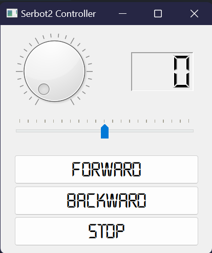
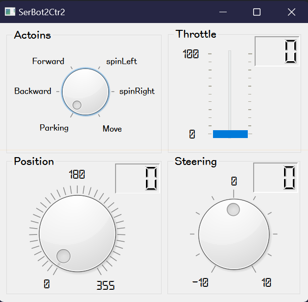

# QT로 SerBot2 제어

## SerBot2의 움직임을 GUI로 제어
QT를 이용해 Serbot2를 제어하는 간단한 GUI 프로그램을 작성해 봅니다.

### QT 디자이너로 UI 구현
QT 디자이너로 다음 스케치와 같이 UI를 디자인합니다.



1. QT 디자이너를 실행합니다.
```sh
qt6-tools designer
```

2. 새 폼으로 Main Window(QMainWindow)를 생성합니다.

3. 객체 탐색기에서 MainWindow 아래 menubar(QMenuBar)와 statusbar(QStatusBar)를 삭제(마우스 우클릭 후 삭제 선택)합니다.

4. 제시된 스케치와 같이 Main Window 폼에 위젯을 배치합니다.
- QMainWindow (MainWindow)
  - windowTitle: Serbot2 Controller
  - font: LAB디지털, 18
- QDial (Dial)
  - objectName: diamalThrottle
  - maximum: 100
  - notchesVisible: check
  - digitCount: 3
- QLCDNumber (LCD Number)
  - objectName: fndThrottle
  - frameShape: Panel
  - frameShadow: Sunken
- QSlider (Horizontal Slider)
  - objectName: sliderSteering
  - minimum: -10
  - maximum: 10
  - pageStep: 3
  - tickPosition: TicksAbove
- QToolButton (Tool Button)
  - objectName: buttonForward
  - text: Forward
- QToolButton (Tool Button)
  - objectName: buttonBackward
  - text: Backward
- QToolButton (Tool Button)
  - objectName: buttonStop
  - text: Stop

5. 시그널/슬롯 편집기에서 +눌러 항목을 추가합니다.

송신자 | 시그널 | 수신자 | 슬롯
------|--------|-------|-------
dialThrottle | valueChanged(int) | fndThrottle | display(int)

6. bot.ui로 저장한 후 종료합니다.

> bot.ui
```xml
<?xml version="1.0" encoding="UTF-8"?>
<ui version="4.0">
 <class>MainWindow</class>
 <widget class="QMainWindow" name="MainWindow">
  <property name="geometry">
   <rect>
    <x>0</x>
    <y>0</y>
    <width>275</width>
    <height>298</height>
   </rect>
  </property>
  <property name="font">
   <font>
    <family>LABDigital</family>
    <pointsize>18</pointsize>
   </font>
  </property>
  <property name="windowTitle">
   <string>Serbot2 Controller</string>
  </property>
  <widget class="QWidget" name="centralwidget">
   <widget class="QDial" name="dialThrottle">
    <property name="geometry">
     <rect>
      <x>20</x>
      <y>10</y>
      <width>100</width>
      <height>100</height>
     </rect>
    </property>
    <property name="maximum">
     <number>100</number>
    </property>
    <property name="notchesVisible">
     <bool>true</bool>
    </property>
   </widget>
   <widget class="QLCDNumber" name="fndThrottle">
    <property name="geometry">
     <rect>
      <x>170</x>
      <y>35</y>
      <width>81</width>
      <height>51</height>
     </rect>
    </property>
    <property name="frameShape">
     <enum>QFrame::Panel</enum>
    </property>
    <property name="frameShadow">
     <enum>QFrame::Sunken</enum>
    </property>
    <property name="digitCount">
     <number>3</number>
    </property>
   </widget>
   <widget class="QSlider" name="sliderSteering">
    <property name="geometry">
     <rect>
      <x>20</x>
      <y>120</y>
      <width>231</width>
      <height>30</height>
     </rect>
    </property>
    <property name="minimum">
     <number>-10</number>
    </property>
    <property name="maximum">
     <number>10</number>
    </property>
    <property name="pageStep">
     <number>3</number>
    </property>
    <property name="orientation">
     <enum>Qt::Horizontal</enum>
    </property>
    <property name="tickPosition">
     <enum>QSlider::TicksAbove</enum>
    </property>
   </widget>
   <widget class="QToolButton" name="buttonForward">
    <property name="geometry">
     <rect>
      <x>18</x>
      <y>169</y>
      <width>240</width>
      <height>38</height>
     </rect>
    </property>
    <property name="text">
     <string>Forward</string>
    </property>
   </widget>
   <widget class="QToolButton" name="buttonBackward">
    <property name="geometry">
     <rect>
      <x>18</x>
      <y>210</y>
      <width>240</width>
      <height>38</height>
     </rect>
    </property>
    <property name="text">
     <string>Backward</string>
    </property>
   </widget>
   <widget class="QToolButton" name="buttonStop">
    <property name="geometry">
     <rect>
      <x>18</x>
      <y>250</y>
      <width>240</width>
      <height>38</height>
     </rect>
    </property>
    <property name="text">
     <string>Stop</string>
    </property>
   </widget>
  </widget>
 </widget>
 <resources/>
 <connections>
  <connection>
   <sender>dialThrottle</sender>
   <signal>valueChanged(int)</signal>
   <receiver>fndThrottle</receiver>
   <slot>display(int)</slot>
   <hints>
    <hint type="sourcelabel">
     <x>69</x>
     <y>59</y>
    </hint>
    <hint type="destinationlabel">
     <x>210</x>
     <y>60</y>
    </hint>
   </hints>
  </connection>
 </connections>
</ui>
```

### .ui를 .py로 변환
VSCode에서 코드 도우미를 사용할 수 있도록 UI 파일을 파이썬 파일로 변환합니다.

```sh
pyuic6 bot.ui -o bot_ui.py
```

### 제어 코드 구현
각 위젯의 신호에 대한 슬롯에 미리 정의한 메소드를 연결한 후 해당 메소드에서 Serbot2 제어 코드를 구현합니다.

1. PyQt6 응용 클래스와 QT 디자이너로 구현한 UI 클래스를 로드합니다.
```python
import sys
from PyQt6.QtWidgets import QApplication, QMainWindow
from bot_ui import Ui_MainWindow
```

2. serbot2의 Driving 클래스를 로드합니다.
```python
from serbot2.driving import Driving
```

3. QMainWindow와 Ui_MainWindow를 상속한 자식 클래스를 정의합니다. 생성자에서 Serbot2를 제어하는 Driving 객체도 함께 생성합니다.
```python
class BotUI(QMainWindow, Ui_MainWindow):
    def __init__(self):
        super().__init__()
        self.setupUi(self)
        self.drv = Driving("192.168.118.32", "238.3.2.50") # 자신의 Serbot2 IP 및 Grup 주소로 바꿀 것!!!
```

4. 자식 클래스를 객체로 만든 후 메시지 루프를 실행합니다.
```python
if __name__ == "__main__":
    app = QApplication(sys.argv)
    ui = BotUI()
    ui.show()
    app.exec()
```

5. 자식 클래스에서 위젯 신호/슬롯에 등록한 메소드를 정의합니다.
```python
class BotUI(QMainWindow, Ui_MainWindow):
    def onThrottle(self):
        pass
    
    def onSteering(self):
        pass
    
    def onForward(self):
        pass

    def onBackward(self):
        pass
    
    def onStop(self):
        pass
```

6. 생성자에서 QDial(dialThrottle)과 QSlider(sliderSteering), 3개의 QToolButton(buttonForward, buttonBackward, buttonStop) 위젯에 대한 신호/슬롯을 연결합니다. 
```python
    def __init__(self):
        super().__init__()
        self.setupUi(self)
        self.drv = Driving("192.168.118.32", "238.3.2.50") # 자신의 SerBot2 IP 및 Grup 주소로 바꿀 것!!!

        self.dialThrottle.valueChanged.connect(self.onThrottle)
        self.sliderSteering.valueChanged.connect(self.onSteering)
        
        self.buttonForward.clicked.connect(self.onForward)
        self.buttonBackward.clicked.connect(self.onBackward)
        self.buttonStop.clicked.connect(self.onStop)
```

7. 앞서 정의한 슬롯 메소드에서 수행할 작업을 구현합니다.
```
    def onThrottle(self):
        self.drv.throttle = self.dialThrottle.value()
    
    def onSteering(self):
        self.drv.steering = (self.sliderSteering.value() / 10) * -1.0
    
    def onForward(self):
        self.drv.forward()
    
    def onBackward(self):
        self.drv.backward()
    
    def onStop(self):
        self.drv.stop()
        self.dialThrottle.setValue(0)
        self.fndThrottle.display(0)
        self.sliderSteering.setValue(0)
```

> bot.py
```python
import sys
from PyQt6.QtWidgets import QApplication, QMainWindow
from bot_ui import Ui_MainWindow
from serbot2.driving import Driving

class BotUI(QMainWindow, Ui_MainWindow):
    def __init__(self):
        super().__init__()
        self.setupUi(self)
        self.drv = Driving("192.168.118.32", "238.3.2.50") # 자신의 SerBot2 IP 및 Grup 주소로 바꿀 것!!!

        self.dialThrottle.valueChanged.connect(self.onThrottle)
        self.sliderSteering.valueChanged.connect(self.onSteering)
        
        self.buttonForward.clicked.connect(self.onForward)
        self.buttonBackward.clicked.connect(self.onBackward)
        self.buttonStop.clicked.connect(self.onStop)
    
    def onThrottle(self):
        self.drv.throttle = self.dialThrottle.value()
    
    def onSteering(self):
        self.drv.steering = (self.sliderSteering.value() / 10) * -1.0
    
    def onForward(self):
        self.drv.forward()
    
    def onBackward(self):
        self.drv.backward()
    
    def onStop(self):
        self.drv.stop()
        self.dialThrottle.setValue(0)
        self.fndThrottle.display(0)
        self.sliderSteering.setValue(0)


if __name__ == "__main__":
    app = QApplication(sys.argv)
    ui = BotUI()
    ui.show()
    app.exec()
```

## 응용 과제
앞서 구현한 예제를 참고해서 Serbot2 제어 동작과 UI를 좀 더 개선해 봅니다.

### UI 디자인
QT 디자이너로 다음과 같은 UI를 디자인한 후 파이썬 파일로 변환합니다.
> bot2.ui
- QGrupBox("Actions")
  - QDial(dialActions)
    - maximum: 5
    - notchesVisibel: check 
  - QLabel("Parking")
  - QLabel("Backward")
  - QLabel("Forward")
  - QLabel("spinLeft")
  - QLabel("spinRight")
  - QLabel("Move")
- QGroupBox("Throttle")
  - QSlider(sliderThrottle)
    - maximum: 100
    - tickPosition: TicksBotthSides 
  - QLCDNumber(fndThrottle)
  - QLable("0")
  - QLabel("100")
- QGroupBox("Position")
  - QDial(dialPosition)
    - maximum: 355
    - singleStep: 5
    - pageStep: 15
    - notchesVisible: check 
  - QLCDNumber(fndPosition)
  - QLabel("0")
  - QLabel("180")
  - QLable("355")
- QGroupBox("Steering")
  - QDial(dialSteering)
  - QLCDNumber(fndSteering)
  - QLabel("-10")
  - QLabel("0")
  - QLable("10")
          


```sh
pyuic6 bot2.ui -o bot2_ui.py
```

### 코드 구현
다음 코드 템플릿을 이용해 UI(bot2_ui.py)에 포함된 위젯에 대한 신호를 슬롯에 연결한 후 Serbot2 제어 코드를 추가합니다.

> bot2.py

```python
import sys
from PyQt6.QtWidgets import QApplication, QMainWindow
from bot2_ui import Ui_MainWindow 

class Bot2UI(QMainWindow, Ui_MainWindow): 
    def __init__(self):
        super().__init__()
        self.setupUi(self)

if __name__ == '__main__':
    app = QApplication(sys.argv)
    ui = Bot2()
    ui.show()
    app.exec()
```
