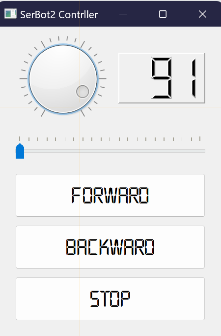
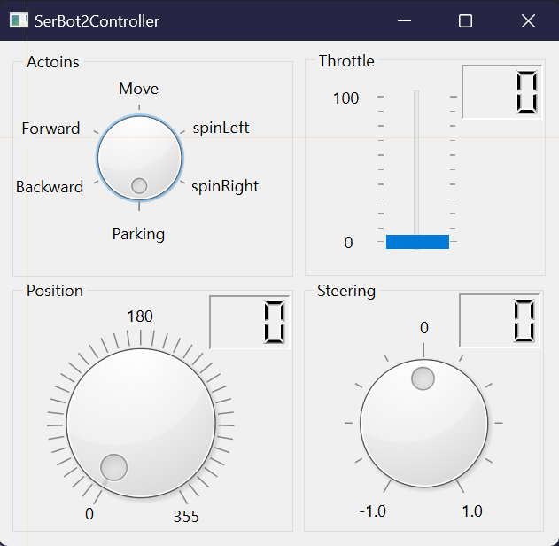

# QT로 SerBot2 제어

## SerBot2의 움직임을 GUI로 제어
QT를 이용해 Serbot2를 제어하는 간단한 GUI 프로그램을 작성해 봅니다.

### QT 디자이너로 UI 구현
QT 디자이너로 다음과 같은 UI를 디자인합니다.



> bot.ui
```xml
<?xml version="1.0" encoding="UTF-8"?>
<ui version="4.0">
 <class>MainWindow</class>
 <widget class="QMainWindow" name="MainWindow">
  <property name="geometry">
   <rect>
    <x>0</x>
    <y>0</y>
    <width>261</width>
    <height>363</height>
   </rect>
  </property>
  <property name="font">
   <font>
    <family>LAB디지털</family>
    <pointsize>18</pointsize>
   </font>
  </property>
  <property name="windowTitle">
   <string>SerBot2 Contrller</string>
  </property>
  <widget class="QWidget" name="centralwidget">
   <widget class="QDial" name="dialThrottle">
    <property name="geometry">
     <rect>
      <x>20</x>
      <y>10</y>
      <width>111</width>
      <height>101</height>
     </rect>
    </property>
    <property name="maximum">
     <number>100</number>
    </property>
    <property name="notchesVisible">
     <bool>true</bool>
    </property>
   </widget>
   <widget class="QLCDNumber" name="fndThrottle">
    <property name="geometry">
     <rect>
      <x>140</x>
      <y>30</y>
      <width>101</width>
      <height>59</height>
     </rect>
    </property>
    <property name="frameShape">
     <enum>QFrame::Panel</enum>
    </property>
    <property name="digitCount">
     <number>3</number>
    </property>
   </widget>
   <widget class="QSlider" name="sliderSteering">
    <property name="geometry">
     <rect>
      <x>20</x>
      <y>125</y>
      <width>221</width>
      <height>31</height>
     </rect>
    </property>
    <property name="minimum">
     <number>-10</number>
    </property>
    <property name="maximum">
     <number>10</number>
    </property>
    <property name="orientation">
     <enum>Qt::Horizontal</enum>
    </property>
    <property name="tickPosition">
     <enum>QSlider::TicksAbove</enum>
    </property>
   </widget>
   <widget class="QToolButton" name="buttonForward">
    <property name="geometry">
     <rect>
      <x>20</x>
      <y>170</y>
      <width>221</width>
      <height>51</height>
     </rect>
    </property>
    <property name="text">
     <string>Forward</string>
    </property>
    <property name="popupMode">
     <enum>QToolButton::DelayedPopup</enum>
    </property>
    <property name="toolButtonStyle">
     <enum>Qt::ToolButtonIconOnly</enum>
    </property>
   </widget>
   <widget class="QToolButton" name="buttonBackward">
    <property name="geometry">
     <rect>
      <x>20</x>
      <y>230</y>
      <width>221</width>
      <height>51</height>
     </rect>
    </property>
    <property name="text">
     <string>Backward</string>
    </property>
   </widget>
   <widget class="QToolButton" name="buttonStop">
    <property name="geometry">
     <rect>
      <x>20</x>
      <y>290</y>
      <width>221</width>
      <height>51</height>
     </rect>
    </property>
    <property name="text">
     <string>Stop</string>
    </property>
   </widget>
  </widget>
 </widget>
 <resources/>
 <connections/>
</ui>
```

### .ui를 .py로 변환
VSCode 등에서 코드 도우미를 사용할 수 있도록 UI 파일을 파이썬 파일로 변환합니다.

```sh
pyuic6 bot.ui -o bot_ui.py
```

### 제어 코드 구현
UI에 대한 Serbot2 제어 코드를 구현합니다.
각 위젯의 신호에 대한 슬롯을 연결한 후 해당 슬롯에서 Serbot2 제어 코드를 구현합니다.

> bot.py
```python
import sys
from PyQt6.QtWidgets import QApplication, QMainWindow
from bot_ui import Ui_MainWindow
from serbot2.driving import Driving

class BotUI(QMainWindow, Ui_MainWindow):
    def __init__(self):
        super().__init__()
        self.setupUi(self)
        self.drv = Driving("192.168.118.32", "238.3.2.50") # 자신의 SerBot2 IP 및 Grup 주소로 바꿀 것!!!

        self.dialThrottle.valueChanged.connect(self.onThrottle)
        self.sliderSteering.valueChanged.connect(self.onSteering)
        
        self.buttonForward.clicked.connect(self.onForward)
        self.buttonBackward.clicked.connect(self.onBackward)
        self.buttonStop.clicked.connect(self.onStop)
    
    def onThrottle(self):
        self.drv.throttle = self.dialThrottle.value()
        self.fndThrottle.display(self.drv.throttle)
    
    def onSteering(self):
        self.drv.steering = (self.sliderSteering.value() / 10) * -1.0
    
    def onForward(self):
        self.drv.forward()
    
    def onBackward(self):
        self.drv.backward()
    
    def onStop(self):
        self.drv.stop()
        self.dialThrottle.setValue(0)
        self.fndThrottle.display(0)
        self.sliderSteering.setValue(0)


if __name__ == "__main__":
    app = QApplication(sys.argv)
    ui = BotUI()
    ui.show()
    app.exec()
```

## 응용 과제
앞서 구현한 예제를 참고해서 Serbot2 제어 동작과 UI를 좀 더 개선해 봅니다.

### UI 디자인
QT 디자이너로 다음과 같은 UI를 디자인한 후 파이썬 파일로 변환합니다.
> serbot2ctrl.ui



```sh
pyuic6 serbot2ctrl.ui -o serbot2ctrl_ui.py
```

### 코드 구현
다음 코드 템플릿을 이용해 UI(serbot2ctrl._ui.py)에 포함된 위젯에 대한 신호를 슬롯에 연결한 후 Serbot2 제어 코드를 추가합니다.

> serbot2ctrl.py

```python
import sys
from PyQt6.QtWidgets import QApplication, QMainWindow
from serbot2ctrl_ui import Ui_MainWindow

class SerBot2Ctrl(QMainWindow, Ui_MainWindow):
    def __init__(self):
        super().__init__()
        self.setupUi(self)

if __name__ == '__main__':
    app = QApplication(sys.argv)
    ui = SerBot2Ctrl()
    ui.show()
    app.exec()
```
