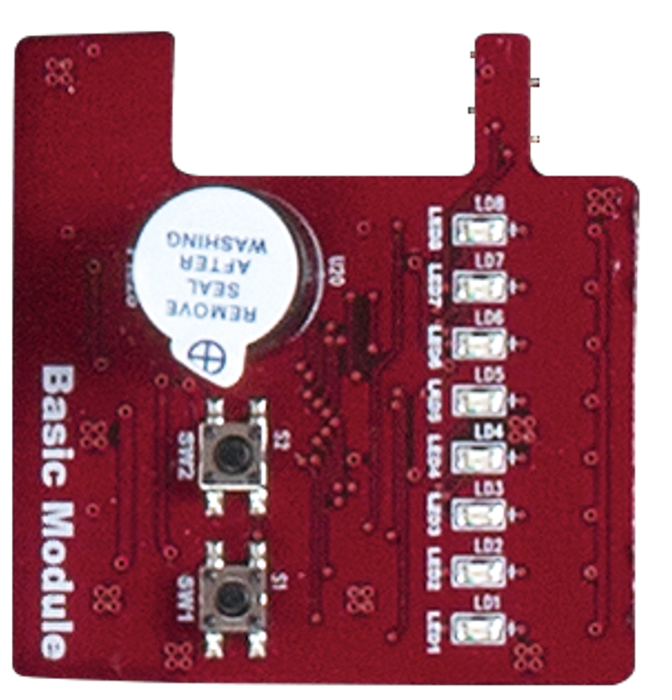
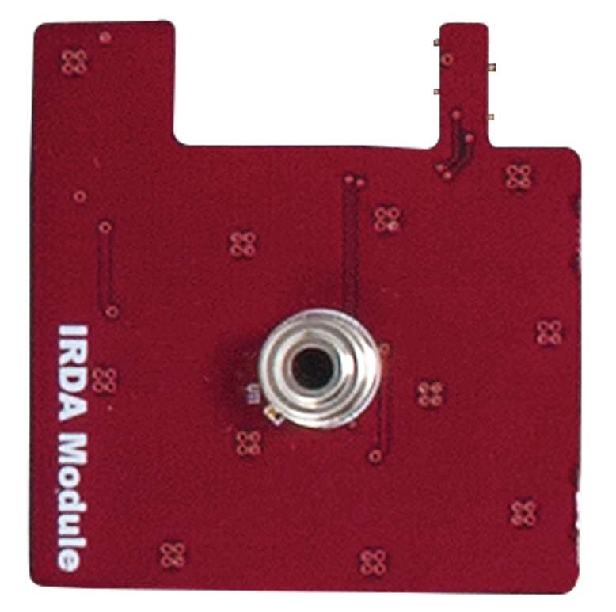
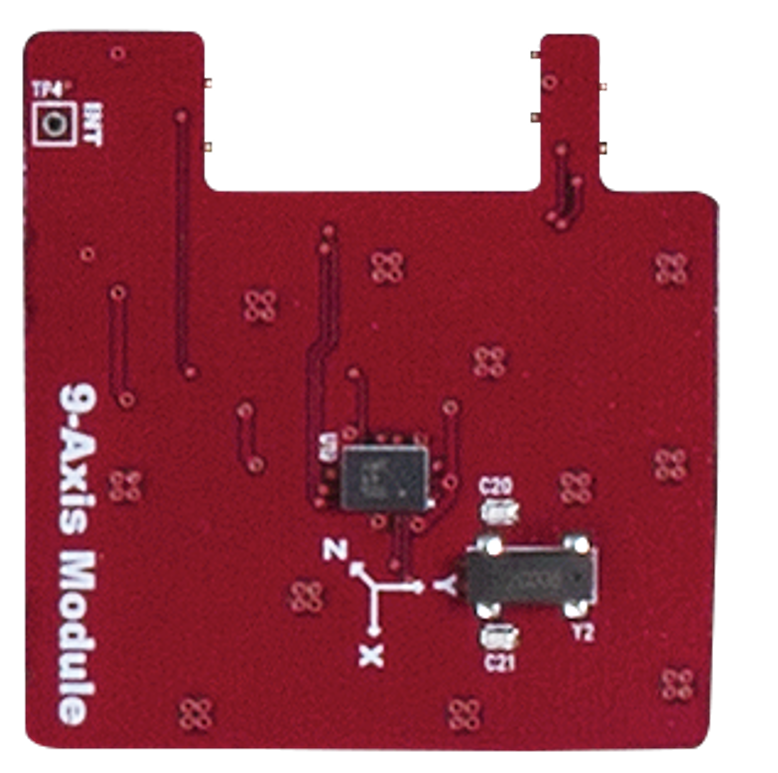
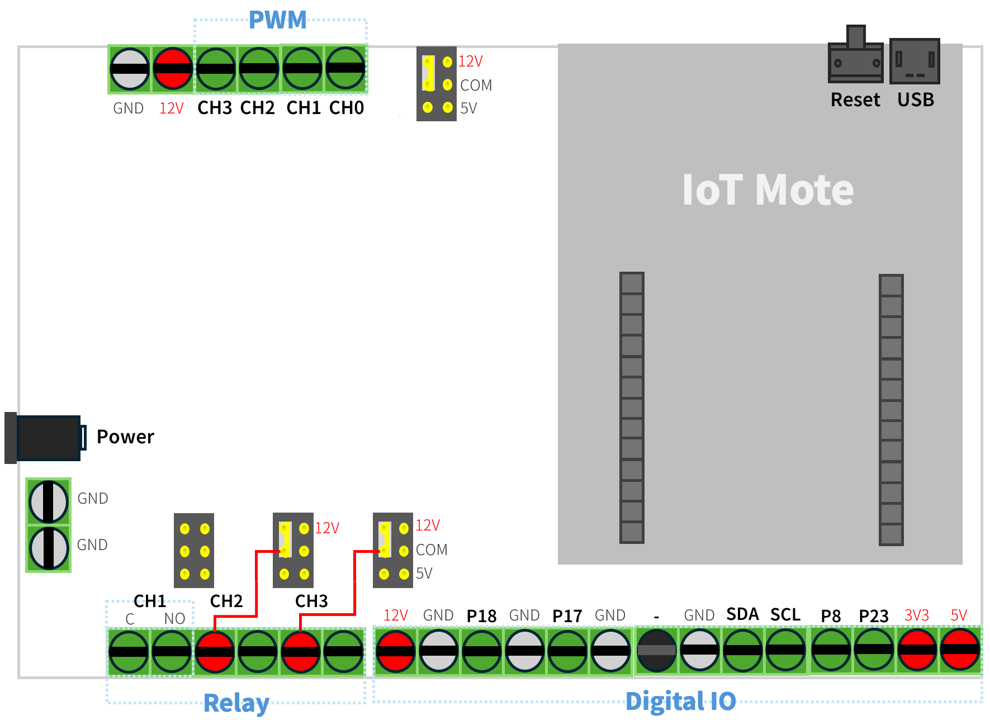

# XNode Home
IoT 센서가 부착된 장비는 온도, 습도, 압력, 진동 등 다양한 데이터를 실시간으로 수집하여 전송하며, 이렇게 수집된 데이터를 분석함으로써 생산 공정의 효율성을 극대화하고 불량률을 감소시키며 생산량을 최적화할 수 있습니다.   
또한, IoT 데이터 기반의 공정 자동화를 통해 특정 조건 충족 시 기계의 자동 작동 또는 정지 설정이 가능해져 인적 오류를 줄이고 생산 속도를 향상시킬 수 있으며, 장비 상태를 실시간으로 모니터링하여 고장을 사전에 예측하고 예방함으로써 장비 수명 연장 및 갑작스러운 고장으로 인한 생산 차질을 최소화합니다.

산업별 IoT 기술 적용 사례는 다음과 같습니다.

- 제조업: 스마트 팩토리 구축을 통해 생산 공정의 효율성을 극대화하고, 불량률을 최소화하며, 생산성 향상
- 에너지 산업: 스마트 그리드를 구축하여 에너지 효율을 높이고, 전력 공급의 안정성 향상 
- 물류 산업: 물류 추적 및 관리를 자동화하여 물류 효율성을 높이고, 배송 시간 단축
- 농업: 스마트 팜을 구축하여 작물의 생육 환경을 최적화하고, 생산량 증대

## 플랫폼 구성
XNode Home은 가정, 사무실, 공장 등에 설치된 인터넷 기반 자동 설비 제어에 필요한 소프트웨어 기술 학습을 위한 플랫폼입니다. IoT 모트(mote)와 IoT 모트가 내장된 자동 제어기, 엣지 게이트웨이, 전원 공급기, 확장 모듈과 주변 장치 등으로 구성됩니다.  


### IoT 모트
IoT 모트는 먼지(mote)라는 단어에서 유래했으며, 작고 분산된 무선 센서 노드를 지칭하는 용어로 널리 사용됩니다. 따라서 무선 센서 네트워크(WSN) 또는 사물 인터넷(IoT) 환경에서 데이터를 수집하고 전송하는 데 사용되는 작은 장치라고 할 수 있습니다  
무선 저전력 IoT 통신 기술이 내장된 저전력 MCU(Microcontroller Unit)와 배터리, 기본 센서, 확장 포트로 구성되며, 프로그래밍 언어는 파이썬의 하위 집합인 마이크로파이썬을 사용합니다.


XNode Home은 3개의 IoT 모트를 제공하며, 각 IoT 모트는 다음과 같은 구성을 갖습니다.

- Zigbee와 BLE 무선 통신 기술이 내장된 Silicon Labs의 Cortex M4 MCU 사용
- XBee의 Zigbee V3 및 BLE 소프트웨어 스택 탑재
- LiPo 타입 3.7V 내장 배터리로 운영
- USB B 타입 포트를 통해 배터리를 충전하거나 PC와 통신
- 공급 전압 측정(Battery)을 비롯해 조도(Bright), 온도/기압/습도/유기화합물(Tphg) 측정 센서 내장
- 전원 켜짐과 배터리 충전 중을 표시하는 LED와 사용자 정의 LED 내장
- 전원 스위치 및 리셋 버튼 내장
- 전용 26핀 확장 커넥터로 기능을 확장하는 추가 모듈 지원

**IoT 모트 확장 커넥터**  


### IoT 모트용 확장 모듈
XNode Home에는 IoT 모트의 전용 26핀 확장 커넥터에 연결해 사용하는 5개의 확장 모듈이 포함되어 있습니다. 

**BASIC 모듈**  
BASIC 모듈은 LED, 버튼, 부저와 같은 필수적인 입출력 요소를 통합하여, 사용자가 별도의 부품 없이도 간단한 인터페이스를 빠르게 구성할 수 있도록 설계되었습니다. 따라서, 간단한 기능 테스트를 위한 시제품 제작에 적합합니다.



**PIR 모듈**  
PIR 모듈에 내장된 PIR 센서(Passive Infrared Sensor)는 사람이나 동물의 움직임을 감지하는 데 사용되는 전자 센서입니다. 수동적이라는 이름에서 알 수 있듯이, 센서 자체가 적외선을 방출하는 것이 아니라 주변 환경에서 방출되는 적외선을 감지하여 작동합니다. 주로 보안 시스템, 자동 조명, 자동문 등 다양한 분야에서 활용됩니다.


**IRTHERMO 모듈**  
IRTHERMO 모듈에 내장된 적외선 온도 센서는 물체에서 방출되는 적외선 복사 에너지를 감지하여 온도를 측정하는 비접촉식 온도 센서입니다. 물체에 직접 접촉하지 않고 온도를 측정할 수 있기 때문에 다양한 산업 및 일상 생활에서 널리 사용됩니다.



**IMU 모듈**  
IMU 모듈에 내장된 관성 측정 장치(IMU: Inertial Measurement Unit)는 물체의 움직임과 방향을 측정하는 전자 장치입니다. 우리 주변의 스마트폰, 드론, 로봇, 자동차 내비게이션 시스템 등 다양한 곳에서 사용되고 있습니다. IMU 모듈은 가속도계, 자이로스코프, 지자기 센서(자력계)를 결합하여 3차원 공간에서의 움직임을 정밀하게 측정합니다.



**GPS 모듈**  
범지구 위치 결정 시스템(GPS: Global Positioning System)는 지구 궤도를 도는 여러 개의 위성을 이용하여 지구상의 위치를 정확하게 측정하는 위성 항법 시스템입니다. 미국 국방부에서 군사 목적으로 개발되었지만, 현재는 민간에서 내비게이션, 측량, 지도 제작, 시간 동기화 등 다양한 용도로 널리 사용되고 있습니다.  
GPS 모듈에 내장된 GPS 수신기는 최소 4개 이상의 GPS 위성으로부터 신호를 받아 자신의 위치를 계산합니다. 각 위성은 고유의 신호와 함께 신호를 보낸 시간 정보를 포함하여 전파를 송신합니다. 수신기는 각 위성에서 보낸 신호가 도달하는 시간 차이를 측정하여 각 위성과의 거리를 계산합니다.   
이때 삼변 측량(Trilateration)이라는 수학적 원리가 사용됩니다. 3개의 위성과의 거리를 알면 2차원 평면에서의 위치를 결정할 수 있고, 4개의 위성과의 거리를 알면 3차원 공간에서의 위치(위도, 경도, 고도)를 정확하게 결정할 수 있습니다.


### Auto 제어기
IoT 모트가 포함된 Auto 제어기는 산업용 액추에이터나 센서 장치를 연결할 수 있도록 릴레이, PWM 컨트롤러, IO 포트로 구성됩니다. 이때, IoT 모트는 외부 전원을 사용하므로 전원 스위치 조작이 필요 없고, 필요에 따라 리셋 버튼만 사용합니다.    
 릴레이에는 12V 조명이나 환풍기 등을 연결하고, PWM 컨트롤러에는 12V 조명이나 DC 모터를 연결하여 밝기 또는 속도를 조절합니다. IO 포트에는 3.3V에서 동작하는 스위치나 동작 감지기, 가스 누설 감지기 등을 연결합니다. 


다음은 Auto 제어기에서 IoT 모트를 제외한 추가 구성입니다.

- IoT 모트의 IO 라인과 전원으로 구성된 디지털 IO 터미널 블록 제공
- 전원을 사용하는 ON-OFF 형태의 외부 장치(조명, 환기팬 등)를 연결할 수 있도록 공용 접점(Common)과 A접점(normmal open)으로 구성된 3개 채널 릴레이 터미널 블록 제공
- PWM 컨트롤러에 연결하여 최대 2kHz 주파수의 12V PWM 신호를 출력할 수 있는 4개 채널 PWM 터미널 블록 제공
- 12V DC 전원으로 운영

**터미널 블록**  
단자대 또는 단자판으로도 불리는 터미널 블록은 전기 회로에서 전선들을 연결하기 위한 모듈식 연결 장치입니다. 간단히 말해, 여러 전선을 안전하고 깔끔하게 연결할 수 있도록 해주는 부품입니다. 특히 산업 현장이나 제어 패널 등에서 배선을 정리하고 유지 보수를 용이하게 하기 위해 널리 사용됩니다. 


터미널 블록은 크게 다음과 같은 부분으로 구성됩니다.

- 절연체 (Insulating Body/Housing): 플라스틱(나일론, 폴리카보네이트 등) 또는 세라믹과 같은 절연 재료로 만들어진 몸체. 전기적 안전을 확보하고 단자들을 고정하는 역할 함
- 도체 (Conductor/Terminal): 금속(구리, 황동 등)으로 만들어진 부분으로, 전선과 연결되어 전류 전달
- 클램핑 부품 (Clamping Mechanism): 전선을 도체에 단단히 고정하는 부분. 나사, 스프링, 레버 등의 형태로 제공

**Auto 제어기 터미널 블록**  
Auto 제어기에는 PCB에 견고하게 고정된 나사식 터미널 블록이 장착되어 있습니다. 이 터미널 블록은 전선과 제어기 간의 안정적인 연결을 제공합니다. 전선을 연결할 때는 먼저 전선의 피복을 적절히 벗긴 후, 각 단자에 삽입합니다. 이후 일자 드라이버를 사용하여 단자의 나사를 시계 방향으로 돌려 조여 전선을 단단히 고정합니다.

Auto 제어기의 PWM 채널, 릴레이 채널, 그리고 사용자가 용도에 맞게 설정할 수 있는 디지털 IO 핀들이 터미널 블록을 통해 외부로 연결됩니다. 따라서 사용자는 터미널 블록의 각 단자에 필요한 전선을 연결함으로써 다양한 외부 장치와 편리하게 연결하고 제어할 수 있습니다.



디지털 IO 터미널 블록의 단자 구성은 다음과 같습니다.

- P18 단자: 내부에 전압 분배 저항이 연결되어 있어, 12V Active Hight 신호(입력이 없으면 LOW, 입력이 있으면 HIGH)를 출력하는 입력 장치 연결
- P18 단자: 내부에 풀업(Pull-Up) 저항이 연결되어 있어, Active Low 신호(입력이 없으면 HIGH, 입력이 있으면 LOW)를 출력하는 입력 장치 연결
- P8, P23 단자: 3V3에서 동작하는 입출력 장치 연결
  - 스위치의 2가닥 제어선 중 한쪽을 3V3 전원 단자에 연결하고, 다른 한쪽을 P8 또는 P23 단자에 연결하면 스위치를 누를 때마다 P8 또는 P23은 HIGH 레벨이 됨
- 3V3, 5V, 12V, GND으로 구성된 전원 단자도 함께 제공함
  - 전원선을 잘못 연결할 경우 **장비가 파손될 수 있으므로** 각별히 주의 

다음은 릴레이 터미널 블록 단자 구성입니다.

- 2.54mm 2핀 점퍼 쇼트 커넥터를 통해 해당 채널의 공용 접점 단자(이하 C 단자)에 내부 전원 연결 설정
  - 12V 또는 5V 전원을 공급하거나 공급하지 않음
- 제품 출고 시 1번 채널의 C 단자는 전원에 연결되어 있지 않지만, **2번과 3번 채널의 C 단자는 내부적으로 12V 전원이 연결되어 있음**

다음은 PWMM 터미널 블록의 단자 구성입니다.

- 2.54mm 2핀 점퍼 쇼트 커넥터를 통해 모든 PWM 채널의 최대 전압 선택
  - 12V 또는 5V 출력 전원 중 선택
- 제품 출고 시 최대 출력 전압은 12V
- 12V 전원 및 GND 단자도 함께 제공함


### Auto 제어기용 주변장치
XNode Home에는 가정이나 빌딩, 공장 자동화에 사용되는 환기팬이나 조명, 도어락, 가스 밸브 차단기, 가스 누설 감지기 등이 포함되어 있으며, 이들은 목적에 따라 Auto 제어기의 릴레이나 PWM 컨트롤러, IO 포트에 대응하는 터미널 단자에 연결해 사용합니다.

**환기팬**  
환기팬으은 단방향으로 회전하는 12V DC 모터가 내장되어 있으며, 검은색 선은 GND 단자, 빨간색 선은 릴레이 또는 PWM 채널 단자에 연결해 사용합니다. 이때 ON-OFF 제어가 필요하면 빨간색 선을 **릴레이 2번 또는 3번 채널 NO 단자**에 연결하고, 가변 속도 제어가 필요하면 PWM 채널 단자에 연결하면 됩니다.

**조명**  
고휘도 LED로 구성된 조명은 환기팬과 같이 검은색 선은 GND 단자, 빨간색 선은 릴레이 또는 PWM 채널 단자에 연결해 사용합니다. 빨간색 선은 ON-OFF 제어를 수행할 때는 **릴레이 2번 또는 3번 채널 NO 단자**에 연결하고, 가변 밝기 제어가 필요하면 PWM 채널 단자에 연결합니다.


**도어락**  
도어락은 기계식과 디지털식으로 나눠지는데, XNode Home에서 채택한 디지털 도어락은 외부 장치와 내부 장치로 구성됩니다. 외부 장치는 번호 입력부와 카드 인식부 등으로, 내부 장치는 모터, 구동부, 잠금쇠, 제어 회로, 수동 개폐 장치 등으로 구성됩니다.  
제어는 내장 장치에 건전지를 채워 넣고 2가닥의 신호선을 각각 릴레이 1번 채널 C와 NO 단자에 연결해 사용합니다.  


**가스 밸브 차단기**  
가스 밸브 차단기(또는 가스 안전 차단기)는 가스 누출로 인한 화재나 폭발 사고를 예방하기 위해 가스 밸브를 자동으로 차단하는 장치입니다. 특히 가스레인지 사용 중 깜빡 잊고 밸브를 잠그지 않았을 경우 발생할 수 있는 사고를 막아주는 중요한 안전 장치입니다.  
양방향으로 회전하는 12V DC 모터가 토크가 높은 기어와 함께 장착되어 있으며, 검은색 선과 빨간색 선을 각각 PWM 채널 2개 단자에 연결해 사용합니다.


**가스 누설 감지기**  
가스 누설 감지기는 공기 중의 가스 농도를 실시간으로 감지하여 누출 여부를 알려주는 장치입니다. 가스 누출은 화재, 폭발, 인체 질식 등 심각한 사고를 초래할 수 있으므로, 가정 및 산업 현장에서 필수적인 안전 장비로 자리 잡았습니다.  
감지기 내부에는 가스에 반응하는 센서가 내장되어 있으며, 이 센서는 특정 가스에 노출될 경우 전기 전도도나 저항 등의 전기적 특성이 변화하는 원리를 이용합니다. 이러한 변화를 감지 회로가 감지하여 경보를 발생시키거나 외부 제어 장치로 신호를 전송합니다.  
XNode Home에 포함된 감지기는 가스 누출이 감지되면, 연결된 신호선을 통해 12V DC High 신호를 출력(ActiveHigh)합니다. 이 신호는 IO 터미널의 P18과 같은 디지털 입력 단자에 연결해 사용합니다.


### 엣지 게이트웨이
엣지 게이트웨이는 Zigbee 기반의 IoT 기기(예: IoT 모트, Auto 제어기)와 인터넷 간의 통신을 중계하는 역할을 하는 소형 컴퓨터입니다. Wi-Fi 또는 이더넷 연결을 통해 인터넷에 접속하며, 여러 대의 IoT 기기를 동시에 관리할 수 있습니다.  
NVIDA의 Jetson nano 플랫폼에서 Ubuntu 리눅스로 운영되며, 오픈 MQTT(Message Queuing Telemetry Transport) 브로커인 모스키토(Mosquitto)가 내장되어 있습니다. 


### 전원 공급기
전원 공급기는 12V DC 입력을 받아 최대 3개의 12V DC 출력으로 분배합니다. 이를 통해 여러 대의 Auto 제어기 및 엣지 게이트웨이에 안정적인 전원 공급이 가능합니다. 또한, Auto 제어기와 동일하게 IoT 모트와 터미널 IO 블록을 내장하고 있어 필요에 따라 주변 장치를 추가로 연결할 수 있습니다.  
전원 공급기에 포함된 2x16 텍스트 LCD에는 실시간으로 현재 전력 공급 상태를 표시합니다.


## 실습 환경
PC에 xnode 툴을 설치한 후 XNode 모트 또는 Auto 제어기 (이하 실습장비)에서 실행할 마이크로파이썬 코드를 작성한 후 실습장치에서 실행  
시리얼 통신을 통해 실습장치와 협업하는 PC용 파이썬 코드 작성을 위해 PC에는 파이썬 SDK가 설치되어 있어야 함.  

실습장치(마이크로파이썬, xnode 라이브러리) <-----시리얼통신------> PC (VSCode, 파이썬 SDK, xnode 툴 등)

### XNode 모트
- 한 개의 XNode 모트 사용
  - XNode 모트의 Micro B 포트와 PC의 USB A 포토를 USB 케이블로 연결
    - 만약 PC에 Type C 포트만 제공하면 Type C to USB A 변환기를 별도 준비해야 함
  - PC에서 XNode 모트의 시리얼 포트 확인 
- 여러 개의 XNode 모트 사용
  - 5V USB 허브용 전원 어댑터를 USB 허브에 연결한 후 전용 케이블로 PC(USB 3.0 A 포트)와 USB 허브(USB 3.0 MicroB 포트) 연결.
    - USB 허브의 USB A 포트에 여러 개의 XNode 모트 연결  
  - PC에서 여러 Auto 제어기의 시리얼 포트 확인
    - XNode 모트를 하나씩 연결하면서 확인할 것

### Auto 제어기 
- 한 개의 Auto 제어기 사용
  - 12V DC 전원 입력을 Auto 제어기 전원 포트에 연결
  - Auto 제어기의 Micro B 포트와 PC의 USB A 포토를 USB 케이블로 연결
    - 만약 PC에 Type C 포트만 제공하면 Type C to USB A 변환기를 별도 준비해야 함
  - PC에서 Auto 제어기의 시리얼 포트 확인 
- 여러 개의 Auto 제어기 사용
  - 5V USB 허브용 전원 어댑터를 USB 허브에 연결한 후 전용 케이블로 PC(USB 3.0 A 포트)와 USB 허브(USB 3.0 MicroB 포트) 연결.
    - USB 허브의 USB A 포트에 여러 개의 Auto 제어기 연결  
  - 12V DC 전원 입력을 전공 공급기에 연결한 후 전용 케이블을 각각의 Auto 제어기 전원 포트에 연결
  - PC에서 여러 Auto 제어기의 시리얼 포트 확인
    - Auto 제어기를 하나씩 연결하면서 확인할 것

### 개발 툴 설치
xnode와 micropython-magic을 비롯해 실습에 필요한 툴 설치.

**xnode**
xnode는 실습장치 초기화를 비롯해 PC에서 작성한 마이크로파이썬 파일을 실습장치로 전송해 실행하거, 실행 중인 프로그램과 시리얼 통신을 수행하며, 실습장치의 파일 관리 같은 부가 기능 수행.  

```sh
pip install -U xnode
pip install -U genlib s2u quat3d smon
```

**micropython-magic** 
micropython-magic은 주피터 노트북 환경에서 실시간으로 마이크로파이썬 코드를 셀 단위로 실습장치로 전송해 실행해 줌.
주로 실습장비를 테스트하거나 특정 함수나 클래스의 사용법을 익힐 때 사용

```sh
pip install -U micropython-magic
```

## 시작하기
실습장비를 PC에 연결한 후 VSCode와 xnote 툴을 이용해 실습 진행

1. scan 명령으로 PC에 연결된 실습장비의 시리얼 포트 확인
   > - **실습 장비가 바뀔 때마다 확인**할 것! (com4로 가정)
```sh
xnode scan
```

- 만약 시리얼 포트가 여러개 출력되면 다음과 같이 장치 관리자를 실행한 후 **포트(COM & LPT) > USB Serial PortI(COMx)** 확인
```
devmgmt.msc 
```

2. init 명령으로 처음 사용하는 실습장비 초기화(포맷 및 전용 라이브러리 설치)
   > 해당 장비당 한 번만 수행하며,약 2분정도 소요됨
```sh
xnode --sport com4 init
```

3. ls 명령으로 전용 라이브러리(xnode/pop) 설치 확인
   > /flash/lib 경로에 라이브러리 위치  
```sh
xnode --sport com4 ls /flash/lib/xnode/pop
```

4. VSCode에서 새 파이썬 파일(my.py)을 만든 후 코드 작성
   > PC에서 계산 가능한 식을 시리얼 통신으로 실습장비에 전달하면 실습장비는 이를 계산한 결과를 다시 PC로 전송 
```python
def setup():
    print("Start...")

def loop():
    exp = input("> ")
    try:
        ret = eval(exp)
        print(ret)
    except:
        print("Syntax Error")

if __name__ == "__main__":
    setup()
    while True:
        loop()
```

- 마이크로파이썬에서 input()은 시리얼로부터 문자열 데이터 읽기, print()는 출력할 문자열을 시리얼로 전송

5. 작성한 코드는 run 명령으로 실습장비에 전송해 실행
   > xnode 툴이 실습장비와 시리얼 통신 수행.  
   >> 사용자가 PC 터미널에서 입력한 문자열을 실습장비로 전송하고, 실습장비가 전송한 문자열을 읽어 화면에 표시

```sh
xnode --sport com4 run my.py
```
- 프로그램이 무한 루프일 때 터미널에서 Ctrl+c를 누르면 xnode 툴은 종료하지만, 프로그램은 계속 실행됨.
  - 실습장비의 리셋 버튼을 누르면, 실행 중인 프로그램 강제 종료

6. run과 함께 -ni(또는 -in)을 사용하면 에코 기능이 꺼지므로 입력 문자가 중복 출력되지 않음
```sh
xnode --sport com4 run -ni my.py
```

7. run과 함께 -n을 사용하면 파이썬 코드를 실습장비에서 실행한 후 바로 xnode 툴 종료
```sh
xnode --sport com4 run -n my.py
```

8. xnode 툴 대신 PuTTY와 같은 시리얼 응용프로그램 사용
   > 앞서 실행한 프로그램 테스트 진행
```py
winget install PuTTY.PuTTY
```
- [주의] **xnode 툴과 putty는 동시에 실행할 수 없으므로** 반드시 xnode 툴은 종료 상태여야 함
- 설치가 완료되면 putty를 실행한 후 다음과 같이 설정
  - Connection type: Serial
  - Serial line: COMx,
  - Speed는 115200
  - Open 버튼 클릭

9. put 명령으로 PC에서 작성한 my.py를 main.py란 이름으로 바꿔 실습장비에 옮기기
   > 실습장비에 전원이 공급(또는 리셋)되면, /flash 폴더에 main.py가 있는지 검사 후 있으면 자동으로 실행

```sh
xnode --sport com4 put my.py /flash/main.py
xnode --sport com4 ls /flash
```  

- 앞서 설치한 PuTTY로 결과 확인

10. 실습장치의 파일시스템에 위치한 파일을 rm 명령으로 삭제하기
    > 앞서 옮긴 /flash/main.py 삭제
```sh
xnode --sport com4 rm /flash/main.py
xnode --sport com4 ls /flash
```
