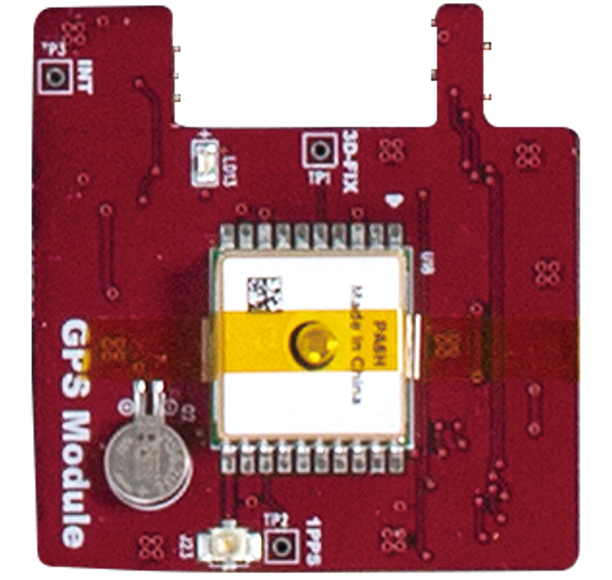
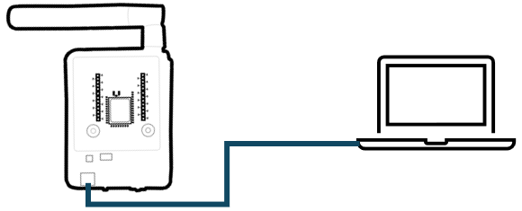

# XNode Home
IoT 센서가 부착된 장비는 온도, 습도, 압력, 진동 등 다양한 데이터를 실시간으로 수집하여 전송하며, 이렇게 수집된 데이터를 분석함으로써 생산 공정의 효율성을 극대화하고 불량률을 감소시키며 생산량을 최적화할 수 있습니다.   
또한, IoT 데이터 기반의 공정 자동화를 통해 특정 조건 충족 시 기계의 자동 작동 또는 정지 설정이 가능해져 인적 오류를 줄이고 생산 속도를 향상시킬 수 있으며, 장비 상태를 실시간으로 모니터링하여 고장을 사전에 예측하고 예방함으로써 장비 수명 연장 및 갑작스러운 고장으로 인한 생산 차질을 최소화합니다.

산업별 IoT 기술 적용 사례는 다음과 같습니다.

- 제조업: 스마트 팩토리 구축을 통해 생산 공정의 효율성을 극대화하고, 불량률을 최소화하며, 생산성 향상
- 에너지 산업: 스마트 그리드를 구축하여 에너지 효율을 높이고, 전력 공급의 안정성 향상 
- 물류 산업: 물류 추적 및 관리를 자동화하여 물류 효율성을 높이고, 배송 시간 단축
- 농업: 스마트 팜을 구축하여 작물의 생육 환경을 최적화하고, 생산량 증대

## 플랫폼 구성
XNode Home은 가정, 사무실, 공장 등에 설치된 인터넷 기반 자동 설비 제어에 필요한 소프트웨어 기술 학습을 위한 플랫폼입니다. IoT 모트(mote)와 IoT 모트가 내장된 Auto 제어기, 엣지 게이트웨이, 전원 공급기, IoT 모트용 확장 모듈과 Auto 제어기용 주변장치 등으로 구성됩니다.  


### IoT 모트
IoT 모트는 먼지(mote)라는 단어에서 유래했으며, 작고 분산된 무선 센서 노드를 지칭하는 용어로 널리 사용됩니다. 따라서 무선 센서 네트워크(WSN) 또는 사물 인터넷(IoT) 환경에서 데이터를 수집하고 전송하는 데 사용되는 작은 장치라고 할 수 있습니다  
무선 저전력 IoT 통신 기술이 내장된 저전력 MCU(Microcontroller Unit)와 배터리, 기본 센서, 확장 포트로 구성되며, 프로그래밍 언어는 파이썬의 하위 집합인 마이크로파이썬을 사용합니다.


XNode Home은 3개의 IoT 모트를 제공하며, 각 IoT 모트는 다음과 같은 구성을 갖습니다.

- Zigbee와 BLE 무선 통신 기술이 내장된 Silicon Labs의 Cortex M4 MCU 사용
- XBee의 Zigbee V3 및 BLE 소프트웨어 스택 탑재
- LiPo 타입 3.7V 내장 배터리로 운영
- USB B 타입 포트를 통해 배터리를 충전하거나 PC와 통신
- 공급 전압 측정(Battery)을 비롯해 조도(Bright), 온도/기압/습도/유기화합물(Tphg) 측정 센서 내장
- 전원 켜짐과 배터리 충전 중을 표시하는 LED와 사용자 정의 LED 내장
- 전원 스위치 및 리셋 버튼 내장
- 전용 26핀 확장 커넥터로 기능을 확장하는 추가 모듈 지원

**IoT 모트 확장 커넥터** 


### IoT 모트용 확장 모듈
확장 모듈은 IoT 모트의 26핀 확장 커넥터를 통해 연결되어, 센서 연결, 통신 인터페이스 확장 등 IoT 모트의 기능을 확장하고, 특정 프로젝트에 필요한 맞춤형 기능을 제공합니다.

**BASIC 모듈**  
BASIC 모듈은 LED, 버튼, 부저와 같은 필수적인 입출력 요소를 통합하여, 사용자가 별도의 부품 없이도 간단한 인터페이스를 빠르게 구성할 수 있도록 설계되었습니다. 따라서, 간단한 기능 테스트를 위한 시제품 제작에 적합합니다.


**PIR 모듈**  
PIR 모듈에 내장된 PIR 센서(Passive Infrared Sensor)는 사람이나 동물의 움직임을 감지하는 데 사용되는 전자 센서입니다. 수동적이라는 이름에서 알 수 있듯이, 센서 자체가 적외선을 방출하는 것이 아니라 주변 환경에서 방출되는 적외선을 감지하여 작동합니다. 주로 보안 시스템, 자동 조명, 자동문 등 다양한 분야에서 활용됩니다.


**IRTHERMO 모듈**  
IRTHERMO 모듈에 내장된 적외선 온도 센서는 물체에서 방출되는 적외선 복사 에너지를 감지하여 온도를 측정하는 비접촉식 온도 센서입니다. 물체에 직접 접촉하지 않고 온도를 측정할 수 있기 때문에 다양한 산업 및 일상 생활에서 널리 사용됩니다.


**IMU 모듈**  
IMU 모듈에 내장된 관성 측정 장치(IMU: Inertial Measurement Unit)는 물체의 움직임과 방향을 측정하는 전자 장치입니다. 우리 주변의 스마트폰, 드론, 로봇, 자동차 내비게이션 시스템 등 다양한 곳에서 사용되고 있습니다. IMU 모듈은 가속도계, 자이로스코프, 지자기 센서(자력계)를 결합하여 3차원 공간에서의 움직임을 정밀하게 측정합니다.


**GPS 모듈**  
범지구 위치 결정 시스템(GPS: Global Positioning System)는 지구 궤도를 도는 여러 개의 위성을 이용하여 지구상의 위치를 정확하게 측정하는 위성 항법 시스템입니다. 미국 국방부에서 군사 목적으로 개발되었지만, 현재는 민간에서 내비게이션, 측량, 지도 제작, 시간 동기화 등 다양한 용도로 널리 사용되고 있습니다.  
GPS 모듈에 내장된 GPS 수신기는 최소 4개 이상의 GPS 위성으로부터 신호를 받아 자신의 위치를 계산합니다. 각 위성은 고유의 신호와 함께 신호를 보낸 시간 정보를 포함하여 전파를 송신합니다. 수신기는 각 위성에서 보낸 신호가 도달하는 시간 차이를 측정하여 각 위성과의 거리를 계산합니다.   
이때 삼변 측량(Trilateration)이라는 수학적 원리가 사용됩니다. 3개의 위성과의 거리를 알면 2차원 평면에서의 위치를 결정할 수 있고, 4개의 위성과의 거리를 알면 3차원 공간에서의 위치(위도, 경도, 고도)를 정확하게 결정할 수 있습니다.



### Auto 제어기
Auto 제어기는 릴레이, PWM 컨트롤러, IO 포트를 통해 산업 현장의 다양한 장치를 제어할 수 있습니다. 릴레이를 이용하여 12V 조명이나 환풍기를 켜고 끌 수 있으며, PWM 컨트롤러로는 12V 조명의 밝기나 DC 모터의 속도를 정밀하게 조절할 수 있습니다. 또한, IO 포트를 통해 3.3V 스위치, 가스 누설 감지 센서 등을 연결하여 다양한 상황을 감지하고 대응할 수 있습니다. 
Auto 제어기의 두뇌에 해당하는 IoT 모트는 배터리 대신 외부 전원을 사용하므로 전원 관리가 용이하며, 필요시 리셋 버튼을 통해 시스템을 재시작할 수 있습니다.


다음은 Auto 제어기에서 IoT 모트를 제외한 추가 구성입니다.

- IoT 모트의 IO 라인과 전원으로 구성된 디지털 IO 터미널 블록 제공
- 전원을 사용하는 ON-OFF 형태의 외부 장치(조명, 환기팬 등)를 연결할 수 있도록 공용 접점(Common)과 A접점(normmal open)으로 구성된 3개 채널 릴레이 터미널 블록 제공
- PWM 컨트롤러에 연결하여 최대 2kHz 주파수의 12V PWM 신호를 출력할 수 있는 4개 채널 PWM 터미널 블록 제공
- 12V DC 전원으로 운영

**터미널 블록**  
단자대 또는 단자판으로도 불리는 터미널 블록은 전기 회로에서 전선들을 연결하기 위한 모듈식 연결 장치입니다. 간단히 말해, 여러 전선을 안전하고 깔끔하게 연결할 수 있도록 해주는 부품입니다. 특히 산업 현장이나 제어 패널 등에서 배선을 정리하고 유지 보수를 용이하게 하기 위해 널리 사용됩니다. 


터미널 블록은 크게 다음과 같은 부분으로 구성됩니다.

- 절연체 (Insulating Body/Housing): 플라스틱(나일론, 폴리카보네이트 등) 또는 세라믹과 같은 절연 재료로 만들어진 몸체. 전기적 안전을 확보하고 단자들을 고정하는 역할 함
- 도체 (Conductor/Terminal): 금속(구리, 황동 등)으로 만들어진 부분으로, 전선과 연결되어 전류 전달
- 클램핑 부품 (Clamping Mechanism): 전선을 도체에 단단히 고정하는 부분. 나사, 스프링, 레버 등의 형태로 제공

**Auto 제어기 터미널 블록**  
Auto 제어기에는 PCB에 견고하게 고정된 나사식 터미널 블록이 장착되어 있습니다. 이 터미널 블록은 전선과 제어기 간의 안정적인 연결을 제공합니다. 전선을 연결할 때는 먼저 전선의 피복을 적절히 벗긴 후, 각 단자에 삽입합니다. 이후 일자 드라이버를 사용하여 단자의 나사를 시계 방향으로 돌려 조여 전선을 단단히 고정합니다.

Auto 제어기의 PWM 채널, 릴레이 채널, 그리고 사용자가 용도에 맞게 설정할 수 있는 디지털 IO 핀들이 터미널 블록을 통해 외부로 연결됩니다. 따라서 사용자는 터미널 블록의 각 단자에 필요한 전선을 연결함으로써 다양한 외부 장치와 편리하게 연결하고 제어할 수 있습니다.

  

디지털 IO 터미널 블록의 단자 구성은 다음과 같습니다.

- P18 단자: 내부에 전압 분배 저항이 연결되어 있어, 12V Active Hight 신호(입력이 없으면 LOW, 입력이 있으면 HIGH)를 출력하는 입력 장치 연결
- P18 단자: 내부에 풀업(Pull-Up) 저항이 연결되어 있어, Active Low 신호(입력이 없으면 HIGH, 입력이 있으면 LOW)를 출력하는 입력 장치 연결
- P8, P23 단자: 3V3에서 동작하는 입출력 장치 연결
  - 스위치의 2가닥 제어선 중 한쪽을 3V3 전원 단자에 연결하고, 다른 한쪽을 P8 또는 P23 단자에 연결하면 스위치를 누를 때마다 P8 또는 P23은 HIGH 레벨이 됨
- 3V3, 5V, 12V, GND으로 구성된 전원 단자도 함께 제공함
  - 전원선을 잘못 연결할 경우 **장비가 파손될 수 있으므로** 각별히 주의 

다음은 릴레이 터미널 블록 단자 구성입니다.

- 2.54mm 2핀 점퍼 쇼트 커넥터를 통해 해당 채널의 공용 접점 단자(이하 C 단자)에 내부 전원 연결 설정
  - 12V 또는 5V 전원을 공급하거나 공급하지 않음
- 제품 출고 시 1번 채널의 C 단자는 전원에 연결되어 있지 않지만, **2번과 3번 채널의 C 단자는 내부적으로 12V 전원이 연결되어 있음**

다음은 PWMM 터미널 블록의 단자 구성입니다.

- 2.54mm 2핀 점퍼 쇼트 커넥터를 통해 모든 PWM 채널의 최대 전압 선택
  - 12V 또는 5V 출력 전원 중 선택
- 제품 출고 시 최대 출력 전압은 12V
- 12V 전원 및 GND 단자도 함께 제공함


### Auto 제어기용 주변장치
XNode Home에는 가정이나 빌딩, 공장 자동화에 사용되는 환기팬이나 조명, 도어락, 가스 밸브 차단기, 가스 누설 감지기 등이 포함되어 있으며, 이들은 목적에 따라 Auto 제어기의 릴레이나 PWM 컨트롤러, IO 포트에 대응하는 터미널 단자에 연결해 사용합니다.

**환기팬**  
환기팬으은 단방향으로 회전하는 12V DC 모터가 내장되어 있으며, 검은색 선은 GND 단자, 빨간색 선은 릴레이 또는 PWM 채널 단자에 연결해 사용합니다. 이때 ON-OFF 제어가 필요하면 빨간색 선을 **릴레이 2번 또는 3번 채널 NO 단자**에 연결하고, 가변 속도 제어가 필요하면 PWM 채널 단자에 연결하면 됩니다.


**조명**  
고휘도 LED로 구성된 조명은 환기팬과 같이 검은색 선은 GND 단자, 빨간색 선은 릴레이 또는 PWM 채널 단자에 연결해 사용합니다. 빨간색 선은 ON-OFF 제어를 수행할 때는 **릴레이 2번 또는 3번 채널 NO 단자**에 연결하고, 가변 밝기 제어가 필요하면 PWM 채널 단자에 연결합니다.


**도어락**  
도어락은 기계식과 디지털식으로 나눠지는데, XNode Home에서 채택한 디지털 도어락은 외부 장치와 내부 장치로 구성됩니다. 외부 장치는 번호 입력부와 카드 인식부 등으로, 내부 장치는 모터, 구동부, 잠금쇠, 제어 회로, 수동 개폐 장치 등으로 구성됩니다.  
제어는 내장 장치에 건전지를 채워 넣고 2가닥의 신호선을 각각 릴레이 1번 채널 C와 NO 단자에 연결해 사용합니다.  


**가스 밸브 차단기**  
가스 밸브 차단기(또는 가스 안전 차단기)는 가스 누출로 인한 화재나 폭발 사고를 예방하기 위해 가스 밸브를 자동으로 차단하는 장치입니다. 특히 가스레인지 사용 중 깜빡 잊고 밸브를 잠그지 않았을 경우 발생할 수 있는 사고를 막아주는 중요한 안전 장치입니다.  
양방향으로 회전하는 12V DC 모터가 토크가 높은 기어와 함께 장착되어 있으며, 검은색 선과 빨간색 선을 각각 PWM 채널 2개 단자에 연결해 사용합니다.


**가스 누설 감지기**  
가스 누설 감지기는 공기 중의 가스 농도를 실시간으로 감지하여 누출 여부를 알려주는 장치입니다. 가스 누출은 화재, 폭발, 인체 질식 등 심각한 사고를 초래할 수 있으므로, 가정 및 산업 현장에서 필수적인 안전 장비로 자리 잡았습니다.  
감지기 내부에는 가스에 반응하는 센서가 내장되어 있으며, 이 센서는 특정 가스에 노출될 경우 전기 전도도나 저항 등의 전기적 특성이 변화하는 원리를 이용합니다. 이러한 변화를 감지 회로가 감지하여 경보를 발생시키거나 외부 제어 장치로 신호를 전송합니다.  
XNode Home에 포함된 감지기는 가스 누출이 감지되면, 연결된 신호선을 통해 12V DC High 신호를 출력(ActiveHigh)합니다. 이 신호는 IO 터미널의 P18과 같은 디지털 입력 단자에 연결해 사용합니다.


### 엣지 게이트웨이
엣지 게이트웨이는 Zigbee 기반의 IoT 기기(예: IoT 모트, Auto 제어기)와 인터넷 간의 통신을 중계하는 역할을 하는 소형 컴퓨터입니다. Wi-Fi 또는 이더넷 연결을 통해 인터넷에 접속하며, 여러 대의 IoT 기기를 동시에 관리할 수 있습니다.  
NVIDA의 Jetson nano 플랫폼에서 Ubuntu 리눅스로 운영되며, 오픈 MQTT(Message Queuing Telemetry Transport) 브로커인 모스키토(Mosquitto)가 내장되어 있습니다. 


### 전원 공급기
전원 공급기는 12V DC 입력을 받아 최대 3개의 12V DC 출력으로 분배합니다. 이를 통해 여러 대의 Auto 제어기 및 엣지 게이트웨이에 안정적인 전원 공급이 가능합니다. 또한, Auto 제어기와 동일하게 IoT 모트와 터미널 IO 블록을 내장하고 있어 필요에 따라 주변 장치를 추가로 연결할 수 있습니다.  
전원 공급기에 포함된 2x16 텍스트 LCD에는 실시간으로 현재 전력 공급 상태를 표시합니다.


### USB 허브 
USB 허브는 여러 대의 IoT 모트와 Auto 제어기를 하나의 PC에 연결하여 다중 장치 통신 환경을 구축하는 데 사용됩니다. PC는 USB를 통해 연결된 IoT 모트를 가상 COM 포트(가상 시리얼 장치)로 인식하며, 각 COM 포트 번호를 통해 장치를 구분합니다.


## 실습 환경
본 문서에서는 IoT 모트와 IoT 모트가 내장된 Auto 제어기를 '실습 장비'로 통칭합니다. 실습을 시작하려면 실습 장비에 전원을 공급한 후 PC와 USB 케이블로 연결해야 합니다. 연결이 완료되면 PC는 실습 장비와의 통신을 위한 가상 시리얼 포트를 자동으로 생성합니다. 이후, 실습 장비에서 실행될 마이크로파이썬 코드와 PC에서 실행되며 실습 장비와 시리얼 통신으로 협업하는 파이썬 코드를 작성해야 합니다. 이 두 가지 코드를 작성하기 위해 [101 개발환경]에서 소개된 개발 환경을 구성합니다. 마지막으로, 작성된 마이크로파이썬 코드를 실습 장비에 배포하고 실행하는 데는 오픈 소스 도구인 xnode를 활용합니다.

[101 개발환경]:https://github.com/PlanXStudio/meister/blob/main/common/101_개발환경.md

다음은 전체 실습 환경 구성입니다.  

  

### PC에 실습 장비 연결
IoT 모트는 내장 배터리를 통해 전원 스위치를 켜는 즉시 사용할 수 있으며, PC와 USB 케이블로 연결하면 자동으로 충전됩니다. 반면 Auto 제어기에 포함된 IoT 모트는 배터리 없이 외부 전원을 연결하여 작동하며, 따라서 전원 스위치가 없습니다.  
실습 장비와 PC를 연결하기 위해 제공되는 USB 케이블의 PC 연결 부분은 USB Type A 커넥터 형태입니다. 만약 사용자의 PC에 USB Type A 포트가 없고 Type C 포트만 있다면, 별도로 **Type C to A 변환 젠더**를 준비하여 연결해야 합니다.

**IoT 모트**  

  

1. 전원 스위치를 꺼짐 쪽으로 욺기면, 전원 LED가 켜집니다.

2. Micro USB Type B 커넥터를 PC의 USB Type A 커넥터에 제공된 USB 케이블로 연결하면, 배터리 잔량이 부족할 경우 충전 LED가 점등되면서 충전이 시작됩니다.

3. PC에서 가상 시리얼 포트가 생성되었는지 확인합니다.
   1. 윈도우: '장치 관리자 > 포트(COM & LPT) > USB Serial Port(COMx)'
   2. 리눅스/맥: '터미널 > ls /dev/tty*'


  


**Auto 제어기**  
1. 제공되는 12V DC 전원 어댑터를 실습 장비의 전원 포트에 연결합니다. 

2. 실습 장비의 Micro USB Type B 커넥터와 PC의 USB Type A 커넥터를 제공되는 USB 케이블로 연결합니다.

3. PC에서 가상 시리얼 포트가 생성되었는지 확인합니다.


  


**USB 허브**   
여러 대의 실습 장비를 PC의 USB 포트에 직접 연결하는 대신, 제공된 USB 허브를 이용하여 한 번에 연결할 수 있습니다.

1. 5V USB 허브용 전원 어댑터를 USB 허브에 연결합니다.

2. USB 허브의 Micro USB 3.0 Type B 커넥터와 PC의 USB 3.0 Type A 커넥터를 제공되는 USB 허브 전용 케이블로 연결합니다.

3. 실습 장비를 PC 대신 USB 허브의 USB Type A 커넥터에 연결합니다.

4. PC에서 가상 시리얼 포트가 생성되었는지 확인하는데, 한 번에 하나씩 확인하면서 연결합니다.

**전원 공급기**    
여러 대의 Auto 제어기를 USB 허브를 이용하여 연결할 때 하나의 전원 어댑터로 통합하여 전원을 공급하면 더욱 편리하게 시스템을 운영할 수 있습니다. 이는 복수의 전원 어댑터를 사용해야 하는 번거로움을 줄여줍니다.

1. 제공되는 12V DC 전원 어댑터를 전원 공급기의 입력 포트에 연결합니다.

2. 별도 전원 케이블을 이용해 전원 공급기의 출력과 실습 장비의 전원 포트를 연결합니다.

  

### 개발 툴 설치
VSCode, 파이썬 확장, 파이썬 SDK가 설치된 PC 환경에서 xnode, micropython-magic과 같은 추가적인 도구 및 파이썬 라이브러리를 설치하여 개발 환경을 구축합니다.

**xnode**
xnode는 명령행 도구로 마이크로파이썬 개발 환경을 확장하여 PC와 마이크로컨트롤러 간의 원활한 통신 및 코드 실행을 지원하는 툴입니다. 실습 장비의 초기화, 코드 업로드, 시리얼 통신, 파일 시스템 관리 등의 기능을 제공하여 효율적인 임베디드 시스템 개발을 가능하게 합니다.

```sh
pip install -U xnode
```

**micropython-magic** 
마이크로파이썬 매직(micropython-magic)은 파이썬 개발 환경에서 마이크로파이썬 코드를 더욱 효율적으로 개발하고 실행할 수 있도록 돕는 강력한 도구입니다. 특히 Jupyter Notebook과 같은 환경에서 마이크로파이썬 코드를 작성하고 실행하는 것을 매우 편리하게 만들어줍니다.

```sh
pip install -U micropython-magic
```

## 시작하기
실습 장비를 PC에 연결한 후 VSCode와 xnote 툴을 이용해 실습을 진행합니다.

1. VSCode를 실행한 후 터미널 창을 선택합니다.

2. 터미널 창에서 scan 명령으로 PC에 연결된 실습 장비의 시리얼 포트를 확인합니다.

```sh
xnode scan
```

> scan 명령은 시리얼 포트를 스캔하여 마이크로파이썬 환경이 구축된 장치를 감지하고, 해당 장치의 시리얼 포트 번호를 출력하는 기능을 제공합니다.
```out
OM8 (v1.12-1556-gcc82fa9 on 2021-06-22; XBee3 Zigbee with EFR32MG)
```

3. init 명령은 실습 장비의 초기 상태를 설정하는 명령으로, 장비의 초기화가 필요한 경우에 한 번만 실행하면 됩니다. 이때, 앞서 확인한 시리얼 포트 번호를 옵션으로 사용합니다.
```sh
xnode --sport com8 init
```

> init 명령을 실행하면 장비를 포맷하고 마이크로파이썬으로 구현한 pop 라이브러리를 실습 장비에 설치합니다.
```out
Formatting...
Formatting is complete!
Installing the pop library on the board.
/flash/lib/xnode/pop/autoctrl.py
[########################################] 100%
/flash/lib/xnode/pop/core.py
[########################################] 100%
/flash/lib/xnode/pop/ext.py
[########################################] 100%
/flash/lib/xnode/pop/tphg.py
[########################################] 100%
The job is done!
```

4. ls 명령으로 실습 장비의 /flash/lib/xnode/pop 경로에 설치된 파일을 확인합니다.
```sh
xnode --sport com8 ls /flash/lib/xnode/pop
```

> ls 명령은 실습 장비의 파일 시스템에서 특정 디렉토리의 내용을 목록 형태로 출력하는 명령입니다. 파일 종류에 따라 색상으로 구분하여 가독성을 높였습니다.
```out
autoctrl.py
core.py
ext.py
tphg.py
```


### 첫 번째 마이크로파이썬 프로그램
계산 식을 입력하면 결과를 반환하는 간단한 프로그램을 작성해 봅니다.

1. VSCode에서 simple_express.py란 이름으로 새 파일을 만든 후 다음과 같이 코드를 작성합니다.

```python
def setup():
    print("Start...")

def loop():
    exp = input("> ")
    try:
        ret = eval(exp)
        print(ret)
    except:
        print("Syntax Error")

if __name__ == "__main__":
    setup()
    while True:
        loop()
```


2. run 명령을 사용하면 완성한 simple_express.py 파일을 실습 장비에서 바로 실행해 볼 수 있습니다.

```sh
xnode --sport com8 run simple_express.py
```

> run 명령은 로컬 시스템에 있는 파이썬 스크립트를 원격 장비로 전송하고 실행하는 기능을 제공합니다. 추가 옵션을 사용하지 않는 한 PC의 표준 입출력 스트림과 실습 장비의 표준 입출력 스트림을 시리얼 통신으로 연결하여 상호 작용을 가능하게 하므로, PC의 키 입력은 실습 장비의 input()으로 전달되고, 실습 장비의 print() 출력은 PC로 전달됩니다.
```out
Start...
> 3+4*5
23
> 
```

3. Ctrl+C 키 조합을 입력하면 시리얼 통신이 강제 종료되어 PC와 실습 장비 간의 연결이 끊어집니다. 하지만 실습 장비에서 실행 중이던 프로그램은 계속 동작합니다.


### 두 번째 마이크로파이썬 프로그램
실습 장비의 사용자 LED를 지속적으로 깜빡이는 프로그램을 작성해 봅니다.

1. VSCode에서 blink_led.py란 이름으로 새 파일을 만든 후 다음과 같이 코드를 작성합니다.

```python
import machine 
import time

led = machine.Pin('D9', machine.Pin.OUT, value=1)

def setup():
    print("Start...")
      
def loop():
    led.value(0)
    time.sleep(0.1)
    led.value(1)
    time.sleep(0.1)
    
if __name__ == "__main__":
    setup()
    while True:
        loop()
```


2. run 명령으로 완성한 blink_led.py를 실습 장비에서 실행 합니다. 이때 loop() 함수 안에 input() 호출이 없으므로 PC에서 키를 입력하는 것은 무의미 합니다. 따라서 -n 옵션을 함께 사용합니다.

```sh
xnode --sport com8 run -n blink_led.py
```

> 옵션 때문에 실습 장비에서 프로그램이 실행되면, 시리얼 통신은 강제로 종료합니다.

3. LED가 깜빡이는 것을 멈추려면 실습 장비의 리셋 버튼을 눌러 프로그램을 강제 종료합니다.

### xnode 설정 파일
xnode 툴의 옵션을 관리하는 설정 파일을 만들면, 해당 옵션을 생략할 수 있습니다. 예를 들어 --sport <serial_name> 옵션은 대부분의 명령에서 필수적으로 사용하는데 이를 생략할 수 있습니다.

1. VSCode에서 .xnode란 이름으로 새 파일을 만듦니다.

2. SERIAL_PORT 변수에 scan 명령으로 확인한 시리얼 포트 이름을 입력합니다.
```sh
SERIAL_PORT=com8
```

3. 파일을 저장합니다.

실습 장비가 바뀌면 시리얼 포트 이름도 바뀔 수 있는데, 이때는 반드시 .xnode 내용을 수정합니다.


### 실습 장비 파일 관리
xnode의 run 명령은 PC의 마이크로파이썬 코드를 일시적으로 실습 장비에서 실행합니다. 하지만 해당 파일을 main.py란 이름으로 실습 장비에 저장하면 리셋 또는 재 시작할 때 자동으로 main.py가 실행됩니다.
앞서 소개한 설정 파일을 만들었다면 xnode 툴을 사용할 때 --sport <serial_name> 옵션은 생략합니다. 

1. put 명령으로 앞서 작성한 blink_led.py를 main.py란 이름으로 실습 장비에 저장합니다. 

```sh
xnode put blink_led.py /flash/main.py
```  

2. ls 명령으로 결과를 확인합니다.
```sh
xnode ls /flash
```

3. get 명령은 put과 반대로 실습 장비의 파일을 PC오 가져오지만 PC에 저장할 파일 이름을 생략하면 내용만 보여 줍니다.
```sh
xnode get /flash/main.py
```

4. 실습 장비의 리셋 버튼을 누르거나 전원을 컸다 켜면 자동으로 main.py가 실행되므로 LED가 깜빡입니다.

5. rm 명령으로 실습 장비에 저장된 파일을 삭제합니다.
```sh
xnode rm /flash/main.py
```
