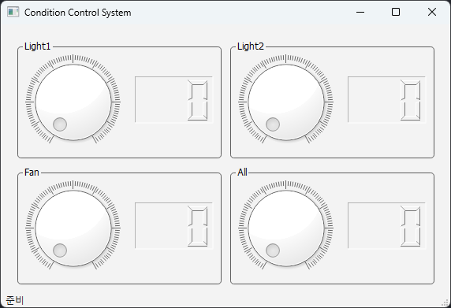

# MQTT로 조명, 팬 원격 제어
인터넷으로 연결된 컴퓨터에서 GUI 프로그램을 이용해 Auto 제어기의 PWM 컨트롤러에 연결된 팬과 조명의 속도 및 밝기를 원격 제어합니다.

## 시스템 구성
Auto 제어기에서 실행하는 펌웨어와, PC1에서 실행하는 시리얼-인터넷 브릿지 프로그램 및 PC2에서 실행하는 GUI 프로그램으로 구성되며, 환경에 따라 PC1과 PC2는 같은 PC일 수 있습니다.

```xml
      MCU      <--- 시리얼 ---> PC1      <--- 인터넷 ---> 브로커 <--- 인터넷 ---> PC2
      펌웨어                    브릿지                                           GUI
      (micrpython)             (python, pyserial, paho-mqtt)                    (python, pyqt6, paho-mqtt)
```

### 준비물
- Auto 제어기: 1개
  - USB 케이블: 1개
  - 파워 어댑터: 1개 
  - 드라이버: 1개
  - 조명 패키지: 1개 (2개의 조명 포함) 
  - 팬: 1개
- PC: 2대
  - PC1: Audo 제어기와 시리얼 연결
  - PC2: PC1과 인터넷 연결
 
### 케이블링
Light1와 Light2, Fan의 빨간색 선(VCC)은 차례로 PWM 포트 0, 1, 3에 연결하고, 검정색 선은 GND 포트 중 하나에 연결합니다.
```sh
                        G       G   G
                        |       |   |  (Black) 
                        F       L2  L1
                        |       |   |  (Red)
PWM Port -->  GND 12V   3   2   1   0
```

### 프로젝트 폴더 구조
현재 작업 공간에 CondCtrl 폴더를 생성하고, 그 아래에 XNode와 PC 폴더를 만듭니다. PC 폴더 아래에는 GUI 폴더를 추가합니다.
폴더 생성을 완료했으면, 각 폴더에 다음과 같이 파일을 구현합니다.

```xml
CondCtrl  
   |--- XNode  
   |    |--- firm_cond_ctrl.py  
   |  
   |--- PC  
        |--- serial_cond_ctrl.py  
        |--- bridge_cond_ctrl.py  
        |--- GUI  
                |--- CondCtrl.ui  
                |--- CondCtrlUi.py  
                |--- CondCtrl.py  
```
                
## Auto 제어기 펌웨어
PWM 포트에 조명과 팬을 연결한 Auto 제어기를 시리얼 통신으로 제어하는 펌웨어를 작성해 보겠습니다.
이 펌웨어는 시리얼 포트에서 데이터를 읽어와 PWM 객체를 이용하여 Auto 제어기에 연결된 장치들을 제어합니다. 

### PWM과 PWM 클래스
PWM(Pulse Width Modulation)은 펄스 폭 변조라고 하며, 디지털 신호를 사용하여 아날로그 회로를 제어하는 기술입니다. 펄스의 폭을 조절하여 전압이나 전류의 평균값을 변경하는 방식으로 작동합니다.  
PWM 신호는 일정한 주파수를 가지는 펄스로 구성됩니다. 각 펄스의 폭은 듀티 사이클(Duty Cycle)이라고 불리는 비율로 표현됩니다. 듀티 사이클은 펄스가 'High' 상태를 유지하는 시간의 비율을 나타냅니다. 듀티 사이클을 변경하면 펄스의 평균 전압이 변경되어, 아날로그 회로를 제어할 수 있습니다.

Auto 제어기에서는 PWM 클래스를 이용해 PWM 컨트롤러의 해당 채널에 PWM 신호를 출력합니다.

- PWM 클래스
  - PWM(): PWM 객체 생성
  - scan(): PWM 컨트롤러 검색. True이면 이상 없음
  - init(): PWM 컨트롤러 초기화
  - freq(n): 주파수 설정 (50 ~ 20000)
  - duty(ch, n): 채당 채널에 듀티 값에 해당하는 PWM 신호 출력
    - ch: 채널 번호 (0 ~ 3)
    - n: 튜티 값 (0 ~ 100)

기본적인 동작은 다음과 같습니다. 주파수를 1KHz로 설정한 후 0번 채널에 50% 듀티 사이클로 출력한 후 5초 후 0% 듀티 사이클로 변경합니다.  
0번 채널에 조명이 연결되었다면, 50% 출력에서는 최대 밝기보다 어두어지고, 0% 출력은 완전히 꺼집니다.   

```python
from xnode.pop.autoctrl import PWM
import time

pwm = PWM()
ret = pwn.scan()
print(ret)

pwm.init()
pwm.freq(1000) # 1KHz

pwm.duty(0, 50)
time.sleep(3)
pwm.duty(0, 0)
```

만약 pwn.scan() 결과가 False라면 이후 init()는 실패하며, PWM 칩에 문제가 있는 것이므로 제조사에 AS를 요청합니다.

### 프로토콜 정의
통신 프로토콜은 컴퓨터나 통신 장비 사이에서 데이터를 주고받기 위한 규칙 체계입니다. 마치 사람들이 서로 의사소통을 하기 위해 언어를 사용하는 것처럼, 컴퓨터들도 데이터를 교환하고 이해하기 위해 통신 프로토콜을 사용합니다.   
PWM 채널과 제어할 장치 및 동작을 나열해 보면 다음과 같습니다.

Channel| Device  | Action
-------|---------|---------
0      | Light1  | 0 ~ 100
1      | Light2  | 0 ~ 100
2      | Fan     | 0 ~ 100
       
PWM 객체를 만든 후 모두 pwm.duty() 메소드에 채널과 듀티 사이클 값만 설정하는 것이므로 이를 파이썬의 eval()로 실행하는 방식을 선택합니다.
```sh
<pwm_object_name>.duty(channel, duty_cycle)
```
- pwm_object_name: pwm
- channel
  - 0: Light1
  - 1: Light2
  - 3: Fan
- duty: 0 ~ 100


따라서 PC에서 Auto 제어기로 전송하는 데이터는 다음과 같습니다. 만약 펌웨어에서 PWM 객체 변수 이름을 변경하면, PC에서 전송하는 pwm_object_name도 함께 변경해야 합니다.
```sh
pwm.duty(0, 50)
pwm.duty(1, 80)
pwm.duty(3, 45)
```

### 펌웨어 구현
시리얼로 PC에서 문자열을 수신하면, 이를 소문자로 변경합니다.
```python
cmd = input().lower()
```

수신한 문자열을 eval()에 전달해 실행하면 해당 장비가 제어되어야 합니다.
```python
eval(cmd)
```

eval()로 실행할 수 없는 문자열일 경우 SyntaxError 예외가 발생해 펌웨어가 종료하므로, 예외 처리 문장을 추가해 종료하지 않도록 합니다.
```python
    try:
        eval(cmd)
    except SyntaxError:
        pass
```

펌웨어의 전체 코드는 다음과 같습니다.

**firm_cond_ctrl.py**  
```python
from xnode.pop.autoctrl import PWM

pwm = PWM()
pwm.init()

pwm.freq(1000)

while True:
    cmd = input().lower() # "pwm.duty(0, 50)\r"
    try:
        eval(cmd)
    except SyntaxError:
        pass
```

### 테스트
PC1에서 구현한 펌웨어를 xnode 툴을 이용해 Auto 제어기에 전송 및 실행한 다음, PC1에서 앞서 정의한 문자열을 전송합니다.

1. PC에 연결된 Auto 제어기의 시리얼 포트 번호를 확인합니다.
```sh
xnode scan
```
```out
com13
```

2. 펌웨어를 Auto 제어기에 전송하고 실행합니다. XNode는 계속 실행 중이므로 Auto 제어기와 데이터를 주고받을 수 있습니다.
```sh
xnode --sport com13 run -in CondCtrl\XNode\firm_cond_ctrl.py
```

3. 앞서 정의한 프로토콜 형식으로 문자열을 Auto 제어기에 전송하면, 해당 채널에 연결된 조명이나 팬의 밝기 및 속도 제어가 가능해야 합니다.
```sh
pwm.duty(0, 30)
pwm.duty(0, 0)
pwm.duty(2, 40)
pwm.duty(2, 0)
```

4. 테스트가 완료되면 Ctrl+C를 눌러 xnode 툴을 강제 종료합니다. Auto 제어기의 펌웨어는 전원을 끄거나 리셋 버튼을 누르기 전까지는 계속 실행 상태를 유지합니다.  

5. 테스트를 완료한 상태에서 Auto 제어기를 재시작하거나 리셋했다면, 다음과 같이 펌웨어만 실행합니다.
```python
xnode --sport com13 run -n CondCtrl\XNode\firm_cond_ctrl.py
```

## 브릿지
PC1은 Auto 제어기와 시리얼 통신을 하면서 동시에 인터넷에 연결되어 있어야 합니다. 브릿지 프로그램은 인터넷에서 MQTT 프로토콜로 수신한 메시지를 시리얼 통신을 통해 Auto 제어기로 전달합니다.  

이 브릿지 프로그램은 2단계로 개발합니다.
시리얼 통신 검증: PC1에서 Auto 제어기로 정의된 프로토콜 형식의 문자열을 전송하는 프로그램을 작성하여 시리얼 통신 검증
MQTT 기능 추가: MQTT 구독 기능을 추가하여 최종 프로그램 완성

### 1단계: 시리얼 통신 검증
PC1에서 사용자가 프로토콜에 맞는 문자열을 입력하여 시리얼 통신으로 Auto 제어기에 전송하고, 해당 장치가 정상적으로 제어되는지 확인합니다.

**serial_cond_ctrl.py**  
```python
from serial import Serial

XNODE_PORT = "COM13" # 자신의 COM 포트로 변경할 것
ser = Serial(XNODE_PORT, 115200, inter_byte_timeout=1)

def main():
    while True:
        ch = input("Enter of channel: ")
        duty = input("Enter of duty: ")
        ser.write(f"pwm.duty({ch}, {duty})\r".encode())

if __name__ == "__main__":
    main()
```

**테스트**  
출력되는 프롬프트에 맞춰 채널 번호와 듀티 값을 입력하면 해당 채널에 연결된 조명이나 팬의 밝기 및 속도가 바뀌어야 합니다.   

```sh
python CondCtrl\PC\seiral_cond_ctrl.py
```
```sh
Enter of channel: 0
Enter of duty: 20
```

### 2단계: MQTT 기능 추가
시리얼 통신 프로토콜 확인 후, MQTT 토픽 메시지를 정의하고 이를 구독하는 기능을 추가합니다.  

- 토픽: PWM 채널에 대응하는 장치 구분
  - 예: pwm/light/1,  pwm/light/2, pwm/fan
- 페이로드: json 문자열 형식의 듀티 사이클 값 (0 ~ 100)
  - 예: 0, 50, 100 등

브릿지와 GUI 프로그램이 주고 받을 MQTT 토픽 메시지는 다음과 같습니다.

Channel | Topic                | payload
--------| ---------------------|--------------
0       | ams/iot/pwm/light/1  | \<0..100
1       | ams/iot/pwm/light/2  | \<0..100
3       | ams/iot/pwm/fan      | \<0..100>

브릿지에서 구독할 토픽은 모두 3개이나, # 필터를 사용하면 한 번에 3개의(실제 3개보다 많을 수 있음) 토픽 메시지를 모두 구독할 수 있습니다. 
```python
TOPIC_IOT_PWM = "asm/iot/pwm/#"

def on_connect(client, userdata, flags, reason_code, properties):
    if reason_code == 0:
        client.subscribe(TOPIC_IOT_PWM)
```

수신된 메시지에서 토픽을 분석하여 PWM 채널 값을 결정하고, 페이로드를 듀티 사이클 값으로 설정합니다.
```python
def on_message(client, userdata, message):
    topic = message.topic
    duty = json.loads(message.payload)

    if topic == "asm/iot/pwm/light/1":
        channel = 0
    ...
```

채널과 듀티 사이클 값이 결정되면, 이를 시리얼 통신으로 펌웨어가 실행중인 Auto 제어기로 전송합니다.
```python
    print(channel, duty)
    ser.write(f"pwm.duty({channel}, {duty})\r".encode())
```

다음은 pyserial과 paho-mqtt가 결합된 최종 브릿지 코드입니다.

**bridge_cond_ctrl.py**  
```python
from serial import Serial
import paho.mqtt.client as mqtt
import json

XNODE_PORT = "COM16" # 자신의 COM 포트로 변경할 것
TOPIC_IOT_PWM = "asm/iot/pwm/#"
"""
asm/iot/pwm/light/1, 50
asm/iot/pwm/light/2, 50
asm/iot/pwm/fan/1, 50
asm/iot/pwm/fan/2, 50
"""

ser = Serial(XNODE_PORT, 115200, inter_byte_timeout=1)

def on_connect(client, userdata, flags, reason_code, properties):
    if reason_code == 0:
        print("브로커에 연결되었습니다.")
        client.subscribe(TOPIC_IOT_PWM)
    else:
        pass

def on_subscribe(client, userdata, mid, reason_code_list, properties):
    print(f"브로커에 {TOPIC_IOT_PWM} 토픽 구독이 등록되었습니다.")

def on_message(client, userdata, message):
    topic = message.topic
    try:
        duty = json.loads(message.payload)
    except ValueError:
        return

    if topic == "asm/iot/pwm/light/1":
        channel = 0
    elif topic == "asm/iot/pwm/light/2":
        channel = 1
    elif topic == "asm/iot/pwm/fan":
        channel = 3
    else:
        return
    
    print(channel, duty)
    ser.write(f"pwm.duty({channel}, {duty})\r".encode())

def main():
    c = mqtt.Client()
    c.on_connect = on_connect
    c.on_subscribe = on_subscribe
    c.on_message = on_message
    
    c.connect("mqtt.eclipseprojects.io")
    c.loop_forever() 
    
if __name__ == "__main__":
    main()
```

### 브릿지 테스트
펌웨어가 Auto 제어기에서 실행 중일 때, PC1에서 브릿지를 실행한 후, MQTTX 툴을 사용하여 Auto 제어기에 연결된 장치가 제어되는지 확인합니다.

1. 토픽 메시지를 구독하는 브릿지를 실행합니다.
```sh
python CondCtrl\PC\bridge_cond_ctrl.py
```

2. MQTTX로 mqtt.eclipseprojects.io 브로커에 연결합니다.

3. Auto 제어기에 연결된 장치를 제어하기 위해 토픽 메시지를 발생합니다. 페이로드는 JSON 형식으로 0 ~ 100 사이 듀티 사이클 값입니다.
```sh
Type: JSON
Topic: asm/iot/pwm/light/1
Payload: 40
```

## 원격 제어용 GUI
인터넷에 연결된 PC2에서 진행하며, 4개의 QDial 위젯 값이 바뀔때 마다 토픽 메시지를 MQTT 브로커에 발행하는 PySide6 기반 GUI를 구현합니다.
각각의 QDial 위젯은 사전 정의한 토픽에 대응하고 바뀐 값은 Json 문자열 형식의 페이로드로 듀티 값에 대응합니다.
 
### PySide6용 paho-mqtt 랩퍼 구현
Qt에는 MQTT 클라이언트를 구현한 QMqtt가 있지만, 상용 라이선스에서만 사용할 수 있으므로 오픈 소스인 paho-mqtt를 사용해야 합니다. 그러나 paho-mqtt는 자체 이벤트 루프를 통해 비동기 함수 호출을 처리하는 반면, PySide6는 QObject 기반의 시그널-슬롯 메커니즘과 QApplication의 이벤트 루프를 사용합니다. 이러한 차이로 인해 두 이벤트 루프의 충돌을 비롯해 사용법의 일관성이 부족하므로 paho-mqtt의 콜백 방식을 PySide6의 시그널-슬롯 메커니즘으로 변환하는 랩퍼 클래스를 구현합니다.

paho.mqtt.client.Client의 콜백을 시그널로 방출을 위해 QObject을 상속한 새 클래스 Client를 정의한 후 콜백을 방출할 Signal()을 추가합니다. 예들 들어 다음과 같이 on_connect 시그널은 수신자의 슬롯에 정수 2개와 객체 1개를 전달합니다.
```python
from PySide6.QtCore import QObject, Signal
import paho.mqtt.client as mqtt

class Client(QObject):
    on_connect = Signal(int, int, object)
    ...
```

새 클래스 생성자에서 paho.mqtt.client.Client에 전달할 매개변수를 정의한 후 paho.mqtt.client.Client 객체를 만들고 필요한 콜백을 등록합니다.
```python
    def __init__(self, client_id="", clean_session=None, userdata=None, protocol=mqtt.MQTTv5, transport="tcp", reconnect_on_failure=True, manual_ack=False, parent=None):
        super().__init__(parent)
        self.__mqtt = mqtt.Client(mqtt.CallbackAPIVersion.VERSION2, client_id, clean_session, userdata, protocol, transport, reconnect_on_failure, manual_ack)

        self.__mqtt.on_connect = self.__on_connect
        ...
```

해당 콜백이 호출되면 미리 정의한 시그널을 emit()로 방출합니다.
```python
    def __on_connect(self, client, userdata, flags, reason_code, properties):
        self.on_connect.emit(flags, reason_code, properties)
```

새 클래스에 paho.mqtt.client.Client 객체를 통해 브로커 연결/해제와 토픽 구독, 발행에 필요한 메소드를 추가합니다.   
이때, 브로커 연결/해제 메소드 이름으로 connect/disconnect를 사용할 수 없는데, 이는 QObject에 이미 송신쪽 시그널을 수신쪽에서 슬롯에 연결/해제하는 connect()/disconnect()가 정의되어 있기 때문입니다.   
따라서 브로커 연결/해제 메소드는 connection()/disconnection()으로 정의합니다.  

```python
    def connection(self, host, port=1883, ...):
        ....
        self.__mqtt.connect(host, port, keepalive, bind_address, bind_port, clean_start, connect_properties)
        self.__mqtt.loop_start()
        ....

    def disconnection(self, reasoncode=None, properties=None):
        self.__mqtt.loop_stop()
        self.__mqtt.disconnect(reasoncode, properties)
```

다음은 paho-mqtt(V2.0 이상)의 비동기 함수 호출을 PySide6의 신호-슬롯 메커니즘에 통합한  PySide6용 paho-mqtt 랩퍼 구현의 전체 코드입니다.

**PahoMqtt.py**   
```python
import json
from PySide6.QtCore import QObject, Signal
import paho.mqtt.client as mqtt
from paho.mqtt.properties import Properties
from paho.mqtt.packettypes import PacketTypes
import socket


class Client(QObject):
    on_connect = Signal(int, int, object)
    on_connect_fail = Signal()
    on_subscribe = Signal(int, list)
    on_message = Signal(str, object, int, bool, object)
    on_publish = Signal(int, int)
    on_unsubscribe = Signal(int, list)
    on_disconnect = Signal(int, int)

    def __init__(self, client_id="", clean_session=None, userdata=None, protocol=mqtt.MQTTv5, transport="tcp", reconnect_on_failure=True, manual_ack=False, parent=None):
        super().__init__(parent)
        self.__mqtt = mqtt.Client(mqtt.CallbackAPIVersion.VERSION2, client_id, clean_session, userdata, protocol, transport, reconnect_on_failure, manual_ack)

        self.__mqtt.on_connect = self.__on_connect
        self.__mqtt.on_connect_fail = self.__on_connect_fail
        self.__mqtt.on_subscribe = self.__on_subscribe
        self.__mqtt.on_message = self.__on_message
        self.__mqtt.on_publish = self.__on_publish
        self.__mqtt.on_unsubscribe = self.__on_unsubscribe
        self.__mqtt.on_disconnect = self.__on_disconnect
        
    def __del__(self):
        if self.__mqtt.is_connected():
            self.disconnect()
    
    def connection(self, host, port=1883, keepalive=60, bind_address="", bind_port=0, clean_start=mqtt.MQTT_CLEAN_START_FIRST_ONLY, session_expiry_interval=60, request_problem_information=True, username=None, password=None):
        try:
            connect_properties = Properties(PacketTypes.CONNECT)
            connect_properties.SessionExpiryInterval = session_expiry_interval
            connect_properties.RequestProblemInformation = request_problem_information
            
            self.__mqtt.username_pw_set(username, password)
            self.__mqtt.connect(host, port, keepalive, bind_address, bind_port, clean_start, connect_properties)
            self.__mqtt.loop_start()
        except socket.gaierror:
            if not self.__mqtt.on_connect:
                raise ValueError("Unknown host")
            else:
                self.__mqtt.on_connect(None, None, None, 3, None)
                
    def disconnection(self, reasoncode=None, properties=None):
        self.__mqtt.loop_stop()
        self.__mqtt.disconnect(reasoncode, properties)

    def publish(self, topic, payload=None, qos=0, retain=False, properties=None):
        self.__mqtt.publish(topic, json.dumps(payload), qos, retain, properties)

    def subscribe(self, topic, qos=0, options=None, properties=None):
        self.__mqtt.subscribe(topic, qos, options, properties)
    
    def unsubscribe(self, topic, properties=None):
        self.__mqtt.unsubscribe(topic, properties)
    
    def will_set(self, topic, payload=None, qos=0, retain=False, properties=None):
        self.__mqtt.will_set(topic, payload, qos, retain, properties)
    
    def will_clear(self):
        self.__mqtt.will_clear()
    
    def __on_connect(self, client, userdata, flags, reason_code, properties):
        self.on_connect.emit(flags, reason_code, properties)
    
    def __on_connect_fail(self, client, userdata):
        self.on_connect_fail.emit()
    
    def __on_subscribe(self, client, userdata, mid, reason_code_list, properties):
        self.on_subscribe.emit(mid, reason_code_list)
    
    def __on_message(self, client, userdata, message):
        self.on_message.emit(message.topic, json.loads(message.payload), message.qos, message.retain, message.properties)
    
    def __on_publish(self, client, userdata, mid, reason_code, properties):
        self.on_publish.emit(mid, reason_code)
    
    def __on_unsubscribe(self, client, userdata, mid, reason_code_list, properties):
        self.on_unsubscribe.emit(mid, reason_code_list)
    
    def __on_disconnect(self, client, userdata, disconnect_flags, reason_code, properties):
        self.on_disconnect.emit(disconnect_flags, reason_code)
```

**수동 설치**  
PahoMqtt.py의 구현이 끝나면, 이 파일을 PySide6 라이브러리가 설치된 경로에 복사합니다. 이렇게하면 여러 프로젝트에서 쉽게 PahoMqtt 모듈을 사용할 수 있습니다.

1. pip 실행 파일 경로를 확인합니다. 
```sh
$pipVersionOutput = & pip --version
```

2. pip 실행 파일 경로에서 pip 라이브러리 경로를 추출합니다. 이 경로의 상위 폴더가 pip로 설치하는 모든 라이브러리의 설치 경로입니다.
```sh
$sitePackagesPath = ($pipVersionOutput -split ' ')[3]
```

3. 현재 폴더의 PahoMqtt.py를 PySide6 라이브러리 설치 경로에 복사합니다.
```python
cp PahoMqtt.py $sitePackagesPath\..\PySide6 
```

**자동 설치**
PahoMqtt.py는 현재 pypi.org에 PySide6-PahoMqtt란 이름으로 등록되어 있으므로 pip로 간단하게 설치할 수 있습니다.
```sh
pip install PySide6-PahoMqtt  
```
 
### UI(화면) 디자인
QMainWindow에서 기본으로 제공되는 메뉴바(QMenuBar)를 제거하고, 4개의 그룹 박스(QGroupBox)를 배치합니다. 각 그룹 박스에는 다이얼(QDial)과 LCD 숫자 표시(QLCDNumber) 위젯을 배치하여 사용자 인터페이스를 구성합니다.  
상태 표시줄(QStatusBar)은 기본 객체 이름인 "statusbar"를 사용합니다.

1. QT 디자이너를 실행합니다.
```sh
pyside6-designer
```

2. 다음과 같이 UI 디자인합니다.
> CondCtrl.ui

 

- QMainWindow 폼에 QMenuBar만 제거한 후 4개의 QGroupBox 배치. 각 QGroupBox마다 QDial와 QLCDNumber 배치
  - QMainWindow 속성 중 windowTitle은 "Condition Control System"으로 설정
  - QGrupBox 1 속성 중 objectName은 grpLight_1, enabled는 체크 해제, title은 Light1로 설정 
    - QDial 1 속성 중 objectName은 dialLight_1, maximum은 100, notchTarget은 1.0, notchesVisible은 체크 선택
    - QLCDNumber 1 속성 중 objectName은 fndLight_1, frameShape는 Panel, frameShadow은 Sunken, digitCount는 3, segmentStyle은 Outline 선택
  - QGrupBox 2 속성 중 objectName은 grpLight_2, enabled는 체크 해제, title은 Light2로 설정
    - QDial 2 속성 중 objectName은 dialLight_2, maximum은 100, notchTarget은 1.0, notchesVisible은 체크 선택
    - QLCDNumber 2 속성 중 objectName은 fndLight_2, frameShape는 Panel, frameShadow은 Sunken, digitCount는 3, segmentStyle은 Outline 선택
  - QGrupBox 3 속성 중 objectName은 grpFan, enabled는 체크 해제, title은 Fan으로 설정
    - QDial 3 속성 중 objectName은 dialFan, maximum은 100, notchTarget은 1.0, notchesVisible은 체크 선택
    - QLCDNumber 3 속성 중 objectName은 fndFan, frameShape는 Panel, frameShadow은 Sunken, digitCount는 3, segmentStyle은 Outline 선택
  - QGrupBox 4 속성 중 objectName은 grpAll, enabled는 체크 해제, title은 All로 설정
    - QDial 4 속성 중 objectName은 dialAll, maximum은 100, notchTarget은 1.0, notchesVisible은 체크 선택
    - QLCDNumber 4 속성 중 objectName은 fndAll, frameShape는 Panel, frameShadow은 Sunken, digitCount는 3, segmentStyle은 Outline 선택
- Signal/Slot 편집기에서 QDial과 QLCDNumber 사이 연결 설정
  - dialLight1.valueChanged(int) -> findLight1.display(int) 
  - dialLight2.valueChanged(int) -> findLight2.display(int) 
  - dialFan.valueChanged(int) -> findFan.display(int) 
  - dialAll.valueChanged(int) -> findAll.display(int) 

<details>
<summary><b>CondCtrl.ui</b></summary>

```xml
<?xml version="1.0" encoding="UTF-8"?>
<ui version="4.0">
 <class>MainWindow</class>
 <widget class="QMainWindow" name="MainWindow">
  <property name="geometry">
   <rect>
    <x>0</x>
    <y>0</y>
    <width>570</width>
    <height>359</height>
   </rect>
  </property>
  <property name="windowTitle">
   <string>Condition Control System</string>
  </property>
  <widget class="QWidget" name="centralwidget">
   <widget class="QGroupBox" name="grpLight_1">
    <property name="enabled">
     <bool>false</bool>
    </property>
    <property name="geometry">
     <rect>
      <x>20</x>
      <y>20</y>
      <width>261</width>
      <height>151</height>
     </rect>
    </property>
    <property name="title">
     <string>Light1</string>
    </property>
    <property name="alignment">
     <set>Qt::AlignmentFlag::AlignLeading|Qt::AlignmentFlag::AlignLeft|Qt::AlignmentFlag::AlignVCenter</set>
    </property>
    <property name="flat">
     <bool>false</bool>
    </property>
    <property name="checkable">
     <bool>false</bool>
    </property>
    <widget class="QDial" name="dialLight_1">
     <property name="geometry">
      <rect>
       <x>11</x>
       <y>18</y>
       <width>121</width>
       <height>121</height>
      </rect>
     </property>
     <property name="autoFillBackground">
      <bool>false</bool>
     </property>
     <property name="maximum">
      <number>100</number>
     </property>
     <property name="singleStep">
      <number>1</number>
     </property>
     <property name="pageStep">
      <number>10</number>
     </property>
     <property name="sliderPosition">
      <number>0</number>
     </property>
     <property name="tracking">
      <bool>true</bool>
     </property>
     <property name="invertedAppearance">
      <bool>false</bool>
     </property>
     <property name="invertedControls">
      <bool>false</bool>
     </property>
     <property name="wrapping">
      <bool>false</bool>
     </property>
     <property name="notchTarget">
      <double>1.000000000000000</double>
     </property>
     <property name="notchesVisible">
      <bool>true</bool>
     </property>
    </widget>
    <widget class="QLCDNumber" name="fndLight_1">
     <property name="geometry">
      <rect>
       <x>150</x>
       <y>46</y>
       <width>100</width>
       <height>60</height>
      </rect>
     </property>
     <property name="frameShape">
      <enum>QFrame::Shape::Panel</enum>
     </property>
     <property name="frameShadow">
      <enum>QFrame::Shadow::Sunken</enum>
     </property>
     <property name="digitCount">
      <number>3</number>
     </property>
     <property name="segmentStyle">
      <enum>QLCDNumber::SegmentStyle::Outline</enum>
     </property>
    </widget>
   </widget>
   <widget class="QGroupBox" name="grpLight_2">
    <property name="enabled">
     <bool>false</bool>
    </property>
    <property name="geometry">
     <rect>
      <x>290</x>
      <y>20</y>
      <width>261</width>
      <height>151</height>
     </rect>
    </property>
    <property name="title">
     <string>Light2</string>
    </property>
    <widget class="QDial" name="dialLight_2">
     <property name="geometry">
      <rect>
       <x>11</x>
       <y>18</y>
       <width>121</width>
       <height>121</height>
      </rect>
     </property>
     <property name="autoFillBackground">
      <bool>false</bool>
     </property>
     <property name="maximum">
      <number>100</number>
     </property>
     <property name="singleStep">
      <number>1</number>
     </property>
     <property name="pageStep">
      <number>10</number>
     </property>
     <property name="sliderPosition">
      <number>0</number>
     </property>
     <property name="tracking">
      <bool>true</bool>
     </property>
     <property name="invertedAppearance">
      <bool>false</bool>
     </property>
     <property name="invertedControls">
      <bool>false</bool>
     </property>
     <property name="wrapping">
      <bool>false</bool>
     </property>
     <property name="notchTarget">
      <double>1.000000000000000</double>
     </property>
     <property name="notchesVisible">
      <bool>true</bool>
     </property>
    </widget>
    <widget class="QLCDNumber" name="fndLight_2">
     <property name="geometry">
      <rect>
       <x>150</x>
       <y>46</y>
       <width>100</width>
       <height>60</height>
      </rect>
     </property>
     <property name="frameShape">
      <enum>QFrame::Shape::Panel</enum>
     </property>
     <property name="frameShadow">
      <enum>QFrame::Shadow::Sunken</enum>
     </property>
     <property name="digitCount">
      <number>3</number>
     </property>
     <property name="segmentStyle">
      <enum>QLCDNumber::SegmentStyle::Outline</enum>
     </property>
    </widget>
   </widget>
   <widget class="QGroupBox" name="grpFan">
    <property name="enabled">
     <bool>false</bool>
    </property>
    <property name="geometry">
     <rect>
      <x>20</x>
      <y>180</y>
      <width>261</width>
      <height>151</height>
     </rect>
    </property>
    <property name="title">
     <string>Fan</string>
    </property>
    <widget class="QDial" name="dialFan">
     <property name="geometry">
      <rect>
       <x>11</x>
       <y>18</y>
       <width>121</width>
       <height>121</height>
      </rect>
     </property>
     <property name="autoFillBackground">
      <bool>false</bool>
     </property>
     <property name="maximum">
      <number>100</number>
     </property>
     <property name="singleStep">
      <number>1</number>
     </property>
     <property name="pageStep">
      <number>10</number>
     </property>
     <property name="sliderPosition">
      <number>0</number>
     </property>
     <property name="tracking">
      <bool>true</bool>
     </property>
     <property name="invertedAppearance">
      <bool>false</bool>
     </property>
     <property name="invertedControls">
      <bool>false</bool>
     </property>
     <property name="wrapping">
      <bool>false</bool>
     </property>
     <property name="notchTarget">
      <double>1.000000000000000</double>
     </property>
     <property name="notchesVisible">
      <bool>true</bool>
     </property>
    </widget>
    <widget class="QLCDNumber" name="fndFan">
     <property name="geometry">
      <rect>
       <x>150</x>
       <y>46</y>
       <width>100</width>
       <height>60</height>
      </rect>
     </property>
     <property name="frameShape">
      <enum>QFrame::Shape::Panel</enum>
     </property>
     <property name="frameShadow">
      <enum>QFrame::Shadow::Sunken</enum>
     </property>
     <property name="digitCount">
      <number>3</number>
     </property>
     <property name="segmentStyle">
      <enum>QLCDNumber::SegmentStyle::Outline</enum>
     </property>
    </widget>
   </widget>
   <widget class="QGroupBox" name="grpAll">
    <property name="enabled">
     <bool>false</bool>
    </property>
    <property name="geometry">
     <rect>
      <x>290</x>
      <y>180</y>
      <width>261</width>
      <height>151</height>
     </rect>
    </property>
    <property name="title">
     <string>All</string>
    </property>
    <widget class="QDial" name="dialAll">
     <property name="geometry">
      <rect>
       <x>11</x>
       <y>18</y>
       <width>121</width>
       <height>121</height>
      </rect>
     </property>
     <property name="autoFillBackground">
      <bool>false</bool>
     </property>
     <property name="maximum">
      <number>100</number>
     </property>
     <property name="singleStep">
      <number>1</number>
     </property>
     <property name="pageStep">
      <number>10</number>
     </property>
     <property name="sliderPosition">
      <number>0</number>
     </property>
     <property name="tracking">
      <bool>true</bool>
     </property>
     <property name="invertedAppearance">
      <bool>false</bool>
     </property>
     <property name="invertedControls">
      <bool>false</bool>
     </property>
     <property name="wrapping">
      <bool>false</bool>
     </property>
     <property name="notchTarget">
      <double>1.000000000000000</double>
     </property>
     <property name="notchesVisible">
      <bool>true</bool>
     </property>
    </widget>
    <widget class="QLCDNumber" name="fndAll">
     <property name="geometry">
      <rect>
       <x>150</x>
       <y>46</y>
       <width>100</width>
       <height>60</height>
      </rect>
     </property>
     <property name="frameShape">
      <enum>QFrame::Shape::Panel</enum>
     </property>
     <property name="frameShadow">
      <enum>QFrame::Shadow::Sunken</enum>
     </property>
     <property name="digitCount">
      <number>3</number>
     </property>
     <property name="segmentStyle">
      <enum>QLCDNumber::SegmentStyle::Outline</enum>
     </property>
    </widget>
   </widget>
  </widget>
  <widget class="QStatusBar" name="statusBar"/>
 </widget>
 <resources/>
 <connections>
  <connection>
   <sender>dialLight_1</sender>
   <signal>valueChanged(int)</signal>
   <receiver>fndLight_1</receiver>
   <slot>display(int)</slot>
   <hints>
    <hint type="sourcelabel">
     <x>91</x>
     <y>98</y>
    </hint>
    <hint type="destinationlabel">
     <x>219</x>
     <y>95</y>
    </hint>
   </hints>
  </connection>
  <connection>
   <sender>dialLight_2</sender>
   <signal>valueChanged(int)</signal>
   <receiver>fndLight_2</receiver>
   <slot>display(int)</slot>
   <hints>
    <hint type="sourcelabel">
     <x>361</x>
     <y>98</y>
    </hint>
    <hint type="destinationlabel">
     <x>489</x>
     <y>95</y>
    </hint>
   </hints>
  </connection>
  <connection>
   <sender>dialAll</sender>
   <signal>valueChanged(int)</signal>
   <receiver>fndAll</receiver>
   <slot>display(int)</slot>
   <hints>
    <hint type="sourcelabel">
     <x>361</x>
     <y>258</y>
    </hint>
    <hint type="destinationlabel">
     <x>489</x>
     <y>255</y>
    </hint>
   </hints>
  </connection>
  <connection>
   <sender>dialFan</sender>
   <signal>valueChanged(int)</signal>
   <receiver>fndFan</receiver>
   <slot>display(int)</slot>
   <hints>
    <hint type="sourcelabel">
     <x>91</x>
     <y>258</y>
    </hint>
    <hint type="destinationlabel">
     <x>219</x>
     <y>255</y>
    </hint>
   </hints>
  </connection>
 </connections>
</ui>
```

</details>

3. 완성된 UI를 CondCtrl\PC\GUI 경로에 CondCtrl.ui로 저장합니다.
  
4. 저장한 UI 파일(CondCtrl.ui)을 파이썬 파일(CondCtrlUi.py)로 변환합니다.
```sh
pyside6-uic CondCtrl\PC\GUI\CondCtrl.ui -o CondCtrl\PC\GUI\CondCtrlUi.py
```

<details>
<summary><b>CondCtrlUi.py</b></summary>

```python
# -*- coding: utf-8 -*-

################################################################################
## Form generated from reading UI file 'CondCtrl.ui'
##
## Created by: Qt User Interface Compiler version 6.8.0
##
## WARNING! All changes made in this file will be lost when recompiling UI file!
################################################################################

from PySide6.QtCore import (QCoreApplication, QDate, QDateTime, QLocale,
    QMetaObject, QObject, QPoint, QRect,
    QSize, QTime, QUrl, Qt)
from PySide6.QtGui import (QBrush, QColor, QConicalGradient, QCursor,
    QFont, QFontDatabase, QGradient, QIcon,
    QImage, QKeySequence, QLinearGradient, QPainter,
    QPalette, QPixmap, QRadialGradient, QTransform)
from PySide6.QtWidgets import (QApplication, QDial, QFrame, QGroupBox,
    QLCDNumber, QMainWindow, QSizePolicy, QStatusBar,
    QWidget)

class Ui_MainWindow(object):
    def setupUi(self, MainWindow):
        if not MainWindow.objectName():
            MainWindow.setObjectName(u"MainWindow")
        MainWindow.resize(570, 359)
        self.centralwidget = QWidget(MainWindow)
        self.centralwidget.setObjectName(u"centralwidget")
        self.grpLight_1 = QGroupBox(self.centralwidget)
        self.grpLight_1.setObjectName(u"grpLight_1")
        self.grpLight_1.setEnabled(False)
        self.grpLight_1.setGeometry(QRect(20, 20, 261, 151))
        self.grpLight_1.setAlignment(Qt.AlignmentFlag.AlignLeading|Qt.AlignmentFlag.AlignLeft|Qt.AlignmentFlag.AlignVCenter)
        self.grpLight_1.setFlat(False)
        self.grpLight_1.setCheckable(False)
        self.dialLight_1 = QDial(self.grpLight_1)
        self.dialLight_1.setObjectName(u"dialLight_1")
        self.dialLight_1.setGeometry(QRect(11, 18, 121, 121))
        self.dialLight_1.setAutoFillBackground(False)
        self.dialLight_1.setMaximum(100)
        self.dialLight_1.setSingleStep(1)
        self.dialLight_1.setPageStep(10)
        self.dialLight_1.setSliderPosition(0)
        self.dialLight_1.setTracking(True)
        self.dialLight_1.setInvertedAppearance(False)
        self.dialLight_1.setInvertedControls(False)
        self.dialLight_1.setWrapping(False)
        self.dialLight_1.setNotchTarget(1.000000000000000)
        self.dialLight_1.setNotchesVisible(True)
        self.fndLight_1 = QLCDNumber(self.grpLight_1)
        self.fndLight_1.setObjectName(u"fndLight_1")
        self.fndLight_1.setGeometry(QRect(150, 46, 100, 60))
        self.fndLight_1.setFrameShape(QFrame.Shape.Panel)
        self.fndLight_1.setFrameShadow(QFrame.Shadow.Sunken)
        self.fndLight_1.setDigitCount(3)
        self.fndLight_1.setSegmentStyle(QLCDNumber.SegmentStyle.Outline)
        self.grpLight_2 = QGroupBox(self.centralwidget)
        self.grpLight_2.setObjectName(u"grpLight_2")
        self.grpLight_2.setEnabled(False)
        self.grpLight_2.setGeometry(QRect(290, 20, 261, 151))
        self.dialLight_2 = QDial(self.grpLight_2)
        self.dialLight_2.setObjectName(u"dialLight_2")
        self.dialLight_2.setGeometry(QRect(11, 18, 121, 121))
        self.dialLight_2.setAutoFillBackground(False)
        self.dialLight_2.setMaximum(100)
        self.dialLight_2.setSingleStep(1)
        self.dialLight_2.setPageStep(10)
        self.dialLight_2.setSliderPosition(0)
        self.dialLight_2.setTracking(True)
        self.dialLight_2.setInvertedAppearance(False)
        self.dialLight_2.setInvertedControls(False)
        self.dialLight_2.setWrapping(False)
        self.dialLight_2.setNotchTarget(1.000000000000000)
        self.dialLight_2.setNotchesVisible(True)
        self.fndLight_2 = QLCDNumber(self.grpLight_2)
        self.fndLight_2.setObjectName(u"fndLight_2")
        self.fndLight_2.setGeometry(QRect(150, 46, 100, 60))
        self.fndLight_2.setFrameShape(QFrame.Shape.Panel)
        self.fndLight_2.setFrameShadow(QFrame.Shadow.Sunken)
        self.fndLight_2.setDigitCount(3)
        self.fndLight_2.setSegmentStyle(QLCDNumber.SegmentStyle.Outline)
        self.grpFan = QGroupBox(self.centralwidget)
        self.grpFan.setObjectName(u"grpFan")
        self.grpFan.setEnabled(False)
        self.grpFan.setGeometry(QRect(20, 180, 261, 151))
        self.dialFan = QDial(self.grpFan)
        self.dialFan.setObjectName(u"dialFan")
        self.dialFan.setGeometry(QRect(11, 18, 121, 121))
        self.dialFan.setAutoFillBackground(False)
        self.dialFan.setMaximum(100)
        self.dialFan.setSingleStep(1)
        self.dialFan.setPageStep(10)
        self.dialFan.setSliderPosition(0)
        self.dialFan.setTracking(True)
        self.dialFan.setInvertedAppearance(False)
        self.dialFan.setInvertedControls(False)
        self.dialFan.setWrapping(False)
        self.dialFan.setNotchTarget(1.000000000000000)
        self.dialFan.setNotchesVisible(True)
        self.fndFan = QLCDNumber(self.grpFan)
        self.fndFan.setObjectName(u"fndFan")
        self.fndFan.setGeometry(QRect(150, 46, 100, 60))
        self.fndFan.setFrameShape(QFrame.Shape.Panel)
        self.fndFan.setFrameShadow(QFrame.Shadow.Sunken)
        self.fndFan.setDigitCount(3)
        self.fndFan.setSegmentStyle(QLCDNumber.SegmentStyle.Outline)
        self.grpAll = QGroupBox(self.centralwidget)
        self.grpAll.setObjectName(u"grpAll")
        self.grpAll.setEnabled(False)
        self.grpAll.setGeometry(QRect(290, 180, 261, 151))
        self.dialAll = QDial(self.grpAll)
        self.dialAll.setObjectName(u"dialAll")
        self.dialAll.setGeometry(QRect(11, 18, 121, 121))
        self.dialAll.setAutoFillBackground(False)
        self.dialAll.setMaximum(100)
        self.dialAll.setSingleStep(1)
        self.dialAll.setPageStep(10)
        self.dialAll.setSliderPosition(0)
        self.dialAll.setTracking(True)
        self.dialAll.setInvertedAppearance(False)
        self.dialAll.setInvertedControls(False)
        self.dialAll.setWrapping(False)
        self.dialAll.setNotchTarget(1.000000000000000)
        self.dialAll.setNotchesVisible(True)
        self.fndAll = QLCDNumber(self.grpAll)
        self.fndAll.setObjectName(u"fndAll")
        self.fndAll.setGeometry(QRect(150, 46, 100, 60))
        self.fndAll.setFrameShape(QFrame.Shape.Panel)
        self.fndAll.setFrameShadow(QFrame.Shadow.Sunken)
        self.fndAll.setDigitCount(3)
        self.fndAll.setSegmentStyle(QLCDNumber.SegmentStyle.Outline)
        MainWindow.setCentralWidget(self.centralwidget)
        self.statusBar = QStatusBar(MainWindow)
        self.statusBar.setObjectName(u"statusBar")
        MainWindow.setStatusBar(self.statusBar)

        self.retranslateUi(MainWindow)
        self.dialLight_1.valueChanged.connect(self.fndLight_1.display)
        self.dialLight_2.valueChanged.connect(self.fndLight_2.display)
        self.dialAll.valueChanged.connect(self.fndAll.display)
        self.dialFan.valueChanged.connect(self.fndFan.display)

        QMetaObject.connectSlotsByName(MainWindow)
    # setupUi

    def retranslateUi(self, MainWindow):
        MainWindow.setWindowTitle(QCoreApplication.translate("MainWindow", u"Condition Control System", None))
        self.grpLight_1.setTitle(QCoreApplication.translate("MainWindow", u"Light1", None))
        self.grpLight_2.setTitle(QCoreApplication.translate("MainWindow", u"Light2", None))
        self.grpFan.setTitle(QCoreApplication.translate("MainWindow", u"Fan", None))
        self.grpAll.setTitle(QCoreApplication.translate("MainWindow", u"All", None))
    # retranslateUi
```

</details>

### 코드 구현
CondCtrlUi.py를 활용하여 사용자 인터페이스에서 QDial 값이 변경될 때마다 해당 값을 MQTT 토픽 메시지로 발행하는 파이썬 코드를 작성합니다.

- 4개의 QDial.valueChanged 신호에 대한 슬롯 구현
  - dialLight_1의 valueChanged 신호를 onLight1ValueChange()에 연결
    - 신호를 받으면 함께 전달된 QDial 값을 "asm/iot/pwm/light/1" 토픽으로 발행
  - dialLight_1의 valueChanged 신호를 onLight2ValueChange()에 연결
    - 신호를 받으면 함께 전달된 QDial 값을 "sm/iot/pwm/light/2" 토픽으로 발행
  - dialFan_1의 valueChanged 신호를 onFan1ValueChange()에 연결
    - 신호를 받으면 함께 전달된 QDial 값을 "asm/iot/pwm/fan/1" 토픽으로 발행
  - dialFan_1의 valueChanged 신호를 onFan2ValueChange()에 연결
    - 신호를 받으면 함께 전달된 QDial 값을 "asm/iot/pwm/fan/2" 토픽으로 발행
- PySide6Mqtt 모듈의 Client 객체를 생성한 후 해당 신호에 대한 슬롯 구현
  - Client 객체의 connectSignal 신호를 onConnect()에 연결
    - 신호를 받으면 함께 전달된 rc를 검사해 처리
      - 0이면 브로커에 연결된 것이므로 모든 QGrouopBox의 setEnabled() 메소드에 True를 전달해 위젯 활성화
      - 아니면 실패이므로 QMainWindow의 close() 메소드를 호출해 창을 닫음(프로그램 종료)
  - Client 객체의 publishSignal 신호를 onPublish()에 연결
    - 신호를 받으면 함께 전달된 mid(발행한 메시지 일련번호)를 상태바에 출력하기 위해 QStatusBar의 showMessage() 메소드 호출
  - Client 객체의 connect() 메소드를 호출해 mqtt 클라이언트 라이브러리가 브로커(mqtt.eclipseprojects.io) 연결을 처리하도록 요청

완성된 코드는 다음과 같습니다.

**CondCtrl.py**
```python
import sys
from PySide6.QtWidgets import QApplication, QMainWindow, QMessageBox
from CondCtrlUi import Ui_MainWindow
from PySide6.PahoMqtt import Client

class CondCtrl(QMainWindow, Ui_MainWindow):
    def __init__(self):
        super().__init__()
        self.setupUi(self)
        
        self.dialLight_1.valueChanged.connect(self.onLight1ValueChange)
        self.dialLight_2.valueChanged.connect(self.onLight2ValueChange)
        self.dialFan.valueChanged.connect(self.onFanValueChange)
        self.dialAll.valueChanged.connect(self.onAllValueChange)
        
        self.client = Client()
        self.client.on_connect.connect(self.onConnect)
        self.client.on_publish.connect(self.onPublish)
        self.client.connection("mqtt.eclipseprojects.io")
    
    def onConnect(self, rc):
        if rc == 0:
            QMessageBox.information(self,"MQTT Broker", "브로커에 연결되었습니다.")
            self.grpLight_1.setEnabled(True)
            self.grpLight_2.setEnabled(True)
            self.grpFan.setEnabled(True)
            self.grpAll.setEnabled(True)
            self.statusBar.showMessage("준비")
        else:
            self.close()
    
    def onPublish(self, mid):
        self.statusBar.showMessage(f"{mid} 번째 메시지가 발행되었습니다.")
    
    def onLight1ValueChange(self, value):
        self.client.publish("asm/iot/pwm/light/1", value)
    
    def onLight2ValueChange(self, value):
        self.client.publish("asm/iot/pwm/light/2", value)
    
    def onFanValueChange(self, value):
        self.client.publish("asm/iot/pwm/fan", value)
    
    def onAllValueChange(self, value):
        self.client.publish("asm/iot/pwm/light/1", value)
        self.client.publish("asm/iot/pwm/light/2", value)
        self.client.publish("asm/iot/pwm/fan", value)


def main():
    app = QApplication(sys.argv)
    win = CondCtrl()
    win.show()
    app.exec()

if __name__ == "__main__":
    main()
```

### 테스트
Auto 제어기에 펌웨어를 설치하고, PC1에서 브릿지 프로그램을 실행한 상태에서 개발한 GUI 프로그램을 실행하여 최종 결과를 확인합니다. 
해당 그룹의 다이얼을 조작하면, Auto 제어기에 연결된 조명의 밝기 또는 팬의 속도가 실시간으로 변경되어야 합니다. 특히 4번째 그룹의 다이얼 값 변화는 조명 2개와 팬에 동시에 적용되어야 합니다.

```sh
python CondCtrl\PC\GUI\CondCtrl.py
```
