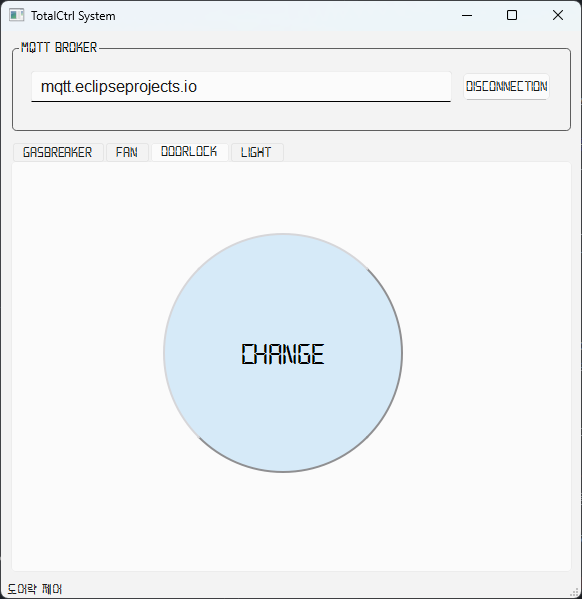

# MQTT로 조명, 팬, 도어락, 가스브레이커 원격 제어
인터넷으로 연결된 컴퓨터에서 GUI 프로그램을 이용해 Auto 제어기의 PWM 컨트롤러에 연결된 가스브레이커와 팬 및 릴레이에 연결된 도어락, 조명 상태를 원격 제어합니다.

## 시스템 구성
Auto 제어기에서 실행하는 펌웨어와, PC1에서 실행하는 시리얼-인터넷 브릿지 프로그램 및 PC2에서 실행하는 GUI 프로그램으로 구성되며, 환경에 따라 PC1과 PC2는 같은 PC일 수 있습니다.

```xml
      MCU      <--- 시리얼 ---> PC1      <--- 인터넷 ---> 브로커 <--- 인터넷 ---> PC2
      펌웨어                    브릿지                                           GUI
      (micrpython)             (python, pyserial, paho-mqtt)                    (python, pyqt6, paho-mqtt)
```

### 준비물
- Auto 제어기: 1개
  - USB 케이블: 1개
  - 파워 어댑터: 1개 
  - 드라이버: 1개
  - 조명: 2개 (1조)
  - 팬: 1개
  - 도어락: 1개  
  - 가스브레이커: 1개
- PC: 2대
  - PC1: Audo 제어기와 시리얼 연결
  - PC2: PC1과 인터넷 연결

### 케이블링
GasBreaker의 빨간색 선(VCC)은 PWM 포트 0에, 검정색 선은 PWM 포트 1에 연결합니다. Fan의 빨간색 선(VCC)은 PWM 포트 3에, 검정색 선은 GND 포트 중 하나에 연결합니다.

```sh         
              G
              |(Black)
             Fan         GasBreaker
         (Red)|      (Red)|     | 
              |     |     |     |(Black)
PWM Port -->  3     2     1     0
```

DoorLock의 검정색 선 2가닥을 Relay 1의 C와 NO 단자에 연결합니다. Light1과 Light2의 빨간색(VCC) 선은 각각 Relay 2와 Relay 3의 NO 단자에 연결하고, 검정색 선은 GND 포트 중 하나에 연결합니다.
```sh
                              G        G
                              |        |
                  DoorLock    Light1    Light2
                   |   |           |        |
Relay Port --->    C   O      C    O    C   O
                  RELAY_1
```

### 프로젝트 폴더 구조
현재 작업 공간에 TotalCtrl 폴더를 생성하고, 그 아래에 XNode와 PC 폴더를 만듭니다. PC 폴더 아래에는 GUI 폴더를 추가합니다.

폴더 생성을 완료했으면, 각 폴더에 다음과 같이 파일을 구현합니다.

```sh
TotalCtrl  
   |--- XNode  
   |    |--- firm_total_ctrl.py  
   |  
   |--- PC  
        |--- serial_total_ctrl.py  
        |--- bridge_total_ctrl.py  
        |--- GUI  
                |--- TotalCtrl.ui  
                |--- TotalCtrlUi.py  
                |--- TotalCtrl.py  
                |--- PahoMqtt.py  
```

## Auto 제어기 펌웨어
PWM 포트에 가스 차단기와 팬, 릴레이 포트에 도어락과 조명을 연결한 Auto 제어기를 시리얼 통신으로 제어하는 펌웨어를 작성해 보겠습니다.

이 펌웨어는 시리얼 포트에서 데이터를 읽어와 릴레이와 PWM 객체를 이용하여 Auto 제어기에 연결된 장치들을 제어합니다. 앞서 배운 내용을 토대로 펌웨어 구현을 시작해 봅시다.

### 프로토콜 정의
먼저 PWM과 Relay 객체로 제어할 장치와 그룹, 동작을 나열해 보면 다음과 같습니다.

| Object | Device     | Group | Action 
|--------|------------|-------|--------
| PWM    | GasBreaker |       | Open 
|        |            |       | Close 
|        |            |       | Stop 
|        | Fan        |       | 0 ~ 100 
| Relay  | DoorLock   |       | stateChange 
|        | Light      | 1     | on 
|        |            |       | off 
|        |            | 2     | on 
|        |            |       | off 

따라서 프로토콜 구조는 다음과 같이 3개의 필드로 구성되며, 내용은 문자열을 사용합니다.
```sh
<device> <group> <action>
```

PC에서 Auto 제어기로 전송하는 데이터는 정의된 프로토콜에 따라 3개의 필드(Object, Device, Action)로 구성됩니다. Group 필드가 없는 Device의 경우, "none" 또는 임의의 문자를 사용합니다.

device      |    group      |     action
------------|---------------|--------------------------
gasbreaker  |    none       |     \<open \| close \| stop>
fan         |    none       |     \<0..100>
doorlock    |    none       |     statechange
light       |   \<1 \| 2>   |     \<on \| off>


### 펌웨어 구현  

펌웨어는 PC에서 수신한 문자열을 공백 문자를 기준으로 3개의 필드(object, device, action)에 해당하는 각각의 문자열로 분리합니다. 

```python
cmd = input().lower().split()  
```

예를들어 수신한 문자열이 "light 1 on"이라면 split() 결과는 ["light", "1", "on"]이므로 cmd[0]은 device, cmd[1]은 group, cmd[2]는 action을 나타냅니다.  
따라서 cmd의 각 필드 내용을 확인하여 PWM 또는 Relay 객체로 필요한 동작을 수행하면 됩니다.  

```python
if cmd[0] == "light":            # device
    if cmd[1] == "1":            # group
        if cmd[2] == "on":       # action
            # 조명1을 켭니다.
        elif cmd[2] == "off":
            # 조명1을 끕니다.          
```

코드 실행 과정에서 예외가 발행해 펌웨어가 강제 종료되는 것을 방지하려면 예외처리가 필요합니다.
먼저 PC에서 전송한 문자열이 3개의 필드로 분할되지 않으면, return 문으로 loop()를 즉시 종료합니다.  

```python
cmd = input().lower().split()  

if len(cmd) != 3:
    return
```

또한 device가 fan일 때 action은 듀티 사이클에 해당하는 1~100사이 문자열인데, 이를 정수로 바꿀 때 변환할 수 없는 문자열이라면 예외처리 구문(try ~ except)을 통해 무시합니다.

```python
try:
    val = int(cmd[2])  # "95" or "95a"
    pwm.duty(3, val)
except:
    pass
```

지금까지 설명한 펌웨어의 전체 코드는 다음과 같습니다.

**firm_total_ctrl.py**  
```python
from xnode.pop.autoctrl import PWM
from xnode.pop.autoctrl import Relay, DIO
import time

pwm = PWM()                        # gasbreaker: ch[1:0], fan: ch[3]
doorlock = Relay(DIO.P_RELAY[0])   # relay 1
light1 = Relay(DIO.P_RELAY[1])     # relay 2
light2 = Relay(DIO.P_RELAY[2])     # relay 3

def setup():
    pwm.init()
    pwm.freq(1000)

def loop():
    cmd = input().lower().split()  

    if len(cmd) != 3:
        return

    if cmd[0] == "gasbreaker":
        if cmd[2] == "open":
            pwm.duty(0, 100)
            pwm.duty(1, 0)
        elif cmd[2] == "close":
            pwm.duty(0, 0)
            pwm.duty(1, 100)
        elif cmd[2] == "stop":
            pwm.duty(0, 0)
            pwm.duty(1, 0)
    elif cmd[0] == "fan":
        try:
            val = int(cmd[2])  
            pwm.duty(3, val)
        except:
            pass
    elif cmd[0] == "doorlock":
        if cmd[2] == "statechange":
            doorlock.on()
            time.sleep(0.5)
            doorlock.off()
    elif cmd[0] == "light":
        if cmd[1] == "1":
            if cmd[2] == "on":
                light1.on()
            elif cmd[2] == "off":
                light1.off()
        elif cmd[1] == "2":
            if cmd[2] == "on":
                light2.on()
            elif cmd[2] == "off":
                light2.off()
    
if __name__ == "__main__":
    setup()
    while True:
        loop()
```

### 심화1: 함수 리팩토링
현재 loop() 함수처럼 많은 코드가 복잡하게 얽혀 있는 경우, 기능별로 분리하여 하위 함수로 만들면 가독성을 높이고 향후 기능 추가 및 유지보수에 도움이 됩니다.

``` python
def gasBreaker(group, action):
    if action == "open": 
        pwm.duty(0, 100)
        pwm.duty(1, 0)
    elif action == "close":
        pwm.duty(0, 0)
        pwm.duty(1, 100)
    elif action == "stop":
        pwm.duty(0, 0)
        pwm.duty(1, 0)    

def fan(group, action):
    try:
        val = int(action)
        pwm.duty(3, val)
    except:
        pass    

def doorLock(group, action):
    if action == "statechange":
        doorlock.on()
        time.sleep(0.5)
        doorlock.off()

def light(group, action):
    if group == "1":  
        if action == "on":
            light1.on()
        elif action == "off":
            light1.off()
    elif group == "2":
        if action == "on":
            light2.on()
        elif action == "off":
            light2.off()

def loop():
    cmd = input().lower().split() 
    
    if len(cmd) != 3:
        return
    
    device = cmd[0]
    
    if device == "gasbreaker":
        gasBreaker(cmd[1], cmd[2])
    elif device == "fan":
        fan(cmd[1], cmd[2])
    elif device == "doorlock":
        doorLock(cmd[1], cmd[2])
    elif device == "light":
        light(cmd[1], cmd[2])
```

### 심화2: 함수 호출 테이블
또한 조건문에 따라 함수를 호출하는 구조를 딕셔너리로 변경하면 코드 구조가 개선되고 함수 갯수와 관계없이 함수 호출 속도가 빨라집니다.

``` python
def loop():
    cmd = input().lower().split() 
    
    if len(cmd) != 3:
        return
    
    try:
        {
            "gasbreaker": gasBreaker, 
            "fan": fan, 
            "doorlock":doorLock, 
            "light":light 
        }[cmd[0]](cmd[1], cmd[2])   
    except:
        pass
```

이제 loop() 함수는 수신한 시리얼 데이터를 공백을 기준으로 3개의 문자열로 분리한 후, 첫 번째 문자열을 키로 사용하여 딕셔너리에서 해당하는 함수를 찾아 두 번째와 세 번째 문자열을 인자로 전달하여 실행합니다.

### 테스트
PC1에서 구현한 펌웨어를 xnode 툴을 이용해 Auto 제어기에 전송 및 실행한 다음, PC1에서 앞서 정의한 제어 문자열을 전송합니다.

1. PC에 연결된 Auto 제어기의 시리얼 포트 번호를 확인합니다.
```sh
xnode scan
```
```out
com13
```

2. 펌웨어를 Auto 제어기에 전송하고 실행합니다. XNode는 계속 실행 중이므로 Auto 제어기와 데이터를 주고받을 수 있습니다.
```sh
xnode --sport com13 run -in TotalCtrl\XNode\firm_total_ctrl.py
```

3. 앞서 정의한 프로토콜 형식으로 문자열을 Auto 제어기에 전송하면 가스 차단기, 팬, 도어락, 조명을 제어할 수 있습니다. Group 필드가 없는 Device는 Group 필드에 임의의 문자를 사용합니다.

```sh
gasbreaker n open
fan n 40
doorlock n statechange
light 1 on
```

4. 테스트가 완료되면 Ctrl+C를 눌러 XNode 툴을 종료합니다. Auto 제어기의 펌웨어는 전원을 끄거나 리셋 버튼을 누르기 전까지는 계속 실행 상태를 유지합니다.

5. 테스트를 완료한 상태에서 Auto 제어기를 재시작하거나 리셋했다면, 다음과 같이 펌웨어만 실행합니다.
```
xnode --sport com13 run -n TotalCtrl\XNode\firm_total_ctrl.py
```

## 브릿지
PC1은 Auto 제어기와 시리얼 통신을 하면서 인터넷에 연결되어야 합니다. 브릿지 프로그램은 인터넷에서 MQTT 프로토콜로 수신한 메시지를 시리얼 통신을 통해 Auto 제어기로 전달합니다.

브릿지 프로그램은 2단계로 구현됩니다.
- 시리얼 통신 검증: PC1에서 Auto 제어기로 정의된 프로토콜 형식의 문자열을 전송하는 프로그램을 작성하여 시리얼 통신 검증
- MQTT 기능 추가: MQTT 구독 기능을 추가하여 최종 프로그램 완성

### 1단계: 시리얼 통신 검증
PC1에서 사용자가 프로토콜에 맞는 문자열을 입력하여 시리얼 통신으로 Auto 제어기에 전송하고, 해당 장치가 정상적으로 제어되는지 확인합니다.

**serial_total_ctrl.py**  
```python
from serial import Serial

XNODE_PORT = "COM20" # 자신의 COM 포트로 변경할 것
ser = Serial(XNODE_PORT, 115200, inter_byte_timeout=1)

def main():
    while True:
        device = input("Enter of Devic: ")     # gasbreaker | fan | doorlock | light
        group = input("Enter of Group: ")      # none | 1 | 2
        action = input("Enter of Action: ")    # open | close | stop | 0..100 | statechange | on | off
        
        cmd = f"{device} {group} {action}\r".encode()
        print(">>> Write:", cmd)
        
        ser.write(cmd)

if __name__ == "__main__":
    main()
```

**테스트**  
device와 group, action 값을 입력하면 해당 채널에 연결된 가스브레이커나, 팬, 도어락, 조명이 제어되어야 합니다.   

```sh
python TotalCtrl\PC\seiral_total_ctrl.py
```
```sh
Enter of Device: light
Enter of Group: 1
Enter of Action: on
```

### 2단계: MQTT 기능 추가
시리얼 통신 프로토콜 확인 후, MQTT 토픽 메시지를 정의하고 이를 구독하는 기능을 추가합니다.

- 토픽: 장치 구분
  - 예: gasbreaker, fan, doorlock, light
- 페이로드: 그룹과 동작을 JSON 형식의 딕셔너리 묶어 표현
  - 예: {"group": "1", "action": "on"}


브릿지와 GUI 프로그램이 주고 받을 MQTT 토픽 메시지는 다음과 같습니다.

topic (device)            | payload (group, action)
--------------------------|--------------------------------------------------
asm/iot/total/gasbreaker  | {"group":none,  "action":\<"open"\|"close"\|"stop">}
asm/iot/total/fan         | {"group":none,  "action":\<0..100>}
asm/iot/totla/doorlock    | {"group":none,  "action":"statechange"}
asm/iot/totla/light       | {"group":\<1\|2>, "action":\<"on"\|"off">}

브릿지는 "asm/iot/total/#" 토픽을 구독합니다. 
```python
TOPIC_IOT_TOTAL = "asm/iot/total/#"

def on_connect(client, userdata, flags, rc, properties):
    if rc == 0:
        client.subscribe(TOPIC_IOT_TOTAL)
```

수신된 메시지에서 토픽을 분석하여 device 값을 결정하고, 페이로드(JSON 형식)에서 "group"과 "action" 키를 사용하여 group과 action 값을 추출합니다.

```python
def on_message(client, userdata, message): 
    topic = message.topic
    group_action = json.loads(message.payload)

    if topic == "asm/iot/total/gasbreaker":
        device = "gasbreaker"

    group = group_action['group']
    action = group_action['action']
```

다음은 pyserial과 paho-mqtt가 결합된 최종 브릿지 코드입니다.

**bridge_total_ctrl.py**
```python
from serial import Serial
import paho.mqtt.client as mqtt
import json


XNODE_PORT = "COM20" # 자신의 COM 포트로 변경할 것
TOPIC_IOT_TOTAL = "asm/iot/total/#"

ser = Serial(XNODE_PORT, 115200, inter_byte_timeout=1)

def on_connect(client, userdata, connect_flags, reason_code, properties):
    if reason_code == 0:
        print("브로커에 연결되었습니다.")
        client.subscribe(TOPIC_IOT_TOTAL)
    else:
        pass

def on_subscribe(client, userdata, mid, reason_code_list, properties):
    print(f"브로커에 {TOPIC_IOT_TOTAL} 토픽 구독이 등록되었습니다.")

def on_message(client, userdata, message):    
    topic = message.topic
    try:
        group_action = json.loads(message.payload)
    except ValueError:
        return
        
    if topic == "asm/iot/total/gasbreaker":
        device = "gasbreaker"
    elif topic == "asm/iot/total/fan":
        device = "fan"
    elif topic == "asm/iot/total/doorlock":
        device = "doorlock"
    elif topic == "asm/iot/total/light":
        device = "light"
    else:
        return

    group = group_action['group']
    action = group_action['action']

    cmd = f"{device} {group} {action}\r".encode()

    print(cmd)
    ser.write(cmd)

def main():
    c = mqtt.Client(mqtt.CallbackAPIVersion.VERSION2)
    c.on_connect = on_connect
    c.on_subscribe = on_subscribe
    c.on_message = on_message
    
    c.connect("mqtt.eclipseprojects.io")
    c.loop_forever() 
    
if __name__ == "__main__":
    main()
```

### 심화: 토픽에서 device 추출
수신한 MQTT 토픽의 마지막 부분이 device 이름이므로, 이를 추출하여 사용하면 코드를 간결하게 만들 수 있습니다.

```python
def on_message(client, userdata, message):
    topic = message.topic
    try:
        group_action = json.loads(message.payload)
    except ValueError:
        return

    device = topic.split('/')[-1]   
    group = group_action["group"]
    action = group_action["action"]
    
    cmd = f"{device} {group} {action}\r".encode()
    
    print(">>> Write:", cmd)
    ser.write(cmd)
```

하지만, 지원하는 장치 목록을 만들고 수신한 토픽의 device 이름이 목록에 있는지 확인하면 불필요한 메시지 전송을 줄일 수 있습니다.

```python
    devices = ["gasbreaker", "fan", "doorlock", "light"]
    device = topic.split('/')[-1]
    if not device in devices:
        return     
```

### 브릿지 테스트
펌웨어가 Auto 제어기에서 실행 중일 때, PC1에서 브릿지를 실행한 후, MQTTX 툴을 사용하여 Auto 제어기에 연결된 장치가 제어되는지 확인합니다.

1. 토픽 메시지를 구독하는 브릿지를 실행합니다.
```sh
python TotalCtrl\PC\bridge_total_ctrl.py
```

2. MQTTX를 실행한 후 다음 브로커에 연결합니다.
```sh
mqtt.eclipseprojects.io
```

3. 연결된 브로커에 토픽 메시지를 발생합니다. 페이로드는 JSON 형식으로 "group"과 "action" 키에 해당 값을 설정합니다.
- 도어락을 제어하는 토픽 메시지
   

- 조명을 제어하는 토픽 메시지


## 원격 제어용 GUI
인터넷에 연결된 PC2에서 진행하며, 2개의 QToolButton 위젯을 이용해 상태가 바뀔때 마다 토픽 메시지를 MQTT 브로커에 발행하는 PySide6 기반 GUI를 구현합니다.

### UI(화면) 디자인
QMainWindow에서 기본으로 제공되는 메뉴바(QMenuBar)를 제거하고, 2개의 그룹박스(QGroup)을 추가합니다.  
첫 번째 그룹박스에는 편집줄(QLineEdit)과 버튼(QPushButton)을, 두 번째 그룹박스에는 버튼(QToolButton) 3개를 추가한 다음 2번째 그룹박스를 비활성화 합니다.  

1. QT 디자이너를 실행합니다.
```sh
pyside6-designer  
```

2. 다음과 같이 UI를 디자인합니다.
> TotalCtrl.ui

 

- QMainWindow
  - windowTitle: TotalCtrl System
  - font: LabDigital, 10 
  - QBroupBox
    - title: MQTT Broker 
    - QLineEdit
      - objectName: edtBroker
      - font: Arial, 12 
    - QPushButton
      - objectName: btConDiscon
      - text: Connection
  - QTabWidget
    - objectName: tabTotalCtrl
    - QWidget
      - objectName: tabGB 
      - QPushButton
        - objectName: btGBOpen
        - font: LabDigital, 14
        - text: Open
        - checkable: True
      - QPushButton
        - objectName:btGBStop
        - font: LabDigital, 14
        - text: Stop
        - checkable: True
      - QPushButton
        - objectName: btGBClose
        - font: LabDigital, 14
        - text: Close
        - checkable: True
      - QDial
        - objectName: dialGB
        - enabled: False
        - maximum: 80
        - notchesVisible: True
      - QLabel
        - text: Close
        - font: LabDigital, 14
      - QLabel
        - text: Open
        - font: LabDigital, 14
  - QWidget
    - objectName: tabFan
    - QDial
      - objectName: dialFan
      - maximum: 100
      - notchesVisible: True
    - QLCDNumber
      - objectName: fndFan
      - frameShape: Panel
      - frameShadow: SunKen
      - digitCount: 3
      - segmentStyle: Outline
    - QLabel
      - text: 0
      - font: LabDigital, 14
    - QLabel
      - text: 100
      - font: LabDigital, 14
  - QWidget
    - objectName: tabDL
    - QPushButton
      - objectName: btDLChange
      - geometry: 240x240 (w, h)
      - font: LabDigital, 20
      - styleSheet
        QPushButton {
            border: 2px solid #8f8f91;
            border-radius: 120px;
            background-color: #d6eaf8;
            border-style: outset;
            border-width: 2px;
            color: black;
        }
        QPushButton:hover {
            background-color: #fcf3cf;
        }
        QPushButton:pressed {
            background-color: #f2d7d5;
        } 
       - text: change
  - QWidget
    - objectName: tabLight
    - QPushButton
      - objectName: btLight1
      - geometry: 380x120 (w, h)
      - font: LabDigital, 20
      - styleSheet
        QPushButton {
            border: 2px solid #85c1e9;
            border-radius: 60px;
            background-color: #85c1e9;
            border-style: outset;
            border-width: 2px;
            color: white;
        }
        QPushButton:hover {
            background-color: #f7dc6f;
        }
        QPushButton:pressed {
            background-color: #f0b27a;
        }
        QPushButton:checked {
            background-color: #d98880;
            border-style: inset;
            color: white;
        }         
      - text: First
      - checkable: True
    - QPushButton
      - objectName: btLight2
      - geometry: 380x120 (w, h)
      - font: LabDigital, 20
      - styleSheet
        QPushButton {
            border: 2px solid #85c1e9;
            border-radius: 60px;
            background-color: #85c1e9;
            border-style: outset;
            border-width: 2px;
            color: white;
        }
        QPushButton:hover {
            background-color: #f7dc6f;
        }
        QPushButton:pressed {
            background-color: #f0b27a;
        }
        QPushButton:checked {
            background-color: #d98880;
            border-style: inset;
            color: white;
        }           
      - text: Second
      - checkable: True
    - currentTabText: GasBreaker (currentTabname: tabGB)
    - currentTabText: Fan (currentTabName: tabFan)
    - currentTabText: DoorLock (currentTabName: tabDL)
    - currentTabText: Light (currentTabName: tabLight)      
  - QStatusBar
    - objectName: statusbar

<details>
<summary><b>TotalCtrl.ui</b></summary>

```xml
<?xml version="1.0" encoding="UTF-8"?>
<ui version="4.0">
 <class>MainWindow</class>
 <widget class="QMainWindow" name="MainWindow">
  <property name="geometry">
   <rect>
    <x>0</x>
    <y>0</y>
    <width>580</width>
    <height>567</height>
   </rect>
  </property>
  <property name="font">
   <font>
    <family>LabDigital</family>
    <pointsize>10</pointsize>
   </font>
  </property>
  <property name="windowTitle">
   <string>TotalCtrl System</string>
  </property>
  <widget class="QWidget" name="centralwidget">
   <widget class="QGroupBox" name="groupBox">
    <property name="geometry">
     <rect>
      <x>10</x>
      <y>10</y>
      <width>561</width>
      <height>91</height>
     </rect>
    </property>
    <property name="title">
     <string>MQTT Broker</string>
    </property>
    <property name="flat">
     <bool>false</bool>
    </property>
    <property name="checkable">
     <bool>false</bool>
    </property>
    <widget class="QLineEdit" name="edtBroker">
     <property name="geometry">
      <rect>
       <x>20</x>
       <y>30</y>
       <width>390</width>
       <height>31</height>
      </rect>
     </property>
     <property name="font">
      <font>
       <family>Arial</family>
       <pointsize>12</pointsize>
      </font>
     </property>
     <property name="frame">
      <bool>true</bool>
     </property>
    </widget>
    <widget class="QPushButton" name="btConDiscon">
     <property name="geometry">
      <rect>
       <x>420</x>
       <y>21</y>
       <width>120</width>
       <height>50</height>
      </rect>
     </property>
     <property name="text">
      <string>Connection</string>
     </property>
    </widget>
   </widget>
   <widget class="QTabWidget" name="tabTotalCtrl">
    <property name="enabled">
     <bool>false</bool>
    </property>
    <property name="geometry">
     <rect>
      <x>10</x>
      <y>110</y>
      <width>561</width>
      <height>431</height>
     </rect>
    </property>
    <property name="styleSheet">
     <string notr="true"/>
    </property>
    <property name="tabPosition">
     <enum>QTabWidget::TabPosition::North</enum>
    </property>
    <property name="tabShape">
     <enum>QTabWidget::TabShape::Rounded</enum>
    </property>
    <property name="currentIndex">
     <number>0</number>
    </property>
    <property name="movable">
     <bool>false</bool>
    </property>
    <widget class="QWidget" name="tabGB">
     <attribute name="title">
      <string>GasBreaker</string>
     </attribute>
     <widget class="QDial" name="dialGB">
      <property name="enabled">
       <bool>false</bool>
      </property>
      <property name="geometry">
       <rect>
        <x>284</x>
        <y>80</y>
        <width>220</width>
        <height>220</height>
       </rect>
      </property>
      <property name="minimum">
       <number>0</number>
      </property>
      <property name="maximum">
       <number>80</number>
      </property>
      <property name="pageStep">
       <number>10</number>
      </property>
      <property name="tracking">
       <bool>true</bool>
      </property>
      <property name="orientation">
       <enum>Qt::Orientation::Horizontal</enum>
      </property>
      <property name="wrapping">
       <bool>false</bool>
      </property>
      <property name="notchTarget">
       <double>1.000000000000000</double>
      </property>
      <property name="notchesVisible">
       <bool>true</bool>
      </property>
     </widget>
     <widget class="QLabel" name="label">
      <property name="geometry">
       <rect>
        <x>304</x>
        <y>300</y>
        <width>61</width>
        <height>31</height>
       </rect>
      </property>
      <property name="font">
       <font>
        <family>LabDigital</family>
        <pointsize>14</pointsize>
       </font>
      </property>
      <property name="styleSheet">
       <string notr="true">color:#707070</string>
      </property>
      <property name="frameShape">
       <enum>QFrame::Shape::NoFrame</enum>
      </property>
      <property name="frameShadow">
       <enum>QFrame::Shadow::Plain</enum>
      </property>
      <property name="text">
       <string>Close</string>
      </property>
      <property name="scaledContents">
       <bool>false</bool>
      </property>
      <property name="alignment">
       <set>Qt::AlignmentFlag::AlignCenter</set>
      </property>
     </widget>
     <widget class="QLabel" name="label_2">
      <property name="geometry">
       <rect>
        <x>424</x>
        <y>300</y>
        <width>61</width>
        <height>31</height>
       </rect>
      </property>
      <property name="font">
       <font>
        <family>LabDigital</family>
        <pointsize>14</pointsize>
       </font>
      </property>
      <property name="styleSheet">
       <string notr="true">color:#707070</string>
      </property>
      <property name="frameShape">
       <enum>QFrame::Shape::NoFrame</enum>
      </property>
      <property name="frameShadow">
       <enum>QFrame::Shadow::Plain</enum>
      </property>
      <property name="text">
       <string>Open</string>
      </property>
      <property name="alignment">
       <set>Qt::AlignmentFlag::AlignCenter</set>
      </property>
     </widget>
     <widget class="QPushButton" name="btGBOpen">
      <property name="geometry">
       <rect>
        <x>54</x>
        <y>50</y>
        <width>180</width>
        <height>90</height>
       </rect>
      </property>
      <property name="font">
       <font>
        <family>LabDigital</family>
        <pointsize>14</pointsize>
       </font>
      </property>
      <property name="text">
       <string>Open</string>
      </property>
      <property name="checkable">
       <bool>true</bool>
      </property>
      <property name="checked">
       <bool>false</bool>
      </property>
      <property name="flat">
       <bool>false</bool>
      </property>
     </widget>
     <widget class="QPushButton" name="btGBStop">
      <property name="geometry">
       <rect>
        <x>54</x>
        <y>153</y>
        <width>180</width>
        <height>90</height>
       </rect>
      </property>
      <property name="font">
       <font>
        <family>LabDigital</family>
        <pointsize>14</pointsize>
       </font>
      </property>
      <property name="text">
       <string>Stop</string>
      </property>
      <property name="checkable">
       <bool>true</bool>
      </property>
     </widget>
     <widget class="QPushButton" name="btGBClose">
      <property name="geometry">
       <rect>
        <x>54</x>
        <y>258</y>
        <width>180</width>
        <height>90</height>
       </rect>
      </property>
      <property name="font">
       <font>
        <family>LabDigital</family>
        <pointsize>14</pointsize>
       </font>
      </property>
      <property name="text">
       <string>Close</string>
      </property>
      <property name="checkable">
       <bool>true</bool>
      </property>
     </widget>
    </widget>
    <widget class="QWidget" name="tabFan">
     <attribute name="title">
      <string>Fan</string>
     </attribute>
     <widget class="QDial" name="dialFan">
      <property name="geometry">
       <rect>
        <x>60</x>
        <y>70</y>
        <width>221</width>
        <height>261</height>
       </rect>
      </property>
      <property name="maximum">
       <number>100</number>
      </property>
      <property name="notchTarget">
       <double>1.000000000000000</double>
      </property>
      <property name="notchesVisible">
       <bool>true</bool>
      </property>
     </widget>
     <widget class="QLCDNumber" name="fndFan">
      <property name="geometry">
       <rect>
        <x>360</x>
        <y>150</y>
        <width>131</width>
        <height>101</height>
       </rect>
      </property>
      <property name="frameShape">
       <enum>QFrame::Shape::Panel</enum>
      </property>
      <property name="frameShadow">
       <enum>QFrame::Shadow::Sunken</enum>
      </property>
      <property name="digitCount">
       <number>3</number>
      </property>
      <property name="segmentStyle">
       <enum>QLCDNumber::SegmentStyle::Outline</enum>
      </property>
     </widget>
     <widget class="QLabel" name="label_3">
      <property name="geometry">
       <rect>
        <x>80</x>
        <y>300</y>
        <width>61</width>
        <height>31</height>
       </rect>
      </property>
      <property name="font">
       <font>
        <family>LabDigital</family>
        <pointsize>14</pointsize>
       </font>
      </property>
      <property name="styleSheet">
       <string notr="true">color:#707070</string>
      </property>
      <property name="frameShape">
       <enum>QFrame::Shape::NoFrame</enum>
      </property>
      <property name="frameShadow">
       <enum>QFrame::Shadow::Plain</enum>
      </property>
      <property name="text">
       <string>0</string>
      </property>
      <property name="scaledContents">
       <bool>false</bool>
      </property>
      <property name="alignment">
       <set>Qt::AlignmentFlag::AlignCenter</set>
      </property>
     </widget>
     <widget class="QLabel" name="label_4">
      <property name="geometry">
       <rect>
        <x>200</x>
        <y>300</y>
        <width>61</width>
        <height>31</height>
       </rect>
      </property>
      <property name="font">
       <font>
        <family>LabDigital</family>
        <pointsize>14</pointsize>
       </font>
      </property>
      <property name="styleSheet">
       <string notr="true">color:#707070</string>
      </property>
      <property name="frameShape">
       <enum>QFrame::Shape::NoFrame</enum>
      </property>
      <property name="frameShadow">
       <enum>QFrame::Shadow::Plain</enum>
      </property>
      <property name="text">
       <string>100</string>
      </property>
      <property name="scaledContents">
       <bool>false</bool>
      </property>
      <property name="alignment">
       <set>Qt::AlignmentFlag::AlignCenter</set>
      </property>
     </widget>
    </widget>
    <widget class="QWidget" name="tabDL">
     <attribute name="title">
      <string>DoorLock</string>
     </attribute>
     <widget class="QPushButton" name="btDLChange">
      <property name="geometry">
       <rect>
        <x>150</x>
        <y>70</y>
        <width>240</width>
        <height>240</height>
       </rect>
      </property>
      <property name="font">
       <font>
        <family>LabDigital</family>
        <pointsize>20</pointsize>
       </font>
      </property>
      <property name="styleSheet">
       <string notr="true">QPushButton {
    border: 2px solid #8f8f91;
    border-radius: 120px;
    background-color: #d6eaf8;
    border-style: outset;
    border-width: 2px;
    color: black;
}
QPushButton:hover {
    background-color: #fcf3cf;
}
QPushButton:pressed {
    background-color: #f2d7d5;
}</string>
      </property>
      <property name="text">
       <string>Change</string>
      </property>
      <property name="checkable">
       <bool>false</bool>
      </property>
      <property name="flat">
       <bool>false</bool>
      </property>
     </widget>
    </widget>
    <widget class="QWidget" name="tabLight">
     <attribute name="title">
      <string>Light</string>
     </attribute>
     <widget class="QPushButton" name="btLight1">
      <property name="geometry">
       <rect>
        <x>90</x>
        <y>69</y>
        <width>380</width>
        <height>120</height>
       </rect>
      </property>
      <property name="font">
       <font>
        <family>LabDigital</family>
        <pointsize>20</pointsize>
       </font>
      </property>
      <property name="styleSheet">
       <string notr="true">QPushButton {
    border: 2px solid #85c1e9;
    border-radius: 60px;
    background-color: #85c1e9;
    border-style: outset;
    border-width: 2px;
    color: white;
}
QPushButton:hover {
    background-color: #f7dc6f;
}
QPushButton:pressed {
    background-color: #f0b27a;
}
QPushButton:checked {
    background-color: #d98880;
    border-style: inset;
    color: white;
}</string>
      </property>
      <property name="text">
       <string>First</string>
      </property>
      <property name="checkable">
       <bool>true</bool>
      </property>
      <property name="flat">
       <bool>false</bool>
      </property>
     </widget>
     <widget class="QPushButton" name="btLight2">
      <property name="geometry">
       <rect>
        <x>90</x>
        <y>220</y>
        <width>391</width>
        <height>120</height>
       </rect>
      </property>
      <property name="font">
       <font>
        <family>LabDigital</family>
        <pointsize>20</pointsize>
       </font>
      </property>
      <property name="styleSheet">
       <string notr="true">QPushButton {
    border: 2px solid #85c1e9;
    border-radius: 60px;
    background-color: #85c1e9;
    border-style: outset;
    border-width: 2px;
    color: white;
}
QPushButton:hover {
    background-color: #f7dc6f;
}
QPushButton:pressed {
    background-color: #f0b27a;
}
QPushButton:checked {
    background-color: #d98880;
    border-style: inset;
    color: white;
}
</string>
      </property>
      <property name="text">
       <string>Second</string>
      </property>
      <property name="checkable">
       <bool>true</bool>
      </property>
      <property name="flat">
       <bool>false</bool>
      </property>
     </widget>
    </widget>
   </widget>
  </widget>
  <widget class="QStatusBar" name="statusbar"/>
 </widget>
 <resources/>
 <connections>
  <connection>
   <sender>dialFan</sender>
   <signal>valueChanged(int)</signal>
   <receiver>fndFan</receiver>
   <slot>display(int)</slot>
   <hints>
    <hint type="sourcelabel">
     <x>182</x>
     <y>332</y>
    </hint>
    <hint type="destinationlabel">
     <x>437</x>
     <y>332</y>
    </hint>
   </hints>
  </connection>
 </connections>
</ui>
```

</details>

3. 완성된 UI를 TotalCtrl\PC\GUI 경로에 TotalCtrl.ui로 저장합니다.
  
4. 저장한 UI 파일(TotalCtrl.ui)을 파이썬 파일(TotalCtrlUi.py)로 변환합니다.
```sh
pyside6-uic TotalCtrl\PC\GUI\TotalCtrl.ui -o TotalCtrl\PC\GUI\TotalCtrlUi.py
```

<details>
<summary><b>TotalCtrlUi.py</b></summary>

```python
# -*- coding: utf-8 -*-

################################################################################
## Form generated from reading UI file 'TotalCtrl.ui'
##
## Created by: Qt User Interface Compiler version 6.8.0
##
## WARNING! All changes made in this file will be lost when recompiling UI file!
################################################################################

from PySide6.QtCore import (QCoreApplication, QDate, QDateTime, QLocale,
    QMetaObject, QObject, QPoint, QRect,
    QSize, QTime, QUrl, Qt)
from PySide6.QtGui import (QBrush, QColor, QConicalGradient, QCursor,
    QFont, QFontDatabase, QGradient, QIcon,
    QImage, QKeySequence, QLinearGradient, QPainter,
    QPalette, QPixmap, QRadialGradient, QTransform)
from PySide6.QtWidgets import (QApplication, QDial, QFrame, QGroupBox,
    QLCDNumber, QLabel, QLineEdit, QMainWindow,
    QPushButton, QSizePolicy, QStatusBar, QTabWidget,
    QWidget)

class Ui_MainWindow(object):
    def setupUi(self, MainWindow):
        if not MainWindow.objectName():
            MainWindow.setObjectName(u"MainWindow")
        MainWindow.resize(580, 567)
        font = QFont()
        font.setFamilies([u"LabDigital"])
        font.setPointSize(10)
        MainWindow.setFont(font)
        self.centralwidget = QWidget(MainWindow)
        self.centralwidget.setObjectName(u"centralwidget")
        self.groupBox = QGroupBox(self.centralwidget)
        self.groupBox.setObjectName(u"groupBox")
        self.groupBox.setGeometry(QRect(10, 10, 561, 91))
        self.groupBox.setFlat(False)
        self.groupBox.setCheckable(False)
        self.edtBroker = QLineEdit(self.groupBox)
        self.edtBroker.setObjectName(u"edtBroker")
        self.edtBroker.setGeometry(QRect(20, 30, 390, 31))
        font1 = QFont()
        font1.setFamilies([u"Arial"])
        font1.setPointSize(12)
        self.edtBroker.setFont(font1)
        self.edtBroker.setFrame(True)
        self.btConDiscon = QPushButton(self.groupBox)
        self.btConDiscon.setObjectName(u"btConDiscon")
        self.btConDiscon.setGeometry(QRect(420, 21, 120, 50))
        self.tabTotalCtrl = QTabWidget(self.centralwidget)
        self.tabTotalCtrl.setObjectName(u"tabTotalCtrl")
        self.tabTotalCtrl.setEnabled(False)
        self.tabTotalCtrl.setGeometry(QRect(10, 110, 561, 431))
        self.tabTotalCtrl.setStyleSheet(u"")
        self.tabTotalCtrl.setTabPosition(QTabWidget.TabPosition.North)
        self.tabTotalCtrl.setTabShape(QTabWidget.TabShape.Rounded)
        self.tabTotalCtrl.setMovable(False)
        self.tabGB = QWidget()
        self.tabGB.setObjectName(u"tabGB")
        self.dialGB = QDial(self.tabGB)
        self.dialGB.setObjectName(u"dialGB")
        self.dialGB.setEnabled(False)
        self.dialGB.setGeometry(QRect(284, 80, 220, 220))
        self.dialGB.setMinimum(0)
        self.dialGB.setMaximum(80)
        self.dialGB.setPageStep(10)
        self.dialGB.setTracking(True)
        self.dialGB.setOrientation(Qt.Orientation.Horizontal)
        self.dialGB.setWrapping(False)
        self.dialGB.setNotchTarget(1.000000000000000)
        self.dialGB.setNotchesVisible(True)
        self.label = QLabel(self.tabGB)
        self.label.setObjectName(u"label")
        self.label.setGeometry(QRect(304, 300, 61, 31))
        font2 = QFont()
        font2.setFamilies([u"LabDigital"])
        font2.setPointSize(14)
        self.label.setFont(font2)
        self.label.setStyleSheet(u"color:#707070")
        self.label.setFrameShape(QFrame.Shape.NoFrame)
        self.label.setFrameShadow(QFrame.Shadow.Plain)
        self.label.setScaledContents(False)
        self.label.setAlignment(Qt.AlignmentFlag.AlignCenter)
        self.label_2 = QLabel(self.tabGB)
        self.label_2.setObjectName(u"label_2")
        self.label_2.setGeometry(QRect(424, 300, 61, 31))
        self.label_2.setFont(font2)
        self.label_2.setStyleSheet(u"color:#707070")
        self.label_2.setFrameShape(QFrame.Shape.NoFrame)
        self.label_2.setFrameShadow(QFrame.Shadow.Plain)
        self.label_2.setAlignment(Qt.AlignmentFlag.AlignCenter)
        self.btGBOpen = QPushButton(self.tabGB)
        self.btGBOpen.setObjectName(u"btGBOpen")
        self.btGBOpen.setGeometry(QRect(54, 50, 180, 90))
        self.btGBOpen.setFont(font2)
        self.btGBOpen.setCheckable(True)
        self.btGBOpen.setChecked(False)
        self.btGBOpen.setFlat(False)
        self.btGBStop = QPushButton(self.tabGB)
        self.btGBStop.setObjectName(u"btGBStop")
        self.btGBStop.setGeometry(QRect(54, 153, 180, 90))
        self.btGBStop.setFont(font2)
        self.btGBStop.setCheckable(True)
        self.btGBClose = QPushButton(self.tabGB)
        self.btGBClose.setObjectName(u"btGBClose")
        self.btGBClose.setGeometry(QRect(54, 258, 180, 90))
        self.btGBClose.setFont(font2)
        self.btGBClose.setCheckable(True)
        self.tabTotalCtrl.addTab(self.tabGB, "")
        self.tabFan = QWidget()
        self.tabFan.setObjectName(u"tabFan")
        self.dialFan = QDial(self.tabFan)
        self.dialFan.setObjectName(u"dialFan")
        self.dialFan.setGeometry(QRect(60, 70, 221, 261))
        self.dialFan.setMaximum(100)
        self.dialFan.setNotchTarget(1.000000000000000)
        self.dialFan.setNotchesVisible(True)
        self.fndFan = QLCDNumber(self.tabFan)
        self.fndFan.setObjectName(u"fndFan")
        self.fndFan.setGeometry(QRect(360, 150, 131, 101))
        self.fndFan.setFrameShape(QFrame.Shape.Panel)
        self.fndFan.setFrameShadow(QFrame.Shadow.Sunken)
        self.fndFan.setDigitCount(3)
        self.fndFan.setSegmentStyle(QLCDNumber.SegmentStyle.Outline)
        self.label_3 = QLabel(self.tabFan)
        self.label_3.setObjectName(u"label_3")
        self.label_3.setGeometry(QRect(80, 300, 61, 31))
        self.label_3.setFont(font2)
        self.label_3.setStyleSheet(u"color:#707070")
        self.label_3.setFrameShape(QFrame.Shape.NoFrame)
        self.label_3.setFrameShadow(QFrame.Shadow.Plain)
        self.label_3.setScaledContents(False)
        self.label_3.setAlignment(Qt.AlignmentFlag.AlignCenter)
        self.label_4 = QLabel(self.tabFan)
        self.label_4.setObjectName(u"label_4")
        self.label_4.setGeometry(QRect(200, 300, 61, 31))
        self.label_4.setFont(font2)
        self.label_4.setStyleSheet(u"color:#707070")
        self.label_4.setFrameShape(QFrame.Shape.NoFrame)
        self.label_4.setFrameShadow(QFrame.Shadow.Plain)
        self.label_4.setScaledContents(False)
        self.label_4.setAlignment(Qt.AlignmentFlag.AlignCenter)
        self.tabTotalCtrl.addTab(self.tabFan, "")
        self.tabDL = QWidget()
        self.tabDL.setObjectName(u"tabDL")
        self.btDLChange = QPushButton(self.tabDL)
        self.btDLChange.setObjectName(u"btDLChange")
        self.btDLChange.setGeometry(QRect(150, 70, 240, 240))
        font3 = QFont()
        font3.setFamilies([u"LabDigital"])
        font3.setPointSize(20)
        self.btDLChange.setFont(font3)
        self.btDLChange.setStyleSheet(u"QPushButton {\n"
"    border: 2px solid #8f8f91;\n"
"    border-radius: 120px;\n"
"    background-color: #d6eaf8;\n"
"    border-style: outset;\n"
"    border-width: 2px;\n"
"    color: black;\n"
"}\n"
"QPushButton:hover {\n"
"    background-color: #fcf3cf;\n"
"}\n"
"QPushButton:pressed {\n"
"    background-color: #f2d7d5;\n"
"}")
        self.btDLChange.setCheckable(False)
        self.btDLChange.setFlat(False)
        self.tabTotalCtrl.addTab(self.tabDL, "")
        self.tabLight = QWidget()
        self.tabLight.setObjectName(u"tabLight")
        self.btLight1 = QPushButton(self.tabLight)
        self.btLight1.setObjectName(u"btLight1")
        self.btLight1.setGeometry(QRect(90, 69, 380, 120))
        self.btLight1.setFont(font3)
        self.btLight1.setStyleSheet(u"QPushButton {\n"
"    border: 2px solid #85c1e9;\n"
"    border-radius: 60px;\n"
"    background-color: #85c1e9;\n"
"    border-style: outset;\n"
"    border-width: 2px;\n"
"    color: white;\n"
"}\n"
"QPushButton:hover {\n"
"    background-color: #f7dc6f;\n"
"}\n"
"QPushButton:pressed {\n"
"    background-color: #f0b27a;\n"
"}\n"
"QPushButton:checked {\n"
"    background-color: #d98880;\n"
"    border-style: inset;\n"
"    color: white;\n"
"}")
        self.btLight1.setCheckable(True)
        self.btLight1.setFlat(False)
        self.btLight2 = QPushButton(self.tabLight)
        self.btLight2.setObjectName(u"btLight2")
        self.btLight2.setGeometry(QRect(90, 220, 391, 120))
        self.btLight2.setFont(font3)
        self.btLight2.setStyleSheet(u"QPushButton {\n"
"    border: 2px solid #85c1e9;\n"
"    border-radius: 60px;\n"
"    background-color: #85c1e9;\n"
"    border-style: outset;\n"
"    border-width: 2px;\n"
"    color: white;\n"
"}\n"
"QPushButton:hover {\n"
"    background-color: #f7dc6f;\n"
"}\n"
"QPushButton:pressed {\n"
"    background-color: #f0b27a;\n"
"}\n"
"QPushButton:checked {\n"
"    background-color: #d98880;\n"
"    border-style: inset;\n"
"    color: white;\n"
"}\n"
"")
        self.btLight2.setCheckable(True)
        self.btLight2.setFlat(False)
        self.tabTotalCtrl.addTab(self.tabLight, "")
        MainWindow.setCentralWidget(self.centralwidget)
        self.statusbar = QStatusBar(MainWindow)
        self.statusbar.setObjectName(u"statusbar")
        MainWindow.setStatusBar(self.statusbar)

        self.retranslateUi(MainWindow)
        self.dialFan.valueChanged.connect(self.fndFan.display)

        self.tabTotalCtrl.setCurrentIndex(0)


        QMetaObject.connectSlotsByName(MainWindow)
    # setupUi

    def retranslateUi(self, MainWindow):
        MainWindow.setWindowTitle(QCoreApplication.translate("MainWindow", u"TotalCtrl System", None))
        self.groupBox.setTitle(QCoreApplication.translate("MainWindow", u"MQTT Broker", None))
        self.btConDiscon.setText(QCoreApplication.translate("MainWindow", u"Connection", None))
        self.label.setText(QCoreApplication.translate("MainWindow", u"Close", None))
        self.label_2.setText(QCoreApplication.translate("MainWindow", u"Open", None))
        self.btGBOpen.setText(QCoreApplication.translate("MainWindow", u"Open", None))
        self.btGBStop.setText(QCoreApplication.translate("MainWindow", u"Stop", None))
        self.btGBClose.setText(QCoreApplication.translate("MainWindow", u"Close", None))
        self.tabTotalCtrl.setTabText(self.tabTotalCtrl.indexOf(self.tabGB), QCoreApplication.translate("MainWindow", u"GasBreaker", None))
        self.label_3.setText(QCoreApplication.translate("MainWindow", u"0", None))
        self.label_4.setText(QCoreApplication.translate("MainWindow", u"100", None))
        self.tabTotalCtrl.setTabText(self.tabTotalCtrl.indexOf(self.tabFan), QCoreApplication.translate("MainWindow", u"Fan", None))
        self.btDLChange.setText(QCoreApplication.translate("MainWindow", u"Change", None))
        self.tabTotalCtrl.setTabText(self.tabTotalCtrl.indexOf(self.tabDL), QCoreApplication.translate("MainWindow", u"DoorLock", None))
        self.btLight1.setText(QCoreApplication.translate("MainWindow", u"First", None))
        self.btLight2.setText(QCoreApplication.translate("MainWindow", u"Second", None))
        self.tabTotalCtrl.setTabText(self.tabTotalCtrl.indexOf(self.tabLight), QCoreApplication.translate("MainWindow", u"Light", None))
    # retranslateUi
```

</details>

### 코드 구현  
TotalCtrlUi.py를 활용하여 해당 탭에서 다이얼 값을 변경하거나 버튼을 누를 때마다 이를 MQTT 토픽 메시지로 발행하는 파이썬 코드를 작성합니다.

**1단계: 클래스 정의**  
일정 시간마다 타임아웃 시그널을 방출하는 타이머 모듈을 추가한 후 QMainWindow와 Ui_MainWindow를 상속한 TotalCtrlUi 클래스를 정의합니다.  
생성자에서 edtBroker의 text에 디폴트 브로커 주소를 설정한 후 QTimer의 timeout, QPushButton의 clicked, MQTT Client의 on_connect와 on_publish 시그널에 연결한 슬롯들을 추가합니다.   

```python
import sys
from PySide6.QtWidgets import QApplication, QMainWindow, QMessageBox
from PySide6.QtCore import QTimer
from TotalCtrlUi import Ui_MainWindow
from PySide6.PahoMqtt import Client

BROKER = "mqtt.eclipseprojects.io"

class TotalCtrlUi(QMainWindow, Ui_MainWindow):
    def __init__(self):
        super().__init__()
        self.setupUi(self)

        self.edtBroker.setText(BROKER)

    def onConDiscon(self):
        pass

    def onTabChanged(self, index):
        pass
    
    def onTimer(self):
        pass
        
    def onGBOpenClicked(self):
        pass
                
    def onGBStopClicked(self):
        pass
            
    def onGBCloseClicked(self):
        pass
           
    def onLight1Clicked(self):
        pass
                 
    def onLight2Clicked(self):
        pass
           
    def onConnect(self, connect_flags, reason_code, properties):
        pass
    
    def onPublish(self, mid, reason_code):
        pass

if __name__ == "__main__":
    app = QApplication(sys.argv)
    win = TotalCtrlUi()
    win.show()
    app.exec()
```

**2단계: 초기화**  
0.1초다 타임아웃 시그널을 방출하는 타이머 객체와 MQTT 클라이언트 객체를 만든 후 해당 시그널을 앞서 추가한 슬롯에 연결합니다.   

```python
    def __init__(self):
        super().__init__()
        self.setupUi(self)

        self.edtBroker.setText(BROKER)
                
        self.btConDiscon.clicked.connect(self.onConDiscon)
        self.tabTotalCtrl.currentChanged.connect(self.onTabChanged)
        
        self.timer = QTimer()
        self.timer.setInterval(100)
        self.timer.timeout.connect(self.onTimer)
        self.btGBOpen.clicked.connect(self.onGBOpenClicked)
        self.btGBStop.clicked.connect(self.onGBStopClicked)
        self.btGBClose.clicked.connect(self.onGBCloseClicked)
        
        self.dialFan.sliderReleased.connect(lambda: self.mqtt.publish("asm/iot/total/fan", {"group":None, "action":self.dialFan.value()}))  
        self.btDLChange.clicked.connect(lambda: self.mqtt.publish("asm/iot/total/doorlock", {"group":None, "action":"statechange"}))
        self.btLight1.clicked.connect(self.onLight1Clicked) 
        self.btLight2.clicked.connect(self.onLight2Clicked) 
        
        self.mqtt = Client()
        self.mqtt.on_connect.connect(self.onConnect)
        self.mqtt.on_publish.connect(self.onPublish)
```

**3단계: 브로커 연결/해제 구현**   
btConDiscon 버튼의 텍스트는 초기에는 "Connection"으로 설정되어 브로커 연결을 유도합니다. 브로커에 연결되면 텍스트는 "Disconnection"으로 변경되어 연결 해제 기능을 제공합니다.  
즉, btConDiscon 버튼은 하나의 UI 요소로 연결과 해제 기능을 모두 수행하는 토글 버튼 역할을 합니다.

```pytyhon
    def onConDiscon(self):
        if self.btConDiscon.text() == "Connection":
            host = self.edtBroker.text()
            self.mqtt.connection(host)
        else:
            self.btConDiscon.setText("Connection")
            self.edtBroker.setEnabled(True)
            self.tabTotalCtrl.setEnabled(False)
            self.statusbar.showMessage("")
```

**4단계: Tab 동작 구현**   
4개의 탭 중 하나를 선택할 때마다 상태표시줄에 메시지를 출력합니다.

```pytyhon
    def onTabChanged(self, index):
        if index == 0:
            self.statusbar.showMessage("가스 벨브 제어")
        elif index == 1:
            self.statusbar.showMessage("환기팬 제어")
        elif index == 2:
            self.statusbar.showMessage("도어락 제어")
        elif index == 3:
            self.statusbar.showMessage("조명 제어")
```

**5단계: 가스브레이커 동작 구현** 
가스 브레이커는 Open에서 Close 또는 Close에서 Open까지 약 8초의 동작 시간을 갖습니다. 동작 완료 시 PWM 신호 출력을 중단해야 하며, 사용자가 동작 중에도 언제든 Stop을 통해 동작을 중지할 수 있어야 합니다. 이러한 복잡한 동작 흐름을 효과적으로 관리하기 위해 프로그램 차원의 제어 방안이 필요합니다.  
가스 브레이커 제어를 효과적으로 관리하기 위해 상태 머신(State Machine) 기반의 프로그램을 구현하는 것이 좋습니다. 상태 머신은 시스템의 상태 변화를 명확하게 정의하고, 각 상태에 따른 동작을 체계적으로 관리할 수 있도록 도와줍니다.

가스 브레이커의 상태는 다음과 같이 정의할 수 있습니다. 초기 상태는 OPEN, CLOSED, STOPPED 중 하나입니다.
- OPENING: Open 동작 중
- OPEN: Open 상태, PWM 신호 출력 없음
- CLOSING: Close 동작 중
- CLOSED: Close 상태, PWM 신호 출력 없음
- STOPPED: Stop 상태, PWM 신호 출력 없음

각 상태는 특정 조건에 따라 다른 상태로 전이됩니다.
- OPENING -> OPEN: 8초 경과 후
- OPEN -> CLOSING: Close 명령 수신 시
- CLOSING -> CLOSED: 8초 경과 후
- CLOSED -> OPENING: Open 명령 수신 시
- (OPENING, CLOSING) -> STOPPED: Stop 명령 수신 시

각 상태에 따른 동작을 정의합니다.
- OPENING: btGBOpen에서 clicked 시그널이 방출되면, 타이머 시작
- CLOSING: btGBClose에서 clicked 시그널이 방출되면, 타이머 시작 
- OPEN, CLOSED, STOPPED: PWM 신호 출력 중지. 타이머에서 OPEN 또는 CLOSED에 필요한 시간이 만료거나, btGBStop에서 clicked 시그널이 방출되면 타이머 중지

```python
    def onTimer(self): # 타이머를 이용해 OPENING 또는 CLOSING 조건 처리
        n = self.dialGB.value()
        if self.btGBOpen.isChecked():
            self.statusbar.showMessage("가스 벨브가 열립니다.")
            if n < 80:
                self.dialGB.setValue(n+1)
            else:
                self.timer.stop()
                self.statusbar.showMessage("가스 벨브가 열렸습니다.")
                self.mqtt.publish("asm/iot/total/gasbreaker", {"group":None, "action":"stop"})
        else:
            self.statusbar.showMessage("가스 벨브가 닫힙니다.")
            if n > 0:
                self.dialGB.setValue(n-1)
            else:
                self.timer.stop()
                self.statusbar.showMessage("가스 벨브가 닫혔습니다.")
                self.mqtt.publish("asm/iot/total/gasbreaker", {"group":None, "action":"stop"})
```

```python
    def onGBOpenClicked(self): # OPENING 시작
        if self.dialGB.value() >= 80:
            self.btGBOpen.setChecked(False)
            return

        self.btGBStop.setChecked(False)
        self.btGBClose.setChecked(False)
        
        self.btGBOpen.setEnabled(False)
        self.btGBStop.setEnabled(True)
        self.btGBClose.setEnabled(False)
        
        self.timer.start()
        self.mqtt.publish("asm/iot/total/gasbreaker", {"group":None, "action":"open"})
```

```python
    def onGBStopClicked(self): # STOPPED
        self.btGBOpen.setChecked(False)
        self.btGBClose.setChecked(False)
        
        self.btGBOpen.setEnabled(True)
        self.btGBStop.setEnabled(False)
        self.btGBClose.setEnabled(True)
        
        n = self.dialGB.value()
        if n == 0 or n == 80:
            self.btGBStop.setChecked(False)
            return
        
        self.timer.stop()
        
        self.statusbar.showMessage("가스 벨브 제어가 중단 되었습니다.")
        self.mqtt.publish("asm/iot/total/gasbreaker", {"group":None, "action":"stop"})  
```

```python
    def onGBCloseClicked(self): # CLOSING 시작
        if self.dialGB.value() <= 0:
            self.btGBClose.setChecked(False)
            return

        self.btGBOpen.setChecked(False)
        self.btGBStop.setChecked(False)
        
        self.btGBOpen.setEnabled(False)
        self.btGBStop.setEnabled(True)
        self.btGBClose.setEnabled(False)
        
        self.timer.start()
        self.mqtt.publish("asm/iot/total/gasbreaker", {"group":None, "action":"close"})
```

**6단계: 조명 동작 구현**  
checked 속성이 부여된 2개의 버튼으로 2개의 조명을 켜고 끕니다.  

```python
    def onLight1Clicked(self):
        if self.btLight1.isChecked():
            self.mqtt.publish("asm/iot/total/light", {"group":1, "action":"on"})
        else:
            self.mqtt.publish("asm/iot/total/light", {"group":1, "action":"off"})
```
```python
    def onLight2Clicked(self):
        if self.btLight2.isChecked():
            self.mqtt.publish("asm/iot/total/light", {"group":2, "action":"on"})
        else:   
            self.mqtt.publish("asm/iot/total/light", {"group":2, "action":"off"})    
```

**7단계: MQTT 슬롯 구현**
MQTT 브로커에 연결을 요청할 때 발생하는 시그널과 브로커에 연결된 상태에서 토픽 메시지를 발생할 때 발생하는 시그널에 대한 슬롯을 구현합니다.  

```python
    def onConnect(self, connect_flags, reason_code, properties):
        if reason_code == 0:
            self.btConDiscon.setText("Disconnection")
            self.edtBroker.setEnabled(False)
            self.tabTotalCtrl.setEnabled(True)
            self.statusbar.showMessage("준비")
        else:
            QMessageBox.warning(self, "MQTT Broker", "브로커 연결이 실패했습니다.")
```

```python
    def onPublish(self, mid, reason_code):
        delimiter = "-"
        
        txt = self.statusbar.currentMessage()
        txt.find(delimiter)
        if txt.find(delimiter) > 0:
            txt = txt[:txt.find(delimiter)]
        
        txt += f"{delimiter}{mid} 번째 토픽 메시지가 발행되었습니다."
        self.statusbar.showMessage(txt)
```

**전체 코드**  
완성된 코드는 다음과 같습니다.

**TotalCtrl.py**
```python
import sys
from PySide6.QtWidgets import QApplication, QMainWindow, QMessageBox
from PySide6.QtCore import QTimer
from TotalCtrlUi import Ui_MainWindow
from PySide6.PahoMqtt import Client

BROKER = "mqtt.eclipseprojects.io"

class TotalCtrlUi(QMainWindow, Ui_MainWindow):
    def __init__(self):
        super().__init__()
        self.setupUi(self)

        self.edtBroker.setText(BROKER)
                
        self.btConDiscon.clicked.connect(self.onConDiscon)
        self.tabTotalCtrl.currentChanged.connect(self.onTabChanged)
        
        self.timer = QTimer()
        self.timer.setInterval(100)
        self.timer.timeout.connect(self.onTimer)
        self.btGBOpen.clicked.connect(self.onGBOpenClicked)
        self.btGBStop.clicked.connect(self.onGBStopClicked)
        self.btGBClose.clicked.connect(self.onGBCloseClicked)
        
        self.dialFan.sliderReleased.connect(lambda: self.mqtt.publish("asm/iot/total/fan", {"group":None, "action":self.dialFan.value()}))  
        self.btDLChange.clicked.connect(lambda: self.mqtt.publish("asm/iot/total/doorlock", {"group":None, "action":"statechange"}))
        self.btLight1.clicked.connect(self.onLight1Clicked) 
        self.btLight2.clicked.connect(self.onLight2Clicked) 
        
        self.mqtt = Client()
        self.mqtt.on_connect.connect(self.onConnect)
        self.mqtt.on_publish.connect(self.onPublish)

    def onConDiscon(self):
        if self.btConDiscon.text() == "Connection":
            host = self.edtBroker.text()
            self.mqtt.connection(host)
        else:
            self.btConDiscon.setText("Connection")
            self.edtBroker.setEnabled(True)
            self.tabTotalCtrl.setEnabled(False)
            self.statusbar.showMessage("")

    def onTabChanged(self, index):
        if index == 0:
            self.statusbar.showMessage("가스 벨브 제어")
        elif index == 1:
            self.statusbar.showMessage("환기팬 제어")
        elif index == 2:
            self.statusbar.showMessage("도어락 제어")
        elif index == 3:
            self.statusbar.showMessage("조명 제어")

    def onTimer(self):
        n = self.dialGB.value()
        if self.btGBOpen.isChecked():
            self.statusbar.showMessage("가스 벨브가 열립니다.")
            if n < 80:
                self.dialGB.setValue(n+1)
            else:
                self.timer.stop()
                self.statusbar.showMessage("가스 벨브가 열렸습니다.")
                self.mqtt.publish("asm/iot/total/gasbreaker", {"group":None, "action":"stop"})
        else:
            self.statusbar.showMessage("가스 벨브가 닫힙니다.")
            if n > 0:
                self.dialGB.setValue(n-1)
            else:
                self.timer.stop()
                self.statusbar.showMessage("가스 벨브가 닫혔습니다.")
                self.mqtt.publish("asm/iot/total/gasbreaker", {"group":None, "action":"stop"})
       
    def onGBOpenClicked(self):
        if self.dialGB.value() >= 80:
            self.btGBOpen.setChecked(False)
            return

        self.btGBStop.setChecked(False)
        self.btGBClose.setChecked(False)
        
        self.btGBOpen.setEnabled(False)
        self.btGBStop.setEnabled(True)
        self.btGBClose.setEnabled(False)
        
        self.timer.start()
        self.mqtt.publish("asm/iot/total/gasbreaker", {"group":None, "action":"open"})
            
    def onGBStopClicked(self):
        self.btGBOpen.setChecked(False)
        self.btGBClose.setChecked(False)
        
        self.btGBOpen.setEnabled(True)
        self.btGBStop.setEnabled(False)
        self.btGBClose.setEnabled(True)
        
        n = self.dialGB.value()
        if n == 0 or n == 80:
            self.btGBStop.setChecked(False)
            return
        
        self.timer.stop()
        
        self.statusbar.showMessage("가스 벨브 제어가 중단 되었습니다.")
        self.mqtt.publish("asm/iot/total/gasbreaker", {"group":None, "action":"stop"})  
        
    def onGBCloseClicked(self):
        if self.dialGB.value() <= 0:
            self.btGBClose.setChecked(False)
            return

        self.btGBOpen.setChecked(False)
        self.btGBStop.setChecked(False)
        
        self.btGBOpen.setEnabled(False)
        self.btGBStop.setEnabled(True)
        self.btGBClose.setEnabled(False)
        
        self.timer.start()
        self.mqtt.publish("asm/iot/total/gasbreaker", {"group":None, "action":"close"})
    
    def onLight1Clicked(self):
        if self.btLight1.isChecked():
            self.mqtt.publish("asm/iot/total/light", {"group":1, "action":"on"})
        else:
            self.mqtt.publish("asm/iot/total/light", {"group":1, "action":"off"})
            
    def onLight2Clicked(self):
        if self.btLight2.isChecked():
            self.mqtt.publish("asm/iot/total/light", {"group":2, "action":"on"})
        else:   
            self.mqtt.publish("asm/iot/total/light", {"group":2, "action":"off"})    
    
    def onConnect(self, connect_flags, reason_code, properties):
        if reason_code == 0:
            self.btConDiscon.setText("Disconnection")
            self.edtBroker.setEnabled(False)
            self.tabTotalCtrl.setEnabled(True)
            self.statusbar.showMessage("준비")
        else:
            QMessageBox.warning(self, "MQTT Broker", "브로커 연결이 실패했습니다.")
    
    def onPublish(self, mid, reason_code):
        delimiter = "-"
        
        txt = self.statusbar.currentMessage()
        txt.find(delimiter)
        if txt.find(delimiter) > 0:
            txt = txt[:txt.find(delimiter)]
        
        txt += f"{delimiter}{mid} 번째 토픽 메시지가 발행되었습니다."
        self.statusbar.showMessage(txt)

if __name__ == "__main__":
    app = QApplication(sys.argv)
    win = TotalCtrlUi()
    win.show()
    app.exec()
```

### 테스트
Auto 제어기에 펌웨어를 설치하고, PC1에서 브릿지 프로그램을 실행한 상태에서 개발한 GUI 프로그램을 실행하여 최종 결과를 확인합니다.     
해당 버튼을 누르면, Auto 제어기에 연결된 가스브레이커 또는 도어락의 상태가 실시간으로 변경되어야 합니다.  

```sh
python TotalCtrl\PC\GUI\TotalCtrl.py
```
