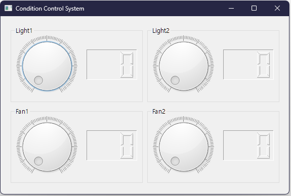

# MQTT로 IoT 장비 원격 제어
Auto 제어기의 PWM 컨트롤러에 연결된 팬과 조명의 속도 및 밝기를 인터넷 환경에서 GUI 프로그램을 이용해 원격 제어

## 시스템 구성
Auto 제어기에서 실행 중인 펌웨어와, PC1에서 실행하는 시리얼-인터넷 브릿지 및 PC2에서 실행하는 GUI 프로그램으로 구성 

```xml
      MCU      <--- 시리얼 ---> PC1      <--- 인터넷 ---> 브로커 <--- 인터넷 ---> PC2
      펌웨어                    브릿지                                           GUI
      (micrpython)             (python, pyserial, paho-mqtt)                    (python, pyqt6, paho-mqtt)
```

### 준비물
- Auto 제어기: 1개
  - USB 케이블: 1개
  - 파워 어댑터: 1개 
  - 드라이버: 1개
  - 조명 패키지: 1개 (2개의 조명 포함) 
  - 팬: 2개
- PC: 2대
  - PC1: Audo 제어기와 시리얼 연결
  - PC2: PC1과 인터넷 연결
 
### 케이블링
Light1, Light2, Fan1, Fan2의 Red 선(VCC)을 PWM 포트 0, 1, 2, 3에 연결하고, Black 선은 PWM 및 DIO 포트의 GND에 연결 
```sh
                        G   G   G   G
                        |   |   |   |  (Black) 
                        F2  F1  L2  L1
                        |   |   |   |  (Red)
PWM Port -->  12V GND   3   2   1   0
```

### 프로젝트 폴더 구조
```xml
CondCtrl  
   |--- XNode  
   |    |--- firm_cond_ctrl.py  
   |  
   |--- PC  
        |--- serial_cond_ctrl.py  
        |--- bridge_cond_ctrl.py  
        |--- PyQt6  
                |--- CondCtrl.ui  
                |--- CondCtrlUi.py  
                |--- CondCtry.py  
                |--- PyQt6Mqtt.py  
```
                
## Auto 제어기
### PWM 클래스를 이용해 Auto 제어기용 펌웨어 구현
PWM 클래스를 이용하면 PWM 컨트롤러의 해당 채널에 PWM 신호 출력 가능

- PWM 클래스
  - PWM(): PWM 객체 생성
  - scan(): PWM 컨트롤러 검색. True이면 이상 없음
  - init(): PWM 컨트롤러 초기화
  - freq(n): 주파수 설정 (50 ~ 20000)
  - duty(ch, n): 채당 채널에 듀티 값에 해당하는 PWM 신호 출력
    - ch: 채널 번호 (0 ~ 3)
    - n: 튜티 값 (0 ~ 100)

```python
from xnode.pop.autoctrl import PWM
import time

pwm = PWM()
if pwn.scan():
    pwm.init()
    pwm.freq(1000) # 1KHz

    pwm.duty(0, 50)
    time.sleep(0)
    pwm.duty(0, 0)
```

PC와 Auto 제어기 펌웨어 사이 통신 규칙 정의
- PC에서 "pwm.duty(0, 50)\r" 형식의 문자열 전송
- 펌웨어는 input()으로 이를 수신한 후 eval()에 대입해 실행

**firm_cond_ctrl.py**
```python
from xnode.pop.autoctrl import PWM

pwm = PWM()
pwm.init()

pwm.freq(1000)

while True:
    cmd = input().lower() # "pwm.duty(0, 50)\r"
    try:
        eval(cmd)
    except SyntaxError:
        pass
```

### 테스트
PC1에서 구현한 펌웨어를 xnode 툴을 이용해 Auto 제어기에 전송 및 실행한 다음 제어 문자열 전송

1. PC에 연결된 Auto 제어기의 시리얼 포트 번호 확인
```sh
xnode scan
```
```out
com13
```

2. 펌웨어 전송 및 실행 
```sh
xnode --sport com13 run -in CondCtrl\XNode\firm_cond_ctrl.py
```

3. "pwm.duty(채널, 듀티값)" 형식의 문자열을 Auto 제어기에 전송하면, 해당 채널에 연결된 조명이나 팬의 밝기 및 속도 제어가 가능해야 함
```sh
pwm.duty(0, 30)
pwm.duty(0, 0)
pwm.duty(2, 40)
pwm.duty(2, 0)
```

4. 테스트가 완료되면 Ctrl+c를 눌러 강제 종료

### 펌웨어 실행
Auto 제어기에 펌웨어만 전송 및 실행한 후 xnode 툴은 종료
```sh
xnode --sport com13 run -n CondCtrl\XNode\firm_cond_ctrl.py
```

## 시리얼과 인터넷 연결 브릿지
Auto 제어기와 시리얼로 연결된 상태에서 인터넷에도 연결된 PC1에서 진행하며, 인터넷에서 구독한 토픽 메시지를 Auto 제어기에 시리얼로 전달

### 시리얼 프로그램 구현
PySerial을 이용해 PC1에서 사용자가 입력한 채널 번호와 듀티 값을 묶어 시리얼 통신으로 Auto 제어기에 전달 

**serial_cond_ctrl.py**
```python
from serial import Serial

XNODE_PORT = "COM13" # 자신의 COM 포트로 변경할 것
ser = Serial(XNODE_PORT, 115200, inter_byte_timeout=1)

def main():
    while True:
        ch = input("Enter of channel: ")
        duty = input("Enter of duty: ")
        ser.write(f"pwm.duty({ch}, {duty})\r".encode())

if __name__ == "__main__":
    main()
```

**테스트**
출력되는 프롬프트에 맞춰 채널 번호와 듀티 값을 입력하면 해당 채널에 연결된 조명이나 팬의 밝기 및 속도 제어가 가능해야 함 
```sh
python CondCtrl\PC\seiral_cond_ctrl.py
```
```sh
Enter of channel: 0
Enter of duty: 20
```

테스트가 끝나면 Ctrl+c를 눌러 강제 종료

### 브릿지 프로그램 구현
paho-mqtt를 이용해 인터넷으로 구독한 토픽 메시지를 시리얼 통신을 통해 Auto 제어기에 전달.  
PWM 채널에 따른 토픽은 다음과 같으며, 페이로드는 json 문자열 형식의 튜티 값 (0 ~ 100)
- 0번 채널: ams/iot/pwm/light/1
- 1번 채널: ams/iot/pwm/light/2
- 2번 채널: ams/iot/pwm/fan/1
- 3번 채널: ams/iot/pwm/fan/2

토픽은 정의한 4개를 모두 구독해야 하나, # 필터를 이용해 한 번만 구독 등록하면, 4개의(실제 4개보다 많을 수 있음) 토픽 메시지를 모두 수신함 
- "asm/iot/pwm/#"

**bridge_cond_ctrl.py**
```python
from serial import Serial
import paho.mqtt.client as mqtt
import json

XNODE_PORT = "COM13" # 자신의 COM 포트로 변경할 것
TOPIC_IOT_PWM = "asm/iot/pwm/#"
"""
asm/iot/pwm/light/1, 50
asm/iot/pwm/light/2, 50
asm/iot/pwm/fan/1, 50
asm/iot/pwm/fan/2, 50
"""

ser = Serial(XNODE_PORT, 115200, inter_byte_timeout=1)

def on_connect(*args):
    if args[3] == 0:
        print("브로커에 연결되었습니다.")
        args[0].subscribe(TOPIC_IOT_PWM)
    else:
        pass

def on_subscribe(*args):
    print(f"브로커에 {TOPIC_IOT_PWM} 토픽 구독이 등록되었습니다.")

def on_message(*args):
    topic = args[2].topic
    try:
        duty = json.loads(args[2].payload)
    except ValueError:
        return

    if topic == "asm/iot/pwm/light/1":
        channel = 0
    elif topic == "asm/iot/pwm/light/2":
        channel = 1
    elif topic == "asm/iot/pwm/fan/1":
        channel = 2
    elif topic == "asm/iot/pwm/fan/2":
        channel = 3
    else:
        return
    
    ser.write(f"pwm.duty({channel}, {duty})\r".encode())

def main():
    c = mqtt.Client()
    c.on_connect = on_connect
    c.on_subscribe = on_subscribe
    c.on_message = on_message
    
    c.connect("mqtt.eclipseprojects.io")
    c.loop_forever() 
    
if __name__ == "__main__":
    main()
```

**테스트**
구현한 브릿지 실행
```sh
python CondCtrl\PC\bridge_cond_ctrl.py
```

MQTTX를 실행한 다음 브릿지와 같은 브로커에 연결하고, 앞서 정의한 토픽(채널 선택)과 Json 문자열 형식의 페이로드(듀티 값) 발행

- 새 연결
  - Name: EclipseProjects
  - Host: mqtt.eclipseprojects.io
- 발행
  - Type: JSON
  - Topic: asm/iot/pwm/light/1
  - Payload: 40


## 원격 제어용 GUI
인터넷에 연결된 PC2에서 진행하며, 4개의 QDial 위젯 값이 바뀔때 마다 토픽 메시지를 MQTT 브로커에 발행하는 PhQy6 기반 GUI 구현
각각의 QDial 위젯은 사전 정의한 토픽에 대응하고 바뀐 값은 Json 문자열 형식의 페이로드로 듀티 값에 대응
 
### MQTT 클라이언트를 PyQt6에 통합
MQTT 클라이언트 객체의 이벤트(비동기 호출)를 QT의 신호-슬롯 메커니즘으로 변환하는 중간 계층을 추가하면 MQTT를 사용하는 QT 응용프로그램 구현이 쉬워짐
이때, MQTT 클라이언트 객체의 이벤트 루프와 QT6의 이벤트 루프가 동시에 실행되어야 하므로 MQTT 클라이언트 객체의 이벤트 루프를 loop_forever() 대신 loop_start()로 변경 함

QObject과 mqtt.Client 클래스를 상속한 Client 클래스에 필요한 신호 정의
- connectSignal: 브로커 연결 요청이 처리되었음을 알리는 신호 보내기
- publishSignal: 토픽 메시지가 발행되었음을 알리는 신호 보내기
- subscribeSignal: 토픽 메시지 구독이 완료되었음을 알리는 신호 보내기
- messageSignal: 토픽 메시지가 수신되었음을 알리는 신호 보내기

[신호와 슬롯 개념](https://doc.qt.io/qtforpython-6/overviews/signalsandslots.html)
  
**PyQt6Mqtt.py**
```python
import json
from PyQt6.QtCore import QObject, pyqtSignal as Signal
import paho.mqtt.client as mqtt

class Client(QObject, mqtt.Client):
    connectSignal = Signal(int)
    publishSignal = Signal(int)
    subscribeSignal = Signal(int, int)
    messageSignal = Signal(str, object)
    
    def __init__(self, parent=None):
        QObject.__init__(self, parent)
        mqtt.Client.__init__(self)
        
        self.on_connect = self.on_connect
        self.on_publish = self.on_publish
        self.on_subscribe = self.on_subscribe
        self.on_message = self.on_message
        
    def on_connect(self, client, userdata, flags, rc):
        self.connectSignal.emit(rc)
    
    def on_publish(self, client, userdata, mid):
        self.publishSignal.emit(mid)
    
    def on_subscribe(self, client, userdata, mid, granted_qos):
        self.subscribeSignal.emit(mid, granted_qos)
    
    def on_message(self, userdata, message):
        self.messageSignal.emit(message.topic, json.loads(message.payload))
    
    def connect(self, broker):
        super().connect(broker)
        self.loop_start()
    
    def publish(self, topic, payload):
        super().publish(topic, json.dumps(payload))
```

### UI(화면) 디자인
QMainWindow 폼에 QMenuBar만 제거한 후 4개의 QGroupBox 배치
- 각 QGroupBox마다 QDial와 QLCDNumber 배치

1. QT 디자이너를 실행
```sh
qt6-tools designer
```

2. 다음과 같이 UI 디자인
> CondCtrl.ui

 

- QMainWindow 폼에 QMenuBar만 제거한 후 4개의 QGroupBox 배치. 각 QGroupBox마다 QDial와 QLCDNumber 배치
  - QMainWindow 속성 중 windowTitle은 "Condition Control System"으로 설정
  - QGrupBox 1 속성 중 objectName은 grpLight_1, enabled는 체크 해제, title은 Light1로 설정 
    - QDial 1 속성 중 objectName은 dialLight_1, maximum은 100, notchTarget은 1.0, notchesVisible은 체크 선택
    - QLCDNumber 1 속성 중 objectName은 fndLight_1, frameShape는 Panel, frameShadow은 Sunken, digitCount는 3, segmentStyle은 Outline 선택
  - QGrupBox 2 속성 중 objectName은 grpLight_2, enabled는 체크 해제, title은 Light2로 설정
    - QDial 2 속성 중 objectName은 dialLight_2, maximum은 100, notchTarget은 1.0, notchesVisible은 체크 선택
    - QLCDNumber 2 속성 중 objectName은 fndLight_2, frameShape는 Panel, frameShadow은 Sunken, digitCount는 3, segmentStyle은 Outline 선택
  - QGrupBox 3 속성 중 objectName은 grpFan_1, enabled는 체크 해제, title은 Fan1로 설정
    - QDial 3 속성 중 objectName은 diaFan_1, maximum은 100, notchTarget은 1.0, notchesVisible은 체크 선택
    - QLCDNumber 3 속성 중 objectName은 fndFan_1, frameShape는 Panel, frameShadow은 Sunken, digitCount는 3, segmentStyle은 Outline 선택
  - QGrupBox 4 속성 중 objectName은 grpFan_2, enabled는 체크 해제, title은 Fan2로 설정
    - QDial 4 속성 중 objectName은 diaFan_2, maximum은 100, notchTarget은 1.0, notchesVisible은 체크 선택
    - QLCDNumber 4 속성 중 objectName은 fndFan_2, frameShape는 Panel, frameShadow은 Sunken, digitCount는 3, segmentStyle은 Outline 선택
- Signal/Slot 편집기에서 QDial과 QLCDNumber 사이 연결 설정
  - dialLight1.valueChanged(int) -> findLight1.display(int) 
  - dialLight2.valueChanged(int) -> findLight2.display(int) 
  - dialFan1.valueChanged(int) -> findFan1.display(int) 
  - dialFan2.valueChanged(int) -> findFan2.display(int) 

<details>
<summary><b>CondCtrl.ui</b></summary>

```xml
<?xml version="1.0" encoding="UTF-8"?>
<ui version="4.0">
 <class>MainWindow</class>
 <widget class="QMainWindow" name="MainWindow">
  <property name="geometry">
   <rect>
    <x>0</x>
    <y>0</y>
    <width>570</width>
    <height>359</height>
   </rect>
  </property>
  <property name="windowTitle">
   <string>Condition Control System</string>
  </property>
  <widget class="QWidget" name="centralwidget">
   <widget class="QGroupBox" name="grpLight_1">
    <property name="enabled">
     <bool>false</bool>
    </property>
    <property name="geometry">
     <rect>
      <x>20</x>
      <y>20</y>
      <width>261</width>
      <height>151</height>
     </rect>
    </property>
    <property name="title">
     <string>Light1</string>
    </property>
    <property name="alignment">
     <set>Qt::AlignLeading|Qt::AlignLeft|Qt::AlignVCenter</set>
    </property>
    <property name="flat">
     <bool>false</bool>
    </property>
    <property name="checkable">
     <bool>false</bool>
    </property>
    <widget class="QDial" name="dialLight_1">
     <property name="geometry">
      <rect>
       <x>11</x>
       <y>18</y>
       <width>121</width>
       <height>121</height>
      </rect>
     </property>
     <property name="autoFillBackground">
      <bool>false</bool>
     </property>
     <property name="maximum">
      <number>100</number>
     </property>
     <property name="singleStep">
      <number>1</number>
     </property>
     <property name="pageStep">
      <number>10</number>
     </property>
     <property name="sliderPosition">
      <number>0</number>
     </property>
     <property name="tracking">
      <bool>true</bool>
     </property>
     <property name="invertedAppearance">
      <bool>false</bool>
     </property>
     <property name="invertedControls">
      <bool>false</bool>
     </property>
     <property name="wrapping">
      <bool>false</bool>
     </property>
     <property name="notchTarget">
      <double>1.000000000000000</double>
     </property>
     <property name="notchesVisible">
      <bool>true</bool>
     </property>
    </widget>
    <widget class="QLCDNumber" name="fndLight_1">
     <property name="geometry">
      <rect>
       <x>150</x>
       <y>46</y>
       <width>100</width>
       <height>60</height>
      </rect>
     </property>
     <property name="frameShape">
      <enum>QFrame::Panel</enum>
     </property>
     <property name="frameShadow">
      <enum>QFrame::Sunken</enum>
     </property>
     <property name="digitCount">
      <number>3</number>
     </property>
     <property name="segmentStyle">
      <enum>QLCDNumber::Outline</enum>
     </property>
    </widget>
   </widget>
   <widget class="QGroupBox" name="grpLight_2">
    <property name="enabled">
     <bool>false</bool>
    </property>
    <property name="geometry">
     <rect>
      <x>290</x>
      <y>20</y>
      <width>261</width>
      <height>151</height>
     </rect>
    </property>
    <property name="title">
     <string>Light2</string>
    </property>
    <widget class="QDial" name="dialLight_2">
     <property name="geometry">
      <rect>
       <x>11</x>
       <y>18</y>
       <width>121</width>
       <height>121</height>
      </rect>
     </property>
     <property name="autoFillBackground">
      <bool>false</bool>
     </property>
     <property name="maximum">
      <number>100</number>
     </property>
     <property name="singleStep">
      <number>1</number>
     </property>
     <property name="pageStep">
      <number>10</number>
     </property>
     <property name="sliderPosition">
      <number>0</number>
     </property>
     <property name="tracking">
      <bool>true</bool>
     </property>
     <property name="invertedAppearance">
      <bool>false</bool>
     </property>
     <property name="invertedControls">
      <bool>false</bool>
     </property>
     <property name="wrapping">
      <bool>false</bool>
     </property>
     <property name="notchTarget">
      <double>1.000000000000000</double>
     </property>
     <property name="notchesVisible">
      <bool>true</bool>
     </property>
    </widget>
    <widget class="QLCDNumber" name="fndLight_2">
     <property name="geometry">
      <rect>
       <x>150</x>
       <y>46</y>
       <width>100</width>
       <height>60</height>
      </rect>
     </property>
     <property name="frameShape">
      <enum>QFrame::Panel</enum>
     </property>
     <property name="frameShadow">
      <enum>QFrame::Sunken</enum>
     </property>
     <property name="digitCount">
      <number>3</number>
     </property>
     <property name="segmentStyle">
      <enum>QLCDNumber::Outline</enum>
     </property>
    </widget>
   </widget>
   <widget class="QGroupBox" name="grpFan_1">
    <property name="enabled">
     <bool>false</bool>
    </property>
    <property name="geometry">
     <rect>
      <x>20</x>
      <y>180</y>
      <width>261</width>
      <height>151</height>
     </rect>
    </property>
    <property name="title">
     <string>Fan1</string>
    </property>
    <widget class="QDial" name="dialFan_1">
     <property name="geometry">
      <rect>
       <x>11</x>
       <y>18</y>
       <width>121</width>
       <height>121</height>
      </rect>
     </property>
     <property name="autoFillBackground">
      <bool>false</bool>
     </property>
     <property name="maximum">
      <number>100</number>
     </property>
     <property name="singleStep">
      <number>1</number>
     </property>
     <property name="pageStep">
      <number>10</number>
     </property>
     <property name="sliderPosition">
      <number>0</number>
     </property>
     <property name="tracking">
      <bool>true</bool>
     </property>
     <property name="invertedAppearance">
      <bool>false</bool>
     </property>
     <property name="invertedControls">
      <bool>false</bool>
     </property>
     <property name="wrapping">
      <bool>false</bool>
     </property>
     <property name="notchTarget">
      <double>1.000000000000000</double>
     </property>
     <property name="notchesVisible">
      <bool>true</bool>
     </property>
    </widget>
    <widget class="QLCDNumber" name="fndFan_1">
     <property name="geometry">
      <rect>
       <x>150</x>
       <y>46</y>
       <width>100</width>
       <height>60</height>
      </rect>
     </property>
     <property name="frameShape">
      <enum>QFrame::Panel</enum>
     </property>
     <property name="frameShadow">
      <enum>QFrame::Sunken</enum>
     </property>
     <property name="digitCount">
      <number>3</number>
     </property>
     <property name="segmentStyle">
      <enum>QLCDNumber::Outline</enum>
     </property>
    </widget>
   </widget>
   <widget class="QGroupBox" name="grpFan_2">
    <property name="enabled">
     <bool>false</bool>
    </property>
    <property name="geometry">
     <rect>
      <x>290</x>
      <y>180</y>
      <width>261</width>
      <height>151</height>
     </rect>
    </property>
    <property name="title">
     <string>Fan2</string>
    </property>
    <widget class="QDial" name="dialFan_2">
     <property name="geometry">
      <rect>
       <x>11</x>
       <y>18</y>
       <width>121</width>
       <height>121</height>
      </rect>
     </property>
     <property name="autoFillBackground">
      <bool>false</bool>
     </property>
     <property name="maximum">
      <number>100</number>
     </property>
     <property name="singleStep">
      <number>1</number>
     </property>
     <property name="pageStep">
      <number>10</number>
     </property>
     <property name="sliderPosition">
      <number>0</number>
     </property>
     <property name="tracking">
      <bool>true</bool>
     </property>
     <property name="invertedAppearance">
      <bool>false</bool>
     </property>
     <property name="invertedControls">
      <bool>false</bool>
     </property>
     <property name="wrapping">
      <bool>false</bool>
     </property>
     <property name="notchTarget">
      <double>1.000000000000000</double>
     </property>
     <property name="notchesVisible">
      <bool>true</bool>
     </property>
    </widget>
    <widget class="QLCDNumber" name="fndFan_2">
     <property name="geometry">
      <rect>
       <x>150</x>
       <y>46</y>
       <width>100</width>
       <height>60</height>
      </rect>
     </property>
     <property name="frameShape">
      <enum>QFrame::Panel</enum>
     </property>
     <property name="frameShadow">
      <enum>QFrame::Sunken</enum>
     </property>
     <property name="digitCount">
      <number>3</number>
     </property>
     <property name="segmentStyle">
      <enum>QLCDNumber::Outline</enum>
     </property>
    </widget>
   </widget>
  </widget>
  <widget class="QStatusBar" name="statusBar"/>
 </widget>
 <resources/>
 <connections>
  <connection>
   <sender>dialLight_1</sender>
   <signal>valueChanged(int)</signal>
   <receiver>fndLight_1</receiver>
   <slot>display(int)</slot>
   <hints>
    <hint type="sourcelabel">
     <x>91</x>
     <y>98</y>
    </hint>
    <hint type="destinationlabel">
     <x>219</x>
     <y>95</y>
    </hint>
   </hints>
  </connection>
  <connection>
   <sender>dialLight_2</sender>
   <signal>valueChanged(int)</signal>
   <receiver>fndLight_2</receiver>
   <slot>display(int)</slot>
   <hints>
    <hint type="sourcelabel">
     <x>361</x>
     <y>98</y>
    </hint>
    <hint type="destinationlabel">
     <x>489</x>
     <y>95</y>
    </hint>
   </hints>
  </connection>
  <connection>
   <sender>dialFan_2</sender>
   <signal>valueChanged(int)</signal>
   <receiver>fndFan_2</receiver>
   <slot>display(int)</slot>
   <hints>
    <hint type="sourcelabel">
     <x>361</x>
     <y>258</y>
    </hint>
    <hint type="destinationlabel">
     <x>489</x>
     <y>255</y>
    </hint>
   </hints>
  </connection>
  <connection>
   <sender>dialFan_1</sender>
   <signal>valueChanged(int)</signal>
   <receiver>fndFan_1</receiver>
   <slot>display(int)</slot>
   <hints>
    <hint type="sourcelabel">
     <x>91</x>
     <y>258</y>
    </hint>
    <hint type="destinationlabel">
     <x>219</x>
     <y>255</y>
    </hint>
   </hints>
  </connection>
 </connections>
</ui>
```

</details>

3. 완성된 UI를 CondCtrl\PC\PyQt6 경로에 CondCtrl.ui로 저장
  
4. 저장한 UI 파일(CondCtrl.ui)을 파이썬 파일(CondCtrlUi.py)로 변환
```sh
pyuic6 CondCtrl\PC\PyQt6\CondCtrl.ui -o CondCtrl\PC\PyQt6\CondCtrlUi.py
```

<details>
<summary><b>CondCtrlUi.py</b></summary>

```python
# Form implementation generated from reading ui file 'CondCtrl.ui'
#
# Created by: PyQt6 UI code generator 6.4.2
#
# WARNING: Any manual changes made to this file will be lost when pyuic6 is
# run again.  Do not edit this file unless you know what you are doing.


from PyQt6 import QtCore, QtGui, QtWidgets


class Ui_MainWindow(object):
    def setupUi(self, MainWindow):
        MainWindow.setObjectName("MainWindow")
        MainWindow.resize(570, 359)
        self.centralwidget = QtWidgets.QWidget(parent=MainWindow)
        self.centralwidget.setObjectName("centralwidget")
        self.grpLight_1 = QtWidgets.QGroupBox(parent=self.centralwidget)
        self.grpLight_1.setEnabled(False)
        self.grpLight_1.setGeometry(QtCore.QRect(20, 20, 261, 151))
        self.grpLight_1.setObjectName("grpLight_1")
        self.dialLight_1 = QtWidgets.QDial(parent=self.grpLight_1)
        self.dialLight_1.setGeometry(QtCore.QRect(11, 18, 121, 121))
        self.dialLight_1.setAutoFillBackground(False)
        self.dialLight_1.setMaximum(100)
        self.dialLight_1.setSingleStep(1)
        self.dialLight_1.setPageStep(10)
        self.dialLight_1.setSliderPosition(0)
        self.dialLight_1.setTracking(True)
        self.dialLight_1.setInvertedAppearance(False)
        self.dialLight_1.setInvertedControls(False)
        self.dialLight_1.setWrapping(False)
        self.dialLight_1.setNotchTarget(1.0)
        self.dialLight_1.setNotchesVisible(True)
        self.dialLight_1.setObjectName("dialLight_1")
        self.fndLight_1 = QtWidgets.QLCDNumber(parent=self.grpLight_1)
        self.fndLight_1.setGeometry(QtCore.QRect(150, 46, 100, 60))
        self.fndLight_1.setFrameShape(QtWidgets.QFrame.Shape.Panel)
        self.fndLight_1.setFrameShadow(QtWidgets.QFrame.Shadow.Sunken)
        self.fndLight_1.setDigitCount(3)
        self.fndLight_1.setSegmentStyle(QtWidgets.QLCDNumber.SegmentStyle.Outline)
        self.fndLight_1.setObjectName("fndLight_1")
        self.grpLight_2 = QtWidgets.QGroupBox(parent=self.centralwidget)
        self.grpLight_2.setEnabled(False)
        self.grpLight_2.setGeometry(QtCore.QRect(290, 20, 261, 151))
        self.grpLight_2.setObjectName("grpLight_2")
        self.dialLight_2 = QtWidgets.QDial(parent=self.grpLight_2)
        self.dialLight_2.setGeometry(QtCore.QRect(11, 18, 121, 121))
        self.dialLight_2.setAutoFillBackground(False)
        self.dialLight_2.setMaximum(100)
        self.dialLight_2.setSingleStep(1)
        self.dialLight_2.setPageStep(10)
        self.dialLight_2.setSliderPosition(0)
        self.dialLight_2.setTracking(True)
        self.dialLight_2.setInvertedAppearance(False)
        self.dialLight_2.setInvertedControls(False)
        self.dialLight_2.setWrapping(False)
        self.dialLight_2.setNotchTarget(1.0)
        self.dialLight_2.setNotchesVisible(True)
        self.dialLight_2.setObjectName("dialLight_2")
        self.fndLight_2 = QtWidgets.QLCDNumber(parent=self.grpLight_2)
        self.fndLight_2.setGeometry(QtCore.QRect(150, 46, 100, 60))
        self.fndLight_2.setFrameShape(QtWidgets.QFrame.Shape.Panel)
        self.fndLight_2.setFrameShadow(QtWidgets.QFrame.Shadow.Sunken)
        self.fndLight_2.setDigitCount(3)
        self.fndLight_2.setSegmentStyle(QtWidgets.QLCDNumber.SegmentStyle.Outline)
        self.fndLight_2.setObjectName("fndLight_2")
        self.grpFan_1 = QtWidgets.QGroupBox(parent=self.centralwidget)
        self.grpFan_1.setEnabled(False)
        self.grpFan_1.setGeometry(QtCore.QRect(20, 180, 261, 151))
        self.grpFan_1.setObjectName("grpFan_1")
        self.dialFan_1 = QtWidgets.QDial(parent=self.grpFan_1)
        self.dialFan_1.setGeometry(QtCore.QRect(11, 18, 121, 121))
        self.dialFan_1.setAutoFillBackground(False)
        self.dialFan_1.setMaximum(100)
        self.dialFan_1.setSingleStep(1)
        self.dialFan_1.setPageStep(10)
        self.dialFan_1.setSliderPosition(0)
        self.dialFan_1.setTracking(True)
        self.dialFan_1.setInvertedAppearance(False)
        self.dialFan_1.setInvertedControls(False)
        self.dialFan_1.setWrapping(False)
        self.dialFan_1.setNotchTarget(1.0)
        self.dialFan_1.setNotchesVisible(True)
        self.dialFan_1.setObjectName("dialFan_1")
        self.fndFan_1 = QtWidgets.QLCDNumber(parent=self.grpFan_1)
        self.fndFan_1.setGeometry(QtCore.QRect(150, 46, 100, 60))
        self.fndFan_1.setFrameShape(QtWidgets.QFrame.Shape.Panel)
        self.fndFan_1.setFrameShadow(QtWidgets.QFrame.Shadow.Sunken)
        self.fndFan_1.setDigitCount(3)
        self.fndFan_1.setSegmentStyle(QtWidgets.QLCDNumber.SegmentStyle.Outline)
        self.fndFan_1.setObjectName("fndFan_1")
        self.grpFan_2 = QtWidgets.QGroupBox(parent=self.centralwidget)
        self.grpFan_2.setEnabled(False)
        self.grpFan_2.setGeometry(QtCore.QRect(290, 180, 261, 151))
        self.grpFan_2.setObjectName("grpFan_2")
        self.dialFan_2 = QtWidgets.QDial(parent=self.grpFan_2)
        self.dialFan_2.setGeometry(QtCore.QRect(11, 18, 121, 121))
        self.dialFan_2.setAutoFillBackground(False)
        self.dialFan_2.setMaximum(100)
        self.dialFan_2.setSingleStep(1)
        self.dialFan_2.setPageStep(10)
        self.dialFan_2.setSliderPosition(0)
        self.dialFan_2.setTracking(True)
        self.dialFan_2.setInvertedAppearance(False)
        self.dialFan_2.setInvertedControls(False)
        self.dialFan_2.setWrapping(False)
        self.dialFan_2.setNotchTarget(1.0)
        self.dialFan_2.setNotchesVisible(True)
        self.dialFan_2.setObjectName("dialFan_2")
        self.fndFan_2 = QtWidgets.QLCDNumber(parent=self.grpFan_2)
        self.fndFan_2.setGeometry(QtCore.QRect(150, 46, 100, 60))
        self.fndFan_2.setFrameShape(QtWidgets.QFrame.Shape.Panel)
        self.fndFan_2.setFrameShadow(QtWidgets.QFrame.Shadow.Sunken)
        self.fndFan_2.setDigitCount(3)
        self.fndFan_2.setSegmentStyle(QtWidgets.QLCDNumber.SegmentStyle.Outline)
        self.fndFan_2.setObjectName("fndFan_2")
        MainWindow.setCentralWidget(self.centralwidget)
        self.statusBar = QtWidgets.QStatusBar(parent=MainWindow)
        self.statusBar.setObjectName("statusBar")
        MainWindow.setStatusBar(self.statusBar)

        self.retranslateUi(MainWindow)
        self.dialLight_1.valueChanged['int'].connect(self.fndLight_1.display) # type: ignore
        self.dialLight_2.valueChanged['int'].connect(self.fndLight_2.display) # type: ignore
        self.dialFan_2.valueChanged['int'].connect(self.fndFan_2.display) # type: ignore
        self.dialFan_1.valueChanged['int'].connect(self.fndFan_1.display) # type: ignore
        QtCore.QMetaObject.connectSlotsByName(MainWindow)

    def retranslateUi(self, MainWindow):
        _translate = QtCore.QCoreApplication.translate
        MainWindow.setWindowTitle(_translate("MainWindow", "Condition Control System"))
        self.grpLight_1.setTitle(_translate("MainWindow", "Light1"))
        self.grpLight_2.setTitle(_translate("MainWindow", "Light2"))
        self.grpFan_1.setTitle(_translate("MainWindow", "Fan1"))
        self.grpFan_2.setTitle(_translate("MainWindow", "Fan2"))
```

</details>

### 코드 구현
PyQt6Mqtt.py와 CondCtrlUi.py를 이용해 사용자가 해당 QDial의 값을 바꿀 때마다 대응하는 토픽 메시지를 발행하는 파이썬 코드 구현
- 4개의 QDial.valueChanged 신호에 대한 슬롯 구현
  - dialLight_1의 valueChanged 신호를 onLight1ValueChange()에 연결
    - 신호를 받으면 함께 전달된 QDial 값을 "asm/iot/pwm/light/1" 토픽으로 발행
  - dialLight_1의 valueChanged 신호를 onLight2ValueChange()에 연결
    - 신호를 받으면 함께 전달된 QDial 값을 "sm/iot/pwm/light/2" 토픽으로 발행
  - dialFan_1의 valueChanged 신호를 onFan1ValueChange()에 연결
    - 신호를 받으면 함께 전달된 QDial 값을 "asm/iot/pwm/fan/1" 토픽으로 발행
  - dialFan_1의 valueChanged 신호를 onFan2ValueChange()에 연결
    - 신호를 받으면 함께 전달된 QDial 값을 "asm/iot/pwm/fan/2" 토픽으로 발행
- PyQt6Mqtt 모듈의 Client 객체를 생성한 후 해당 신호에 대한 슬롯 구현
  - Client 객체의 connectSignal 신호를 onConnect()에 연결
    - 신호를 받으면 함께 전달된 rc를 검사해 처리
      - 0이면 모든 QGrouopBox의 setEnabled() 메소드에 True를 전달해 위젯 활성화
      - 아니면 실패이므로 QMainWindow의 close() 메소드를 호출해 창을 닫음(프로그램 종료)
  - Client 객체의 publishSignal 신호를 onPublish()에 연결
    - 신호를 받으면 함께 전달된 mid(발행한 메시지 일련번호)를 상태바에 출력하기 위해 QStatusBar의 showMessage() 메소드 호출
  - Client 객체의 connect() 메소드를 호출해 mqtt 클라이언트 라이브러리가 브로커(mqtt.eclipseprojects.io) 연결을 처리하도록 요청
     
**CondCtrl.py**
```python
import sys
import json
from PyQt6.QtWidgets import QApplication, QMainWindow, QMessageBox
from CondCtrlUi import Ui_MainWindow
from PyQt6Mqtt import Client

class CondCtrl(QMainWindow, Ui_MainWindow):
    def __init__(self):
        super().__init__()
        self.setupUi(self)
        
        self.dialLight_1.valueChanged.connect(self.onLight1ValueChange)
        self.dialLight_2.valueChanged.connect(self.onLight2ValueChange)
        self.dialFan_1.valueChanged.connect(self.onFan1ValueChange)
        self.dialFan_2.valueChanged.connect(self.onFan2ValueChange)
        
        self.client = Client()
        self.client.connectSignal.connect(self.onConnect)
        self.client.publishSignal.connect(self.onPublish)
        self.client.connect("mqtt.eclipseprojects.io")
    
    def onConnect(self, rc):
        if rc == 0:
            QMessageBox.information(self,"MQTT Broker", "브로커에 연결되었습니다.")
            self.grpLight_1.setEnabled(True)
            self.grpLight_2.setEnabled(True)
            self.grpFan_1.setEnabled(True)
            self.grpFan_2.setEnabled(True)
            self.statusBar.showMessage("준비")
        else:
            self.close()
    
    def onPublish(self, mid):
        self.statusBar.showMessage(f"{mid} 번째 메시지가 발행되었습니다.")
    
    def onLight1ValueChange(self, value):
        self.client.publish("asm/iot/pwm/light/1", json.dumps(value))
    
    def onLight2ValueChange(self, value):
        self.client.publish("asm/iot/pwm/light/2", json.dumps(value))
    
    def onFan1ValueChange(self, value):
        self.client.publish("asm/iot/pwm/fan/1", json.dumps(value))
    
    def onFan2ValueChange(self, value):
        self.client.publish("asm/iot/pwm/fan/2", json.dumps(value))


def main():
    app = QApplication(sys.argv)
    win = CondCtrl()
    win.show()
    app.exec()

if __name__ == "__main__":
    main()
```

PC1에서 브릿지가 실행 중인 상태에서 구현한 GUI 실행
```sh
python CondCtrl\PC\PyQt6\CondCtrl.py
```
