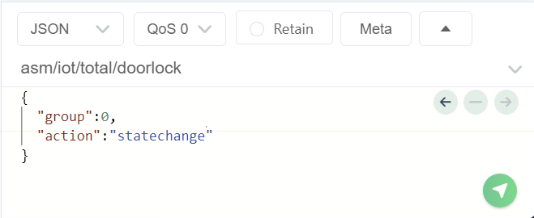
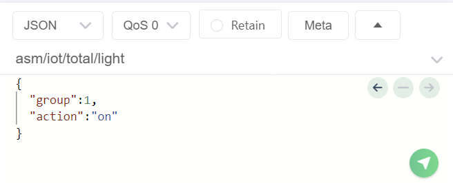

# MQTT로 조명, 팬, 도어락, 가스브레이커 원격 제어
인터넷으로 연결된 컴퓨터에서 GUI 프로그램을 이용해 Auto 제어기의 PWM 컨트롤러에 연결된 가스브레이커와 팬 및 릴레이에 연결된 도어락, 조명 상태를 원격 제어합니다.

## 시스템 구성
Auto 제어기에서 실행하는 펌웨어와, PC1에서 실행하는 시리얼-인터넷 브릿지 프로그램 및 PC2에서 실행하는 GUI 프로그램으로 구성되며, 환경에 따라 PC1과 PC2는 같은 PC일 수 있습니다.

```xml
      MCU      <--- 시리얼 ---> PC1      <--- 인터넷 ---> 브로커 <--- 인터넷 ---> PC2
      펌웨어                    브릿지                                           GUI
      (micrpython)             (python, pyserial, paho-mqtt)                    (python, pyqt6, paho-mqtt)
```

### 준비물
- Auto 제어기: 1개
  - USB 케이블: 1개
  - 파워 어댑터: 1개 
  - 드라이버: 1개
  - 조명: 2개 (1조)
  - 팬: 1개
  - 도어락: 1개  
  - 가스브레이커: 1개
- PC: 2대
  - PC1: Audo 제어기와 시리얼 연결
  - PC2: PC1과 인터넷 연결

### 케이블링
GasBreaker의 빨간색 선(VCC)은 PWM 포트 0에, 검정색 선은 PWM 포트 1에 연결합니다. Fan의 빨간색 선(VCC)은 PWM 포트 3에, 검정색 선은 GND 포트 중 하나에 연결합니다.

```sh         
              G
              |(Black)
             Fan         GasBreaker
         (Red)|      (Red)|     | 
              |     |     |     |(Black)
PWM Port -->  3     2     1     0
```

DoorLock의 검정색 선 2가닥을 Relay 1의 C와 NO 단자에 연결합니다. Light1과 Light2의 빨간색(VCC) 선은 각각 Relay 2와 Relay 3의 NO 단자에 연결하고, 검정색 선은 GND 포트 중 하나에 연결합니다.
```sh
                              G        G
                              |        |
                  DoorLock    Light1    Light2
                   |   |           |        |
Relay Port --->    C   O      C    O    C   O
                  RELAY_1
```

### 프로젝트 폴더 구조
현재 작업 공간에 TotalCtrl 폴더를 생성하고, 그 아래에 XNode와 PC 폴더를 만듭니다. PC 폴더 아래에는 GUI 폴더를 추가합니다.

폴더 생성을 완료했으면, 각 폴더에 다음과 같이 파일을 구현합니다.

```sh
TotalCtrl  
   |--- XNode  
   |    |--- firm_total_ctrl.py  
   |  
   |--- PC  
        |--- serial_total_ctrl.py  
        |--- bridge_total_ctrl.py  
        |--- GUI  
                |--- TotalCtrl.ui  
                |--- TotalCtrlUi.py  
                |--- TotalCtrl.py  
                |--- PahoMqtt.py  
```

## Auto 제어기 펌웨어
PWM 포트에 가스 차단기와 팬, 릴레이 포트에 도어락과 조명을 연결한 Auto 제어기를 시리얼 통신으로 제어하는 펌웨어를 작성해 보겠습니다.

이 펌웨어는 시리얼 포트에서 데이터를 읽어와 릴레이와 PWM 객체를 이용하여 Auto 제어기에 연결된 장치들을 제어합니다. 앞서 배운 내용을 토대로 펌웨어 구현을 시작해 봅시다.

### 프로토콜 정의
먼저 PWM과 Relay 객체로 제어할 장치와 그룹, 동작을 나열해 보면 다음과 같습니다.

| Object | Device     | Group | Action 
|--------|------------|-------|--------
| PWM    | GasBreaker |       | Open 
|        |            |       | Close 
|        |            |       | Stop 
|        | Fan        |       | 0 ~ 100 
| Relay  | DoorLock   |       | stateChange 
|        | Light      | 1     | on 
|        |            |       | off 
|        |            | 2     | on 
|        |            |       | off 

따라서 프로토콜 구조는 다음과 같이 3개의 필드로 구성되며, 내용은 문자열을 사용합니다.
```sh
<device> <group> <action>
```

PC에서 Auto 제어기로 전송하는 데이터는 정의된 프로토콜에 따라 3개의 필드(Object, Device, Action)로 구성됩니다. Group 필드가 없는 Device의 경우, "none" 또는 임의의 문자를 사용합니다.

device      |    group      |     action
------------|---------------|--------------------------
gasbreaker  |    none       |     \<open \| close \| stop>
fan         |    none       |     \<0..100>
doorlock    |    none       |     statechange
light       |   \<1 \| 2>   |     \<on \| off>


### 펌웨어 구현  

펌웨어는 PC에서 수신한 문자열을 공백 문자를 기준으로 3개의 필드(object, device, action)에 해당하는 각각의 문자열로 분리합니다. 

```python
cmd = input().lower().split()  
```

예를들어 수신한 문자열이 "light 1 on"이라면 split() 결과는 ["light", "1", "on"]이므로 cmd[0]은 device, cmd[1]은 group, cmd[2]는 action을 나타냅니다.  
따라서 cmd의 각 필드 내용을 확인하여 PWM 또는 Relay 객체로 필요한 동작을 수행하면 됩니다.  

```python
if cmd[0] == "light":            # device
    if cmd[1] == "1":            # group
        if cmd[2] == "on":       # action
            # 조명1을 켭니다.
        elif cmd[2] == "off":
            # 조명1을 끕니다.          
```

코드 실행 과정에서 예외가 발행해 펌웨어가 강제 종료되는 것을 방지하려면 예외처리가 필요합니다.
먼저 PC에서 전송한 문자열이 3개의 필드로 분할되지 않으면, return 문으로 loop()를 즉시 종료합니다.  

```python
cmd = input().lower().split()  

if len(cmd) != 3:
    return
```

또한 device가 fan일 때 action은 듀티 사이클에 해당하는 1~100사이 문자열인데, 이를 정수로 바꿀 때 변환할 수 없는 문자열이라면 예외처리 구문(try ~ except)을 통해 무시합니다.

```python
try:
    val = int(cmd[2])  # "95" or "95a"
    pwm.duty(3, val)
except:
    pass
```

지금까지 설명한 펌웨어의 전체 코드는 다음과 같습니다.

**firm_total_ctrl.py**  
```python
from xnode.pop.autoctrl import PWM
from xnode.pop.autoctrl import Relay, DIO
import time

pwm = PWM()                        # gasbreaker: ch[1:0], fan: ch[3]
doorlock = Relay(DIO.P_RELAY[0])   # relay 1
light1 = Relay(DIO.P_RELAY[1])     # relay 2
light2 = Relay(DIO.P_RELAY[2])     # relay 3

def setup():
    pwm.init()
    pwm.freq(1000)

def loop():
    cmd = input().lower().split()  

    if len(cmd) != 3:
        return

    if cmd[0] == "gasbreaker":
        if cmd[2] == "open":
            pwm.duty(0, 100)
            pwm.duty(1, 0)
        elif cmd[2] == "close":
            pwm.duty(0, 0)
            pwm.duty(1, 100)
        elif cmd[2] == "stop":
            pwm.duty(0, 0)
            pwm.duty(1, 0)
    elif cmd[0] == "fan":
        try:
            val = int(cmd[2])  
            pwm.duty(3, val)
        except:
            pass
    elif cmd[0] == "doorlock":
        if cmd[2] == "statechange":
            doorlock.on()
            time.sleep(0.5)
            doorlock.off()
    elif cmd[0] == "light":
        if cmd[1] == "1":
            if cmd[2] == "on":
                light1.on()
            elif cmd[2] == "off":
                light1.off()
        elif cmd[1] == "2":
            if cmd[2] == "on":
                light2.on()
            elif cmd[2] == "off":
                light2.off()
    
if __name__ == "__main__":
    setup()
    while True:
        loop()
```

### 심화1: 함수 리팩토링
현재 loop() 함수처럼 많은 코드가 복잡하게 얽혀 있는 경우, 기능별로 분리하여 하위 함수로 만들면 가독성을 높이고 향후 기능 추가 및 유지보수에 도움이 됩니다.

``` python
def gasBreaker(group, action):
    if action == "open": 
        pwm.duty(0, 100)
        pwm.duty(1, 0)
    elif action == "close":
        pwm.duty(0, 0)
        pwm.duty(1, 100)
    elif action == "stop":
        pwm.duty(0, 0)
        pwm.duty(1, 0)    

def fan(group, action):
    try:
        val = int(action)
        pwm.duty(3, val)
    except:
        pass    

def doorLock(group, action):
    if action == "statechange":
        doorlock.on()
        time.sleep(0.5)
        doorlock.off()

def light(group, action):
    if group == "1":  
        if action == "on":
            light1.on()
        elif action == "off":
            light1.off()
    elif group == "2":
        if action == "on":
            light2.on()
        elif action == "off":
            light2.off()

def loop():
    cmd = input().lower().split() 
    
    if len(cmd) != 3:
        return
    
    device = cmd[0]
    
    if device == "gasbreaker":
        gasBreaker(cmd[1], cmd[2])
    elif device == "fan":
        fan(cmd[1], cmd[2])
    elif device == "doorlock":
        doorLock(cmd[1], cmd[2])
    elif device == "light":
        light(cmd[1], cmd[2])
```

### 심화2: 함수 호출 테이블
또한 조건문에 따라 함수를 호출하는 구조를 딕셔너리로 변경하면 코드 구조가 개선되고 함수 갯수와 관계없이 함수 호출 속도가 빨라집니다.

``` python
def loop():
    cmd = input().lower().split() 
    
    if len(cmd) != 3:
        return
    
    try:
        {
            "gasbreaker": gasBreaker, 
            "fan": fan, 
            "doorlock":doorLock, 
            "light":light 
        }[cmd[0]](cmd[1], cmd[2])   
    except:
        pass
```

이제 loop() 함수는 수신한 시리얼 데이터를 공백을 기준으로 3개의 문자열로 분리한 후, 첫 번째 문자열을 키로 사용하여 딕셔너리에서 해당하는 함수를 찾아 두 번째와 세 번째 문자열을 인자로 전달하여 실행합니다.

### 테스트
PC1에서 구현한 펌웨어를 xnode 툴을 이용해 Auto 제어기에 전송 및 실행한 다음, PC1에서 앞서 정의한 제어 문자열을 전송합니다.

1. PC에 연결된 Auto 제어기의 시리얼 포트 번호를 확인합니다.
```sh
xnode scan
```
```out
com13
```

2. 펌웨어를 Auto 제어기에 전송하고 실행합니다. XNode는 계속 실행 중이므로 Auto 제어기와 데이터를 주고받을 수 있습니다.
```sh
xnode --sport com13 run -in TotalCtrl\XNode\firm_total_ctrl.py
```

3. 앞서 정의한 프로토콜 형식으로 문자열을 Auto 제어기에 전송하면 가스 차단기, 팬, 도어락, 조명을 제어할 수 있습니다. Group 필드가 없는 Device는 Group 필드에 임의의 문자를 사용합니다.

```sh
gasbreaker n open
fan n 40
doorlock n statechange
light 1 on
```

4. 테스트가 완료되면 Ctrl+C를 눌러 XNode 툴을 종료합니다. Auto 제어기의 펌웨어는 전원을 끄거나 리셋 버튼을 누르기 전까지는 계속 실행 상태를 유지합니다.

5. 테스트를 완료한 상태에서 Auto 제어기를 재시작하거나 리셋했다면, 다음과 같이 펌웨어만 실행합니다.
```
xnode --sport com13 run -n TotalCtrl\XNode\firm_total_ctrl.py
```

## 브릿지
PC1은 Auto 제어기와 시리얼 통신을 하면서 인터넷에 연결되어야 합니다. 브릿지 프로그램은 인터넷에서 MQTT 프로토콜로 수신한 메시지를 시리얼 통신을 통해 Auto 제어기로 전달합니다.

브릿지 프로그램은 2단계로 구현됩니다.
- 시리얼 통신 검증: PC1에서 Auto 제어기로 정의된 프로토콜 형식의 문자열을 전송하는 프로그램을 작성하여 시리얼 통신 검증
- MQTT 기능 추가: MQTT 구독 기능을 추가하여 최종 프로그램 완성

### 1단계: 시리얼 통신 검증
PC1에서 사용자가 프로토콜에 맞는 문자열을 입력하여 시리얼 통신으로 Auto 제어기에 전송하고, 해당 장치가 정상적으로 제어되는지 확인합니다.

**serial_total_ctrl.py**  
```python
from serial import Serial

XNODE_PORT = "COM20" # 자신의 COM 포트로 변경할 것
ser = Serial(XNODE_PORT, 115200, inter_byte_timeout=1)

def main():
    while True:
        device = input("Enter of Devic: ")     # gasbreaker | fan | doorlock | light
        group = input("Enter of Group: ")      # none | 1 | 2
        action = input("Enter of Action: ")    # open | close | stop | 0..100 | statechange | on | off
        
        cmd = f"{device} {group} {action}\r".encode()
        print(">>> Write:", cmd)
        
        ser.write(cmd)

if __name__ == "__main__":
    main()
```

**테스트**  
device와 group, action 값을 입력하면 해당 채널에 연결된 가스브레이커나, 팬, 도어락, 조명이 제어되어야 합니다.   

```sh
python TotalCtrl\PC\seiral_total_ctrl.py
```
```sh
Enter of Device: light
Enter of Group: 1
Enter of Action: on
```

### 2단계: MQTT 기능 추가
시리얼 통신 프로토콜 확인 후, MQTT 토픽 메시지를 정의하고 이를 구독하는 기능을 추가합니다.

- 토픽: 장치 구분
  - 예: gasbreaker, fan, doorlock, light
- 페이로드: 그룹과 동작을 JSON 형식의 딕셔너리 묶어 표현
  - 예: {"group": "1", "action": "on"}


브릿지와 GUI 프로그램이 주고 받을 MQTT 토픽 메시지는 다음과 같습니다.

topic (device)            | payload (group, action)
--------------------------|--------------------------------------------------
asm/iot/total/gasbreaker  | {"group":none,  "action":\<"open"\|"close"\|"stop">}
asm/iot/total/fan         | {"group":none,  "action":\<0..100>}
asm/iot/totla/doorlock    | {"group":none,  "action":"statechange"}
asm/iot/totla/light       | {"group":\<1\|2>, "action":\<"on"\|"off">}

브릿지는 "asm/iot/total/#" 토픽을 구독합니다. 
```python
TOPIC_IOT_TOTAL = "asm/iot/total/#"

def on_connect(client, userdata, flags, rc, properties):
    if rc == 0:
        client.subscribe(TOPIC_IOT_TOTAL)
```

수신된 메시지에서 토픽을 분석하여 device 값을 결정하고, 페이로드(JSON 형식)에서 "group"과 "action" 키를 사용하여 group과 action 값을 추출합니다.

```python
def on_message(client, userdata, message): 
    topic = message.topic
    group_action = json.loads(message.payload)

    if topic == "asm/iot/total/gasbreaker":
        device = "gasbreaker"

    group = group_action['group']
    action = group_action['action']
```

다음은 pyserial과 paho-mqtt가 결합된 최종 브릿지 코드입니다.

**bridge_total_ctrl.py**
```python
from serial import Serial
import paho.mqtt.client as mqtt
import json


XNODE_PORT = "COM20" # 자신의 COM 포트로 변경할 것
TOPIC_IOT_TOTAL = "asm/iot/total/#"

ser = Serial(XNODE_PORT, 115200, inter_byte_timeout=1)

def on_connect(client, userdata, connect_flags, reason_code, properties):
    if reason_code == 0:
        print("브로커에 연결되었습니다.")
        client.subscribe(TOPIC_IOT_TOTAL)
    else:
        pass

def on_subscribe(client, userdata, mid, reason_code_list, properties):
    print(f"브로커에 {TOPIC_IOT_TOTAL} 토픽 구독이 등록되었습니다.")

def on_message(client, userdata, message):    
    topic = message.topic
    try:
        group_action = json.loads(message.payload)
    except ValueError:
        return
        
    if topic == "asm/iot/total/gasbreaker":
        device = "gasbreaker"
    elif topic == "asm/iot/total/fan":
        device = "fan"
    elif topic == "asm/iot/total/doorlock":
        device = "doorlock"
    elif topic == "asm/iot/total/light":
        device = "light"
    else:
        return

    group = group_action['group']
    action = group_action['action']

    cmd = f"{device} {group} {action}\r".encode()

    print(cmd)
    ser.write(cmd)

def main():
    c = mqtt.Client(mqtt.CallbackAPIVersion.VERSION2)
    c.on_connect = on_connect
    c.on_subscribe = on_subscribe
    c.on_message = on_message
    
    c.connect("mqtt.eclipseprojects.io")
    c.loop_forever() 
    
if __name__ == "__main__":
    main()
```

### 심화: 토픽에서 device 추출
수신한 MQTT 토픽의 마지막 부분이 device 이름이므로, 이를 추출하여 사용하면 코드를 간결하게 만들 수 있습니다.

```python
def on_message(client, userdata, message):
    topic = message.topic
    try:
        group_action = json.loads(message.payload)
    except ValueError:
        return

    device = topic.split('/')[-1]   
    group = group_action["group"]
    action = group_action["action"]
    
    cmd = f"{device} {group} {action}\r".encode()
    
    print(">>> Write:", cmd)
    ser.write(cmd)
```

하지만, 지원하는 장치 목록을 만들고 수신한 토픽의 device 이름이 목록에 있는지 확인하면 불필요한 메시지 전송을 줄일 수 있습니다.

```python
    devices = ["gasbreaker", "fan", "doorlock", "light"]
    device = topic.split('/')[-1]
    if not device in devices:
        return     
```

### 브릿지 테스트
펌웨어가 Auto 제어기에서 실행 중일 때, PC1에서 브릿지를 실행한 후, MQTTX 툴을 사용하여 Auto 제어기에 연결된 장치가 제어되는지 확인합니다.

1. 토픽 메시지를 구독하는 브릿지를 실행합니다.
```sh
python TotalCtrl\PC\bridge_total_ctrl.py
```

2. MQTTX를 실행한 후 다음 브로커에 연결합니다.
```sh
mqtt.eclipseprojects.io
```

3. 연결된 브로커에 토픽 메시지를 발생합니다. 페이로드는 JSON 형식으로 "group"과 "action" 키에 해당 값을 설정합니다.
- 도어락을 제어하는 토픽 메시지
   

- 조명을 제어하는 토픽 메시지
   
