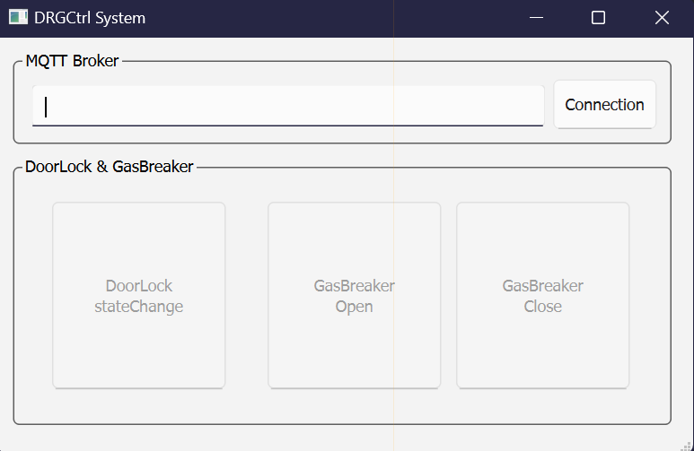

# MQTT로 도어락, 가스브레이커 원격 제어
인터넷으로 연결된 컴퓨터에서 GUI 프로그램을 이용해 Auto 제어기의 PWM 컨트롤러에 연결된 가스브레이커와 릴레이에 연결된 도어락 상태를 원격 제어합니다.

## 시스템 구성
Auto 제어기에서 실행하는 펌웨어와, PC1에서 실행하는 시리얼-인터넷 브릿지 프로그램 및 PC2에서 실행하는 GUI 프로그램으로 구성되며, 환경에 따라 PC1과 PC2는 같은 PC일 수 있습니다.

```xml
      MCU      <--- 시리얼 ---> PC1      <--- 인터넷 ---> 브로커 <--- 인터넷 ---> PC2
      펌웨어                    브릿지                                           GUI
      (micrpython)             (python, pyserial, paho-mqtt)                    (python, pyqt6, paho-mqtt)
```

### 준비물
- Auto 제어기: 1개
  - USB 케이블: 1개
  - 파워 어댑터: 1개 
  - 드라이버: 1개
  - 도어락: 1개  
  - 가스브레이커: 1개
- PC: 2대
  - PC1: Audo 제어기와 시리얼 연결
  - PC2: PC1과 인터넷 연결
 
### 케이블링
가스브레이커의 Red 선(VCC)을 PWM 포트 0, Black 선(GND)을 PWM 포트 1에 연결하고, 도어락은 2개의 제어 선을 순서에 관계 없이 릴레이 1번 포트 C(공용)와 O(A접점)에 연결합니다. 
```sh
               GassBreaker                       DoorLock
        (Black)  |   |  (Red)                     |   |
                 |   |                            |   |
PWM Port -->     1   0         Relay Port --->    C   O
                                                 RELAY_1
```

### 프로젝트 폴더 구조
현재 작업 공간에 DRGCtrl 폴더를 만든 후 하위에 XNode와 PC 폴더를, PC 폴더에는 다시 GUI 폴더를 추가합니다.
폴더를 모두 만들었으면, 각 폴더에 다음과 같이 파일을 구현합니다.  

```xml
DRGCtrl  
   |--- XNode  
   |    |--- firm_drg_ctrl.py  
   |  
   |--- PC  
        |--- serial_drg_ctrl.py  
        |--- bridge_drg_ctrl.py  
        |--- GUI  
                |--- DRGCtrl.ui  
                |--- DRGCtrlUi.py  
                |--- DRGCtrl.py  
                |--- PySide6PahoMqtt.py  
```
                
## Auto 제어기
PWM 포트에 조명과 팬을 연결한 Auto 제어기에는 시리얼로부터 데이터를 읽어 이를 제어하는 펌웨어를 작성합니다.

### PWM와 Relay 클래스를 이용해 Auto 제어기용 펌웨어 구현
펌웨어를 구현하기 전에 다음과 같이 PC에서 Auto 제어기로 전달한 데이터 형식과 처리 방법을 정의합니다.
- PC에서 다음과 같이 3개 문자로 정의한 제어 문자열을 "\r"과 함께 전송
  - "gbo\r" --> gasBreaker Open
  - "gbc\r" --> gasBreaker Close
  - "dsc\r" --> doorLock stateChange
- 펌웨어는 input()으로 이를 수신한 후 if ~ elif로 해당 문자열을 비교한 후 해당 제어 명령을 실행합니다.

펌웨어 구현은 다음과 같습니다.

**firm_drg_ctrl.py**  
```python
from xnode.pop.autoctrl import PWM
from xnode.pop.autoctrl import Relay, DIO
import time

pwm = PWM()
doorlock = Relay(DIO.P_RELAY[0])

def setup():
    pwm.init()
    pwm.freq(1000)

def loop():
    cmd = input().lower() 
    if cmd == "gbo": # gasBreaker Open
        pwm.duty(0, 100)
        pwm.duty(1, 0)
    elif cmd == "gbc": # gasBreaker Close 
        pwm.duty(0, 0)
        pwm.duty(1, 100)
    elif cmd == "dsc": # doorLock stateChange
        doorlock.on()
        time.sleep(0.5)
        doorlock.off()

if __name__ == "__main__":
    setup()
    while True:
        loop()
```

### 테스트
PC1에서 구현한 펌웨어를 xnode 툴을 이용해 Auto 제어기에 전송 및 실행한 다음, PC1에서 앞서 정의한 제어 문자열을 전송합니다.

1. PC에 연결된 Auto 제어기의 시리얼 포트 번호를 확인합니다.
```sh
xnode scan
```
```out
com13
```

2. 펌웨어를 전송 및 실행합니다. 이때, xnode는 계속 실행 상태이므로 Auto 제어기로 데이터를 전송하거나 수신할 수 있습니다.
```sh
xnode --sport com13 run -in DRGCtrl\XNode\firm_drg_ctrl.py
```

3. 앞서 정의한 제어 문자열을 Auto 제어기에 전송하면, 도어락이나 가스브레이커의 상태가 바뀝니다.
```sh
gbo
gbc
dsc
```

4. 테스트가 완료되면 Ctrl+c를 눌러 xnode 툴을 강제 종료합니다.

### 펌웨어 실행
Auto 제어기에 펌웨어만 전송 및 실행한 후 xnode 툴은 종료합니다.
```sh
xnode --sport com13 run -n DRGCtrl\XNode\firm_drg_ctrl.py
```

## 시리얼과 인터넷 연결 브릿지
PC1은 Auto 제어기와 시리얼 통신을 하면서 동시에 인터넷에 연결되어 있어야 합니다. 브릿지 프로그램은 MQTT를 통해 인터넷에서 수신한 메시지를 Auto 제어기로 시리얼 통신을 이용하여 전달하는 역할을 수행합니다.

이 브릿지 프로그램은 2단계로 개발합니다.
- 1단계: PC1에서 Auto 제어기로 제어 문자열을 전달하는 프로그램을 작성하고 시리얼 통신 검증
- 2단계: MQTT 구독 기능을 추가하여 최종 프로그램 완성

### 1단계: 시리얼 프로그램 구현
PC1에서 사용자가 제어 명령을 입력하면 "\r"을 추가해 pyserial로 Auto 제어기에 전송합니다.  

**serial_drg_ctrl.py**  
```python
from serial import Serial

XNODE_PORT = "COM13" # 자신의 COM 포트로 변경할 것
ser = Serial(XNODE_PORT, 115200, inter_byte_timeout=1)

def main():
    while True:
        cmd = input("Enter of command: ")
        ser.write(f"{cmd}\r".encode())

if __name__ == "__main__":
    main()
```

**테스트**  
출력되는 프롬프트에 맞춰 제어 명령을 입력하면 도어락이나 가스브레이커의 상태가 바뀌어야 합니다.

```sh
python DRGCtrl\PC\seiral_drg_ctrl.py
```
```sh
Enter of command: gbo
Enter of command: gbc
Enter of command: dsc
```

테스트가 끝나면 Ctrl+c를 눌러 프로그램을 강제 종료합니다.

### 2단계: 브릿지 프로그램 구현
사용자 입력 대신 paho-mqtt를 이용해 MQTT 브로커로부터 구독한 토픽 메시지를 제어 문자열로 바꾸는 기능을 추가합니다.   
- 가스브레이커 열림: ams/iot/drg/gasbreaker/open
- 가스브레이커 잠금: ams/iot/drg/gasbreaker/close
- 도어락 상태 변경: ams/iot/drg/doorlock/change

브릿지에서 구독할 토픽은 모두 3개이나, # 필터를 사용하면 한 번에 3개의(실제 3개보다 많을 수 있음) 토픽 메시지를 모두 구독할 수 있습니다. 
- "asm/iot/drg/#"

다음은 pyserial과 paho-mqtt가 결합된 최종 브릿지 코드입니다.

**bridge_drg_ctrl.py**  
```python
from serial import Serial
import paho.mqtt.client as mqtt
import json

XNODE_PORT = "COM13" # 자신의 COM 포트로 변경할 것
TOPIC_IOT_DRG = "asm/iot/drg/#"
"""
asm/iot/drg/gasbreaker/open
asm/iot/drg/gasbreaker/close 
asm/iot/drg/doorlock/change
"""

ser = Serial(XNODE_PORT, 115200, inter_byte_timeout=1)

def on_connect(*args):
    if args[3] == 0:
        print("브로커에 연결되었습니다.")
        args[0].subscribe(TOPIC_IOT_DRG)
    else:
        pass

def on_subscribe(*args):
    print(f"브로커에 {TOPIC_IOT_DRG} 토픽 구독이 등록되었습니다.")

def on_message(*args):
    topic = args[2].topic
    try:
        _ = json.loads(args[2].payload)
    except ValueError:
        return

    if topic == "asm/iot/drg/gassbreaker/open":
        cmd = "gbo"
    elif topic == "asm/iot/drg/gassbreaker/close":
        cmd = "gbc"
    elif topic == "asm/iot/drg/doorlock/change":
        cmd = "dsc"
    else:
        return
    
    print(cmd)
    ser.write(f"{cmd}\r".encode())

def main():
    c = mqtt.Client()
    c.on_connect = on_connect
    c.on_subscribe = on_subscribe
    c.on_message = on_message
    
    c.connect("mqtt.eclipseprojects.io")
    c.loop_forever() 
    
if __name__ == "__main__":
    main()
```

**테스트**  
구현한 브릿지를 실행합니다.

```sh
python DRGCtrl\PC\bridge_drg_ctrl.py
```

MQTTX를 실행한 다음 브릿지와 같은 브로커에 연결하고, 앞서 정의한 토픽을 발행합니다. 현재 페이로드는 사용하지 않으므로 0으로 설정합니다.

- 새 연결
  - Name: EclipseProjects
  - Host: mqtt.eclipseprojects.io
- 발행
  - Type: JSON
  - Topic: asm/iot/drg/gassbreaker/open
  - Payload: 0


## 원격 제어용 GUI
인터넷에 연결된 PC2에서 진행하며, 2개의 QToolButton 위젯을 이용해 상태가 바뀔때 마다 토픽 메시지를 MQTT 브로커에 발행하는 PhQy6 기반 GUI를 구현합니다.
 
### paho-mqtt를 PySide6로 변환한 라이브러리 구현
Qt에서 제공하는 QMqtt는 상용 라이선스에서만 사용할 수 있으므로 paho-mqtt의 콜백 처리 방식을 PySide6의 시그널-슬롯 메커니즘으로 변환합니다.

**PySide6PahoMqtt.py** 
```python
import json
from PySide6.QtCore import QObject, Signal
import paho.mqtt.client as mqtt

class MqttClient(mqtt.Client, QObject):
    onConnect = Signal(int)
    onConnectFail = Signal()
    onSubscribe = Signal(int)
    onMessage = Signal(str, object)
    onPublish = Signal(int)
    onUnsubscribe = Signal(int)
    onDisconnect = Signal()

    def __init__(self, client_id="", clean_session=None, userdata=None, protocol=mqtt.MQTTv311, transport="tcp", reconnect_on_failure=True, manual_ack=False, parent=None):
        mqtt.Client.__init__(self, mqtt.CallbackAPIVersion.VERSION2, client_id, clean_session, userdata, protocol, transport, reconnect_on_failure, manual_ack)
        QObject.__init__(self, parent)

        self.on_connect = self.__on_connect
        self.on_connect_fail = self.__on_connect_fail
        self.on_subscribe = self.__on_subscribe
        self.on_message = self.__on_message
        self.on_publish = self.__on_publish
        self.on_unsubscribe = self.__on_unsubscribe
        self.on_disconnect = self.__on_disconnect
        
    def __del__(self):
        self.loop_stop()

    #주의: QObject의 connect()와 paho.mqtt.client.Client의 connect() 이름이 충돌. connection으로 이름 변경 
    def connection(self, host, port=1883, keepalive=60, bind_address="", bind_port=0, clean_start=mqtt.MQTT_CLEAN_START_FIRST_ONLY, properties=None):
        mqtt.Client.connect(self, host, port, keepalive, bind_address, bind_port, clean_start, properties)
        self.loop_start()

    def __on_connect(self, client, userdata, connect_flags, reason_code, properties):
        self.onConnect.emit(reason_code)
    
    def __on_connect_fail(self, client, userdata):
        self.onConnectFail.emit()
    
    def __on_subscribe(self, client, userdata, mid, reason_code_list, properties):
        self.onSubscribe(mid)
    
    def __on_message(self, client, userdata, message):
        self.onMessage.emit(message.topic, json.loads(message.payload))
    
    def __on_publish(self, client, userdata, mid, reason_code, properties):
        self.onPublish.emit(mid)
    
    def __on_unsubscribe(self, client, userdata, mid, reason_code_list, properties):
        self.onUnsubscribe.emit(mid)
    
    def __on_disconnect(self, client, userdata, disconnect_flags, reason_code, properties):
        self.onDisconnect.emit()
```

### UI(화면) 디자인
QMainWindow에서 기본으로 제공되는 메뉴바(QMenuBar)를 제거하고, 2개의 그룹박스(QGroup)을 추가합니다.
첫 번째 그룹박스에는 편집줄(QLineEdit)과 버튼(QPushButton)을, 두 번째 그룹박스에는 버튼(QToolButton) 3개 추가합니다.  

- QMainWindow
  - QBroupBox
    - title: MQTT Broker 
    - QLineEdit
      - objectName: edtBroker 
    - QPushButton
      - objectName: btConDiscon
      - text: Connection
  - QBroupBox
    - objectName: grpDRG
    - title: DoorLock && GasBreaker Controller 
    - QToolButton
      - objectName: btDoorLock
      - enabled: Unchecked
      - text: DoorLock\nstateChange
    - QToolButton
      - objectName: btGBOpen
      - text: GasBreaker\nOpen
    - QToolButton
      - objectName: btGBClose
      - text: GasBreaker\nClose 
  - QStatusBar
    - objectName: statusbar
 
1. QT 디자이너를 실행합니다.
```sh
pyside6-designer 
```

2. 다음과 같이 UI를 디자인합니다.
> DRGCtrl.ui

 

<details>
<summary><b>DrgCtrl.ui</b></summary>

```xml
<?xml version="1.0" encoding="UTF-8"?>
<ui version="4.0">
 <class>MainWindow</class>
 <widget class="QMainWindow" name="MainWindow">
  <property name="geometry">
   <rect>
    <x>0</x>
    <y>0</y>
    <width>516</width>
    <height>309</height>
   </rect>
  </property>
  <property name="windowTitle">
   <string>MainWindow</string>
  </property>
  <widget class="QWidget" name="centralwidget">
   <widget class="QGroupBox" name="grpDRG">
    <property name="enabled">
     <bool>false</bool>
    </property>
    <property name="geometry">
     <rect>
      <x>10</x>
      <y>88</y>
      <width>491</width>
      <height>201</height>
     </rect>
    </property>
    <property name="title">
     <string>DoorLock &amp;&amp; GasBreaker Controller</string>
    </property>
    <widget class="QToolButton" name="btDoorLock">
     <property name="geometry">
      <rect>
       <x>29</x>
       <y>33</y>
       <width>131</width>
       <height>141</height>
      </rect>
     </property>
     <property name="text">
      <string>DoorLock
stateChange</string>
     </property>
    </widget>
    <widget class="QToolButton" name="btGBOpen">
     <property name="geometry">
      <rect>
       <x>189</x>
       <y>33</y>
       <width>131</width>
       <height>141</height>
      </rect>
     </property>
     <property name="text">
      <string>GasBreaker
Open</string>
     </property>
    </widget>
    <widget class="QToolButton" name="btGBClose">
     <property name="geometry">
      <rect>
       <x>329</x>
       <y>33</y>
       <width>131</width>
       <height>141</height>
      </rect>
     </property>
     <property name="text">
      <string>GasBreaker
Close</string>
     </property>
    </widget>
   </widget>
   <widget class="QGroupBox" name="groupBox_2">
    <property name="geometry">
     <rect>
      <x>10</x>
      <y>9</y>
      <width>491</width>
      <height>71</height>
     </rect>
    </property>
    <property name="title">
     <string>MQTT Broker</string>
    </property>
    <widget class="QLineEdit" name="edtBroker">
     <property name="geometry">
      <rect>
       <x>15</x>
       <y>26</y>
       <width>381</width>
       <height>31</height>
      </rect>
     </property>
     <property name="frame">
      <bool>true</bool>
     </property>
     <property name="dragEnabled">
      <bool>false</bool>
     </property>
    </widget>
    <widget class="QPushButton" name="btConDiscon">
     <property name="geometry">
      <rect>
       <x>400</x>
       <y>20</y>
       <width>81</width>
       <height>41</height>
      </rect>
     </property>
     <property name="text">
      <string>Connection</string>
     </property>
    </widget>
   </widget>
  </widget>
  <widget class="QStatusBar" name="statusbar"/>
 </widget>
 <resources/>
 <connections/>
</ui>
```

</details>

3. 완성된 UI를 DRGCtrl\PC\GUI 경로에 DRGCtrl.ui로 저장합니다.
  
4. 저장한 UI 파일(DRGCtrl.ui)을 파이썬 파일(DRGCtrlUi.py)로 변환합니다.
```sh
pyside6-uic DRGCtrl\PC\GUI\DRGCtrl.ui -o DRGCtrl\PC\GUI\DRGCtrlUi.py
```

<details>
<summary><b>DRGCtrlUi.py</b></summary>

```python
# -*- coding: utf-8 -*-

################################################################################
## Form generated from reading UI file 'DRGCtrl.ui'
##
## Created by: Qt User Interface Compiler version 6.8.0
##
## WARNING! All changes made in this file will be lost when recompiling UI file!
################################################################################

from PySide6.QtCore import (QCoreApplication, QDate, QDateTime, QLocale,
    QMetaObject, QObject, QPoint, QRect,
    QSize, QTime, QUrl, Qt)
from PySide6.QtGui import (QBrush, QColor, QConicalGradient, QCursor,
    QFont, QFontDatabase, QGradient, QIcon,
    QImage, QKeySequence, QLinearGradient, QPainter,
    QPalette, QPixmap, QRadialGradient, QTransform)
from PySide6.QtWidgets import (QApplication, QGroupBox, QLineEdit, QMainWindow,
    QPushButton, QSizePolicy, QStatusBar, QToolButton,
    QWidget)

class Ui_MainWindow(object):
    def setupUi(self, MainWindow):
        if not MainWindow.objectName():
            MainWindow.setObjectName(u"MainWindow")
        MainWindow.resize(516, 309)
        self.centralwidget = QWidget(MainWindow)
        self.centralwidget.setObjectName(u"centralwidget")
        self.grpDRG = QGroupBox(self.centralwidget)
        self.grpDRG.setObjectName(u"grpDRG")
        self.grpDRG.setEnabled(False)
        self.grpDRG.setGeometry(QRect(10, 88, 491, 201))
        self.btDoorLock = QToolButton(self.grpDRG)
        self.btDoorLock.setObjectName(u"btDoorLock")
        self.btDoorLock.setGeometry(QRect(29, 33, 131, 141))
        self.btGBOpen = QToolButton(self.grpDRG)
        self.btGBOpen.setObjectName(u"btGBOpen")
        self.btGBOpen.setGeometry(QRect(189, 33, 131, 141))
        self.btGBClose = QToolButton(self.grpDRG)
        self.btGBClose.setObjectName(u"btGBClose")
        self.btGBClose.setGeometry(QRect(329, 33, 131, 141))
        self.groupBox_2 = QGroupBox(self.centralwidget)
        self.groupBox_2.setObjectName(u"groupBox_2")
        self.groupBox_2.setGeometry(QRect(10, 9, 491, 71))
        self.edtBroker = QLineEdit(self.groupBox_2)
        self.edtBroker.setObjectName(u"edtBroker")
        self.edtBroker.setGeometry(QRect(15, 26, 381, 31))
        self.edtBroker.setFrame(True)
        self.edtBroker.setDragEnabled(False)
        self.btConDiscon = QPushButton(self.groupBox_2)
        self.btConDiscon.setObjectName(u"btConDiscon")
        self.btConDiscon.setGeometry(QRect(400, 20, 81, 41))
        MainWindow.setCentralWidget(self.centralwidget)
        self.statusbar = QStatusBar(MainWindow)
        self.statusbar.setObjectName(u"statusbar")
        MainWindow.setStatusBar(self.statusbar)

        self.retranslateUi(MainWindow)

        QMetaObject.connectSlotsByName(MainWindow)
    # setupUi

    def retranslateUi(self, MainWindow):
        MainWindow.setWindowTitle(QCoreApplication.translate("MainWindow", u"MainWindow", None))
        self.grpDRG.setTitle(QCoreApplication.translate("MainWindow", u"DoorLock && GasBreaker Controller", None))
        self.btDoorLock.setText(QCoreApplication.translate("MainWindow", u"DoorLock\n"
"stateChange", None))
        self.btGBOpen.setText(QCoreApplication.translate("MainWindow", u"GasBreaker\n"
"Open", None))
        self.btGBClose.setText(QCoreApplication.translate("MainWindow", u"GasBreaker\n"
"Close", None))
        self.groupBox_2.setTitle(QCoreApplication.translate("MainWindow", u"MQTT Broker", None))
        self.btConDiscon.setText(QCoreApplication.translate("MainWindow", u"Connection", None))
    # retranslateUi
```

</details>

### 코드 구현
앞서 구현한 PyQt6Mqtt.py와 DRGCtrlUi.py를 활용하여 사용자 인터페이스에서 QToolButton 상태가 바뀔 때마다 해당 값을 MQTT 토픽 메시지로 발행하는 파이썬 코드를 작성합니다.

완성된 코드는 다음과 같습니다.

**DRGCtrl.py**
```python

```

Auto 제어기에 펌웨어를 설치하고, PC1에서 브릿지 프로그램을 실행한 상태에서 개발한 GUI 프로그램을 실행하여 최종 결과를 확인합니다. 
해당 버튼을 누르면, Auto 제어기에 연결된 가스브레이커 또는 도어락의 상태가 실시간으로 변경되어야 합니다.

```sh
python DRGCtrl\PC\PyQt6\DRGCtrl.py
```
