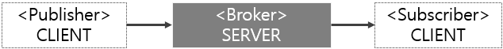

# ISO 표준 발행-구독 기반의 메시징 프로토콜: MQTT(Message Queuing Telemetry transport) 

**MQTT**는 앤디 스텐포드-클락*andy stanford-clark*(IBM)과 알렌 니퍼*arlen nipper*가 인공위성을 통해 오일 파이프라인 원격 검침 시스템을 연결하기 위해 1999년부터 설계한 것으로 2010년 로열티 없는 상태로 출시되어 2014년 OASIS*advancing open standards for the information society* 표준이 되었습니다. 이후 MQTT V3.1을 중심으로 IoT Internet of Thing 장치 사이 낮은 대역폭 통신을 제공하는 가벼운 메시징 프로토콜 중 하나로 자리매김하고 있으며 2018년 1월 최신 버전인 MQTT V5가 승인된 상태입니다.

MQTT 시스템은 중계 서버 역할의 브로커*broker*와 브로커에 토픽을 기반으로 메시지를 보내고 받는 클라이언트로 구성되는데, 클라이언트는 브로커로부터 토픽 메시지를 구독하는 구독자*subscriber*와 토픽에 메시지를 발행하는 발행자*publisher*로 나누어집니다.

\
[그림 1 MQTT 구성]

## MQTT 개요
MQTT는 TCP/IP를 기반으로 한 메시지 버스 시스템으로 클라이언트(발행자, 구독자)와 서버(브로커), 세션, 서브스크립션, 토픽으로 구성됩니다. 브로커의 디폴트 포트 번호는 1883입니다.
 
\
[그림 2 MQTT 시스템 아키텍처]

### MQTT 클라이언트
현재 기기가 발행자면 토픽에 대한 메시지를 발행해 브로커에 게시할 수 있고 구독자면 브로커의 특정 토픽에 가입해 메시지를 구독할 수 있습니다. 하나의 클라이언트는 구독자 또는 발행자이거나 모두일 수 있으며 브로커에 연결할 때 사용자 ID와 비밀번호 또는 인증서를 이용해 인증합니다.
 
\
[그림 3 발생과 구독]

클라이언트는 일반적으로 공개된 클라이언트 라이브러리를 이용해 구현하지만 크롬 브라우저의 확장 플러그인 MQTTlens나 리눅스 쉘 또는 윈도우 명령행에서 동작하는 mosquitto-clients처럼 미리 범용으로 구현된 제품들도 있습니다. tos OS(이하 tos)에는 mosquitto-client가 다음 명령으로 미리 설치되어 있습니다.

*linux*
```sh
sudo apt install mosquitto-clients
```
*macOS*
```sh
brew install mosquitto-clients
```
*windows*
```sh
winget install emqx.mqttx
```

mosquitto-client를 설치하면 범용 발행자인 mosquitto_pub과 범용 구독자인 mosquitto_sub를 사용할 수 있습니다.

### MQTT 브로커

브로커는 일종의 서버 프로그램으로 발행자와 구독자 사이 중계자 역할만 하므로 서버 대신 브로커란 용어를 사용합니다. 브로커가 발행자로부터 메시지를 수신하면 토픽을 기반으로 이를 게시한 후 토픽에 가입한 모든 구독자에게 배포합니다. 일반적으로 게시된 메시지 중 가입자가 없는 메시지나 배포된 메시지는 제거되지만 보존 속성을 가진 메시지나 영구 세션에서 발행한 메시지는 최소한 다음 배포까지 유지됩니다. 

브로커는 IBM MQ와 같은 상용 제품부터 EMQ, mosquitto와 같은 오픈소스에 이르기까지 다양한 제품들이 출시되어 있는데, Sdoa에는 mosquitto가 미리 설치되어 시스템이 부팅할 때마다 자동으로 실행됩니다. 또한 초기 설정은 익명을 허용하므로 클라이언트는 사용자 ID나 비밀번호 없이 브로커에 연결할 수 있습니다.

*linux*
```sh
sudo apt install mosquitto
```
*macOS*
```sh
brew install mosquitto
```
*windows*
```sh
winget install EclipseFoundation.Mosquitto
```
참고로 /etc/mosquitto/conf.d/mosquitto.conf에는 브로커의 보안을 높여 익명을 허용하지 않을 때를 대비한 설정이 들어 있으나 자동 실행되는 mosquittor 브로커에는 간편한 사용을 위해 적용하지 않고 있습니다. 이 파일을 이용해 mosquitto를 실행하면 클라이언트는 브로커에 연결할 때마다 반드시 /etc/mosquitto/passwd에 추가된 사용자 ID와 비밀번호를 사용해야 합니다.

**공개용 브로커*

|Name |	Broker Address | TCP Port	| TLS Port | WebSocket Port| Message Retention|
|---|---|---|---|---|---|
Eclipse	| mqtt.eclipse.org	| 1883	| N/A	| 80, 443 |	YES  
Mosquitto	| test.mosquitto.org	| 1883	| 8883, 8884	| 80	| YES  
HiveMQ | broker.hivemq.com	| 1883	| N/A	| 8000	| YES  
Flespi | mqtt.flespi.io | 1883 | 8883 | 80, 443 | YES
Dioty	| mqtt.dioty.co |	1883 | 8883 |	8080, 8880 |	YES
Fluux	| mqtt.fluux.io |	1883 | 8883 |	N/A |	N/A
EMQX | broker.emqx.io |	1883 | 8883| 8083 |	YES


### 토픽
토픽은 메시지에 대한 발생/구독 패턴의 기준으로 클라이언트 사이 미리 정의한 의미대로 정보를 교환할 수 있게 합니다. 대소 문자를 구분하는 계층 구조의 UTF-8 문자열로 파일 시스템의 경로와 같이 슬래시(/)로 구분되며 발행자와 브로커, 브로커와 구독자 사이 토픽에 따른 메시지 흐름을 구분합니다. 

#### **토픽 구조**
$SYS 토픽을 제외하고 기본 또는 표준화된 토픽 구조는 없습니다. $SYS 토픽은 브로커에 대한 정보를 공개하기 위해 대부분의 브로커에서 예약되어 있습니다.

\
[그림 4 토픽]

다음 예에서 클라이언트와 브로커는 첫 번째 레벨 tos를 기준으로 8개의 토픽을 사용합니다. tos의 두 번째 레벨은 pir, cds, motor이고 pir과 cds의 다음 레벨은 각각 value이며 motor의 다음 레벨은 direction과 speed입니다. 

* tos/pir/value
* tos/cds/value
* tos/motor/direction
* tos/motor/speed

#### **토픽 생성 및 제거**
발행자는 메시지를 발행할 때마다 토픽을 포함하므로 브로커는 토픽이 없으면 만든 후 게시합니다. 또한 구독자도 토픽에 가입할 때 토픽이 없으면 브로커는 만든 후 가입시킵니다. 토픽은 세션이 제거될 때 제거됩니다.

#### **토픽 필터**
발행자가 토픽에 메시지를 게시할 때는 항상 개별적인 발행만 허용하므로 두 가지 토픽에 메시지를 게시하려면 두 번 발행해야 합니다. 하지만 구독자는 여러 토픽에 가입하는 대신 토픽 필터를 적용해 한 번만 가입해도 됩니다. 토픽 필터는 단일 레벨 필터일 '+'와 다중 레벨 필터인 '#' 중 하나를 이용해 레벨 또는 이후 모든 레벨을 와일드카드wildcard로 설정합니다. 

* +: 단일 레벨 와일드카드로 레벨의 모든 문자 치환
* #: 다중 레벨 와일드카드로 현재 레벨과 이후 모든 레벨의 문자 치환
  * $SYS/#: 브로커의 모든 토픽에 가입

앞의 예에서 발행자가 tos 또는 tos/pir이나 tos/pir/value 토픽 등으로 메시지를 발행하면 구독자는 일치하는 토픽 구독 대신 다음과 같이 구독 필터를 적용할 수 있습니다.
* tos/+/value: 2개의 토픽 구독
  *	tos/pir/value
  *	tos/cds/value
* tos/#: tos를 포함한 모든 하위 토픽 구독
  * tos
  *	tos/pir
  *	tos/pir/value
  *	tos/cds
  *	tos/cds/value
  *	tos/motor
  *	tos/motor/direction
  *	tos/motor/speed

### 세션
세션은 연결된 클라이언트와 브로커 사이 상호작용을 관리하기 위한 것으로 클라이언트와 브로커는 세션 정보 중 서비스 품질을 나타내는 QoS를 통해 "적어도 한 번" 및 "정확히 한 번" 발행과 "정확히 한 번" 구독을 보장합니다. 또한 구독자가 작성한 구독도 세션 정보에 포함됩니다.

다음은 세션에 저장되는 내용입니다.

* 구독이 없는 세션의 존재 여부
* 모든 구독
* 클라이언트가 확인하지 않은 QoS = 1 또는 QoS = 2 메시지
* 클라이언트가 끊어진 동안 놓친 모든 새로운 QoS = 1 또는 QoS = 2 메시지
* 클라이언트에서 아직 확인되지 않은 모든 수신된 QoS = 2 메시지

클라이언트를 연결할 때 이전 세션 정보를 유지하거나 유지하지 않도록 선택할 수 있는데, 영구 세션(CleanSession = False)은 세션 상태를 유지하고 클린 세션(CleanSession = True)은 유지하지 않습니다.

클라이언트가 클라이언트 ID와 브로커 주소, 클린 세션 여부, 사용자 ID, 비밀번호 또는 인증서를 이용해 브로커에 연결을 요청하면 브로커는 세션 정보가 이전 연결에서 저장되어 있는지 확인합니다. 이전 세션이 존재할 때 클린 세션이면 클라언트와 브로커의 이전 세션 상태는 지워지고 영구 세션이면 이전 세션 상태를 다시 사용합니다. 이전 세션이 없으면 새 세션이 시작됩니다.

#### **발행**
클린 세션으로 클라이언트를 연결하면 보류 중인 모든 발행의 송신이 제거됩니다. 또한 클린 세션에서 QoS = 0으로 발행된 메시지는 영향을 주지 않지만 QoS = 1 및 QoS = 2로 발행한 메시지는 게시되지 않고 잃어버릴 수 있습니다.

#### **구독**
세션 상태에서 구독은 논리적으로 클라이언트의 토픽을 연결하며 토픽에 가입한 클라이언트는 게시된 메시지를 수신할 수 있습니다. 클린 세션으로 클라이언트를 연결하면 브로커는 클라이언트에 대한 이전 구독을 모두 제거합니다. 또한 연결이 끊어지면 세션 중에 클라이언트가 만든 모든 새 구독도 함께 제거됩니다. 반면에 영구 세션에서는 클라이언트가 만드는 구독이 연결되기 전에 클라이언트에 있었던 모든 구독에 추가됩니다. 클라이언트가 연결을 끊어도 모든 구독은 활성 상태를 유지합니다.

클린 세션은 기본 세션 모드로 세션 범위 내에서만 게시된 메시지를 받을 수 있으므로 구독은 일시적입니다. 따라서 세션이 닫히면 세션 상태도 지워지므로 이후 게시된 메시지는 잃어버린다. 하지만 영구 세션은 구독이 영구적이므로 클라이언트의 연결을 끊었다가 다시 연결하면 QoS = 1 또는 QoS = 2로 게시된 메시지를 받게 됩니다.

\
[그림 5 클린 세션과 영구 세션]

어떤 세션이든 한 번 만들어지면 전체 세션 동안 지속되므로 모드를 바꾸려면 클라이언트의 연결을 끊었다가 다시 연결하는 방법밖에 없습니다. 영구 세션을 끊고 클린 세션으로 다시 연결하면 클라이언트에 대한 모든 이전 구독 및 수신되지 않은 모든 발행이 삭제됩니다.

#### **클라이언트 ID**
클라이언트 ID는 브로커가 세션 안에서 각각의 클라이언트를 구분하는 유일한 식별자로 숫자와 영문자 대소문자 및 '_' 문자를 조합해 만듭니다. CleanSession = True일 때는 브로커가 동적으로 만들지만 CleanSession = False에서는 클라이언트가 반드시 유효한 문자열로 클라이언트 ID를 부여해야 하는데, 물리적으로 다른 장치에서 동일한 클라이언트 ID를 사용하면 보류 중인 게시 및 활성 구독이 자동으로 새 장치로 전송되므로 장애가 발행한 장치의 이전이 쉽습니다.

브로커가 동적으로 만드는 클라이언트 ID는 고유성이 보장되지만 클라이언트에서 명시적으로 만들 때는 브로커에 이미 등록된 클라이언트 ID인지 알 수 없으므로 128bit 고유 문자열을 생성하는 uuid 툴이나 네트워크 인터페이스의 MAC 주소 등을 사용하는 것과 같이 스스로 특별한 규칙을 적용할 필요가 있습니다.

## MQTT 제어 패킷
MQTT는 TCP/IP를 사용하므로 MQTT 제어 패킷은 TCP의 사용자 데이터인 페이로드에 대응합니다. MQTT 제어 패킷은 브로커와 클라이언트 사이 데이터 교환 단위로 제어 헤더(1byte)와 패킷 길이(1 ~ 4byte), 가변 길이 헤더(0 ~ xbyte), 페이로드(0 ~ xbyte)로 구성되는데, 제어 헤더와 패킷 길이는 항상 고정되고 가변 길이 헤더와 페이로드는 패킷 유형에 따라 달라집니다. 패킷의 최소 크기는 고정 헤더로만 구성된 2바이트이고, 최대 크기는 256MB입니다.
 
\
[그림 6 MQTT 메시지 패킷 구조]

### 제어 헤더
제어 필드로도 불리는 제어 헤더는 4비트 2개로 나눠 상위 4bit는([7:4]) 명령 또는 메시지를 구분하는 패킷 유형으로 사용하고 나머지 4bit는([3:0]) 패킷 유형에 따른 여분의 플래그로 사용합니다.

\
[그림 7 제어 필드 구조]

#### **패킷 유형**
메시지 유형으로도 불리는 패킷 유형은 클라이언트와 브로커 사이에 주고받는 명령 또는 메시지의 종류를 구분하는 것으로 다음과 같이 정의되어 있습니다.

|Name             |	Value    |	Direction of flow|	Description|
|-----------------|----------|-------------------|-------------|
|Reserved|	0|	Forbidden|	Reserved|
|CONNECT|	1|	Client to Server|	Client request to connect to Server|
|CONNACK|	2|	Server to Client|	Connect acknowledgment|
|PUBLISH|	3|	Client to Server/ Server to Client|	Publish message|
|PUBACK|	4|	Client to Server/ Server to Client|	Publish| acknowledgment|
|PUBREC|	5|	Client to Server/ Server to Client|	Publish received|
|PUBREL|	6|	Client to Server/ Server to Client|	Publish release|
|PUBCOMP|	7|	Client to Server/ Server to Client|	Publish complete|
|SUBSCRIBE|	8|	Client to Server|	Client subscribe request|
|SUBACK|	9|	Server to Client|	Subscribe acknowledgment|
|UNSUBSCRIBE|	10|	Client to Server|	Subscribe acknowledgment|
|UNSUBACK|	11|	Server to Client|	Unsubscribe acknowledgment|
|PINGREQ|	12|	Client to Server|	PING request|
|PINGRESP|	13|	Server to Client|	PING response|
|DISCONNECT|	14|	Client to Server|	Client is disconnecting|
|Reserved|	15|	Forbidden|	Reserved|
[표 1 MQTT 패킷 유형]

클라이언트가 브로커에 CONNECT 패킷은 전달해 연결을 요청하면 브로커는 CONNACK 패킷으로 응답합니다. PUBLISH 패킷은 클라이언트가 브로커에 메시지를 발행하거나, 브로커가 게시된 메시지를 배포할 때 사용하며 QoS에 따라 응답이 달라집니다. 

* QoS = 0
  * 응답 패킷 없음
* QoS = 1
  * PUBACK 패킷 응답
* QoS = 2
  * 첫 번째로 PUBREC 패킷 응답 
  * 상대 쪽은 PUBREL 패킷 전달
  * 마지막으로 PUBCOMP 패킷 응답

SUBSCRIBE 패킷은 하나 이상의 구독을 생성하기 위해 클라이언트에서 브로커로 전송되며 각 구독은 자신만의 QoS와 함께 클라이언트의 관심을 하나 이상의 토픽에 등록합니다. 브로커는 메시지가 게시되면 이를 배포하기 위해 클라이언트에 PUBLISH 패킷을 보냅니다. 브로커는 SUBSCRIBE 패킷을 받으면 SUBACK 패킷으로 응답합니다. UNSUBSCRIBE 패킷은 구독을 취소하기 위해 클라이언트에서 브로커로 전달되며, 브로커는 UNSUBACK 패킷으로 응답합니다. 

PINGREQ 패킷은 킵얼라이브 프로토콜을 위해 클라이언트에서 브로커로 전송되며 다른 제어 패킷이 브로커로 전송되지 않을 때 클라이언트가 살아있음을 브로커에 알리거나 반대로 서버가 살아있는지 확인하기 위해 사용합니다. PINGREQ 패킷을 받은 브로커는 PINGRESP 패킷으로 응답합니다. DISCONNECT 패킷은 클라이언트의 연결 해제를 브로커에 알리는 최종 제어 패킷이며 브로커는 응답 패킷 없이 클라이언트와의 연결을 끊습니다.

#### **플래그**
플래그는 패킷 유형에 대한 추가 정보로 브로커나 클라이언트는 유효하지 않은 플래그가 수신되면 네트워크 연결을 해제합니다. PUBLISH를 제외한 모든 플래그는 다음과 같이 예약되어 있습니다.

|Name|	flags|	bit 3|	bit 2|	bit 1|	bit 0|
|----|-------|-------|-------|-------|-------|
|CONNECT|	Reserved|	0|	0|	0|	0|
|CONNACK|	Reserved|	0|	0|	0|	0|
|PUBLISH|	Used in MQTT v3.1.1|	DUP|QoS	|QoS|	RETAIN|
|PUBACK|	Reserved|	0|	0|	0|	0|
|PUBREC|	Reserved|	0|	0|	0|	0|
|PUBREL|	Reserved|	0|	0|	1|	0|
|PUBCOMP|	Reserved|	0|	0|	0|	0|
|SUBSCRIBE|	Reserved|	0|	0|	1|	0|
|SUBACK|	Reserved|	0|	0|	0|	0|
|UNSUBSCRIBE|	Reserved|	0|	0|	1|	0|
|UNSUBACK|	Reserved|	0|	0|	0|	0|
|PINGREQ|	Reserved|	0|	0|	0|	0|
|PINGRESP|	Reserved|	0|	0|	0|	0|
|DISCONNECT|	Reserved|	0|	0|	0|	0|
[표 2 MQTT 플래그]

PUBLISH 패킷의 플래그는 DUP*duplicate delivery*, QoS(0 ~ 2), RETAIN을 나타내는데, DUP가 0이면 첫 번째 PUBLISH 패킷을 의미하고 1이면 이전 시도의 다시 전송임을 나타냅니다. RETAIN이 1이면 브로커는 이전 메시지를 지우고 현재 메시지를 보존합니다. 즉, 항상 마지막 메시지를 보존합니다. 이렇게 보존된 메시지는 나중에 구독한 클라이언트에도 배포됩니다.

### 패킷 길이
패킷 길이에는 가변 길이 헤더와 페이로드의 합을 저장하며 이 값이 128보다 작으면 패킷 길이는 1바이트를 사용하고 128바이트에서 16,383까지는 2바이트를 사용합니다. 가장 큰 4바이트는 2,097,152에서 268,435,455바이트 범위의 가변 길이 헤더와 페이로드의 합을 저장합니다. 따라서 실제 제어 패킷 크기는 패킷 길이 필드의 저장 값에 제어 헤더 1바이트와 패킷 길이 필드의 크기인 n바이트 더해야 합니다.

* 1 Digit: 0 (0x00) ~ 127 (0x7F)
* 2 Digit: 128 (0x80, 0x01) ~ 16,383(0xFF, 0x7F)
* 3 Digit: 16,384(0x80, 0x80, 0x01) ~ 2,097,151(0xFF, 0xFF, 0x7F)
* 4 Digit: 2,097,152(0x80, 0x80, 0x80, 0x01) ~ 268,435,455(0xFF, 0xFF, 0xFF, 0x7F)
 
### 가변 길이 헤더와 페이로드
가변 길이 헤더와 페이로드는 패킷 유형에 따라 크기와 의미가 다릅니다.

#### **CONNECT**
10바이트 크기의 가변 길이 헤더는 프로토콜 이름(6바이트), 프로토콜 수준(1바이트), 연결 플래그(1바이트), 킵얼라이브(2바이트) 순으로 구성됩니다. 페이로드는 연결 플래그에 따라 생략되거나 클라이언트 ID, 윌will 토픽, 윌 메시지, 사용자 ID, 비밀번호순으로 나열되는데, 각 데이터는 길이 접두사(2바이트)를 포함해 데이터를 크기를 구분합니다.

\
[그림 8 CONNECT 패킷의 가변 길이 헤더]

프로토콜 이름은 처음 2바이트가 이름에 대한 길이고 나머지는 이름입니다. 일반적으로 길이는 4바이트를 의미하는 0x00, 0x04, 이름은 0x0d('M'), 0x51('Q'), 0x54('T), 0x54('T')을 사용합니다. 프로토콜 수준은 v3.1.1 기준으로 0x04를 사용하고 연결 플래그는 비트 단위로 의미가 다릅니다.

\
[그림 9 CONNECT 패킷의 가변 길이 헤더 중 연결 플래그]

연결 플래그의 CS([1])는 세션의 수명과 관련된 클린 세션의 사용 여부로, CS = 1(클린 세션)이면 항상 새로운 세션을 만들어 상태를 유지하다가 연결이 끊어지면 세션 정보도 함께 제거합니다. CS = 0(영구 세션)이면 브로커는 클라이언트 ID로 구분되는 현재 세션 목록을 CONNECT 패킷의 페이로드에 포함된 클라이언트 ID와 비교해 일치하는 세션이 있으면 이를 이용해 클라이언트와의 통신을 재개하고 없으면 새로운 세션을 만듭니다. 또한 클라이언트와 브로커는 연결이 끊어질 때 세션을 저장하므로 CS = 0으로 다시 연결한 클라이언트는 종료한 동안 브로커에 게시된 QoS 1 또는 QoS 2 메시지를 수신할 수 있습니다. 

다음은 클라이언트의 세션 상태입니다.

* 브로커로 전송되었지만 완전히 확인되지 않은 QoS 1, QoS 2 메시지
* 브로커부터 수신되었지만 완전히 확인되지 않은 QoS 2 메시지

다음은 브로커의 세션 상태입니다.

* 구독이 없는 세션의 존재 여부
* 클라이언트의 모든 구독
* 클라이언트에게 전송되었지만 완전히 확인되지 않은 QoS 1, QoS 2 메시지
* 클라이언트에 전송이 보류 중인 QoS 1, QoS 2 메시지
* 클라이언트로부터 수신되었지만 완전히 확인되지 않은 QoS 2 메시지
* 선택적으로, 클라이언트에 전송이 보류 중인 QoS 0 메시지

연결 플래그의 WF([2])가 1이면 페이로드에는 클라이언트의 연결이 비정상적으로 끊어질 때 브로커가 다른 클라이언트에 송신할 윌 토픽과 윌 메시지를 포함합니다. 이때 WR([5])이 1이면 윌 메시지를 지속적으로 브로커에 보존하고, WQ([4:3])는 윌 메시지의 QoS를 나타냅니다. 윌 메시지를 등록한 클라이언트가 DISCONNECT 패킷을 보내면 브로커는 저장된 세션 상태에서 윌 메시지를 제거합니다.

연결 플래그의 최상위 비트인 UF([7])와 PF([6])가 1이면 페이로드에는 사용자 ID와 비밀번호가 포함되어 있어 이를 이용해 브로커와 연결합니다.

클라이언트와 브로커의 연결 유지를 위해 전송되는 제어 패킷 사이 간격이 킵얼라이브 값을 초과하지 않도록 하는 것은 클라이언트의 책임이므로 킬얼라이브 시간이 지날때까지 다른 제어 패킷을 전송하지 않으면 클라이언트는 PINREQ 패킷을 브로커에 전송해야 합니다. PINGREQ 패킷을 보낸 후 일정 시간 내에 브로커로부터 PINGRESP 패킷을 수신할 수 없으면 네트워크 연결이 끊긴 것으로 간주합니다. 60초 킵얼라이브는 0x00, 0x3C이지만, 0을 사용하면 연결 유지 메커니즘을 사용하지 않습니다.

페이로드의 첫 번째 필드에 위치하는 클라이언트 ID는 브로커와 클라이언트 사이 연결된 세션 상태를 식별하기 위한 것으로 UTF-8로 인코딩된 숫자와 영문자 대소문자만 허용합니다. 클라이언트 ID를 생략할 때는 반드시 CS = 1이어야 하며, 브로커는 자신이 동적으로 생성한 클라이언트 ID를 클라이언트가 전달한 것처럼 사용합니다.

#### **CONNACK**
2바이트크기의 가변 길이 헤더는 연결 확인 플래그(1바이트)와 반환 코드(1바이트로)로 구성됩니다. 페이로드는 항상 사용하지 않습니다.

\
[그림 10 CONNACK 패킷의 가변 길이 헤더]

연결 확인 플래그의 [7:1]은 예약되어 있어 항상 0이고 세션의 존재session present를 나타내는 SP([0])만 사용합니다. 클린 세션으로 연결을 요청했다면 세션 존재 비트는 0이고, 클린 세션이 아니라면 클라이언트 ID와 일치하는 기존 세션 상태가 저장되어 있을 때 1, 아니면 0입니다. 반환 코드는 브로커가 연결을 허용하면 0, 아니면 원인을 나타내는 1 ~ 5사이 값을 갖습니다.

* 0x01: 프로토콜 레벨 불일치
* 0x02: 식별자가 거부됨 → CS = 0에서 클라이언트 ID를 제공하지 않음
* 0x03: 네트워크에 연결되어 있지만 브로커를 사용할 수 없음
* 0x04: 사용자 ID 또는 비밀번호 불일치
* 0x05: 클라이언트의 연결 권한이 없음

#### **PUBLISH**
가변 길이 헤더는 토픽(가변 길이)과 패킷 ID(2바이트)로 구성됩니다. 페이로드는 생략될 수 있습니다.

\
[그림 11 PUBLISH 패킷의 가변 길이 헤더와 페이로드]

토픽의 크기는 가변이므로 처음 2바이트에 길이, 나머지는 길이만큼 토픽을 저장합니다. 메시지 ID로도 불리는 패킷 ID는 비동기 환경에서 QoS > 0인 단위 작업을 구분하기 위해 1부터 시작하는 일련번호입니다. PUBLISH로부터 시작하는 PUBACK, PUBREC, PUBREL, PUBCOMP 패킷은 모두 하나의 단위 작업으로 이들은 PUBLISH의 패킷 ID와 같은 패킷 ID를 사용합니다. SUBSCRIBE와 SUBACK, UNSUBSCRIBE와 UNSUBACK도 하나의 단위 작업이므로 PUBLISH 단위 작업의 패킷 ID가 1이면, 이후 SUBSCRIBE 단위 작업은 2, 다시 PUBLISH 단위 작업은 3이 되는 식입니다. 

QoS 0일때 이 필드는 생략되므로 페이로드는 토픽 바로 다음에 위치합니다. PUBLISH 패킷은 QoS에 따라 응답 패킷이 다른데, QoS 0은 응답 패킷이 없고 QoS 1은 PUBACK, QoS 2는 PUBREC 패킷을 사용합니다.

#### **PUBACK**
가변 길이 헤더는 패킷 ID(2바이트)로만 구성됩니다. 페이로드는 사용하지 않습니다. PUBLISH 패킷을 보낸 쪽은 동일한 식별자의 PUBACK 패킷을 받을 때 수신이 확인된 것으로 간주합니다. 받은 쪽은 수신되었음을 알리기 위해 PUBLISH 패킷의 식별자를 포함하는 PUBACK 패킷을 응답으로 보냅니다. 이후부터 받은 쪽은 DUP 설정과 관계없이 패킷 ID가 같은 PUBLISH 패킷을 항상 새로 게시합니다.

#### **PUBREC**
가변 길이 헤더는 패킷 ID(2바이트)로만 구성됩니다. 페이로드는 사용하지 않습니다. PUBLISH 패킷을 보낸 쪽은 PUBRECpublic received 패킷을 받으면 반드시 PUBRELpublic release 패킷을 보내야 하고 최종적으로 PUBCOMPpublic complete 패킷을 받아야 수신이 확인된 것으로 간주합니다.

PUBLISH 패킷을 받은 쪽은 PUBLISH 패킷의 식별자를 포함하는 PUBREC 패킷을 응답으로 보낸다음 PUBREL 패킷을 받을 때까지 PUBREC 패킷을 보냄으로써 동일한 패킷 ID를 가진 PUBLISH 패킷이 다시 보내지지 않도록 막습니다. 

#### **PUBREL**
가변 길이 헤더는 패킷 ID(2바이트)로만 구성됩니다. 페이로드는 사용하지 않습니다.

#### **PUBCOMP**
가변 길이 헤더는 패킷 ID(2바이트)로만 구성됩니다. 페이로드는 사용하지 않습니다.

#### **SUBSCRIBE**
가변 길이 헤더는 패킷 ID(2바이트)로만 구성되며 페이로드에는 UTF-8로 인코딩된 구독할 토픽 또는 토픽 필터의 길이(2바이트)와 내용(N바이트), QoS(1바이트 중 하위 2bit)으로 구성된 목록이 포함됩니다.

\
[그림 12 SUBSCRIBE 패킷의 가변 길이 헤더와 페이로드]

브로커는 이미 등록된 토픽 또는 토픽 필터를 다시 수신하면 기존 구독을 새로운 구독으로 완전히 대체하며 보존된 메시지도 다시 보냅니다.

#### **SUBACK**
가변 길이 헤더는 패킷 ID(2바이트)로만 구성되며 페이로드에는 반환 코드(1바이트)들이 포함됩니다.

\
[그림 13 SUBACK 패킷의 가변 길이 헤더와 페이로드]

SUBACK 패킷은 SUBSCRIBE 패킷과 동일한 패킷 ID를 가지며 반환 코드는 실제 브로커가 부여한 QoS와 오류 코드 중 하나로 SUBSCRIBE 패킷의 토픽 순서와 일치합니다. 

* 0x00: 성공. QoS 0
* 0x01: 성공. QoS 1
* 0x02: 성공. QoS 2
* 0x80: 실패

#### **UNSUBSCRIBE**
가변 길이 헤더는 패킷 ID만 포함합니다. 페이로드는 취소할 토픽 또는 토픽 필터의 길이(2바이트)와 내용(N 바이트)입니다.

\
[그림 14 UNSUBSCRIBE 패킷의 가변 길이 헤더와 페이로드]

브로커는 UNSUBSCRIBE 패킷에 포함된 페이로드를 자신이 보유하고 있는 토픽 필터 집합과 비교해 일치하면 서브스크립션을 삭제하고 그렇치않으면 무시합니다. 이때 송신하기 시작한 QoS 1 또는 QoS 2 메시지가 있다면 이는 정상적으로 배달됩니다.

#### **UNSUBACK**
가변 길이 헤더에는 패킷 ID만 포함하고 페이로드는 사용하지 않습니다. 이때 패킷 ID는 UNSUBSCRIBE 패킷과 같습니다.

#### **PINGREQ**
가변 길이 헤더와 페이로드를 사용하지 않습니다.

#### **PINGRESP**
가변 길이 헤더와 페이로드는 사용하지 않습니다.

#### **DISCONNECT**
가변 길이 헤더와 페이로드는 사용하지 않습니다. 브로커는 이 패킷을 받으면 클라이언트의 연결을 끊지만 이 패킷 없이 연결 끊김을 감지하면 등록된 윌 메시지가 있을 경우 이를 PUBLISH로 전송합니다.

### MQTT 패킷 정리
지금까지 설명한 MQTT 패킷을 정리하는 다음과 같습니다. 이러한 패킷 구조의 이해는 Wireshark와 같은 네트워크 모니터링 툴로 실제 통신 중인 MQTT 패킷을 캡처해 해석할 때 필요합니다.

\
[그림 15 CONNECT 패킷]

\
[그림 16 CONNACK 패킷]

\
[그림 17 PUBLISH 패킷]

\
[그림 18 PUBACK 패킷]

\
[그림 19 PUBREC 패킷]

\
[그림 20 PUBREL 패킷]

\
[그림 21 PUBCOMP 패킷]

\
[그림 22 SUBSCRIBE 패킷]

\
[그림 23 SUBACK 패킷]

\
[그림 24 UNSUBSCRIBE 패킷]

\
[그림 25 UNSUBACK 패킷]

\
[그림 26 PINGREQ 패킷]

\
[그림 27 PINGRESP 패킷]

\
[그림 28 DISCONNECT 패킷]

## MQTT 클라이언트 라이브러리
대부분의 브로커는 MQTT 클라이언트 라이브러리를 함께 제공하므로 MQTT 클라이언트 라이브러리의 종류는 브로커만큼 다양합니다. 그중 IBM으로부터 시작된 Paho API는 Java부터 C, 파이썬에 이르기까지 다양한 언어를 지원하는 오픈소스 MQTT 클라이언트 라이브러리로, 동기/블로킹 및 비동기 API를 지원합니다. 동기/블로킹 기능을 사용하면 MQTT 로직을 쉽고 간결하게 구현할 수 있고, 비동기 기능은 고성능 MQTT 클라이언트를 작성할 수 있도록 높은 처리량을 제공합니다. 

Paho API는 콜백 기반이며 사용자 정의 비즈니스 로직을 다른 이벤트(예: 메시지 수신시 또는 브로커 연결이 끊어진 경우)에 연결합니다.  또한 TLStransport layer security 기반 보안 통신을 비롯해 표준 MQTT v3.1 기능을 모두 지원합니다. tos에는 다음 명령으로 파이썬용 Paho 라이브러리가 미리 설치되어 있습니다.

> sudo pip3 install paho-mqtt

파이션용 Paho API는 MQTT 클라이언트 구현을 지원하는 client 모듈 외에 구독자와 발행자를 좀 더 쉽게 구현할 수 있도록 publish 모듈과 subscribe 모듈을 함께 제공합니다. 일반적으로 사용자는 다음과 같은 방법으로 client 모듈을 로드합니다. 

```python
01:	import paho.mqtt.client as mqtt
```

### client 모듈
client 모듈의 Client 클래스는 MQTT 클라이언트의 모든 기능을 지원하는데, 클라이언트 객체가 만들어지면 `connect*()` 중 하나를 사용해 브로커에 연결한 다음 `loop*()` 중 하나로 브로커와의 연결을 유지합니다. `subscribe()`는 토픽을 구독하고 `publish()`는 토픽에 메시지를 발행하며 `disconnect()`는 브로커와의 연결을 끊습니다.

#### **클라이언트 객체 생성 및 다시 초기화**
처음 `Client()`를 호출하면 세션 모드가 설정된 MQTT 클라이언트 객체가 만들어집니다. 첫 번째 인자인 client_id를 생략하면 브로커에서 클라이언트 ID를 만들지만, 영구 세션을 만들기 위해 두 번째 인자인 clean_session에 False를 전달할 때는 반드시 유효한 문자열을 설정해야 합니다. 필요에 따라 `reinitialize()`를 호출해 클라이언트 객체를 다시 초기화할 수 있습니다.

* Client(client_id="", clean_session=True, userdata=None, protocol=MQTTv311, transport="tcp")
  * 세션 모드가 설정된 클라이언트 객체 생성
  * client_id: 브로커에 연결할 때 사용할 클라이언트 ID. 기본값은 브로커 자동 생성
  * clean_session = False이면 반드시 설정해야 함
  * 유일한 UTF-8 문자열로 만들어야 함
  *	clean_session: 세션 모드 지정
  * True: 클린 세션
  * False: 영구 세션. 반드시 client_id 설정 필요
  *	userdata: 콜백 함수가 호출될 때 함께 전달할 사용자 데이터
  *	protocol: 사용할 프로토콜 버전. MQTTv31 또는 MQTTv311(기본값) 사용
  *	transport: 전송 계층 선택
  *	"websockets": 웹 소켓
  *	"tcp": 기본값으로 TCP 소켓
* reinitialise(client_id="", clean_session=True, userdata=None)
  *	클라이언트 객체 다시 초기화
  *	브로커에 연결된 상태라면 리셋을 전달해 즉시 연결을 끊음

다음은 클라이언트 객체를 만드는 예입니다. 인자를 사용하지 않으면 클린 세션을 사용하며 브로커에서 자동으로 클라이언트 ID를 생성합니다.

```python
01:	import paho.mqtt.client as mqtt
02:	
03:	client = mqtt.Client()
04:	...
05:	client.reinitialise()
```

#### **옵션 기능**
옵션 기능은 클라이언트 객체의 동작을 수정하며 대부분은 `connect*()`로 브로커에 연결하기 전에 적용해야 합니다. `username_pw_set()`을 이용해 연결할 브로커의 사용자 ID와 비밀번호를 설정하는 것은 브로커가 익명을 허용하지 않을 때만 필요합니다.

* max_infcds_messages_set(infcds): 최대 메시지 수 설정
  *	infcds: 기본값은 20
    * 늘리면 처리량은 증가하지만 더 많은 메모리 소비
* max_queued_messages_set(queue_size): 보내는 메시지를 보관할 최대 수 설정
  *	queue_size: 기본값은 0으로 무제한
    * 가득 차면 이후 모든 보내는 메시지는 버려짐
* message_retry_set(retry): 브로커의 응답이 없을 때 다시 시도할 시간 설정
  *	retry: 기본값인 5초 권장
* ws_set_options(path="/mqtt", headers=None): 웹 소켓 옵션 설정
  *	클라이언트 객체를 생성할 때 transport가 "websockets"일 때만 유효
  *	path: 브로커에서 사용할 MQTT 경로
  *	headers: 표준 웹 소켓 헤더에 추가할 헤더 목록
* tls_set(ca_certs=None, certfile=None, keyfile=None, cert_reqs=ssl.CERT_REQUIRED,  tls_version=ssl.PROTOCOL_TLS, ciphers=None)
  *	네트워크 비밀번호화 및 인증 옵션 설정. SSL/TLS 지원
  *	ca_certs: 신뢰할 수 있는 인증 기관의 인증서 파일에 대한 문자열 경로
  *	certfile, keyfile: PEM으로 인코딩된 클라이언트 인증서와 키 파일 경로
    * TLS 기반 인증을 위해 사용하며 파일이 비밀번호화되어 있다면 명령줄에서 비밀번호 요구
  *	cert_reqs: 클라이언트가 브로커에 요구하는 인증서 요구 사항
    * 기본값인 ssl.CERT_REQUIRED은 브로커가 인증서(certfile, keyfile) 제공
    * ssl pydoc 참조
  *	tls_version: 사용할 SSL/TLS 프로토콜 버전. 기본적으로 가장 높은 TLS 버전 감지
  *	ciphers: 연결에 대해 허용할 문자열 타입의 비밀번호 설정
    * ssl pydoc 참조 
* tls_set_context(context=None): SSL/TLS 지원을 위한 인증 컨텍스트 설정
  *	context: ssl.create_default_context()에 의해 생성된 ssl.SSLContext 객체
* enable_logger(logger=None): 파이썬 로깅 패키지를 이용해 로깅 활성화
  *	logger: 로깅할 logging.Logger 객체. 기본값은 자동 생성. 로깅 수준은 다음과 같음
    * MQTT_LOG_ERROR: logging.ERROR
    * MQTT_LOG_WARNING: logging.WARNING
    * MQTT_LOG_NOTICE: 항목 없음. logging.INFO로 대체
    * MQTT_LOG_INFO: logging.INFO
    * MQTT_LOG_DEBUG: logging.DEBUG
* disable_logger(): 로깅 비활성
* username_pw_set(username, password=None): 브로커 인증 설정
  *	username, password: 사용자 이름과 비밀번호
* user_data_set(userdata): 콜백 함수가 호출될 때 함께 전달할 사용자 데이터 설정 
* will_set(topic, payload=None, qos=0, retain=False): 클라이언트가 강제 종료될 때 전달할 메시지
  *	topic: 토픽 문자열
  *	payload: 메시지
    * int 또는 float 타입 인자는 내부에서 바이트 배열로 변환
    * 구조체 타입은 미리 struct.pack()으로 변환해 적용
  *	qos: 0 ~ 2 사이 서비스 품질 수준. 기본값은 0
    * 0: 최대 1회 전송
      *	구독자의 메시지 수신을 보장하지 않음
    * 1: 최소 1회 전송
      *	구독자의 메시지 수신이 불확실하면 재전송
      *	메시지 중복이 발생할 수 있음
    * 2: 정확히 1회 전송
      * 구독자 정확히 메시지를 한 번 수신할 수 있도록 보장
      *	retain: True이면 마지막으로 전달한 메시지 보관
* reconnect_delay_set(min_delay=1, max_delay=120): 다시 연결 시간 설정
  *	네트워크 장애 등으로 연결이 끊어질 때 이 설정을 참조해 다시 연결 시도
  *	min_delay: 최소 지연 시간. 기본값은 1초
  *	max_delay: 최대 지연 시간. 기본값은 60초

#### **연결, 해제 및 다시 연결**
브로커에 메시지를 게시하거나 배포된 메시지를 수신하려면 `connect*()` 중 하나를 사용해 브로커에 연결해야 합니다. `disconnect()`는 연결을 명시적으로 해제하고 `reconnect()`는 연결이 해제된 상태에서 이전 정보를 이용해 다시 연결합니다. connect()는 블로킹 모드로 동작하므로 유효하지 않은 브로커 주소를 인자로 전달하면 일정 시간 프로그램이 블로킹 되지만 `connect_async()`는 비동기 모드로 동작하므로 블로킹 되지 않습니다. `connect*()`와 `disconnect()`는 동작이 완료되면 `on_connect()`와 `on_disconnect()` 콜백을 호출해 응용프로그램에 이 사실을 알립니다.

* connect(host, port=1883, keepalive=60, bind_address=""): 동기 방식으로 브로커에 연결
  * host: 문자열 타입의 연결할 브로커 주소
  *	port: 연결할 브로커의 포트 번호. 기본값은 1883
  *	keepalive: 킵얼라이브 만료시간. 기본값은 60초
  *	bind_address: 로컬 인터페이스가 여러 개일 때 클라이언트를 바인드하는 인터페이스 주소
  * 연결이 완료된 후 on_connect() 콜백이 존재하면 호출
* connect_async(host, port=1883, keepalive=60, bind_address=""): 비동기 연결
  *	loop_start()와 함께 사용. loop_start()가 호출될 때까지 연결이 완료되지 않음
  *	연결이 완료된 후 on_connect() 콜백이 존재하면 호출
* connect_srv(domain, keepalive=60, bind_address=""): DNS 질의와 함께 연결
  * domain: 브로커의 도메인 이름
  * 연결이 완료된 후 on_connect() 콜백이 존재하면 호출
* reconnect(): 이전 정보로 다시 연결
  *	이 전 connect*() 호출이 있어야 함
* disconnect(): 연결 해제
  *	will 메시지를 보내지 않음. 대기 중인 메시지는 버려짐
  *	연결이 해제된 후 on_disconnect() 콜백이 존재하면 호출

다음은 클라이언트를 브로커에 연결한 후 해제하는 예입니다.

```python
01:	client = mqtt.Client()
02:	
03:	client.connect("192.168.10.2")
04:	...
05:	client.disconnect()
````

#### ***네트워크 루프***
브로커에 연결 요청이 완료되거나 발행한 메시지가 수신될 때마다 클라이언트 객체는 콜백을 통해 이를 응용프로그램에 알립니다. 심지어 발행한 메시지가 토픽에 게시되어도 콜백이 호출되는데, 이는 사용자를 대신해 네트워크 상태를 감시하는 네트워크 루프가 실행 중이기 때문입니다.

`loop_start()`는 스레드를 만들어 백그라운드에서 네트워크 루프를 실행하므로 즉시 반환되지만 `loop_forever()`는 내부 while 루프를 실행하므로 `disconnect()`를 호출할 때까지 반환되지 않습니다.

* loop(timeout=1.0, max_packets=1): 메시지 송/수신을 위해 select() 기반 네트워크 루프 실행
  *	한 번만 실행되므로 지속적으로 루프를 실행하려면 for나 while 필요.
  *	timeout: 킵얼라이브 미만의 최대 프로그램 블로킹 시간. 기본값은 1초
    * 초과하면 브로커에 의해 정기적으로 연결이 끊어짐
  *	max_packets: 사용하지 않으므로 설정하지 말 것
* loop_start(): 작업 스레드를 만들어 지속적으로 loop() 실행
* loop_stop(force=False): loop_start()로 실행한 스레드 중지
  *	force: 현재 무시됨
* loop_forever(timeout=1.0, max_packets=1, retry_first_connection=False)
  *	select() 기반 내부 while 루프에서 지속적으로 loop() 실행
  *	disconnect()가 호출될 때까지 반환되지 않음
  *	자동으로 다시 연결 처리
    * reconnect_delay_set()으로 다시 연결 시간 설정 허용
  *	retry_first_connection: 첫 번째 연결 실패 때 동작 설정
    * True: connect_async()에서 첫 번째 연결이 실패하면 다시 연결 시도

다음과 같이 `loop_forever()`로 네트워크 루프를 실행하면 `loop_forever()` 이후 명령은 `disconnect()`를 호출할 때까지 실행되지 않습니다.

```python
01:	def _on_connect(client, userdata, flags, rc):
02:	    print(flags, rc)
03:	    client.disconnect()
04:	
05:	client = mqtt.Client()
06:	client.on_connect = _on_connect
07:	client.connect("192.168.10.2")
08:	
09:	client.loop_forever()
10:	print("good-bye")
```

#### **메시지 발행**
클라이언트가 `publish()`로 메시지를 발행하면 브로커는 이를 토픽에 게시합니다. `publish()`의 반환 객체인 MQTTMessageinfo를 이용해 `is_published()`를 호출하면 메시지 전송 상태를 알려주고 `wait_for_publish()`는 메시지가 전송될 때까지 응용프로그램을 대기 상태로 만듭니다.

* publish(topic, payload=None, qos=0, retain=False): 브로커에 메시지 발행
  *	payload: 토픽에 게시할 메시지. 최대 268,435,455바이트
    * O 또는 None이면 길이가 0인 메시지 사용
    * 문자열 또는 int, float는 내부에서 바이트 배열로 변환
  * retain: True이면 브로커에 마지막 메시지 보존. 기본값인 False는 보존하지 않음
    * MQTTMessageInfo 객체 반환
      *	rc: 결과 코드
        * 0 (MQTT_ERR_SUCCESS): 전송 성공. → 브로커에 게시된 것을 확인하지 않음
        * 4 (MQTT_ERR_NO_CONN): 전송 실패
        * 15 (MQTT_ERR_QUEUE_SIZE): 전송 큐가 가득 차 메시지가 버려짐
      *	mid: 메시지 ID
      * is_published(): 메시지가 전송되었으면 True 반환. 아니면 False
      * wait_for_publish(): 메시지가 전송될 때까지 대기 
    * 발행한 후 on_publish() 콜백이 존재하면 호출

다음은 측정한 센서값들을 토픽에 게시하는 예입니다. 무효한 토픽 문자열이나 QoS, 메시지 길이 초과 등은 ValueError 예외를 발생시킵니다. 실제 브로커에 게시되는 메시지의 타입은 바이트 배열입니다.

```python
01:	th = TempHumi(4)
02:	client = mqtt.Client()
03:	
04:	client.connect("192.168.10.2")
05:	
06:	while True:
07:	    data = th.read()
08:	    temp = round(data.temp)
09:	    humi = round(data.humi)
10:	    try:
11:	        mi = client.publish("tos/sensors/temp", temp)
12:	        mi.wait_for_publish()
13:	        mi = client.publish("tos/sensors/humi", humi)
14:	        mi.wait_for_publish()
15:	    except ValueError:
16:	        Break
```

#### **메시지 구독**
브로커가 배포하는 메시지를 수신하려면 토픽을 구독해야 하는데, `subscribe()`는 구독할 토픽에 가입하고 `unsubscribe()`는 취소합니다. 브로커는 토픽에 메시지가 게시될 때마다 구독에 가입한 모든 클라이언트에 메시지를 배포하는데, 이를 수신하려면 반드시 `on_message()` 콜백이 필요합니다.

* subscribe(topic, qos=0): 하나 이상의 토픽 구독
  * topic과 qos를 튜플로 묶어 전달할 수 있음
    * subscribe(("tos/sensor/temp", 0))
  *	두 개 이상의 구독은 튜플을 요소로 갖는 리스트 전달
    * subscribe([("tos/sensor/temp", 0), ("tos/sensor/humi", 2)])
  * rc, mid를 튜플로 묶어 반환. 토픽이나 QoS가 유효하지 않으면 ValueError 예외 발생
  *	구독에 가입한 후 on_subscribe() 콜백이 존재하면 호출
* unsubscribe(topic): 하나 이상의 토픽 구독 취소
  * 구독 취소가 완료된 후 on_unsubscribe() 콜백이 존재하면 호출

여러 개의 토픽에 가입할 때는 `subscribe()`를 여러 번 호출해야 하는데, 이를 튜플 요소의 리스트로 만들면 `subscribe()`를 한 번만 호출할 수 있습니다.

```python
01:	client = mqtt.Client()
02:	
03:	client.connect("192.168.10.2")
04:	client.subscribe([("tos/sensors/temp", 0), ("tos/sensors/humi", 0)])
```

#### **콜백**
네트워크 루프는 사용자를 대신해 네트워크 상태를 감시하다가 이벤트가 발행하면 이를 콜백으로 응용프로그램에 알립니다. 따라서 호출되는 콜백은 이벤트의 종류에 따라 다릅니다. `on_connect()`는 CONNACT 응답 패킷이 수신되면 호출되고 `on_disconnect()`는 DISCONNECT 패킷을 송신한 후 호출됩니다. on_message()는 PUBLISH 패킷이 수신될 때마다 호출되고 `on_publish()`는 PUBLISH 패킷을 송신한 후 호출됩니다. `on_subscribe()`와 `on_unsubscribe()`는 각각 SUBACK와 UNSUBACK 패킷이 수신되면 호출됩니다. 마지막으로 `on_log()`는 `enable_logger()`를 호출한 후 내부 이벤트가 발생할 때마다 호출됩니다.

* on_connect(client, userdata, flags, rc): CONNACK 패킷이 수신되면 호출
  *	connect()로 송신한 CONNECT 패킷의 응답
  *	client: Client()로 생성한 클라이언트 객체
  *	userdata: Client() 또는 user_data_set()으로 설정한 사용자 데이터
  *	flags: 브로커가 보낸 딕셔너리 타입 응답 플래그
    * flags["session present"]: 영구 세션일 때 현재 세션 상태 반환
        * 0: 새로운 세션. 1: 기존 세션
  * rc: 결과 코드
    * 0: 성공
    * 1: 프로토콜 버전 문제로 실패
    * 2: 잘못된 클라이언트 ID로 실패
    * 3: 브로커를 사용할 수 없으므로 실패
    * 4: 잘못된 사용자 ID 또는 비밀번호로 실패
    * 5: 권한 없음므로 실패
* on_disconnect(client, userdata, rc): disconnect()로 DISCONNECT 패킷을 송신한 후 호출
  *	브로커와의 연결이 끊어진 상태이므로 client는 다시 연결하는 용도로만 사용
  *	통신 장애 등으로 연결이 끊어져도 호출됨
* on_message(client, userdata, message): PUBLISH 패킷이 수신될 때 호출
  *	subscribe()로 가입한 토픽의 메시지 수신
  *	message: 수신한 메시지를 MQTTMessage 객체로 전달
    * topic: 토픽
    * payload: 메시지
    * qos: 메시지의 QoS
    * retain: 지속 데이터 여부
* on_publish(client, userdata, mid): publish()로 PUBLISH 패킷을 송신한 후 호출
  * 유사한 MQTTMessageInfo.wait_for_publish()는 동기 모드
  * mid: 메시지 ID 또는 패킷 ID
* on_subscribe(client, userdata, mid, granted_qos): SUBACK 패킷을 수신하면 호출
  * subscribe()로 송신한 SUBSTRIBE 패킷의 응답
  * granted_qos: 다중 구독 요청에 대한 QoS 목록
* on_unsubscribe(client, userdata, mid): UNSUBACK 패킷을 수신하면 호출
  * unsubscribe()로 송신한 UNSUBSCRIBE 패킷의 응답
* on_log(client, userdata, level, buf): 네트워크 이벤트가 발생할 때마다 호출
  *	enable_logger()와 disable_logger()로 활성화, 비활성화
  *	level: MQTT_LOG_INFO, _NOTICE, _WARNING, _ERR, _DEBUG 중 하나
  *	buf: 로그 메시지

클라이언트 객체의 초기 콜백 속성들은 빈 상태이므로 사용자 함수를 대입해 사용합니다. 다음은 메시지를 구독하는 예로 `on_connect()` 콜백이 호출되면 rc를 확인해 브로커 연결이 성공이면 토픽에 가입한 후 `on_message()` 콜백으로 수신된 메시지를 출력합니다.

```python
01:	def _on_connect(client, userdata, flags, rc):
02:	    if rc == 0:
03:	        client.subscribe([("tos/sensors/temp", 0), ("tos/sensors/humi", 0)])
04:	
05:	def _on_message(client, userdata, message):
06:	    print(message.topic, message.payload, message.qos, message.retain)
07:	
08:	mqttc = mqtt.Client()
09:	
10:	mqttc.on_connect = _on_connect
11:	mqttc.on_message = _on_message
12:	
13:	mqttc.connect("192.168.10.2")
14:	
15:	mqttc.loop_forever()
```

`publish()`로 발행한 메시지가 브로커에 송신되면 `on_publish()` 콜백이 호출되는데, 이곳에서 다시 `publish()`를 호출하면 `on_publish()` 콜백과 `publish()` 호출이 지속됩니다.

```python
01:	def _on_connect(client, userdata, flags, rc):
02:	    if rc == 0:
03:	        client.publish("tos/sensors/cds", cds.readAverage)
04:	
05:	def _on_publish(client, userdata, mid):
06:	    client.publish("tos/sensors/cds", cds.readAverage)
07:	
08:	cds = Cds(27)
09:	mqttc = mqtt.Client()
10:	
11:	mqttc.on_connect = _on_connect
12:	mqttc.on_publish = _on_publish
13:	
14:	mqttc.connect("192.168.10.2")
15:	
16:	mqttc.loop_forever()
```

`message_callback_add()`는 수신한 메시지 중 일부를 별도의 사용자 콜백에서 처리하도록 수신 필터와 수신 콜백을 등록하고 `message_callback_remove()`는 이를 제거합니다. 따라서 `subscribe()`로 토픽 필터를 지정한 후 `message_callback_add()`으로 수신 필터를 지정하면 수신 필터와 일치하는 메시지는 수신 콜백으로 전달되고 나머지만 `on_message()`로 전달됩니다.

* message_callback_add(sub, callback): 수신 콜백 추가
  * sub: 수신 필터 → 토픽 또는 토픽 필터 형식
  * callback: 수신 콜백
    * 수신 필터와 일치하지 않는 메시지는 on_message()에 전달 
*	message_callback_remove(sub): 수신 콜백 제거

다음은 토픽 필터에 가입한 후 수신 필터를 설정해 토픽별로 콜백을 분리한 예입니다. `_on_message_temp()`는 "tos/sensros/temp" 토픽이 수신될 때 호출되고, `_on_message_humi()`는 "tos/sensors/humi" 토픽이 수신될 때 호출됩니다. 그 밖의 메시지는 `_on_message()`에 전달됩니다.

```python
01:	def _on_connect(client, userdata, flags, rc):
02:	    if rc == 0:
03:	        client.subscribe("tos/sensors/+")
04:	        client.message_callback_add("tos/sensors/temp", _on_message_temp)
05:	        client.message_callback_add("tos/sensors/humi", _on_message_humi)
06:	    
07:	def _on_message(client, userdata, message):
08:	    print("OTHER:", message.topic, message.payload)
09:	
10:	def _on_message_temp(client, userdata, message):
11:	    print("TEMP: ", int(message.payload))
12:	
13:	def _on_message_humi(client, userdata, message):
14:	    print("HUMI: ", int(message.payload))
15:	
16:	client = mqtt.Client()
17:	
18:	mqttc.on_connect = _on_connect
19:	mqttc.on_message = _on_message
20:	
21:	mqttc.connect("192.168.10.2")
22:	
23:	mqttc.loop_forever()
```

하나의 응용프로그램에 발행자와 구독자를 함께 구현할 때 `on_publish()` 콜백에서 `publish()`로 송신하는 메시지는 반드시 QoS > 0이어야 `on_message()` 콜백이 정상적으로 호출됩니다. 다음 예처럼 자신이 발행한 메시지를 자신이 구독할 수도 있습니다.

```python
01:	def _on_connect(client, userdata, flags, rc):
02:	    client.subscribe("tos/sensors/cds")
03:	    client.publish("tos/sensors/cds", cds.readAverage(), 1)
04:	
05:	def _on_publish(client, userdata, mid):
06:	    client.publish("tos/sensors/cds", cds.readAverage(), 1)
07:	
08:	def _on_message(client, userdata, message):
09:	    print(int(message.payload))
10:	
11:	cds = Cds(27)
12:	client = mqtt.Client()
13:	
14:	client.on_connect = _on_connect
15:	client.on_publish = _on_publish
16:	client.on_message = _on_message
17:	
18:	client.connect("192.168.122.53")
19:	
20:	client.loop_forever()
```

### publish 모듈
publish 모듈의 `single()`과 `multiple()`은 간단하게 단일 또는 다중 메시지 발행을 지원합니다.

* single(topic, payload=None, qos=0, retain=False, hostname="localhost", port=1883, client_id="", keepalive=60, will=None, auth=None, tls=None, protocol=mqtt.MQTTv311, transport="tcp")
  * will: 딕셔너리 타입의 강제 종 시 배포할 메시지. 기본값은 사용 안 함 
    * will = { 'topic': "<topic>", "payload": "<payload">, 'qos': <qos>, 'retain': <retain>}
  *	auth: 딕셔너리 타입의 인증 매개변수. 기본값은 사용 안 함
    * auth = { 'username': "<username>", "password": "<password>"}
      * username은 필수. password는 옵션
  * tls: 딕셔너리 타입의 TLS 인증 매개변수. 기본값은 사용 안 함
    *	dict = { 'ca_certs': "<ca_certs>", "certfile": "<certfile>", "keyfile": "<keyfile>", "tls_version": "<tls_version>", "ciphers": "<ciphers ">}
        * ca_certs는 필수. 나머지는 옵션
* multiple(msgs, hostname="localhost", port=1883, client_id="", keepalive=60, will=None, auth=None, tls=None, protocol=mqtt.MQTTv311, transport="tcp")
  * msgs: 딕셔너리 또는 튜플 타입의 발행할 메시지 목록. 
    * 반드시 토픽 포함. 나머지는 기본값 사용 허용
    * msgs = {"topic":"<topic>", "payload":"<payload>", "qos":<qos>, "retain":<retain>}
    * msgs = ("<topic>", "<payload>", qos, retain)

다음은 `multiple()`을 사용해 한 번에 "tos/msg1"과 "tos/msg2" 토픽에 메시지를 발행하는 예입니다.

```python
01:	import paho.mqtt.publish as publish
02:	
03:	msgs = [
04:	    {'topic':"tos/msg1", 'payload':"tos OS"},
05:	    ("tos/msg2", "Welcome to IoT World!", 0, False)
06:	]
07:	
08:	publish.multiple(msgs)
```

### subscribe 모듈
subscribe 모듈은 `simple()`과 `callback()`으로 메시지의 간단한 구독 및 처리를 지원합니다. `simple()`은 토픽에 대한 MQTTMessage 객체가 반환되고 `callback()`은 인자로 전달한 사용자 함수가 호출되면서 인자로 MQTTMessage 객체가 전달됩니다.

* simple(topics, qos=0, msg_count=1, retained=False, hostname="localhost", port=1883, client_id="", keepalive=60, will=None, auth=None, tls=None, protocol=mqtt.MQTTv311)
  * topic: 구독할 토픽 문자열로 필터 적용 허용
  * msg_count: 브로커에서 찾을 메시지 수. 기본값은 1
  * msg_count == 1: MQTTMessage 객체 반환
  * msg_count > 1: MQTTMessage 객체 목록 반환
* callback(callback, topics, qos=0, userdata=None, hostname="localhost", port=1883, client_id="", keepalive=60, will=None, auth=None, tls=None, protocol=mqtt.MQTTv311)
  * callback: 메시지가 수신되면 호출할 사용자 함수
    * def on_message(client, userdata, message)
  * userdata: callback이 호출될 때 함께 전달할 사용자 제공 인자

MQTTMessage 객체의 topic과 payload 속성에는 수신된 토픽과 바이트 배열 타입의 메시지가 저장되어 있으며 토픽 필터를 적용했다면 topic을 통해 수신된 토픽을 확인할 수 있습니다. `callback()`은 내부 무한 루프에서 `select()`를 사용해 메시지를 수신하므로 프로그램은 무한 대기 상태가 됩니다.

```python
01:	import paho.mqtt.subscribe as subscribe
02:	
03:	def on_message_print(client, userdata, message):
04:	    print("%s %s" % (message.topic, message.payload.decode()))
05:	
06:	try:
07:	    subscribe.callback(on_message_print, "tos/+", hostname="192.168.10.2")
08:	except KeyboardInterrupt:
09:	    pass
```
---------
## MQTT 응용

MQTT 응용 구현에 사용하는 MQTT API는 내부 소켓 인터페이스로 사용자를 대신해 브로커에 메시지를 발행하고 구독에 가입한 후 메시지가 배포될 때마다 이를 사용자에게 전달하므로 일반적인 소켓 프로그램보다 쉽습니다. 

### 단방향 클라이언트
발행자와 구독자는 통신 방향에 따라 개별적으로 구현하거나 하나로 구현할 수 있습니다. 개별 클라이언트 구현은 단방향으로 메시지가 흐르므로 발행자가 메시지를 브로커에 게시하면 브로커는 이를 구독자에게 배포합니다. tos에 탭제된 브로커는 익명 연결을 허용하므로 브로커에 연결하기 전에 `username_pw_set()`으로 사용자 ID와 비밀번호 설정하는 것은 생략합니다.

#### **센서값 발행자**
Cds 객체로 엣지에서 수집한 조도 값을 "tos/sensors/cds" 토픽에 발행하는 발행자 구현은 다음과 같습니다. 참고로 모든 콜백 함수의 첫 번째 매개변수는 항상 Client 객체입니다.

---
```python
01:	import paho.mqtt.client as mqtt
02:	from pop import Cds
03:	import time
04:	import signal
05
06:	client = mqtt.Client()
07:	cds = Cds()
08
09:	def __cds_publish(client):
10:	    cds_value = cds.readAverage()
11:	    client.publish("tos/sensors/cds", cds_value)
12:	    time.sleep(1)
13:
14:	def _signal_handler(signal, frame):
15:	    client.disconnect()
16:
17:	def _on_connect(client, userdata, flags, rc):
18:	    if rc == 0:
19:	        __cds_publish(client)
20:
21:	def _on_publish(client, userdata, mid):
22:	    __cds_publish(client)
23:
24:	def main():
25:	    signal.signal(signal.SIGINT, _signal_handler)
26:	    client.on_connect = _on_connect
27:	    client.on_publish = _on_publish
28:
29:	    client.connect("192.168.10.2")
30:	    client.loop_forever()
31
32:	if __name__ == "__main__":
33:	    main()
```

##### 02: pop의 Cds 클래스 로드
##### 04: signal 모듈 로드
##### 06: MQTT Client 객체를 만들어 client에 대입
##### 07: Cds 객체를 만들어 cds에 대입
##### 09 ~ 12: __cds_publish()는 조도 값을 브로커에 발행
##### 10: 측정한 조도 값을 cds_value에 대입
##### 11: "tos/sensors/cds" 토픽에 cds_value 발행
##### 12: 1초 동안 프로그램 대기
##### 14 ~ 15: _signal_handler()는 키보드 인터럽트(\<Ctrl>c) 시그널이 발생하면 호출되는 핸들러
##### 15: 브로커와의 연결을 끊음
##### 17 ~ 19: _on_connect()는 on_connect() 콜백
##### 18 ~ 19: 연결에 성공하면 __cds_publis() 호출
##### 21 ~ 22: _on_publish()는 on_publish() 콜백
##### 22: __cds_publis() 호출
##### 24 ~ 30: main()은 작업 초기화
##### 25: 키보드 인터럽트 시그널이 발생하면 _signal_hander()를 호출하도록 설정
##### 26: on_connect 콜백에 _on_connect() 대입
##### 27: on_message 콜백에 _on_message() 대입
##### 29: 엣지 A 브로커에 연결 요청
##### 30: 네트워크 루프 실행
---

일반적으로 응용프로그램이 실행 중인 상태에서 \<Ctrl>c 키를 누르면 INT 시그널(키보드 인터럽트)에 의해 프로그램이 강제 종료되지만, `signal()`을 이용하면 사용자 함수가 호출되도록 다시 정의할 수 있습니다. 현재 발행자는 INT 시그널이 발생하면 `_signal_handler()`를 실행하도록 재설정했으며 `_signal_handler()`에서는 `disconnect()`를 호출하므로 브로커와의 연결을 끊고 `loop_forever()`로 실행 중인 네트워크 루프를 탈출합니다.

만약 여러 장치에서 동시에 발행자를 실행하면 구독자는 발행자를 식별할 수 없지만 토픽을 다음과 같이 바꾸면 가능합니다.

* 엣지 A: "tos/sensors/cds/a"
* 엣지 B: "tos/sensors/cds/b"

### 센서값 구독자
다음은 브로커에서 "tos/sensors/cds" 토픽 구독하는 구독자 구현입니다.

---
```python
01:	import paho.mqtt.client as mqtt
02:	import signal
03:	
04:	client = mqtt.Client()
05:	
06:	def _signal_handler(signal, frame):
07:	    client.disconnect()
08:	
09:	def _on_connect(client, userdata, flags, rc):
10:	    if rc == 0:
11:	        client.subscribe("tos/sensors/cds")        
12:	
13:	def _on_message(client, userdata, message):
14:	    print(message.topic, int(message.payload))
15:	
16:	def main():
17:	    signal.signal(signal.SIGINT, _signal_handler)
18:	    client.on_connect = _on_connect
19:	    client.on_message = _on_message
20:	
21:	    client.connect("192.168.10.2")
22:	    client.loop_forever()
23:	    
24:	if __name__ == "__main__":
25:	    main()
```

##### 10 ~ 11: 연결에 성공하면 "tos/sensors/cds" 구독
##### 13 ~ 14: _on_message()는 on_message() 콜백
##### 14: MQTTMessage 객체에서 페이로드를 int 타입으로 변환해 토픽과 함께 출력
##### 19: on_message 콜백에 _on_message() 대입
---

만약 n개의 발행자가 토픽에 자신의 식별자를 포함한다면 구독자는 `subscribe()`로 토픽을 등록할 때 다음과 같이 대응하면 됩니다.

* 두 개의 토픽에 대해 각각 subscribe() 실행
  * subscribe("tos/sensors/cds/a")
  * subscribe("tos/sensors/cds/b")
* 두 개의 토픽을 QoS와 함께 리스트로 묶어 subscribe() 한 번 호출
  * subscribe([("tos/sensors/cds/a", 0), ("tos/sensors/cds/b", 0)])
* 단일 토픽 필터 적용
  * subscribe("tos/sensors/cds/+")

## 양방향 클라이언트
양방향 클라이언트는 메시지를 발행하면서 구독도 하는 클라이언트로 브로커에 A 토픽을 발생하면서 B토픽을 구독하기 때문에 메시지는 양방향으로 흐릅니다. 즉, 하나의 프로그램에 발행자와 구독자를 모두 구현합니다.

### 센서값 발행, 인터벌 구독 클라이언트
다음은 센서값 발행자를 수정해 "tos/sensors/interval" 토픽 구독을 추가한 것입니다. `__cds_publish()`에서 센서값을 발행한 후 전역 변수 interval만큼 대기하도록 수정하고, 메시지가 수신되면 이를 실수 타입으로 바꿔 전역 변수 interval에 대입하므로 수신된 값에 따라 대기하는 시간을 바꿀 수 있습니다.

---
```python
01:	import paho.mqtt.client as mqtt
02:	from pop import Cds
03:	import time
04:	import signal
05:	
06:	interval = 1
07:	
08:	client = mqtt.Client()
09:	cds = Cds()
10:	
11:	def __cds_publish(client):
12:	    cds_value = cds.readAverage()
13:	    client.publish("tos/sensors/cds", cds_value, 1)
14:	    time.sleep(interval)
15:	
16:	def _signal_handler(signal, frame):
17:	    client.disconnect()
18:	
19:	def _on_connect(client, userdata, flags, rc):
20:	    if rc == 0:
21:	        __cds_publish(client)
22:	        client.subscribe("tos/sensors/interval")
23:	
24:	def _on_publish(client, userdata, mid):
25:	    __cds_publish(client)
26:	
27:	def _on_message(client, userdata, message):
28:	    global interval
29:	    interval = float(message.payload)
30:	    
31:	def main():
32:	    signal.signal(signal.SIGINT, _signal_handler)
33:	    client.on_connect = _on_connect
34:	    client.on_publish = _on_publish
35:	    client.on_message = _on_message
36:	    
37:	    client.connect("192.168.10.2")
38:	    client.loop_forever()
39:	    
40:	if __name__ == "__main__":
41:	    main()
```

##### 06: 인터벌 기본값인 1초를 interval에 대입
##### 13: on_message() 콜백을 함께 사용하므로 반드시 QoS > 0으로 메시지 발행
##### 14: 전역 변수 interval만큼 대기
##### 22: 연결이 성공하면 "tos/sensors/interval" 구독
##### 28: 전역 변수 interval 쓰기 허용 설정
##### 29: MQTTMessage 객체의 페이로드를 float 타입으로 변환해 전역 변수 interval에 대입
---

### 인터벌 발행, 센서값 구독 클라이언트
인터벌을 발행하고 센서값을 구현하는 클라이언트 구현은 다음과 같습니다. 참고로 쉘 환경에서 `input()`으로 발행할 인터벌 값을 입력 받으면 수신한 센서 값의 출력과 사용자 입력이 뒤섞이므로 별도의 처리가 필요합니다.

---
```python
01:	import paho.mqtt.client as mqtt
02:	import signal
03:	import sys
04:	
05:	client = mqtt.Client()
06:	
07:	def _signal_handler(signal, frame):
08:	    sys.exit(0)
09:	
10:	def _on_connect(client, userdata, flags, rc):
11:	    if rc == 0:
12:	        client.subscribe("tos/sensors/cds")        
13:	
14:	def _on_message(client, userdata, message):
15:	    print(message.topic, int(message.payload))
16:	
17:	def main():
18:	    signal.signal(signal.SIGINT, _signal_handler)
19:	    client.on_connect = _on_connect
20:	    client.on_message = _on_message
21:	
22:	    client.connect("192.168.10.2")
23:	    client.loop_start()
24:	    
25:	    while True:
26:	        interval = input()
27:	        client.publish("tos/sensors/interval", interval)
28:	    
29:	if __name__ == "__main__":
30:	    main()
```

##### 03: sys 모듈 로드
##### 08: 키보드 인터럽트 시그널이 발생하면 프로그램 종료
##### 25 ~ 27: while 루프를 돌며 input()으로 읽어온 interval을 "tos/sensors/interval" 토픽에 발행
---

### 구독에 따른 발행
메시지 발행과 구독에 대한 처리는 비동기이기 때문에 발행 결과를 구독한 후 다시 발행할 때는 메시지 수신을 처리하는 on_message() 콜백에서 처리합니다.

```python
01:	client = mqtt.Client()
02:	
03:	def __on_publish_led_cmd(client):
04:	    led_cmd = input()
05:	    client.publish("tos/actions/leds", led_cmd)
06:	
07:	def _on_message(client, userdata, message):
08:	    print(message.payload)
09:	    __on_publish_led_cmd(client)
10:	
11:	client.on_message = _on_message
12:	
13:	client.connect("192.168.10.2")
14:	client.subscribe("tos/actions/ack")
15:	__on_publish_led_cmd(client)
16:	
17:	client.loop_forever()
```

LED 제어를 발행자로 구독자로 나눠 구현해 보겠습니다. 먼저 발행자는 "tos/actions/ack"를 구독하면서 표준 입력에서 LED 제어 명령을 읽어 "tos/action/leds"에 발행한 후 `on_message()` 콜백으로 응답 메시지를 기다립니다. `on_message()`가 호출되면 수신한 내용을 출력한 후 다시 LED 제어 명령을 발행합니다. 

제어 명령은 LED1을 켤 때는 “1 1”, 끌 때는 “1 0”이고 LED2는 각각 “2, 1”, “2, 0”으로 정의합니다.

---
```python
01:	import paho.mqtt.client as mqtt
02:	import signal
03:	import sys
04:	
05:	client = mqtt.Client()
06:	
07:	def __publish_led_cmd(client):
08:	    led_cmd = input("Enter of led actions (ex: 1 1):")
09:	    client.publish("tos/actions/leds", led_cmd)
10:	        
11:	def _signal_handler(signal, frame):
12:	    client.disconnect()
13:	    sys.exit(0)
14:	
15:	def _on_connect(client, userdata, flags, rc):
16:	    if rc == 0:
17:	        client.subscribe("tos/actions/ack")
18:	        __publish_led_cmd(client) 
19:	    else:
20:	        sys.exit(0)       
21:	
22:	def _on_message(client, userdata, message):
23:	    print(message.payload.decode())
24:	    __publish_led_cmd(client)
25:	    
26:	def main():
27:	    signal.signal(signal.SIGINT, _signal_handler)
28:	    client.on_connect = _on_connect
29:	    client.on_message = _on_message
30:	    
31:	    client.connect("192.168.10.2")
32:	    client.loop_forever()
33:	
34:	if __name__ == "__main__":
35:	    main()
```

##### 07 ~ 09: __publish_led_cmd()는 표준 입력에서 읽은 LED 제어 명령 발행
##### 08: input()으로 읽은 LED 제어 문자열을 led_cmd에 대입
##### 09: “tos/actions/leds”에 led_cmd 발행
##### 17 ~ 18: 브로커에 연결되면 “tos/actions/ack”를 구독한 후 __publish_led_cmd() 호출
##### 23: on_message() 콜백이 호출되면 수신한 바이트 배열 타입의 페이로드를 문자열로 변환해 출력
##### 24: __publish_led_cmd() 호출
---

구독자는 Leds 객체를 만든 후 수신한 메시지를 분석해 LED1 또는 LED2를 켜거나 끕니다. 이때 수신한 메시지가 올바른 제어 명령이면 “led<1|2> <on>|<off>” 메시지를 발행하고 아니면 “unknown command”를 발행합니다. 

---
```python
01:	import paho.mqtt.client as mqtt
02:	from pop import Leds
03:	import signal
04:	import sys
05:	
06:	client = mqtt.Client()
07:	leds = Leds()
08:	
09:	def _signal_handler(signal, frame):
10:	    client.disconnect()
11:	    sys.exit(0)
12:	
13:	def _on_connect(client, userdata, flags, rc):
14:	    if rc == 0:
15:	        client.subscribe("tos/actions/leds")
16:	    else:
17:	        sys.exit(0)
18:	    
19:	def _on_message(client, userdata, message):
20:	    led, cmd = [int(r) for r in message.payload.decode().split()]
21:	    
22:	    if not ((led == 1 or led == 2) and (cmd == 0 or cmd == 1)):
23:	        ack = "unknown command"
24:	    else:
25:	        ack = "led%d "%(led)
26:	
27:	        if cmd:
28:	            leds[led-1].on()
29:	            ack += "on"
30:	        else:
31:	            leds[led-1].off()
32:	            ack += "off"
33:	    
34:	    client.publish("tos/actions/ack", ack)
35:	    
36:	def main():
37:	    signal.signal(signal.SIGINT, _signal_handler)
38:	    client.on_connect = _on_connect
39:	    client.on_message = _on_message
40:	        
41:	    client.connect("192.168.10.2")
42:	    client.loop_forever()
43:	    
44:	if __name__ == "__main__":
45:	    main()
```

##### 13 ~ 17: _on_connect()는 브로커에 연결되면 "tos/actions/leds" 구독
##### 19 ~ 34: 토픽에 수신되면 LED를 껴거나 끈 후 응답 게시
##### 20: LED 위치와 명령을 분리해 led와 cmd에 대입
##### 22 ~ 12: LED 위치와 명령이 정의된 것이 아니면 "unknown command"를 ack에 대입
##### 24 ~ 32: led와 cmd를 이용해 LED를 켜거나 끄고 응답을 ack에 대입
##### 34: ack를 "tos/actions/ack" 토픽에 게시
---

## 영구 세션
`Client()`의 기본값인 clean_session 인자가 True일 때는 항상 클린 세션으로 통신하지만 이를 False로 설정하면 영구 세션이 만들어집니다. 클린 세션은 발행자와 구독자가 실행 중일 때만 메시지가 이동되지만 영구 세션은 한쪽을 종료한 후 다시 실행해도 메시지가 이동합니다.

### 영구 세션으로 발행
앞서 구현한 LED 제어 발행자를 영구 세션에서 실행되도록 코드를 수정해 보겠습니다. Client 객체를 만들 때 클라이언트 ID 인자는 "tos_led_pub", clean_session 인자는 False로 설정합니다. 또한 영구 세션은 항상 `subscribe()`와 `publish()`의 qos 인자가 0보다 켜야 합니다. 

```python
01:	client = mqtt.Client("tos_led_pub", False)
02:	
03:	def __publish_led_cmd(client):
04:	    led_cmd = input("Enter of led actions (ex: 1 1):")
05:	    client.publish("tos/actions/leds", led_cmd, 2)
06:	        
07:	def _on_connect(client, userdata, flags, rc):
08:	    if rc == 0:
09:	        client.subscribe("tos/actions/ack", 1)
10:	        __publish_led_cmd(client) 
11:	    else:
12:	        sys.exit(0)
```

### 영구 세션으로 구독
LED 제어 구독자도 영구 세션에서 실행되도록 수정합니다. 클라이언트 ID는 "tos_led_sub"를 사용하고 `subscribe()`와 `publish()`의 qos 인자는 0보다 큰 값을 사용합니다. 브로커와 클라이언트 객체는 QoS 1보다 QoS 2에서 좀 더 메시지 게시와 수신에 노력을 기울이지만 통신 장애가 없는 환경에서는 QoS 1로도 충분합니다. 

```python
01:	client = mqtt.Client("tos_led_pub", False)
02:	
03:	def __publish_led_cmd(client):
04:	    led_cmd = input("Enter of led actions (ex: 1 1):")
05:	    client.publish("tos/actions/leds", led_cmd, 2)
06:	        
07:	def _on_connect(client, userdata, flags, rc):
08:	    if rc == 0:
09:	        client.subscribe("tos/actions/ack", 1)
10:	        __publish_led_cmd(client) 
11:	    else:
12:	        sys.exit(0)
```

이제 발행자만 실행한 후 LED 제어 명령을 발행해도 정상적으로 브로커에 게시되고, 심지어 발행자가 종료해도 세션 상태는 유지되므로 나중에 구독자를 실행해도 브로커에 게시된 메시지를 받을 수 있습니다.

## 콜백 이벤트
Client 객체는 항상 콜백으로 내부 상태를 응용프로그램에 전달하는데, 이벤트 상태에 따라 호출하는 콜백의 종류도 달라집니다.

### 연결, 해제 콜백
`on_connect()` 콜백은 브로커로부터 CONNACK 패킷을 수신하면 호출됩니다. CONNACK는 `connect*()`로 송신한 CONNECT 패킷에 대한 응답으로, 일정 시간 동안 CONNACK를 수신하지 못하면 OSError 예외가 발생합니다.

`on_disconnect()` 콜백은 `disconnect()`로 브로커에 DISCONNECT 패킷을 송신한 후 진행 중인 작업이 있다면 이를 중단하고 호출됩니다. `disconnect()`를 호출한 클라이언트는 `reconnect()`만 유효하며 `reconnect_delay_set()`으로 기본값이 1초인 연결 지연 시간을 조정할 수 있습니다.

연결 및 해제 콜백의 사용법을 알아보기 위해 주변 소음을 측정하는 Sound 객체를 이용해 발행자와 구독자를 구현해 봅니다.

#### **연결이 끊어질 때마다 다시 연결 시도**
연결이 끊어질 때마다 자동으로 다시 연결을 시도하도록 Sound 구독자의 `on_disconnect()` 콜백에서 `reconnect()`를 호출합니다. 사전에 `reconnect_delay_set()`으로 최소 지연 시간을 변경했다면 해당 시간만큼 지연한 후 다시 브로커에 연결을 요청합니다.

---
```python
01:	import paho.mqtt.client as mqtt
02:	import signal
03:	
04:	client = mqtt.Client()
05:	
06:	def _signal_handler(signal, frame):
07:	    client.disconnect()
08:	
09:	def _on_connect(client, userdata, flags, rc):
10:	    if rc == 0:
11:	        print("connected...")
12:	        client.subscribe("tos/sensors/sound")
13:	    else:
14:	        print("connection fail:", rc)
15:	        sys.exit(0)
16:	
17:	def _on_disconnect(client, userdata, rc):
18:	    print("reconnected...")
19:	    client.reconnect()
20:	
21:	def _on_message(client, userdata, message):
22:	    print(message.payload.decode())
23:	    
24:	def main():
25:	    signal.signal(signal.SIGINT, _signal_handler)
26:	    client.on_connect = _on_connect
27:	    client.on_disconnect = _on_disconnect
28:	    client.on_message = _on_message
29:	
30:	    client.reconnect_delay_set(5) 
31:	
32:	    try:
33:	        client.connect_async("192.168.10.2")
34:	        client.loop_forever()
35:	    except OSError as e:
36:	        print(e)
37:	    
38:	if __name__ == "__main__":
39:	    main()
```

##### 10 ~ 12: 브로커에 연결되면 "tos/sensors/sound" 구독
##### 19: 응용프로그램이 브로커와의 연결을 끊으면 reconnect()를 호출해 다시 연결
##### 30: 다시 연결할 때 최소 지연을 5초로 설정
##### 35 ~ 36: 브로커 주소가 유효하지 않으면 OSError 예외 발생
---

구독자를 종료하기 위해 \<Ctrl>c를 눌러도 `_on_disconnect()` 콜백에서 다시 다시 `reconnect()`를 호출하므로 \<Ctrl>c를 두 번 연속으로 누르거나 \<Ctrl>\\를 눌러야 합니다.

#### **QoS와 disconnect() 부효과**
QoS에 따른 `disconnect()`의 부효과를 알아보기 위해 Sound 발행자는 `on_connect()` 콜백에서 for 루프로 각각 10회씩 QoS를 바꿔가며 토픽을 게시한 후 `disconnect()`로 브로커와의 연결을 끊어 봅니다.

---
```python
01:	import paho.mqtt.client as mqtt
02:	from pop import Sound
03:	import sys
04:	
05:	client = mqtt.Client()
06:	sound = Sound()
07:	
08:	def __publish_sound(client, i, qos):
09:	    sound_val = sound.readAverage()
10:	    payload = "%02d: qos = %d, sound_level = %d"%(i + 1, qos, sound_val)
11:	    client.publish("tos/sensors/sound", payload, qos)
12:	
13:	def _on_connect(client, userdata, flags, rc):
14:	    if rc == 0:
15:	        print("connected...")
16:	        for qos in range(3):
17:	            for i in range(10):
18:	                __publish_sound(client, i, qos)
19:	        
20:	        print("completed...")
21:	        client.disconnect()
22:	    else:
23:	        print("connection fail:", rc)
24:	        sys.exit(0)
25:	
26:	def _on_disconnect(client, userdata, rc):
27:	    print("disconnected...")
28:	    
29:	def main():
30:	    client.on_connect = _on_connect
31:	    client.on_disconnect = _on_disconnect
32:	    
33:	    try:
34:	        client.connect_async("192.168.10.2")
35:	        client.loop_forever()
36:	    except OSError as e:
37:	        print(e)
38:	    
39:	if __name__ == "__main__":
40:	    main()
```

##### 06: Sound 객체를 만들어 sound에 대입
##### 08 ~ 11: __publish_sound()는 Sound 객체로 주변 소음 수준을 측정해 발행
##### 09: 측정하나 주변 소음 평균 수준을 sound_val에 대입
##### 10: 매개변수로 전달받은 순서 번호 i와 qos 및 sound_val를 이용해 문자열을 만들어 payload에 대입
##### 11: "tos/sensors/sound"에 payload를 qos로 게시
##### 16 ~ 18: 0 ~ 2까지 차례로 qos에 대입하면서 내부 for 루프 실행
##### 17 ~ 18: 0 ~ 9까지 차례로 i에 대입하면서 for 루프 실행
##### 18: client와 i, qos를 인자로 __publish_sound() 호출
##### 21: for 루프가 완료되면 disconnect()로 연결 끊기

`publish()`는 비동기 함수이므로 for 루프가 종료해도 Clinet 객체는 여전히 브로커에 메시지 전달을 처리하고 있을 수 있습니다. QoS = 0은 응답 패킷을 요구하지 않으므로 바로 다음 단계로 넘어가지만 QoS > 0은 1개 이상의 응답 패킷을 요구하므로 QoS = 0 보다는 전달 시간이 더 걸립니다. 이 상태에서 `disconnect()`를 호출하면, 모든 작업이 중단되므로 남은 패킷이 있다면 이 역시 더 이상 브로커로 전송되지 않습니다.

따라서 구독자를 실행한 후 발행자를 실행하면 QoS = 0인 메시지는 모두 수신되지만 QoS = 1은 일부, QoS = 2는 하나도 수신되지 않을 수 있습니다.

### 발행 콜백
`on_publish()`는 `publish()`로 PUBLISH 패킷을 송신하거나(QoS = 0), PUBACK 응답 패킷을 수신하거나(QoS = 1), PUBCOMP 2차 응답 패킷을 수신하면(QoS = 2) 호출되므로 `publish()`로 발행한 메시지는 가급적 `on_publish()` 콜백으로 브로커에 송신 또는 게시되었는지 확인하는 것이 좋습니다.

Sound 발행자를 다음과 같이 `on_publish()` 콜백을 통해 메시지가 브로커에 전달되거나 게시되면 다음 메시지를 발행하도록 수정하면 모든 메시지를 전송한 후 `disconnect()`를 호출할 수 있습니다.

---
```python
01:	import paho.mqtt.client as mqtt
02:	from pop import Sound
03:	import sys
04:	
05:	client = mqtt.Client()
06:	sound = Sound()
07:	
08:	qos = 0
09:	index = 0
10:	
11:	def __publish_sound(client, i, qos):
12:	    sound_val = sound.readAverage()
13:	    payload = "%02d: qos = %d, sound_level = %d"%(i + 1, qos, sound_val)
14:	    client.publish("tos/sensors/sound", payload, qos)
15:	
16:	def _on_connect(client, userdata, flags, rc):
17:	    if rc == 0:
18:	        print("connected...")
19:	        _on_publish(client, userdata, -1)
20:	    else:
21:	        print("connection fail:", rc)
22:	        sys.exit(0)
23:	
24:	def _on_disconnect(client, userdata, rc):
25:	    print("disconnected...")
26:	
27:	def _on_publish(client, userdata, mid):
28:	    global qos
29:	    global index
30:	
31:	    if index > 9:
32:	        qos += 1
33:	        index = 0
34:	
35:	    if qos > 2:
36:	        print("completed...")
37:	        client.disconnect()
38:	    else:            
39:	        __publish_sound(client, index, qos)
40:	        index += 1
41:	    
42:	def main():
43:	    client.on_connect = _on_connect
44:	    client.on_disconnect = _on_disconnect
45:	    client.on_publish = _on_publish
46:	    try:
47:	        client.connect_async("192.168.10.2")
48:	        client.loop_forever()
49:	    except OSError as e:
50:	        print(e)
51:	    
52:	if __name__ == "__main__":
53:	    main()
```

##### 08: 전역 변수 qos에 0 대입
##### 09: 전역 변수 index에 0 대입
##### 19: 브로커에 연결되면 _on_publish() 호출
##### 27 ~ 40: _on_publish()는 on_publish() 콜백
##### 28 ~ 29: 전역 변수 qos와 index 쓰기 허용 설정
##### 31 ~ 33: index > 9이면 qos와 index를 각각 1씩 증가
##### 35 ~ 37: qos > 2이면 disconnect() 호출
##### 38 ~ 40: soq <= 2이면 __publish_sound() 호출한 후 index를 1 증가

### userdata
Clinet 객체는 사용자 데이터를 콜백 함수에서 공유할 수 있도록 `Clinet()`의 userdata 인자 또는 `user_data_set()`로 설정하는 userdata 필드를 제공합니다.

앞의 수정한 Sound 발행자는 콜백 함수에서 접근하는 2개의 전역 변수가 있는데, "qos":0과 "index":0을 요소로 갖는 딕셔너리 객체를 만들어 `Client()`의 userdata 인자로 전달하면 `_on_publish()`의 userdata 매개변수를 통해 접근할 수 있으므로 과도한 전역 변수의 사용을 줄일 수 있습니다.

```python
01:	client = mqtt.Client(userdata={"qos":0, "index":0})
02:	
03:	def _on_publish(client, userdata, mid):
04:	    if userdata["index"] > 9:
05:	        userdata["qos"] += 1
06:	        userdata["index"] = 0
07:	
08:	    if userdata["qos"] > 2:
09:	        print("completed...")
10:	        client.disconnect()
11:	    else:            
12:	        __publish_sound(client, userdata["index"], userdata["qos"])
13:	        userdata["index"] += 1
```

### 연속적인 메시지 발행과 수신 콜백 문제
`on_publish()`에서 다시 QoS = 0인 `publish()`를 호출하면 `on_publish()` 콜백과 QoS = 0인 `publish()` 호출이 무한히 반복되므로 브로커로부터 PUBLISH 패킷이 수신되어도 `on_message()` 콜백이 호출되지 않습니다. 

```python
01:	def __publish_cds(client):
02:	    cds_val = cds.readAverage()
03:	
04:	    client.publish("tos/sensors/cds", cds_val)      #QoS = 0
05:	
06:	def _on_connect(client, userdata, flags, rc):
07:	    client.subscribe("tos/sensors/cds")
08:	    __publish_cds(client)
09:	
10:	def _on_message(client, userdata, message):  #this has no chance of being called!
11:	    print(message.payload.decode())
12:	
13:	def _on_publish(client, userdata, mid):      #without waiting
14:	    __publish_cds(client)
```

QoS = 1인 `publish()`는 응답 패킷인 PUBACK을 받아야 다음 PUBLISH 패킷을 송신하므로 그사이 다른 이벤트를 처리할 시간이 주어집니다. 따라서 `on_publish()` 콜백에서 QoS = 1인 `publish()`를 사용하면 메시지가 수신될 때마다 `on_message()` 콜백도 정상적으로 호출됩니다.

---
```python
01:	import paho.mqtt.client as mqtt
02:	from pop import Cds
03:	import signal
04:	import datetime
05:	
06:	client = mqtt.Client()
07:	cds = Cds()
08:	
09:	def __publish_cds(client):
10:	    cds_val = cds.readAverage()
11:	    now = datetime.datetime.now()
12:	    payload = "%s %d"%(now.strftime("%S:%f"), cds_val)
13:	    
14:	    client.publish("tos/sensors/cds", payload, 1)        #QoS = 1
15:	
16:	def _signal_handler(signal, frame):
17:	    client.disconnect()
18:	
19:	def _on_connect(client, userdata, flags, rc):
20:	    if rc == 0:
21:	        print("connected...")
22:	        client.subscribe("tos/sensors/cds")
23:	        __publish_cds(client)
24:	    else:
25:	        print("connection fail:", rc)
26:	        sys.exit(0)
27:	
28:	def _on_message(client, userdata, message):
29:	    now = datetime.datetime.now()
30:	    t, sound_val = message.payload.decode().split()
31:	    t_time = datetime.datetime.strptime(t, "%S:%f")
32:	    diff = now - t_time
33:	    
34:	    print(t, now.strftime("%S:%f"), "%.4f"%(diff.microseconds / 1000000), sound_val)
35:	
36:	def _on_publish(client, userdata, mid):
37:	    __publish_cds(client)
38:	    
39:	def main():
40:	    signal.signal(signal.SIGINT, _signal_handler)
41:	    client.on_connect = _on_connect
42:	    client.on_message = _on_message
43:	    client.on_publish = _on_publish
44:	    
45:	    try:
46:	        client.connect_async("192.168.10.2")
47:	        client.loop_forever()
48:	    except OSError as e:
49:	        print(e)
50:	    
51:	if __name__ == "__main__":
52:	    main()
```

##### 04: datetime 모듈 로드
##### 07: Cds 객체를 만들어 cds에 대입
##### 9 ~ 14: __publish_cds()는 조도를 측정해 측정 시각과 함께 QoS = 1로 게시
##### 10: 측정한 조도를 cds_val에 대입
##### 11: 현재 시각을 now에 대입
##### 12: now의 초와 밀리초 및 cds_val를 <time> <value> 형식으로 문자열로 만들어 payload에 대입
##### 13: QoS = 1로 "tos/sensors/cds"에 payload 게시
##### 22 ~ 23: 브로커에 연결되면 "tos/sensors/cds"를 구독한 후 __publish_cds() 호출
##### 29: 현재 시각을 now에 대입
##### 30: 문자열로 변환한 message.payload의 <time> <value>를 분리해 각각 t와 sound_val에 대입
##### 31: 문자열 t를 초와 밀리초로 구성된 datetime 객체로 바꿔 t_time에 대입
##### 32: 측정 시간과 수신 시간을 비교하기 위해 now - t_time 결과인  timedelta 객체를 diff에 대입
##### 34: t, now의 초, 밀리초, diff의 마이크로초, sound_val 순으로 출력
##### 37: on_publish() 콜백이 호출될 때마다 __publish_cds() 호출
---

하지만 QoS > 0인 `publish()`는 응답 패킷 처리로 인해 QoS = 0인 `publish()`보다 전달 시간이 더 걸리므로 전송 시간을 줄이려면 `on_publish()` 콜백 보다는 다른 곳에서 QoS = 0인 `publish()`를 사용해야 합니다.

### 메시지 루프와 연속적인 메시지 발행
`loop_forever()`와 `loop_start()`는 둘 다 Clinet 객체의 메시지 처리를 담당하지만 `loop_start()` 호출은 즉시 반환되므로 다음과 작업 종료를 관리하는 상태 변수와 사용자 루프가 필요합니다.

```python
01:	def _on_connect(client, userdata, flags, rc):
02:	    client.subscribe("tos/sensors/cds")
03:	    client.is_stop = False
04:	
05:	def _signal_handler(signal, frame):
06:	    client.disconnect()
07:	    client.loop_stop()
08:	    client.is_stop = True
09:	
10:	def main():
11:	    ...
12:	    client.is_stop = True   #user attribute
13:	
14:	    client.connect_async("192.168.10.2")
15:	    client.loop_start()
16:	
17:	    while client.is_stop: pass
18:	    
19:	    while not client.is_stop:
20:	        __publish_cds(client)
```

메시지 발행하면서 구독하는 양방향 클라이언트에 이 구조를 적용하면 메시지 전달 시간을 최대 절반 이하로 줄일 수 있는데, 다음은 이를 적용한 Cds 양방향 클라이언트 구현을 보여줍니다.

---
```python
01:	import paho.mqtt.client as mqtt
02:	from pop import Cds
03:	import signal
04:	import datetime
05:	
06:	client = mqtt.Client()
07:	cds = Cds()
08:	
09:	def __publish_cds(client):
10:	    cds_val = cds.readAverage()
11:	    now = datetime.datetime.now()
12:	    payload = "%s %d"%(now.strftime("%S:%f"), cds_val)
13:	    
14:	    client.publish("tos/sensors/cds", payload, 1)
15:	
16:	def _signal_handler(signal, frame):
17:	    client.disconnect()
18:	    client.loop_stop()
19:	    client.is_stop = True
20:	
21:	def _on_connect(client, userdata, flags, rc):
22:	    if rc == 0:
23:	        print("connected...")
24:	        client.subscribe("tos/sensors/cds")
25:	        client.is_stop = False
26:	    else:
27:	        print("connection fail:", rc)
28:	        sys.exit(0)
29:	
30:	def _on_message(client, userdata, message):
31:	    now = datetime.datetime.now()
32:	    t, sound_val = message.payload.decode().split()
33:	    t_time = datetime.datetime.strptime(t, "%S:%f")
34:	    diff = now - t_time
35:	    
36:	    print(t, now.strftime("%S:%f"), "%.4f"%(diff.microseconds / 1000000), sound_val)
37:	    
38:	def main():
39:	    signal.signal(signal.SIGINT, _signal_handler)
40:	    client.on_connect = _on_connect
41:	    client.on_message = _on_message
42:	    client.is_stop = True
43:	    
44:	    try:
45:	        client.connect_async("192.168.10.2")
46:	        client.loop_start()
47:	    except OSError as e:
48:	        print(e)
49:	    
50:	    while client.is_stop: pass
51:	    
52:	    while not client.is_stop:
53:	        __publish_cds(client)
54:	    
55:	if __name__ == "__main__":
56:	    main()
```

##### 18: Client 객체의 메시지 루프 중단
##### 19: INT 시그널이 발행하면 client 사용자 속성 is_stop에 True 대입
##### 25: 브로커에 연결되면 client 사용자 속성 is_stop에 False 대입
##### 42: client 사용자 속성 is_stop의 초깃값으로 True 대입
##### 50: client 사용자 속성 is_stop이 True인 동안 while 루프 실행
##### 52 ~ 53: client 사용자 속성 is_stop이 False인 동안 while 루프를 실행하며 __publish_cds() 호출
---

## payload
payload는 클라이언트와 브로커 사이를 이동하는 메시지로 발행자는 `publish()`로 브로커에 전달하고 구독자는 브로커로부터 `on_message()` 콜백으로 받습니다. 이때 MQTT 전송 계층은 바이트 배열만 허용하므로 `publish()`는 게시할 데이터가 바이트 배열이 아니면 변환한 후 전송합니다. 

`on_message()` 콜백의 message 매개변수는 MQTTMessage 타입으로 수신한 데이터는 payload 속성에 포함되어 있으며, 항상 바이트 배열입니다. 따라서 사용자 변환이 필요한데 발행자의 메시지 타입에 맞춰 정수나 실수는 `int()` 또는 `float()`, 문자열은 `decode()` 메소드를 사용합니다.

### 구조체 메시지 발행
struct 모듈의 `pack()`으로 만드는 구조체는 여러 타입 또는 같은 타입의 여러 데이터를 하나의 데이터로 묶을 수 있으므로 이를 메시지 발행에 적용하면 발행 횟수를 줄일 수 있습니다.

TempHumi 객체로 측정한 온도와 습도를 브로커에 게시할 때 `pack()`으로 묶으면 `publish()`는 한 번만 호출하면 됩니다. 아래 `_do_publish_temphumi()`는 temp와 humi를 "2H" (unsigned short 2개)로 묶어 전송하는 것은 보여줍니다. 

```python
01:	def _do_publish_temphumi(client):
02:	    while not client.is_stop:
03:	        thData = th.read()
04:	        temp = round(thData.temp)
05:	        humi = round(thData.humi)
06:	    
07:	        data = struct.pack("2H", temp, humi)
08:	        client.publish("tos/sensors/temphumi", data)
09:	        time.sleep(client.interval / 1000)
```

또한 주기적으로 게시되는 메시지는 작업 스레드를 사용하면 편리합니다.

```python
01:	def _on_connect(client, userdata, flags, rc):
02:	    if rc == 0:
03:	        print("connected...")
04:	        client.subscribe("tos/sensors/interval")
05:	        threading.Thread(target=_do_publish_temphumi, args=(client,)).start()
06:	    else:
07:	        print("connection fail:", rc)
08:	        sys.exit(0)
```

구조체와 작업 스레드를 이용해 온도와 습도를 게시하는 전체 구현은 다음과 같습니다.

---
```python
01:	import paho.mqtt.client as mqtt
02:	from pop import TempHumi
03:	import signal
04:	import struct
05:	import threading
06:	import sys
07:	import time
08:	
09:	client = mqtt.Client()
10:	th = TempHumi()
11:	
12:	def _do_publish_temphumi(client):
13:	    while not client.is_stop:
14:	        thData =  th.read()
15:	        temp = round(thData.temp)
16:	        humi = round(thData.humi)
17:	    
18:	        data = struct.pack("2H", temp, humi)
19:	        client.publish("tos/sensors/temphumi", data)
20:	        time.sleep(client.interval / 1000)
21:	
22:	def _signal_handler(signal, frame):
23:	    client.is_stop = True
24:	    client.disconnect()
25:	
26:	def _on_connect(client, userdata, flags, rc):
27:	    if rc == 0:
28:	        print("connected...")
29:	        client.subscribe("tos/sensors/interval")
30:	        threading.Thread(target=_do_publish_temphumi, args=(client,)).start()
31:	    else:
32:	        print("connection fail:", rc)
33:	        sys.exit(0)
34:	        
35:	def _on_message(client, userdata, message):
36:	    client.interval = int(message.payload)
37:	    print("SET INTERVAL:", client.interval)
38:	
39:	def main():
40:	    signal.signal(signal.SIGINT, _signal_handler)
41:	    client.on_connect = _on_connect
42:	    client.on_message = _on_message 
43:	    client.interval = 500    #0.5sec
44:	    client.is_stop = False
45:	    
46:	    client.connect_async("192.168.10.2")    
47:	    client.loop_forever()
48:	        
49:	if __name__ == "__main__":
50:	    main()
```

##### 04: struct 모듈 로드
##### 05: threading 모듈 로드
##### 10: 온도와 습도를 측정하는 TempHumi 객체를 th에 대입
##### 12 ~ 19: _do_publish_temphumi()는 지속적으로 측정한 온습도를 발행하는 스레드
##### 13 ~ 19: client 사용자 속성 is_stop이 False인 동안 while 루프 실행
##### 15: 현재 습도를 읽어 소수점을 제거한 후 humi에 대입
##### 16: 현재 온도를 읽어 소수점을 제거한 후 temp에 대입
##### 18: unsigned short(2바이트) 단위로 temp와 humi를 묶어 data에 대입
##### 19: "tos/sensors/temphumi"에 data 발행
##### 20: client 사용자 속성 interval만큼 밀리초 단위로 대기
##### 23: INT 시그널이 발행하면 스레드를 멈추기 위해 client 사용자 속성 is_stop에 True 대입
##### 29: 브로커에 연결되면 "tos/sensors/interval" 구독
##### 30: client를 인자로 _do_publish_temphumi()를 스레드로 만들어 실행
##### 43: client 사용자 속성 interval에 초깃값으로 500(0.5초) 대입
##### 44: client 사용자 속성 is_stop에 초깃값으로 False 대입
---

### 구조체 메시지 구독
구조체 타입 메시지를 구독할 때는 발행자가 `pack()`으로 묶은 메시지 구조를 알아야 `unpack()`으로 풀 수 있습니다. 앞서 발행자는 온도와 습도를 "2H"로 묶어 발행했으므로 구독자는 수신한 메시지를 "2H"로 풀어야 합니다.

---
```python
01:	def _on_message(client, userdata, message):
02:	    temp, humi = struct.unpack("2H", message.payload)
03:	    print("temp = %d, humi = %d"%(temp, humi))
```

다음은 구조체 메시지를 구독하는 전체 구현입니다.

```python
01:	import paho.mqtt.client as mqtt
02:	import signal
03:	import struct 
04:	import sys
05:	
06:	client = mqtt.Client()
07:	
08:	def _signal_handler(signal, frame):
09:	    client.disconnect()
10:	    client.loop_stop()
11:	    sys.exit(0)
12:	
13:	def _on_connect(client, userdata, flags, rc):
14:	    client.subscribe("tos/sensors/temphumi")
15:	    
16:	def _on_message(client, userdata, message):
17:	    temp, humi = struct.unpack("2H", message.payload)
18:	    print("temp = %d, humi = %d"%(temp, humi))
19:	
20:	def main():
21:	    signal.signal(signal.SIGINT, _signal_handler)
22:	    client.on_connect = _on_connect
23:	    client.on_message = _on_message
24:	    
25:	    client.connect("192.168.10.2")
26:	    client.loop_start()
27:	    
28:	    while True:
29:	        interval = int(input("Enter of interval: "))
30:	        client.publish("tos/sensors/interval", interval)
31:	        
32:	if __name__ == "__main__":
33:	    main()
```

##### 10 ~ 11: INT 시그널이 발생하면 스레드에서 실행 중인 네트워크 루프를 멈추고 프로그램 강제 종료
##### 14: 브로커에 연결되면 "tos/sensors/temphumi" 구독
##### 17: 수신한 메시지에서 unsigned short(2바이트) 단위로 2개를 풀어 temp와 humi에 대입
##### 28 ~ 30: 메인 모듈에서 while 발행 루프 실행
##### 29: 표준 입력에서 읽은 문자열을 정수로 바꿔 interval에 대입
##### 30: "tos/sensors/interval"에 interval 발행
---

### GUI 입히기
파이썬용 GUI 라이브러리는 기본 패키지인 Tkinter를 비롯해 좀더 전문적인 QT 라이브러리의 바인더(파이썬 호출 버전)인 PyQt 또는 PySide 및 교육용으로 사용하기 쉽게 Tkinter를 추상화한 AppJar가 있습니다. 

tos에는 PyQt가 미리 설치되어 있는데, GUI 프로그래밍 경험이 없다면 어렵게 느껴질 수 있으므로 AppJar를 권장합니다. AppJar의 설치 명령은 다음과 같습니다. 사용법은 http://appjar.info/ 를 참조하세요.

> sudo pip3 install appjar

다음은 구현할 GUI 화면 구성입니다.

\
[그림 29 GUI 기반 구조체 스타일 Temp/Humi 구독, 인터벌 발행 클라이언트]

화면은 행 단위로 1개의 토글 프레임과 2개의 레이블 프레임으로 구성됩니다. 

```python
01:	def main():    
02:	    app.setBg("Khaki")
03:	    app.setFont(12, "은 그래픽")
04:	
05:	    with app.toggleFrame("Broker Info", 0, 0):
06:	        ...
07:	
08:	    with app.labelFrame(" Subscribe Message ", 1, 0):
09:	        ...
10:	
11:	    with app.labelFrame(" Publish Message ", 2, 0):
12:	        ...
```

토글 프레임에는 브로커 주소를 입력한 후 연결을 요청하는 레이블과 addr 입력항목, connect, disconnect 버튼을 가로로 추가한 후 disconnect 버튼을 숨깁니다.

```python
01:	    with app.toggleFrame("Broker Info", 0, 0):
02:	        app.setToggleFrameBg("Broker Info", "gold")
03:	        app.toggleToggleFrame("Broker Info")
04:	
05:	        app.setSticky("news")
06:	            
07:	        app.addLabel("label1", "Addr", 0, 0)
08:	        app.setLabelAlign("label1", "right")
09:	        app.setLabelWidth("label1", 4)
10:	        app.addEntry("addr", 0, 1)            
11:	
12:	        app.addButton("disconnect", on_bt_disconnect, 0, 2)
13:	        app.hideButton("disconnect")
14:	        app.addButton("connect", on_bt_connect, 0, 2)
```

첫 번째 레이블 프레임에는 수신된 센서값을 표시하는 recv 리스트박스만 추가하는데, 아이템이 5줄 이상 추가되면 스크롤이 되도록 설정합니다.

```python
01:	    with app.labelFrame(" Subscribe Message ", 1, 0):
02:	        app.setSticky("news")
03:	        app.addListBox("recv", [])
04:	        app.setListBoxRows("recv", 5)
```

두 번째 레이블 프레임에는 인터벌을 발행하는데 필요한 interval 입력항목과 publish 버튼을 추가한 후 publish 버튼은 비활성화시킵니다. 

```python
01:	    with app.labelFrame(" Publish Message ", 2, 0):
02:	        app.setSticky("news")
03:	        app.addEntry("interval", 0, 0)
04:	        app.setEntrySubmitFunction("interval", on_bt_publish)
05:	
06:	        app.addButton("publish", on_bt_publish, 0, 1)
07:	        app.setButtonWidth("publish", 1)
08:	        app.disableButton("publish")
```

addr 입력항목에 브로커의 주소를 입력한 후 connect 버튼을 누르면 `on_bt_connect()` 콜백이 호출됩니다. `on_bt_connect()`는 클라이언트 객체를 만들어 전역 변수인 client에 대입한 후 addr 입력항목의 주소를 가져와 비동기로 브로커에 연결합니다. 

이렇게 `on_bt_connect()`에서 Client 객체를 만드는 이유는 브로커가 실행되지 않은 상태에서 `connect_async()`로 연결을 요청하면 지나친 연결 대기가 발행하므로, 이를 무시하고 브로커가 실행되며 다시 연결을 시도록 하기 위함입니다.

```python
01:	def on_bt_connect(unuse):
02:	    global client
03:	    
04:	    if client:
05:	        del client
06:	            
07:	    client = mqtt.Client()
08:	    client.on_connect = _on_connect
09:	    client.on_message = _on_message
10:	    
11:	    addr = app.getEntry("addr")
12:	    
13:	    try:
14:	        client.connect_async(addr)
15:	        client.loop_start()
16:	    except (ValueError, OSError):
17:	        client.loop_stop()
18:	        app.errorBox("Connection Error", "invalied broker address")
```

사용자가 disconnect 버튼을 누르면 `on_bt_disconnect()` 콜백이 호출되면서 브로커와의 연결을 끊고 네트워크 루프를 멈춘 후 connect, disconnect, publish 버튼을 원래 상태로 되돌립니다. 

```python
01:	def on_bt_disconnect(unuse):             
02:	    client.disconnect()
03:	    client.loop_stop()
04:	    
05:	    change_bt_connect_ui(False)
```

`change_bt_connect_ui()`는 브로커에 연결되거나 연결이 끊어졌을 때 connect, disconnect, publish 버튼 상태를 바꾸는데, 인자로 True를 전달하면 연결된 상태를 반영하고 False이면 끊어졌을 때, 즉 초기 UI 상태로 되돌립니다.

```python
01:	def change_bt_connect_ui(is_connect):
02:	    if is_connect:
03:	        app.hideButton("connect")
04:	        app.showButton("disconnect")
05:	        app.enableButton("publish")
06:	    else:
07:	        app.hideButton("disconnect")
08:	        app.showButton("connect")
09:	        app.disableButton("publish")
```

클라이언트가 브로커에 연결되면 publish 버튼이 활성화되므로 interval 입력항목에 20 ~ 5000 사이 값을 입력할 수 있다. 입력 완료는 \<Enter> 또는 publish 버튼이며, `on_bt_publish()` 콜백이 호출되어 "tos/sensors/interval" 토픽에 interval 입력항목에서 가져온 인터벌을 발행합니다. 

```python
01:	def on_bt_publish(unuse):
02:	    interval = int(app.getEntry("interval"))
03:	    app.clearEntry("interval")
04:	    
05:	    client.publish("tos/sensors/interval", interval)
```

브로커에 연결되면 `on_connect()` 콜백에서 "tos/sensors/temphumi"를 구독한 후 `change_bt_connect_ui()`에 True를 전달해 UI에 반영합니다. 만약 연결에 문제가 있으면 네트워크 루프를 멈추고 반환 코드를 오류 메시지박스에 표시합니다.

```python
01:	def _on_connect(client, userdata, flags, rc):
02:	    if rc != 0:
03:	        client.loop_stop()
04:	        app.errorBox("Connection Error:", str(rc))
05:	        return
06:	    
07:	    client.subscribe("tos/sensors/temphumi")
08:	    change_bt_connect_ui(True)
```

브로커에 연결되면 센서값이 수신될 때마다 Client 객체의 `on_message()` 콜백이 호출되는데, 수신된 메시지에서 `unpack()`으로 온도와 습도를 풀어 recv 리스트박스에 추가합니다.

```python
01:	def _on_message(client, userdata, message):
02:	    temp, humi = struct.unpack("2H", message.payload)
03:	    data = "temp = %d, humi = %d"%(temp, humi) 
04:	    
05:	    app.addListItem("recv", data)
```

지금까지 설명한 내용의 전체 코드는 다음과 같습니다. 전역 변수 clien는 `on_bt_connect()`에서 Client 객체로 초기화되고 app는 if __name__ 구문에서 GUI 객체로 초기화됩니다.

```python
01:	import paho.mqtt.client as mqtt
02:	import struct 
03:	from appJar import gui 
04:	
05:	client = None
06:	app = None
07:	
08:	def _on_connect(client, userdata, flags, rc):
09:	    if rc != 0:
10:	        client.loop_stop()
11:	        app.errorBox("Connection Error:", str(rc))
12:	        return
13:	    
14:	    client.subscribe("tos/sensors/temphumi")
15:	    change_bt_connect_ui(True)
16:	    
17:	def _on_message(client, userdata, message):
18:	    temp, humi = struct.unpack("2H", message.payload)
19:	    data = "temp = %d, humi = %d"%(temp, humi) 
20:	    
21:	    app.addListItem("recv", data)
22:	
23:	def on_bt_connect(unuse):
24:	    global client
25:	    
26:	    if client:
27:	        del client
28:	            
29:	    client = mqtt.Client()
30:	    client.on_connect = _on_connect
31:	    client.on_message = _on_message
32:	    
33:	    addr = app.getEntry("addr")
34:	    
35:	    try:
36:	        client.connect_async(addr)
37:	        client.loop_start()
38:	    except (ValueError, OSError):
39:	        client.loop_stop()
40:	        app.errorBox("Connection Error", "invalied broker address")
41:	    
42:	def on_bt_disconnect(unuse):             
43:	    client.disconnect()
44:	    client.loop_stop()
45:	    
46:	    change_bt_connect_ui(False)
47:	    
48:	def on_bt_publish(unuse):
49:	    interval = int(app.getEntry("interval"))
50:	    app.clearEntry("interval")
51:	    
52:	    client.publish("tos/sensors/interval", interval)
53:	
54:	def change_bt_connect_ui(is_connect):
55:	    if is_connect:
56:	        app.hideButton("connect")
57:	        app.showButton("disconnect")
58:	        app.enableButton("publish")
59:	    else:
60:	        app.hideButton("disconnect")
61:	        app.showButton("connect")
62:	        app.disableButton("publish")
63:	
64:	def main():    
65:	    app.setBg("Khaki")
66:	    app.setFont(12, "은 그래픽")
67:	
68:	    with app.toggleFrame("Broker Info", 0, 0):
69:	        app.setToggleFrameBg("Broker Info", "gold")
70:	        app.toggleToggleFrame("Broker Info")
71:	
72:	        app.setSticky("news")
73:	            
74:	        app.addLabel("label1", "Addr", 0, 0)
75:	        app.setLabelAlign("label1", "right")
76:	        app.setLabelWidth("label1", 4)
77:	        app.addEntry("addr", 0, 1)            
78:	
79:	        app.addButton("disconnect", on_bt_disconnect, 0, 2)
80:	        app.hideButton("disconnect")
81:	        app.addButton("connect", on_bt_connect, 0, 2)
82:	
83:	    with app.labelFrame(" Subscribe Message ", 1, 0):
84:	        app.setSticky("news")
85:	        app.addListBox("recv", [])
86:	        app.setListBoxRows("recv", 5)
87:	
88:	    with app.labelFrame(" Publish Message ", 2, 0):
89:	        app.setSticky("news")
90:	        app.addEntry("interval", 0, 0)
91:	        app.setEntrySubmitFunction("interval", on_bt_publish)
92:	
93:	        app.addButton("publish", on_bt_publish, 0, 1)
94:	        app.setButtonWidth("publish", 1)
95:	        app.disableButton("publish")
96:	                    
97:	if __name__ == "__main__":
98:	    app = gui("MQTT Simple Client")
99:	    main()
100:	    app.go()
```

## 적절한 토픽과 JSON 메시지
클라이언트로 발행 및 구독하는 정보가 집안의 온도, 습도, 조도, 소음 레벨일 때 이를 개별 토픽으로 분류하면 다음과 같습니다. 하지만 이 방법은 각 토픽마다 2바이트 크기의 센서값을 가지므로 발행자는 4번의 `publish()` 호출이 필요하고 구독자는 4번의 메시지 수신을 처리해야 합니다.

* house/sensors/temp
* house/sensors/humi
* house/sensors/cds
* house/sensors/sound

앞서 소개한 바와 같이 토픽을 "house/sensors"로 통일한 후 4개의 센서값을 구조체 스타일로 묶으면 발행과 구독 횟수가 1회로 줄어듭니다. 하지만 이때는 메시지의 포맷이 고정되어 특정 센서만 선택적으로 발행하거나 구독할 때 어려움이 있으므로 JSON *JavaScript Object Notation*과 같은 표준화된 데이터 포맷을 사용하는 것이 좋습니다. 

JSON은 JavaScript 문법에 영향을 받은 매우 가볍고 효율적인 데이터 표현 방식으로 단순함과 유연함 때문에 네트워크 환경에서 데이터를 교환할 때 널리 사용됩니다. 일반적인 JSON 포맷은 키와 값 모음으로 파이썬은 json 패키지의 `dumps()`와 `loads()`로 이를 지원합니다. `dumps()`는 딕셔너리를 JSON 문자열로 변환*encoding*하고 `loads()`는 JSON 문자열을 다시 딕셔너리로 복원*decoding*합니다.

### 센서값 발행, 액션 구독 토픽
메시지에 JSON 포맷을 적용하는 방법을 알아보기 위해 "house/sensors" 토픽에 지속적으로 측정한 온도, 습도, 조도, 소음 레벨을 발행하고, "house/actions"에서 구독한 메시지를 처리해 LED, 모터 중 하나에 적용하는 발행 및 구독 클라이언트를 구현해 보겠습니다.

토픽에 대한 메시지 규칙은 다음과 같습니다.

* house/sensors
  * temp = <value>
  * humi = <value>
  * cds = <value>
  * sound = <value>
* house/actions
  * sensors
    * interval = <value>
  * led 
    * <0 | 1>
        * on = <True | False> | bright = < 1 ~ 10>
  * motor 
    * direction = <"stop" | "forward" | "backword">
    * speed = <1 ~ 10>

"house/actions" 토픽의 메시지는 문자열 파싱에 대한 부담을 줄이기 위해 다음과 같이 딕셔너리로 표현된 문자열을 사용자가 입력하면 이를 `eval()`를 통해 딕셔너리 객체로 변환해 사용할 것입니다.

* interval
   * {"sensors":{"interval":1000}}
* led
  * {"led":{0:{"on":True}}}
  * {"led":{0:{"on":False}, 1:{"bright":7}}}
* motor
  * {"motor":{"direction":"forward"}}
  * {"motor":{"speed":10}}
  * {"motor":{"direction":"backward", "speed":7}}
* total
  * {"led":{0:{"on":False}, 1:{"bright":3}}, "sensors":{"interval":1000}}
  * {"led":{0:{"on":True}}, "motor":{"direction":"forward", "speed":4}, "sensors":{"interval":100}}

### 센서값 발행, 액션 구독 클라이언트
측정한 센서값들은 인터벌만큼 지연하면서 지속적으로 발행해야 하므로 `_do_publish_sensors()`를 작업 스레드로 만든 후 while 발행 루프를 실행하는데, TempHumi와 Cds, Sound 객체는 모두 이 스레드 안에서만 사용하므로 객체의 생성도 스레드 안으로 한정합니다. 

```python
01:	def _do_publish_sensors(client):
02:	    th = TempHumi(21)
03:	    cds = Cds(2)
04:	    sound = Sound(1)
```

while 발행 루프에서는 온도와 습도, 조도, 주변 소음 수준을 측정한 후 이를 `dumps()`로 묶어 "tos/sensors"에 발행한 다음 밀리초 단위로 지연하기 위해 `sleep()`에 client.interval / 1000을 전달합니다. 

```python
01:	while not client.is_stop:
02:	        thData = th.read()
03:	        t = round(thData.temp)
04:	        h = round(thData.humi)
05:	        c = cds.readAverage()
06:	        s = sound.readAverage()
07:	            
08:	        data = json.dumps({"temp":t, "humi":h, "cds":c, "sound":s})
09:	        client.publish("tos/sensors", data)
10:	        time.sleep(client.interval / 1000)
```

인터벌을 포함해 LED와 모터는 `on_message()` 콜백에서 수신한 메시지를 파악해 제어하므로 Leds와 DCMotor 객체를 딕셔너리의 요소로 만들어 `Client()`의 userdata 인자에 딕셔너리를 전달합니다. 

```python
01:	actions = {
02:	    "leds":Leds(), 
03:	    "motor":DCMotor()
04:	}
05:	
06:	client = mqtt.Client(userdata=actions)
```

`on_message()` 콜백은 메시지가 전달될 때마다 `loads()`로 JSON 포맷의 센서값들을 딕셔너리로 변환한 후 키에 따른 값을 처리합니다. 

```python
01:	def _on_message(client, userdata, message):
02:	    payload = json.loads(message.payload)
03:	    
04:	    for key, values in payload.items():
05:	        ...
```

key가 "sensors"라면 values는 "interval":\<value> 타입의 딕셔너리이므로 values["interval"]로 인터벌값을 가져옵니다.

```python
01:	        if key == "sensors":
02:	            client.interval = values["interval"]
```

key가 "led"일 때 values는 "pos":{"cmd":\<value>} 타입의 딕셔너리를 값으로 갖는 딕셔너리이므로 이를 values.items()으로 풀면 action은 "cmd":\<value> 타입의 딕셔너리로 추출됩니다. 마지막으로 action을 `action.items()`로 풀어 "cmd"에 따른 \<value>를 처리합니다.

```python
01:	        elif key == "led":            
02:	            for pos, action in values.items():
03:	                for cmd, value in action.items():
04:	                    pos = int(pos)
05:	                    if cmd == "on":
06:	                        userdata["leds"][pos].on() if value else userdata["leds"][pos].off()
07:	                    elif cmd == "bright":
08:	                        userdata["leds"][pos].bright(value)
```

key가 "motor"일 때 values는 "action":\<value>, … 타입의 딕셔너리므로 values를 `values.items()`로 풀어 action에 따른 value를 처리합니다. 단, action이 "direction"이고 value가 "stop"이면 다음 요소를 처리할 필요가 없습니다.

```python
01:	        elif key == "motor":              
02:	            for action, value in values.items():
03:	                if action == "direction":
04:	                    if value == "stop":
05:	                        userdata["motor"].stop()
06:	                        break
07:	                    elif value == "forward":
08:	                        userdata["motor"].forward()
09:	                    elif value == "backward":
10:	                        userdata["motor"].backward()
11:	                elif action == "speed":
12:	                    userdata["motor"].setSpeed(value)
```

전체 구현은 다음과 같습니다.

---
```python
01:	import paho.mqtt.client as mqtt
02:	from pop import TempHumi, Cds, Sound, Leds, DCMotor
03:	import signal
04:	import json
05:	import threading
06:	import time
07:	
08:	actions = {
09:	    "leds":Leds(), 
10:	    "motor":DCMotor()
11:	}
12:	
13:	client = mqtt.Client(userdata=actions)
14:	
15:	def _do_publish_sensors(client):
16:	    th = TempHumi()
17:	    cds = Cds()
18:	    sound = Sound()
19:	    while not client.is_stop:
20:	        thData = th.read()
21:	        t = round(th.temp)
22:	        h = round(th.humi)
23:	        c = cds.readAverage()
24:	        s = sound.readAverage()
25:	            
26:	        data = json.dumps({"temp":t, "humi":h, "cds":c, "sound":s})
27:	        client.publish("tos/sensors", data)
28:	        time.sleep(client.interval / 1000)
29:	
30:	def _signal_handler(signal, frame):
31:	    client.is_stop = True
32:	    client.disconnect()
33:	
34:	def _on_connect(client, userdata, flags, rc):
35:	    client.subscribe("tos/actions")
36:	    threading.Thread(target=_do_publish_sensors, args=(client,)).start()
37:	        
38:	def _on_message(client, userdata, message):
39:	    payload = json.loads(message.payload)
40:	    
41:	    for key, values in payload.items():        
42:	        if key == "sensors":
43:	            client.interval = values["interval"]
44:	        elif key == "led":            
45:	            for pos, action in values.items():
46:	                for cmd, value in action.items():
47:	                    pos = int(pos)
48:	                    if cmd == "on":
49:	                        userdata["leds"][pos].on() if value else userdata["leds"][pos].off()
50:	                    elif cmd == "bright":
51:	                        userdata["leds"][pos].bright(value)
52:	        elif key == "motor":              
53:	            for action, value in values.items():
54:	                if action == "direction":
55:	                    if value == "stop":
56:	                        userdata["motor"].stop()
57:	                        break
58:	                    elif value == "forward":
59:	                        userdata["motor"].forward()
60:	                    elif value == "backward":
61:	                        userdata["motor"].backward()
62:	                elif action == "speed":
63:	                    userdata["motor"].setSpeed(value)                
64:	
65:	def main():
66:	    signal.signal(signal.SIGINT, _signal_handler)
67:	    client.on_connect = _on_connect
68:	    client.on_message = _on_message 
69:	    client.is_stop = False
70:	    client.interval = 500
71:	    
72:	    try:
73:	        client.connect_async("192.168.10.2")
74:	        client.loop_forever()
75:	    except OSError as e:
76:	        print(e)
77:	        
78:	if __name__ == "__main__":
79:	    main()
```

##### 03: json 모듈 로드
##### 08 ~ 11: Leds, DCMotor 객체를 딕셔너리의 요소로 만들어 actions에 대입
##### 09: 키 "leds"에 대한 값으로 Leds 객체를 요소로 갖는 리스트 사용
##### 10: 키 "motor"에 대한 값으로 DCMotor 객체 사용
##### 13: Client()의 userdata 인자에 actions 전달
##### 15 ~ 28: _do_publish_sensors()는 센서값을 발행하는 스레드
##### 20 ~ 28: client.si_stop이 False인 동안 while 루프 실행
##### 21 ~ 24: 측정한 온도, 습도, 조도, 평균 소음 레벨을 각각 t, h, c, s에 대입
##### 26: 키 "temp", "humi", "cds", "sond"와 값 t, h, c, s의 딕셔너리를 JSON 객체로 만들어 data에 대입
##### 29: JSON 포맷의 메시지를 딕셔너리로 변환해 payload에 대입 
##### 41 ~ 63: payload에서 key, values를 추출하면서 for 루프 실행
##### 42 ~ 43: key == "sensors"이면 values["interval"]을 client.sensors_interval에 대입
##### 44 ~ 51: key == "led"이면 values에서 하위 딕셔너리를 추출해 LED 제어
##### 45 ~ 51: values에서 pos, action을 추출하면서 for 루프 실행
##### 46 ~ 51: action에서 cmd과 value를 추출하면서 내부 for 루프 실행
##### 47: pos를 정수로 변환해 pos에 대입
##### 48 ~ 49: cmd == "on"이면 value에 따라 pos의 LED를 켜거나 끔
##### 50 ~ 51: cmd == "bright"이면 value를 인자로 pos의 LED의 밝기 조절
##### 52 ~ 63: key == "motor"이면 values에서 action, value를 추출해 모터 제어
##### 53 ~ 63: values에서 action과 value를 추출하면서 for 루프 실행
##### 54 ~ 61: action == "direction"이면 value에 따른 모터 동작 처리
##### 55 ~ 57: value == "stop"이면 모터를 멈춘 후 for 루프 탈출
##### 58 ~ 59: value == "forward"이면 시계 방향으로 회전
##### 60 ~ 61: value == "backward"이면 시계 반대 방향으로 회전
##### 62 ~ 63: action == "speed"이면 value를 인자로 모터 속도 설정
---

### 센서값 구독, 액션 발행 클라이언트
센서값 구독, 액션 발행 클라이언트 구현은 앞서 소개한 *GUI 입히기*를 수정하는데, struct 모듈 대신 json 모듈을 로드하고 `on_connect()` 콜백을 통해 `subscribe()`로 구독하는 토픽을 "tos/sensors/temphumi"에서 "tos/sensors"로 바꾸며, 의미에 맞춰 기존 interval 입력항목 이름도 actions로 바꿉니다.

```python
01:	import paho.mqtt.client as mqtt
02:	import json 
03:	from appJar import gui 
04:	
05:	client = None
06:	app = None
07:	
08:	def _on_connect(client, userdata, flags, rc):
09:	    ...
10:	    client.subscribe("tos/sensors")
11:	    change_bt_connect_ui(True)
12:	...
13:	def main():    
14:	   ...
15:	    with app.labelFrame(" Publish Message ", 2, 0):
16:	        app.setSticky("news")
17:	        app.addEntry("actions", 0, 0)
18:	        app.setEntrySubmitFunction("actions", on_bt_publish)
19:	        ...
```

메시지가 구조체 스타일에서 JSON으로 바뀌었으므로 수신한 메시지를 처리하는 `on_message()` 콜백과 인터벌을 발행하던 `on_bt_publish()`를 다음과 같이 수정합니다. 나머지 구현은 기존과 같습니다.

```python
01:	def _on_message(client, userdata, message):
02:	    payload = json.loads(message.payload)
03:	    
04:	    data = ""
05:	    for key, item in payload.items():
06:	        data += "%s:%4d, "%(key, item)
07:	        
08:	    data = data[:-2]        
09:	    app.addListItem("recv", data)
10:	
11:	def on_bt_publish(unuse):
12:	    data = eval(app.getEntry("actions"))
13:	    msg = json.dumps(data) 
14:	    app.clearEntry("actions")
15:	
16:	    client.publish("tos/actions", msg)
```

### 테스트
엣지 A에 센서값 발행 액션 구독 클라이언트를 실행하고 엣지 B에 센서값 구독, 액션 발행 클라이언트를 실행하면 엣지 B는 엣지 A의 온도와 습도, 조도, 사운드 값을 실시간으로 모니터링하게 됩니다. 엣지 B의 클라이언트에서 Publish Message 엔트리를 통해 {"sensors":{"interval":100}}를 발행하면 엣지 A의 센서값 발행 속도가 0.1초 단위로 빨라지고 {"led":{0:{"on":True}}, "motor":{"direction":"forward", "speed":9}}를 발생하면 엣지 A의 LED1이 켜지고 모터가 빠르게 회전합니다.

## 디버깅
MQTT 디버깅은 이벤트가 발생할 때마다 로그 메시지를 출력하는 것이 가장 간단하나 필요에 따라 발행 또는 구독 전용 툴을 이용하거나 심지어 패킷 수준의 통신 흐름을 파악하기 위해 Wireshark와 같은 패킷 캡쳐 툴 사용하기도 합니다. 

### 강제 종료 메시지
`will_set()`은 연결이 강제로 종료될 때 브로커가 구독자에 전송할 메시지를 등록하므로 이를 이용하면 강제 종료 상황을 모든 구독자에 알릴 수 있습니다. 만약 나중에 실행되는 클라이언트를 위해 이 메시지를 브로커에 계속 유지해야 합니다면 마지막 인자인 retain을 True로 설정합니다.

```python
01:	import paho.mqtt.client as mqtt
02:	
03:	def _on_message(client, userdata, message):
04:	    print(message.topic, message.payload)
05:	    
06:	client = mqtt.Client()
07:	
08:	client.on_message = _on_message
09:	client.will_set("tos/except", "Force terminate by KeyboardInterrupt", 2, True)
10:	
11:	client.connect("192.168.10.2")
12:	client.subscribe("tos/except")
13:	
14:	try:
15:	    client.loop_forever()
16:	except KeyboardInterrupt:
17:	    pass
```

### 로그 메시지
MQTT 클라이언트 프로그램을 작성할 때 `on_log()` 콜백을 등록한 후 `enable_logger()`를 호출하면 mosquitto_pub 또는 mosquitto_sub에서 -d 옵션을 사용한 것과 같이 내부에서 이벤트가 발생할 때마다 `on_log()` 콜백이 호출됩니다. 

다음 예는 일반 세션에서 QoS = 2의 구독과 발행에 대한 모든 콜백 정보를 보여줍니다.

```python
01:	import paho.mqtt.client as mqtt
02:	import datetime
03:	
04:	def _on_connect(client, userdata, flags, rc):
05:	    print("\t_on_connect:", flags)
06:	    
07:	def _on_disconnect(client, userdata, rc):
08:	    print("\t_on_disconnect:", rc)
09:	
10:	def _on_message(client, userdata, message):
11:	    print("\t_on_message:", message.topic, message.payload)
12:	    client.is_message_complected = True
13:	    
14:	def _on_publish(client, userdata, mid):
15:	    print("\t_on_public:", mid)
16:	
17:	def _on_subscribe(client, userdata, mid, granted_qos):
18:	    print("\t_on_subscribe:", mid, granted_qos)
19:	
20:	def _on_unsubscribe(client, userdata, mid):
21:	    print("\t_on_unsubscribe:", mid)
22:	
23:	def _on_log(client, userdata, level, buf):
24:	    now = datetime.datetime.now()
25:	    print(now.strftime("[%M:%S:%f] "), end='')
26:	        
27:	    print(level, buf)
28:	
29:	client = mqtt.Client("tos_pub", False)
30:	client.enable_logger()
31:	
32:	client.on_connect = _on_connect
33:	client.on_disconnect = _on_disconnect
34:	client.on_message = _on_message
35:	client.on_publish = _on_publish
36:	client.on_subscribe = _on_subscribe
37:	client.on_unsubscribe = _on_unsubscribe
38:	client.on_log = _on_log
39:	
40:	client.connect("192.168.10.2")
41:	client.subscribe("tos/something", 2)
42:	client.publish("tos/something", "hello everyone!", 2)
43:	
44:	client.is_message_complected = False
45:	client.loop_start()
46:	
47:	while not client.is_message_complected:
48:	    pass
49:	
50:	client.unsubscribe("tos/something")
51:	 
52:	try:
53:	    while True:
54:	        pass
55:	except KeyboardInterrupt:
56:	    client.disconnect()
```

프로그램 실행에 따른 이벤트 흐름은 다음과 같습니다.

* connect() 호출
  * CONNECT 송신
* subscribe() 호출
  * SUBSCRIBE 송신
* publish() 호출
  * PUBLISH 송신
* CONACK 수신
  * _on_connect() 콜백
* SUBACK 수신
  * _on_subscribe() 콜백
* PUBREC 수신
* PUBREL송신
* PUBCOMP수신
  * _on_public() 콜백
* PUBLISH 수신
  * PUBREC 송신
  * PUBREL 수신
  * _on_message() 콜백
  * PUBCOMP 송신
* unsubscribe() 호출
  * UNSUBSCRIBE 송신
* UNSUBACK 수신
* _on_unsubscribe() 콜백
> 킵얼라이브 시간이 만료될 때마다 반복
> * PINGREQ 송신
> * PINGREST 수신
> * ... 
* 프로그램 강제 종료
  * disconnect() 호출
    * DISCONNECT 송신
      * _on_disconnect() 콜백

다음은 클린 세션에서 QoS = 0의 이벤트 흐름으로, 가장 큰 차이는 메시지 게시와 게시된 메시지의 수신 흐름입니다. 또한 `disconnect()`에 의한 콜백은 생략됩니다.

* connect() 호출
  * CONNECT 송신
* subscribe() 호출
  * SUBSCRIBE 송신
* publish() 호출
  * PUBLISH 송신
  * _on_public() 콜백
* CONACK 수신
  * _on_connect() 콜백
* SUBACK 수신
  * _on_subscribe() 콜백
* PUBLISH 수신
  * _on_message() 콜백
* unsubscribe() 호출
  * UNSUBSCRIBE 송신
* UNSUBACK 수신
  * _on_unsubscribe() 콜백
> 킵얼라이브 시간이 만료될 때마다 반복
> * PINGREQ 송신
> * PINGREST 수신
> * ...
* disconnect() 호출
  * DISCONNECT 송신

### 발행 및 구독 툴
MQTT 클라이언트인 mosquitto-clients를 설치하면 프로그램을 작성하지 않고도 브로커에 토픽을 발행해 메시지를 게시하거나 토픽 구독을 등록해 게시된 메시지를 가져올 수 있습니다. mosquitto_pub는 토픽을 발행하고 mosquitto_sub는 구독하는데, 몇 가지를 제외하면 대부분의 옵션은 동일합니다.

* -A bind_address: 로컬 네트워크 인터페이스가 여러 개일 때 특정 통신 인터페이스 선택
* -d: 디버그 메시지 출력
* -h hostname: 브로커 주소. 기본값은 localhost
* -p port_number: 브로커 포트 번호. 기본값은 1883
* -u username, -P passwd: 브로커 인증 ID와 패스워드
* -i client_id: 클라이언트 ID. 기본값은 클라이언트의 프로세스 ID
* -k keepalive_time: 킵얼라이브 만료 시간 설정. 기본값은 60초
* -q qos: 0 ~ 2 사이 서비스 품질 설정. 기본값은 0
* -t topic: 토픽

다음은 mosquitto_pub 전용 옵션입니다.

* -r: 유지 비트를 붙여 브로커에 마지막 게시 메시지 유지
* -l: \<Enter>를 누를 때마다 표준 입력에서 읽은 메시지 전송. 빈 줄은 전송하지 않음
* -s: \<Ctrl>d를 누를 때까지 표준 입력에서 읽은 전체 내용을 단일 메시지로 전송
* -n: 길이가 0인 메시지 전송
* -f file: 파일 내용 전송. '-s < file' 과 같음
* -m message: 단일 메시지 전송

mosquitto_pub 사용 예는 다음과 같습니다.

* mosquitto_pub -t tos/test "hello mqtt"
  * 로컬 브로커에 연결한 tos/test 토픽 메시지 "hello mqtt" 게시
* mosquitto_pub -q 1 -t tos/sensors/temp 27
  * QoS 1로 tos/sensors/temp 토픽 메시지 27 게시
* mosquitto_pub -r -t tos/sensors/temp 30
  * 브로커에 게시된 메시지 30 보존
* mosquitto_pub -h 192.168.10.2 -t tos/sensors/humi 32
  * 192.168.10.2 브로커에 tos/sensors/humi 토픽 메시지 32 게시
* mosquitto_pub -d -h 192.168.10.2 -t tos/actions -f my_action
  * 디버깅 메시지를 출력하면서 tos/actions 토픽에 my_action 파일 내용 게시

mosquitto_sub 전용 옵션은 다음과 같습니다.

* -c: 클린 세션 비활성화. 
  * 연결이 끊어져도 구독이 유지되므로 이후 도작하는 QoS 1, 2 메시지 유지
  * 다시 연결하면 대기 중인 모든 메시지 수신
* -C msg_count: 주어진 수만큼 메시지를 수신하면 연결을 해제한 후 프로그램 종료
* -R: 유지 비트가 설정된 수신 메시지 출력 안 함
* -N: 수신한 메시지를 출력할 때 줄 바꿈 문자를 추가로 출력 안 함
  * -d 옵션을 사용하면 디버깅 메시지로 인해 효과가 없음
* -v: 수신한 메시지의 토픽과 페이로드를 함께 출력. 생략하면 페이로드만 출력
  * 다중 토픽 필터를 설정할 때 사용
* -T filter-out...: 필터와 일치하는 토픽의 수신 메시지 출력 안 함. 옵션 반복 허용
  * 다중 토픽 필터를 설정한 후 특정 토픽은 무시할 때 사용

다음은 mosquitto_sub 사용 예입니다.
* mosquitto_sub q 2 -t tos/sensors/#
  * 로컬 브로커에 연결한 후 QoS 2로 tos/sensors의 모든 토픽 구독
* mosquitto_sub -v -t tos/sensors/#
  * 수신한 메시지를 출력할 때 토픽도 함께 출력
* mosquitto_pub -R -d -t tos/sensors/#
  * 유지 비트가 설정된 메시지는 출력하지 않고 모든 디버깅 메시지 출력
* mosquitto_pub -h 192.168.10.2 -t tos/sensors/# -c
  * 192.168.10.2 브로커에 연결. 연결이 끊어져도 브로커는 세션 유지
* mosquitto_pub -h 192.168.10.2 -t tos/sensors/# -T tos/sensors/temp -T tos/sensors/humi
  * tos/sensors/temp과 tos/sensors/humi 토픽 메시지 출력 제외

### 패킷 분석
TCP/IP 프로토콜 분석을 위해 주로 사용하는 Wireshark는 오픈소스로 GUI 환경에서 특정 네트워크 인터페이스를 통해 송수신되는 모든 패킷을 캡처해 사용자에게 보여줍니다. MQTT는 TCP 기반 메시지 버스 서비스이므로 Wireshark로 모든 통신 흐름을 파악할 수 있습니다. 

tos에는 다음 명령으로 Wireshark가 미리 설치되어 있습니다. 따라서 사용자는 '패널 > 보조 프로그램 > 네트워크 분석기'를 선택해 Wireshark를 실행합니다.

> sudo apt install wireshark

Wireshark가 실행되면 인터페이스 목록에서 'eth0'와 같은 인터페이스를 선택한 후 도구 모음에서 'Start a new live capture' 버튼을 눌러 모니터링을 시작합니다. 브로커는 기본적으로 1883 포트 번호를 사용하므로 디스플레이 필터에 tcp.port == 1883을 설정하면 MQTT 패킷만 화면에 표시합니다.
 
\
[그림 30 Wireshark로 MQTT 패킷 캡처]

