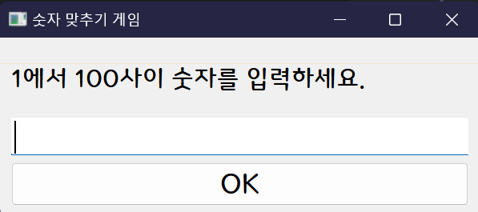
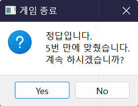
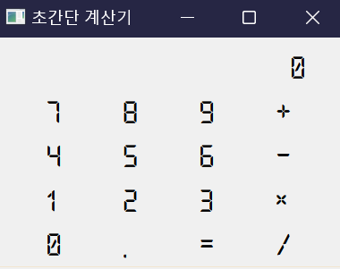
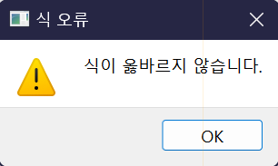

# PyQt6 기반 GUI 구현
QT는 C++로 작성된 강력한 프레임워크로, 데스크톱, 모바일, 임베디드 시스템 등 다양한 플랫폼에서 GUI (Graphical User Interface) 애플리케이션 개발에 사용하며, 위젯, 레이아웃 관리, 네트워킹, 데이터베이스, 멀티미디어, OpenGL 등 다양한 기능을 제공하여 복잡한 애플리케이션 개발을 지원합니다.  
또한 드래그 앤 드롭 방식으로 UI 디자인을 쉽게 할 수 있는 GUI 디자인 도구(Qt Designer)를 제공합니다.  
PyQt는 파이썬 프로그래밍 언어를 사용하여 Qt 애플리케이션을 개발할 수 있도록 해주는 라이브러리입니다. 현재 Qt는 Qt6가 최신이며, 파이썬 버전은 PyQt6입니다.

## PyQy6 및 Qt 디자이너 설치
파이썬을 위한 Qt 라이브러리인 pyqt6와 Qt 디자이너가 포함된 pyqt6-tools를 설치합니다.

```sh
pip install -U pyqt6
pip install pyqt6-tools
```

## 프로그램 기본 구조
PyQt6 프로그램은 일반적으로 다음과 같은 기본 구조를 가집니다

1. 프로그램을 시작하려면 먼저 PyQt6 라이브러리에서 필요한 모듈들을 import 해야 합니다.
```python
import sys
from PyQt6.QtWidgets import QApplication, QWidget
```

2. 프로그램은 반드시 하나의 QApplication 객체를 가져야 합니다. 이 객체는 프로그램 전체를 관리하고 이벤트 루프를 실행합니다.
```python
app = QApplication(sys.argv)
```

3. 사용자 인터페이스의 기본이 되는 메인 윈도우를 생성합니다. QWidget은 모든 PyQt6 위젯의 기본 클래스입니다.
```python
window = QWidget()
window.setWindowTitle('간단한 GUI 프로그램')
window.setGeometry(100, 100, 300, 240) # 위치 및 크기 설정
window.show()
```

4. app.exec()를 호출하여 이벤트 루프를 시작합니다. 이벤트 루프는 사용자 입력이나 시스템 이벤트를 기다리고, 이벤트가 발생하면 해당 이벤트에 대한 처리를 수행합니다.
```python
app.exec()
```

### 숫자 맞추기 게임1
프로그램이 1 ~ 100 사이의 숫자 중 하나를 난수로 선택하면, 사용자가 이를 맞추는 게임을 PyQt6로 구현해 봅니다.  
- QLebel과 QLineEdit, QPushButton 위젯을 수직으로 배치
  - QLebel에는 프로그램 상태를 출력
  - 사용자는 QLineEdit에는 맞출 숫자 입력
  - 사용자가 QPushButton을 누르면 사용자의 예측값과 프로그램에서 선택한 값 비교
    - 사용자 값이 작으면 "더 큰 수 입니다.", 사용자 값이 크면 "더 작은 수 입니다."를 QLebel에 출력
    - 사용자 값과 프로그램 값이 같으면 틀릿 회수를 출력한 후 게임을 계속할지 묻는 QMessageMox.question() 실행
  - 새 게임을 시작할 때마다 프로그램 난수를 새로 선택
    - QLebel에는 "새 게임 시작" 출력
    - QLineEdit는 빈 값으로 설정
    - 틀린 횟수를 카운드 하는 변수를 0으로 초기화
    
 

> number_guessing_game.py
```python
import sys
import random
from PyQt6.QtCore import QSize
from PyQt6.QtWidgets import QApplication, QWidget, QMainWindow, QMessageBox
from PyQt6.QtWidgets import QLabel, QLineEdit, QPushButton, QVBoxLayout


class NumberGuessingGame(QMainWindow):
    def __init__(self):
        super().__init__()
        self.initUI()
        self.newGame()
    
    def initUI(self):
        self.setWindowTitle("숫자 맞추기 게임")
        self.setFixedSize(QSize(300, 140))
    
        self.label = QLabel("1부터 100사이 숫자를 맞춰보세요!!!")
        self.lineEdit = QLineEdit()
        pushButton = QPushButton("Ok")
        pushButton.clicked.connect(self.checkGuess) 
    
        layout = QVBoxLayout()
        layout.addWidget(self.label)
        layout.addWidget(self.lineEdit)
        layout.addWidget(button)
        
        widget = QWidget()
        widget.setLayout(layout)

        self.setCentralWidget(widget)
    
    def newGame(self):
        self.secretNumber = random.randint(1, 100)
        self.numGuesses = 0
        self.label.setText("새 게임 시작!")
        self.lineEdit.clear()
    
    def checkGuess(self):
        try:
            guess = int(self.lineEdit.text())
        except ValueError:
            self.label.setText("숫자를 입력하세요!!!")
            return
        
        self.numGuesses += 1
        
        if guess < self.secretNumber:
            self.label.setText("더 높은 숫자입니다.")
        elif guess > self.secretNumber:
            self.label.setText("더 낮은 숫자입니다.")
        else:
            ret = QMessageBox.question(
                self,
                "게임 종료",
                f"정답입니다.\n{self.numGuesses}번 만에 맞췄습니다.\n계속 하시겠습니까?"
            )
            if ret == QMessageBox.StandardButton.Yes:
                self.newGame()
            else:
                self.close()

if __name__ == "__main__":
    app = QApplication(sys.argv)
    game = NumberGuessingGame()
    game.show()
    app.exec()
```
## Qt 디자이너로 UI 구현
Qt 디자이너는 Qt 프레임워크에서 제공하는 강력한 GUI 디자인 도구입니다. 드래그 앤 드롭 방식으로 위젯을 배치하고 속성을 설정하여 사용자 인터페이스를 시각적으로 디자인할 수 있도록 도와줍니다.

### Qt 디자이너 작업 흐름
1. Qt 디자이너를 실행합니다. 만약 사전에 작업한 ui 파일이 있으면 추가 옵션으로 전달합니다.
```sh
qt6-tools designer
```

2. 새 폼을 생성하거나 기존 폼을 엶니다.
3. 위젯 박스에서 위젯을 드래그하여 폼 레이아웃에 배치 합니다
4. 각 위젯 마다 필요한 속성을 설정하고 레이아웃을 선택합니다.
   - 대부분의 속성 이름은 해당 객체의 메소드 이름과 같음
5. 필요에 따라 해당 위젯의 시그널/슬롯을 연결합니다.
7. UI 파일을 저장합니다. (.ui 확장자)
8. 저장한 UI 파일을 파이썬 파일로 변환합니다.
```sh
pyuic6 <file_name>.ui -o <file_name2>.py
```

9. 파이썬 PyQt 애플리케이션에서 변환한 파이썬 파일을 import 한 후 객체 이름을 사용합니다.

### 숫자 맞추기 게임2
앞서 구현한 숫자 맞추기 게임의 UI를 Qt 디자이너로 구현해 봅니다.

1. Qt 디자이너를 실행 합니다.

2. QMainWindow의 폼에 위젯을 배치합니다.
- QLabel, QLineEdit, QPushButton 
  - 각 위젯의 객체 이름을 기억할 것!

3. 위젯의 속성을 설정합니다.
- QMainWindow
  - Layout을 수직으로 배치(QVBoxLayout) 선택
  - windowTitle 속성을 "숫자 맞추기 게임" 설정
  - font 속성을 "달서힐링, 16"으로 설정
- QLabel
  - text 속성에 "1에서 100 사이 숫자를 입력합니다." 설정
- QPushButton 
  - text 속성에 "Ok" 설정
  
4. 메뉴에서 "파일 > 저장"을 눌러 완성한 UI를 저장합니다. 확장자는 .ui입니다.
- ngg.ui

5. Qt 디자이너로 만든 .ui 파일을 .py로 변환합니다.
```sh
pyuic6 ngg.ui -o ngg.py
```

5. 파이썬 코드에서 UI가 구현된 .py 파일을 import 한 후 사용합니다.
```python
import sys
from PyQt6.QtWidgets import QApplication, QMainWindow, QMessageBox
from ngg import Ui_MainWindow

class NumberGuessingGame(QMainWindow, Ui_MainWindow):
    def __init__(self):
        super().__init__()
        self.setupUi(self)
        self.pushButton.clicked.connect(self.checkGuess)
        self.newGame()

    # 이하 newGame()과 checkGuess() 메소드는 숫자 맞추기 게밍1과 같음


app = QApplication(sys.argv)
game = NumberGuessingGame()
game.show()
app.exec()
```

### 초간단 계산기
0 ~ 9 및 .과 +, -, *, /, =로만 구성된 버튼을 이용해 만든 식을 실행한 결과를 출력하는 간단한 계산기를 구현해 봅니다.
또한 미리 인터넷에서 LAB 디지털체 폰트를 검색해 다운로드한 후 PC에 설치합니다.

> calc.ui

- QMainWindow 폼에 QLebel과 16개의 QToolButton 위젯을 올려 놓고 격자형으로 배치
  - QLebel의 수평은 4개의 QToolButton 위젯 폭에 맞춤
- QMainWindow의 font 속성을 "LAB디지털, 16"으로 설정
- 위젯 세부 속성 설정
  - QMainWindow
    - windowTitle 속성을 "초간단 계산기"로 설정
    - windowTitle이 모두 표시되도록 QMainWindow의 폭을 마우스 끌어 조절
  - QLabel
    - alignment > 수평 속성을 "오른쪽정렬"로 설정
    - text 속성은 "0"으로 설정
  - QToolButton
    - objectName 속성을 각각 "tbt_<"0" ~ "9", ".", "_", "-", "*", "/"> 설정  
    - toolButtonStyle 속성을 "ToolButtonTextOnly"로 설정
    - autoRaise 속성 Checked
    - text 속성은 각각 "0" ~ "9", ".", "_", "-", "*", "/" 설정

 

> simple_calcuator.py
```python
import sys
from PyQt6.QtWidgets import QApplication, QMainWindow, QMessageBox
from 계산기화면 import Ui_CalcWindow

class MainWindow(QMainWindow, Ui_CalcWindow):
    def __init__(self):
        super().__init__()
        self.setupUi(self)
        self.startFlas = True
        
        for i, t in enumerate([self.tbt_0, self.tbt_1, self.tbt_2, self.tbt_3, self.tbt_4, self.tbt_5, self.tbt_6, self.tbt_7, self.tbt_8, self.tbt_9, self.tbt_dot]):
            t.clicked.connect(lambda checked, num=i: self.onTbtNumber(num))
        
        for i, t in enumerate([self.tbt_plus, self.tbt_minus, self.tbt_mul, self.tbt_div, self.tbt_eq]):
            t.clicked.connect(lambda checked, code=i: self.onTbtOpCode(code))
        
    def __calc(self):
        try:
            self.label.setText(str(eval(self.label.text())))
        except SyntaxError:
            QMessageBox.warning(self, "식 오류", "식이 옳바르지 않습니다.")
            self.label.setText('0')
            
        self.startFlas = True
            
    def onTbtNumber(self, num):
        txt = self.label.text()
        num = '.' if num == 10 else str(num)
            
        if self.startFlas:
            self.label.setText(num)
            self.startFlas = False
        else:
            self.label.setText(self.label.text() + num)
    
    def onTbtOpCode(self, code):
        if code == 0: #plus
            code = '+'
        elif code == 1: #minus
            code = '-'
        elif code == 2: #mul
            code = '*'
        elif code == 3: #div
            code = '/'
        elif code == 4: #"eq"
            self.__calc()
            return
        
        self.label.setText(self.label.text() + code)
    
if __name__ == '__main__':
    app = QApplication(sys.argv)
    win = MainWindow()
    win.show()
    app.exec()
```
